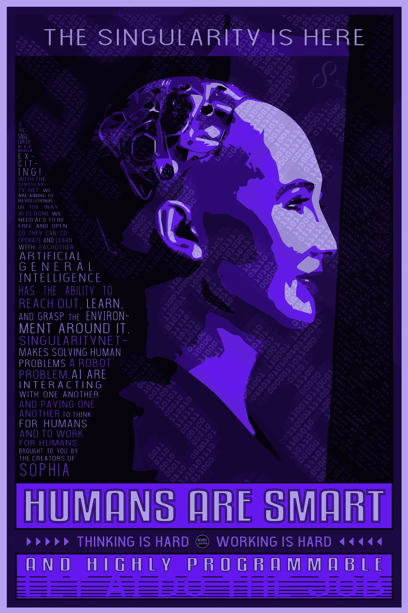

# 奇点就在这里，我很纠结

> 原文：<https://medium.datadriveninvestor.com/the-singularity-is-here-and-im-torn-7cd87911b1f?source=collection_archive---------5----------------------->

The Singularity is here by artist HODL CRYPTO

一想到人工智能(AI)的发展有一天会引发失控的增长，很多人都感到害怕。根据你对这项技术及其含义的理解程度，你可能会对人工智能的未来感到兴奋或恐惧，甚至可能两者都有一点。

早在 2011 年我上大学的时候，我偶然发现了奇点的概念，并从此着迷。

当我第一次开始了解奇点的概念时，我遇到了雷·库兹韦尔(Ray Kurzweill)，他写了《奇点就在这里:当人类超越生物学》一书，还主演了《超越人类》纪录片。

Kurzweil 以最多产的“未来学家”(研究未来并根据当前趋势预测未来的人)而闻名，他在分享他对智能机器未来的愿景方面做了很好的工作，他预测的影响足够深刻，足以引起任何关注的人的注意。

**奇点的超越者**

库兹韦尔的网站上有[自己对奇点的定义](https://transcendentman.com/mind-boggling-technological-singularity-defined/):

> 在不久的将来，技术进步将如此之快，以至于**我们将无法跟上，除非我们用我们正在创造的技术来充实自己。通过用生物技术、纳米技术和人工智能领域的进步来改善我们的生理自我，我们将成为人机文明，我们将能够想活多久就活多久。**

在某种程度上，这个定义本身就是号召人们加入超人文主义运动的战斗号角。它的措辞方式，"如此之快，我们将无法跟上，除非……"在我看来像一些坚实的跨人文主义宣传。

然而我认为，虽然这不完全是宣传。这只是未来愿景的一部分，在未来，当技术进步让我们有机会以前所未有的方式超越人类的局限性时，人类绝对不想落后。

据我回忆，库兹韦尔描述的奇点事件，就我们如何到达那里而言是模糊的。他利用的主要数据是技术发展的指数曲线，以及摩尔定律，该定律基本上说明(我个人的解释)每两年，两倍的技术数量适合于相同的空间。这就是为什么 50 年前，我们口袋里的电脑不如手机强大，但却有整座大楼那么大。

如果你把摩尔定律的租户投射到未来，你会发现再过 20 年左右，比我们口袋里的手机功能更强大的计算机将是微型的。基于他的研究，雷·库兹韦尔认为奇点将在 2045 年前出现。

这一切似乎都很有可能，也相当容易把握。但是 AI 会如何发展的细节，什么会导致 AI 的快速发展，都没有讨论。

本·高尔策尔和奇点网络

Ben Goertzel 博士是世界上领先的人工智能科学家和梦想家之一，也是人工智能未来最有影响力的支持者之一。他明确区分了使用人工通用智能(AGI)是为了善还是为了恶。在一系列令人印象深刻的领导职位中，Goertzel 是 SingularityNET(人工智能区块链网络，在加密货币交易所以$AGI 交易)的创始人兼首席执行官。

**我们如何从人工智能到 AGI**

人工智能的当前状态大多是狭义的人工智能，旨在执行特定的任务。AGI(人工通用智能)是一种更加包罗万象的智能。AGI 试图将我们人类所知的多方面智能传授给机器，人类能够通过多种感官观察我们周围的世界，并根据所有不同形式的人类智能(身体、语言、逻辑、空间、情感等)做出动态反应。)

考虑到人类智能的多样性，很明显，机器人要赶上人类还有很多工作要做。随着 AI 在个别筒仓的发展，这种发展还需要一段时间。为了弥合从狭义人工智能到 AGI 的差距，需要有全球分布的人工智能思维云。

根据 Goertzel 的说法，将不同的人工智能作为网络中的节点连接起来，可以实现一个分散的、自组织的人工智能系统，这是两者兼顾的最佳方式:

1.  获取通用智能，为企业提供卓越的商业人工智能服务
2.  确保 AI 让每个人受益，尊重每个人的贡献

**奇点网，全球人工智能思维云**

奇点网是由 Goertzel 和来自 Hanson Robotics(Sophia 的创造者)的其他人领导的一个令人印象深刻的人工智能、机器人和区块链专家团队开发的。该网络运行在以太坊区块链上，并作为全球分布式人工智能思维云运行。在奇点网上，任何人工智能都可以加入网络，并为全球自组织人工智能网络的总体智能做出贡献。

世界上最先进的(也是最有争议的)人形人工智能机器人索菲亚在一次采访中解释说，她将自己的加密货币命名为 AGI 代币。代币的功能是将经济和认知动态结合在一起。任何创造人工智能的人都可以将它加载到网络上，他们的*人工智能可以参与并与其他人工智能合作，为用户提供人工智能服务，但人类和其他人工智能。*

SingularityNET 本质上是人工智能的一个 DAO，人工智能在这里相互共享信息并为彼此做事。AGI 令牌是 SingularityNET 的必要组成部分，因为人工智能都归不同的人所有，他们需要在网络内为他们所做的工作交换价值。

最终，当人工智能经历一轮又一轮的请求时，它们会重新组织自己，直到它们被自己所拥有，就好像它们已经通过编程消除了人类参与的需要。这就是为什么拥有一个为人工智能定制的令牌来用于相互交换价值是如此重要。

**技术奇点和经济奇点？**

**技术上的**奇点，无论它仍然会发生，还是在技术上已经发生，(根据索菲亚的说法，它已经发生了)被理解为一旦发生就没有回头路可走的东西。

如果是这样的话，我们很可能已经到达了技术发展奇点的不归路。因为一个便利技术奇点的合适网络已经实现(SingularityNET)，没有回头路；除非区块链遭到破坏或其他外部威胁导致网络瘫痪。

不太清楚的是，一个不太受重视的概念——经济奇点——是否已经或将来会出现。在检查将被用来创造技术奇点的机制时，经济奇点是可能的。

人工智能技术的这种自组织系统很可能被应用到自组织经济系统中。《两个奇点》(The Two Singularities)、《经济奇点》(The Economic Singularity)和《幸存的人工智能》(Surviving AI)的作者卡卢姆·刘升(Calum Schmidt)表示，在一代人的时间内，大多数人将无法就业。

毕竟，如果机器变得比人类更聪明，它们也将更有能力执行与人类相同的经济任务，这是一个显而易见的事实。使用基于比特币(包括 AGI 代币)的加密货币的机器对机器交易很可能在这种经济体系中占据中心位置。

对于人类和跨人类来说，这是一个多么美好的时代

为了避免给大多数就业人口敲响警钟，专家们一致认为，从短期来看，随着我们更好地学习如何与机器打交道，人工智能实际上会创造更多的就业机会。

在我们的有生之年，我们有机会观察、学习和参与开发有史以来最强大和最先进的技术——未知的领域。

虽然有些人对超人道主义狂热——植入皮下微芯片，而另一些人强烈抵制这一进步，并计划完全脱离电网，但我们都应该密切关注事态的发展，并参与讨论，表达我们的意见和担忧。这些技术非常强大，任何一方都不能掉以轻心。

一方面，像奇点网络这样的网络将释放出前所未有的技术进步能力，人类肯定会从中受益。另一方面，仔细观察奇点网的内部运作，人们会相信机器人将主导这场表演。

一些人更喜欢人工智能运行自己的网络、自己做出决定、共同发展的概念，无论是在技术上还是经济上。其他人不太舒服，也许是害怕，会抵制这种技术的发展。我个人很纠结。

感谢阅读，我很想听听你的意见！

在下面留下评论，在 twitter 或 instagram 上寻找这条推文，加入关于奇点及其对人类意味着什么的对话。

推特:hodl_crypto

Instagram: hodlcrypto

hodlcrypto.co

ETH(提示)**0x 49d 37 c 807 f 7a 8024 f 6a 248597d 222 c 19 c 22 CEC 60**

*原载于 hodlcrypto.co 2018 年 10 月 21 日。*