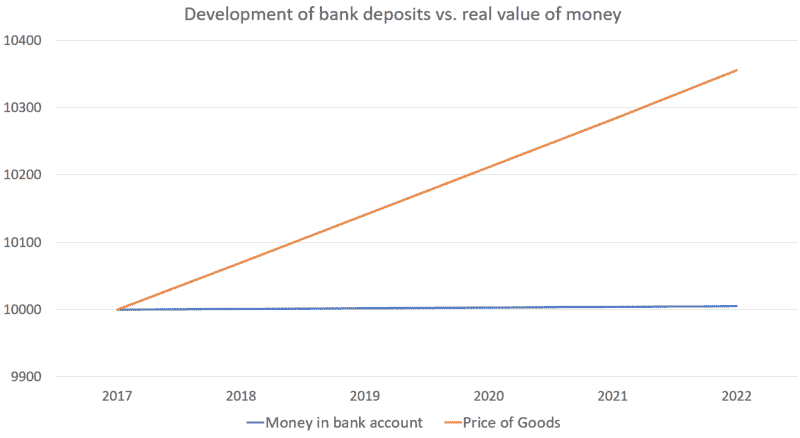
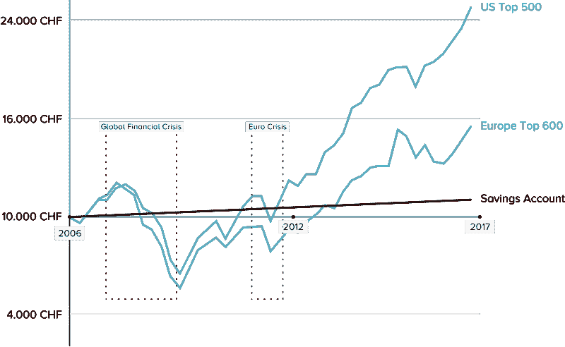

# 瑞士储蓄账户的明智选择

> 原文：<https://medium.datadriveninvestor.com/the-smart-alternative-to-swiss-savings-accounts-828337db866b?source=collection_archive---------3----------------------->

需要一个令人信服的理由来投资你的钱，而不是你的银行账户吗？除了你的银行账户本身，你不需要看得更远。

把目光投向分配给你账户的利率。如果你的存款存在任何一家主要的瑞士银行，这个数字将在 0.01%左右徘徊。

这意味着您的余额在 10，000 瑞士法郎的基础上每年只会增加 1 瑞士法郎。五年后，你的财富将增长到 10，005 瑞士法郎。

不幸的是，对于你的储蓄目标来说，这是最好的情况。几家瑞士银行的储蓄账户利率为负。还有银行手续费要考虑。

此外，[通货膨胀](https://arxiv.org/pdf/1609.00716.pdf)正在上升，这意味着商品和服务的价格正在缓慢上涨(例如，在 2001 年，一个巨无霸的价格为 5.90 瑞士法郎。现在需要 6.50 瑞士法郎)。让我们假设通货膨胀率稳定在目前每年 0.7%的水平。这对你的钱的实际价值会有什么影响？

如图所示，在这种情况下，商品和服务的价格将上涨 350 瑞士法郎。五年后，你可能需要 10，350 瑞士法郎才能买到今天用 10，000 瑞士法郎能买到的东西。与此同时，你的银行账户只会增加到 10，005 瑞士法郎——这让你比存钱时更穷。

# 那么，银行储蓄账户的替代品是什么呢？

对于那些准备采取长期观点的人来说，股票市场历史上提供了大约 10%的年回报率——或者当你减去通货膨胀的影响时，大约为 7%。

假设 5 年前，你没有将钱存入储蓄账户，而是将这 10，000 瑞士法郎投资于多元化的股票市场策略。在此期间，您的投资价值现在已经增加到 16，000 瑞士法郎左右，无论从哪方面来看，这都是一个可观的收益。

当然，历史回报并不能预测未来会发生什么——更高回报的机会总是伴随着更大的风险。重要的是，你进入任何股票市场投资，充分了解你可能会亏钱。

让我们来看看这张图表:

在这里，你可以看到市场在全球金融危机中遭受了重大打击。这种情况从 2007 年一直持续到 2009 年左右，当时市场开始反弹。在 2007 年至 2009 年间从全球股市撤资的短期投资者可能遭受了巨大损失。

另一方面，能够安然度过风暴几年的投资者现在将再次获得丰厚的收益。

这就是为什么对股市的任何投资都要有长远眼光的重要原因之一。你最不想做的事情就是恐慌，在糟糕的市场中卖出你的股票。

# 风险较低的投资选择是什么？

对于那些希望投资不易受市场波动影响的人来说，还有其他选择。其中之一是“固定收益证券”，包括债券。

国家和大型组织使用债券作为借钱的方式。总的来说，这两家公司都很擅长按时还钱，并有预先确定的利率。这些类型的投资回报低于股票市场，但也被认为更安全，因为它们的波动性更小。

以一个 5 年期的 3%固定利率债券为例。在这些债券上投资 10，000 瑞士法郎将导致每年支付 300 瑞士法郎，直到到期，届时投资者也将收回最初的 10，000 瑞士法郎…到投资期结束时，将获得 1500 瑞士法郎的可观收益。

# 我可以把债券和股票合并成一项投资吗？

有了 Yova，你的定制投资组合策略可以完全基于股票，也可以包括股票和政府债券的组合。我们调整股票和债券的比例，以创建适合您的财务状况和个人偏好的投资组合。无论如何，我们将通过分散您在不同行业、公司规模、国家等公司的投资来降低您的风险(了解我们如何做到这一点[在这里](https://www.inyova.com/investment-insights/efficient-frontier-investment-theory)，或[像我们一样在脸书](https://www.facebook.com/inyova)保持在循环中)。

# 听起来不错，我如何开始？

第一步是参加我们的[探索问卷](https://medium.inyova.ch/?utm_source=Mediumcom&utm_medium=QLpage)。大约需要 10 分钟。

我们会问你一些问题，以便了解你承担财务风险的财务能力，以及你自己对风险的承受能力(这是你在情绪上可以接受的风险水平。我们不想让你失眠！).与典型的投资公司不同，我们还会根据你对世界的希望，询问你愿意支持哪些公司。

从那里，我们的团队将创建一个个性化的投资策略供您考虑。

[从这里开始我们的 10 分钟探索问卷](https://medium.inyova.ch/?utm_source=Mediumcom&utm_medium=QLpage)。

*最初发表于*[*in yova . ch*](https://medium.inyova.ch/?utm_source=Mediumcom&utm_medium=QLpage)*。在 Yova，我们帮助人们通过符合他们价值观的投资组合来积累财富。Yova 是 inyova AG 的品牌。*