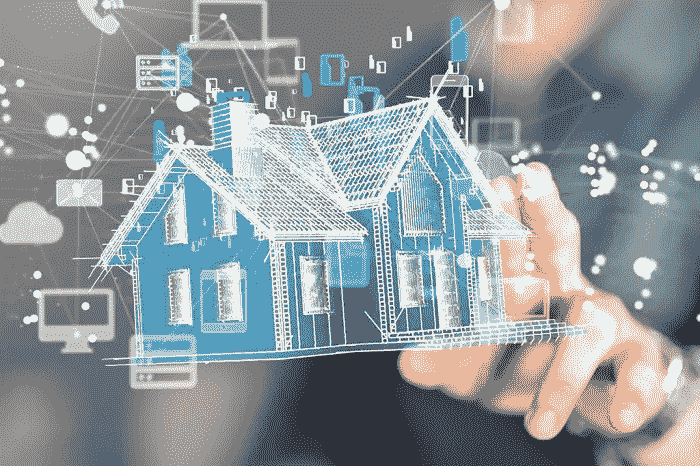

# 智能家居市场对苹果来说看起来不太好

> 原文：<https://medium.datadriveninvestor.com/the-smart-home-market-doesnt-look-too-good-for-apple-721b441dcb18?source=collection_archive---------8----------------------->

但是现在还不要把公司排除在外。

竞争很激烈。我们有强大的谷歌，亚马逊也将一直全力以赴，但苹果呢？你猜怎么着: [iPhone 的销量正在下滑](https://vigyaa.com/@pierre/6-developments-will-see-from-apple-soon-if-we-havent-already-7296bed7/)！相信它。现在，你已经让公司在收入来源的目标上争得不可开交，只是为了让公司继续运营下去。他们已经把*的*瞄准了几个可能性，但这里有一个是上坡路的: [**智能家居**](https://vigyaa.com/@pierre/beware-as-the-city-you-live-in-might-get-smarter-than-you-c7d8fe7b/) *。*

 [## 挑战你对人工智能和社会的看法的 4 本书——数据驱动的投资者

### 深度学习、像人类一样思考的机器人、人工智能、神经网络——这些技术引发了…

go.datadriveninvestor.com](http://go.datadriveninvestor.com/4AI1) 

# 谁主导智能家居技术？没错:亚马逊和谷歌。

事实上，统计数据显示，亚马逊凭借其 **Echo** 以 70%的市场份额横扫全国，但是你还能从这个电子商务巨头那里期待什么呢？谷歌也不算太差，有 24%的份额。苹果有什么？少得可怜的 6%。我们敢打赌你从来没有听说过这个叫做 HomePod 的小东西(这是苹果智能音箱的贡献，不像 iPod 那么吸引人，但是嘿)。

有人会说苹果已经放弃了进取的技术趋势，但我们期待看到该公司准备进行第二轮突袭，因为智能锁公司 Otto 的 Sam Jadallah 现在负责智能家居部门。换句话说，苹果正在重组并雇佣一个团队，将他们的智能家居技术产品推向大众，我们很快就会见证一场霍比特人和指环王的三方大战——好像谷歌和亚马逊之间的战斗还不够激烈。

# 苹果或许有机会尝试一下——但是谁知道呢

这项技术主要围绕着 iOS。如果你已经有了一台 Mac 或 Macbook，你几乎已经内置了一个家庭应用程序，它可以将你与数百个第三方设备连接起来，比如灯、相机和门锁。奖金？也许你喜欢你的 iPhones 和 iPods，如果是这样的话，你集成智能家居技术的成本将几乎为零。

但是如果没有…..如果你喜欢安卓之类的东西，那么…苹果将不得不试着赢得你的芳心！让战斗开始吧。

你对整个智能家居技术行业有什么看法？ [**注册一个免费的 VIGYAA 账号，开始写你的观点吧！**](https://vigyaa.com/accounts/login/)

【vigyaa.com】最初发表于**。**