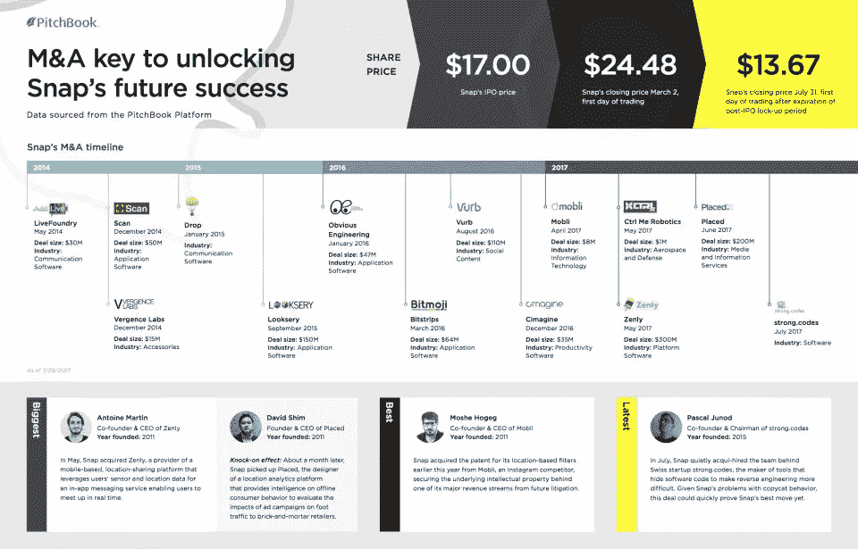
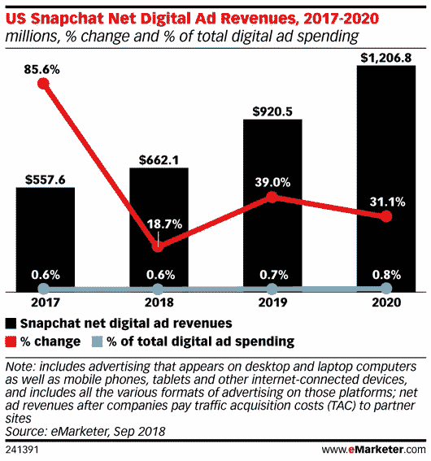

# Snapchat 的故事:以及多年来它是如何保持相关性的

> 原文：<https://medium.datadriveninvestor.com/the-snapchat-story-and-how-it-managed-to-stay-relevant-over-the-years-a017a2fb7a43?source=collection_archive---------5----------------------->

2019 年第一季度，Snapchat 拥有 1.9 亿日活跃用户(dau)，比俄罗斯和马来西亚的人口加起来还多。Snap Inc 目前在纽约证券交易所的交易价格为 11.5 美元(远低于其 IPO 当天的 24 美元)，这使其市值达到 154 亿美元。因此，我可以肯定地说，埃文·斯皮格尔和鲍比·墨菲的宝宝已经从他们简朴的斯坦福大学宿舍走了很长的路。但是是什么让 Snapchat 成功了呢？Snapchat 与 play store 上的其他数千个社交媒体应用相比有什么不同？让我们看看 Snapchat 成为今天这个样子的因素。

Snapchat 的前身 icaboo 在埃文·斯皮格尔有一个古怪的联合创始人。他从一开始就是“主力”，每个人都对他一视同仁。作为斯坦福大学产品设计专业的学生，埃文只参加他喜欢的课程，对分数毫不在意。他以在校园里举办最棒的宿舍聚会而闻名。他富有魅力的个性使他在学生和教授中很受欢迎。虽然埃文喜欢聚会和消磨他的空闲时间，但他在他所关心的事情上是一个勤奋的工作者。

 [## 在创业之旅中，拥抱学习数据驱动的投资者

### 好像建立一个数百万美元的公司还不够困难，企业家必须额外照顾他们的…

www.datadriveninvestor.com](https://www.datadriveninvestor.com/2018/10/16/on-the-entrepreneurial-trek-embrace-the-learning/) 

“一个非永久性的社交媒体”在当时是一个陌生的概念，埃文承担起给世界上第一个消失信息的社交媒体应用的责任。他希望人们与他们最亲密的朋友分享他们此时此刻正在做的事情。没有人理解这款应用的前提或如何使用它，但埃文指望口碑广告，这被证明是正确的。埃文的问题在于，他根据直觉做出最大的决定，而直觉往往对他有利。他拒绝了马克·扎克伯格在 Snapchat 还年轻时提出的 30 亿美元的收购要约。拒绝扎克需要一些勇气，然后试图在他自己的游戏中击败他(当 Poke 和 Slingshot 失败时，他可以说做到了)。

Snapchat 仍然以非常自上而下的方式运行，就像它刚开始的时候一样。作为一名设计师，Evan 一直将设计师和艺术家放在比工程师更优先的位置，这在 app 本身就有明显的体现。以至于他选择将 Snapchat 的总部设在洛杉矶威尼斯，而不是大肆宣传的硅谷。

> “分享那些不会永远存在的时刻是有真正价值的。”埃文·斯皮格尔

收购者一直热衷于 Snapchat。纵观其历史，Snapchat 一直在积极收购较小的初创公司。Looksery 是一家应用软件初创公司，它无缝集成到 Snapchat 应用程序中，并催生了我们今天所知的各种滤镜或镜头！另一家应用软件初创公司 Bitmoji 为用户提供了制作自己头像的选项，这很快在用户中流行起来。类似地，一家新贵 Zenly，一个位置共享平台，被 Snapchat 收购并添加到自己的应用程序中。此外，自成立以来，Snapchat 一直没有停止创新，与脸书正面交锋，后者公开抄袭了 Snapchat 的 Stories 和 Discover 等功能。Evan 一次又一次地证明了他首先作为用户然后作为 CEO 思考的能力，这在 Snap 的旅程中被证明是至关重要的。

Snap Inc’s acquisitions till mid-2017.

Snapchat 占据了用户手机的整个屏幕，这给了广告商很大的可玩空间。与脸书甚至 Instagram 上的广告相比，Snapchat 上的广告非常具有互动性。Snapchat 很好地融入了增强现实，事实证明这对广告商来说是卓有成效的。AR 是 Snapchat 目前的关键区别点。此外，自过去几年以来，Snapchat 已经开始向广告商提供有用的数据分析，以便他们更好地瞄准广告，虽然没有脸书那么详细，但也快了。从一开始，埃文就热衷于这样一个事实，即广告不应该妨碍用户体验，事实证明，他们没有。Snapchat 也张开双臂欢迎出版商，为用户提供更多优质内容。所有这些都迫使人们认真对待 Snapchat，而不是像媒体曾经描绘的那样，把它当成某种噱头。

尽管 Snapchat 已经证明了自己的实力，但它还不能停止前进。我个人认为，“垂直视频”的游戏还远没有结束。社交媒体巨头和垂直视频领域的内容创作者仍有许多有待发现的地方。Snapchat 和脸书(以及它自己的 Instagram)都知道它的前景，并意识到它在未来几年可能扮演的重要角色，并决定着视频流媒体行业的发展方向，到 2025 年，视频流媒体行业已经有望达到 1255 亿美元。这将是一件有趣的事情。

*   这篇帖子的灵感来自比利·加拉格尔的《如何拒绝十亿美元》，你可以在这里购买****。*** ****