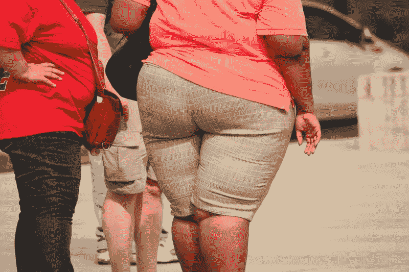
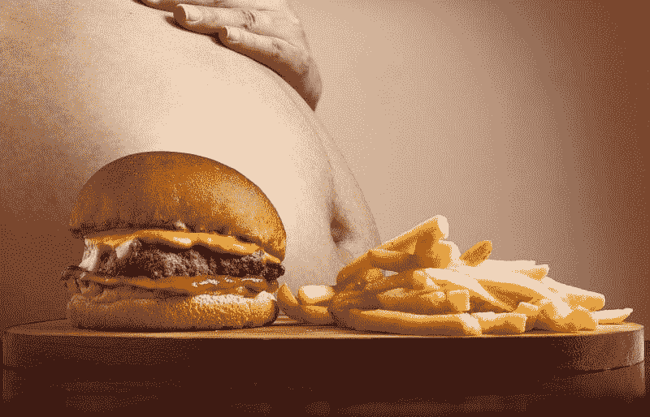
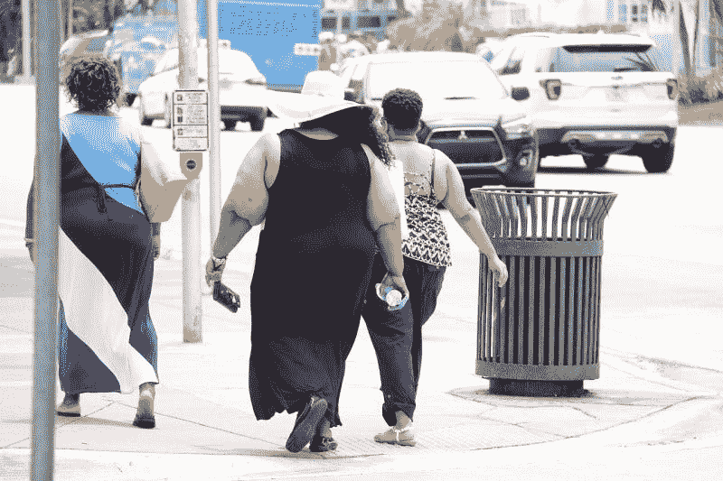

# 肥胖的社会成本——市场疯人院

> 原文：<https://medium.datadriveninvestor.com/the-societal-cost-of-obesity-market-mad-house-934c093e2420?source=collection_archive---------6----------------------->

根据印第安纳州波尔州立大学的研究人员，肥胖症正在增加。基于他们早期研究的估计表明，到 2030 年，如果没有任何干预措施，六岁至十一岁的儿童中有三分之一将被认为肥胖或超重。

毫无疑问，这是一个令人震惊的统计数字。

首席研究员王友法博士指出，这项研究确实依赖于一个小样本。更广泛的研究仍然是必要的，以了解当前的趋势真正走向，以及前景是否像许多人认为的那样可怕。但是[他警告说](https://www.webmd.com/diet/obesity/news/20180612/us-obesity-rates-rising-again#1)肥胖是一个社会必须解决的问题:

 [## 医疗保健的未来正在被一场大型技术入侵所塑造|数据驱动型投资者

### 过去十年，全球经济的所有部门都经历了大规模的数字颠覆，而卫生部门现在…

www.datadriveninvestor.com](https://www.datadriveninvestor.com/2018/11/02/the-future-of-healthcare-is-being-shaped-by-a-big-tech-invasion/) 

*“美国的肥胖和相关健康问题在未来不太可能变得不那么严重。我们需要继续并加强我们在对抗肥胖流行病方面的努力。”*

但是肥胖到底是什么？它是如何定义的，它真的达到了流行病的程度吗？还是现实远没有研究和新闻告诉我们的那么令人担忧？肥胖的实际代价是什么，如果有的话？

让我们看看美国的肥胖问题，看看这些问题是否有答案。

# 什么是肥胖？

因为这不是一个简单的测量你的确切体重的方法，所以要了解美国的肥胖问题，先给它下定义是有帮助的。

肥胖的基本定义是当一个人的体重高于普遍接受的身高标准时。

为了衡量你是否超重或肥胖，你必须考虑你的身体质量指数，或身体质量指数。

对于成年人来说，身体质量指数包括一个人的体重除以身高的平方。例如:

使用千克(kg)和米(m)的公制度量单位:

90.7 千克的重量除以 1.78 米(或 177.8 厘米)的高度的平方等于 28.7 身体质量指数。

使用磅(lbs)和英寸(in):

200 磅的重量除以 70 英寸(或 5 英尺 10 英寸)高的平方等于 28.7 身体质量指数。

然后根据四个类别来衡量您的身体质量指数指数:

这张图表普遍适用于所有成年人，所有体型的数字都一样，不论年龄或性别。要快速计算自己的身体质量指数，你可以使用疾病控制中心的[成人身体质量指数计算器](https://www.cdc.gov/healthyweight/assessing/bmi/adult_bmi/english_bmi_calculator/bmi_calculator.html)。

对儿童来说，身体质量指数是用同样的公式计算的，但用儿童的年龄和性别来解释。然后在百分位数中测量这些结果。这种方法解释了 2 岁至 19 岁之间青少年发育的差异。

要确定儿童或青少年的身体质量指数，使用疾病预防控制中心的[儿童和青少年百分位数计算器](https://www.cdc.gov/healthyweight/bmi/calculator.html)。

# 肥胖的代价

那么，肥胖的影响仅仅是针对那些被身体质量指数列为超重的人吗？

答案要复杂得多，因为整个社会——健康与否——都会遭受一些后果。

根据最近的统计数据，T2 的整体肥胖率接近 40%。

[截至 2018 年 9 月](https://www.stateofobesity.org/adult-obesity/)，7 个州肥胖率超过 35%。另有 22 个州的这一比例超过了 30%。总共有 48 个州的肥胖率超过了 25%。期望呢？

夏威夷和科罗拉多州，比例分别为 23.8%和 22.6%。

更深入地研究这些数字，会发现更令人不安的趋势。来自 [2014 年国民健康与营养检查调查](https://www.niddk.nih.gov/health-information/health-statistics/overweight-obesity) (NHANES):

*   三分之二的成年人被认为超重
*   三分之一的成年人被认为肥胖
*   十三分之一的成年人被发现极度肥胖
*   2 至 19 岁的青少年中有六分之一被认为肥胖

# 肥胖的原因

然而，肥胖不仅仅是数字和百分比。

许多因素可能在一个人肥胖或变得肥胖的原因中起作用。一些最常见的包括:

不管肥胖的来源是什么，真正的健康和社会风险都与超重有关。

# 肥胖的身体成本

健康风险可能发生在任何人身上，无论他们的生活方式或健康水平如何。但是对于那些肥胖的人来说，经历严重健康问题的风险要高得多。潜在健康问题和并发症的清单非常广泛，包括:

*   二型糖尿病
*   高血压(高血压)
*   中风风险
*   睡眠呼吸暂停
*   呼吸困难
*   冠心病
*   胆囊疾病
*   骨关节炎(关节中骨和软骨的退化)

几乎在所有情况下，肥胖也会增加过早死亡的风险。

最后一点尤其令人担忧，研究显示五分之一的美国成年人死于肥胖。[据](https://www.mailman.columbia.edu/public-health-now/news/obesity-kills-more-americans-previously-thought)哥伦比亚大学梅尔曼公共卫生学院研究员瑞安·马斯特斯博士介绍:

*“肥胖对健康的影响比最近一些报道让我们相信的要严重得多。我们预计，肥胖将导致美国越来越多的死亡，甚至可能导致美国人的预期寿命下降。”*

# 医疗费用

然而，肥胖对个人健康的影响并不孤立。随着肥胖率持续攀升，其经济后果也越来越严重。

正如我们之前提到的，肥胖影响着每个人，甚至包括那些不肥胖的人。

根据几项估计，美国每年在肥胖相关费用上的花费从 1500 亿美元到超过 1900 亿美元不等。一些人把这个范围[定得更高。这包括诊断和治疗，以及与预防相关的费用。](https://www.stateofobesity.org/healthcare-costs-obesity/)

到 2030 年——再过十年多一点——这些数字可能会以每年 660 亿美元的速度增长。

然而，这些数字只考虑了直接成本。它们没有考虑失业(员工工资损失或雇主生产率损失)、保险成本或整体工资下降。根据一些最流行的报道，这些次要的经济后果比肥胖的直接医疗费用更沉重。

在最极端的情况下，肥胖可能被证明是人类最糟糕的疾病之一。根据研究公司麦肯锡公司的数据，肥胖对全球 GDP 的影响为 2.1 万亿美元，仅次于吸烟和武装暴力、战争和恐怖主义的综合分类，两者对全球 GDP 的影响均为 2.1 万亿美元。

换句话说，肥胖是人类造成的三大社会负担之一。

# 还有希望吗？

预测可能是严峻的，但在对抗和减少肥胖方面有一些乐观。来自 [2018 年报告](https://www.stateofobesity.org),《2018 年肥胖状况:为更健康的美国制定更好的政策:

为了强调个人的环境和促进健康习惯确实很重要，肥胖状况报告的作者建议:

# 减少和预防肥胖的机会是存在的

作为美国健康信托的首席执行官，约翰·奥尔巴奇同意这些建议。[何州](https://www.aafp.org/news/health-of-the-public/20181015obesityrpt.html):

肥胖是一个复杂且往往难以解决的问题，美国的肥胖流行病继续给个人、家庭和我们的国家带来严重的健康和成本后果。好消息是越来越多的证据表明某些预防项目可以逆转这些趋势。但是我们不会看到州和全国肥胖率有意义的下降，直到它们在全国范围内实施并得到持续的支持。”

最终，要扭转儿童和成人日益增长的肥胖趋势，仍有许多工作要做。然而，通过教育、预防和投资的正确组合，肥胖是可以克服的，其在美国的流行也从常态变成了例外。

文章再版。这里是[原文](https://www.mbahealthcaremanagement.org/topics/the-societal-cost-of-obesity/)。