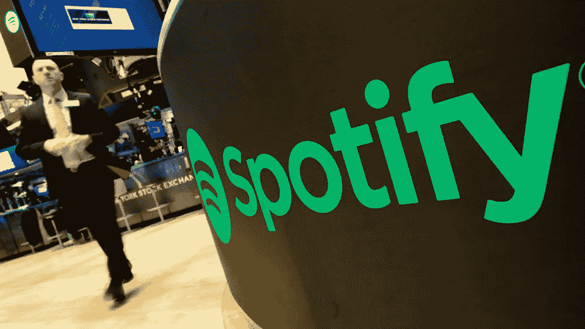

# 银行业的 Spotify 时刻——可能吗？会是什么样子？

> 原文：<https://medium.datadriveninvestor.com/the-spotify-moment-of-banking-is-it-possible-and-what-would-it-look-like-971be704814c?source=collection_archive---------1----------------------->

# 你有没有觉得我现在经历的事情改变了一切？

这是一种非常发自内心的感觉——你只是知道从现在开始，这就是事情的发展方向。一些公司会紧随其后，另一些公司会倒下，但事情永远不会是一样的。

对我来说，其中一个时刻是我在 2008 年第一次使用 Spotify 测试版。这有点艰难，但最突出的一点是没有等待。当你点击曲目时，音乐立即开始，你可以找到几乎任何东西，即使是在他们整个图书馆都是盗版的时候。

另一个是当你一扫就能看到整个一季的《纸牌屋》。它改变了电视的格局，改变了流媒体如何找到与广播竞争的方式。网飞用他们的力量和内在品质瓦解了自媒体诞生以来传统媒体把关内容的方式。

Reed Hasting, CEO of Netflix

对于网上购物来说，类似的时刻可能是当你的体验变得更好，并且很可能感觉比实体购物更好，避免了拥挤的 H&M 试衣间的恐惧。

Karl-Johan Persson, CEO of H&M

但对金融和银行业而言，这一时刻仍在前方。

到目前为止，大银行让我们失望了。我们在之前的文章中提到了他们的无能。发展很难，创新超级超级难。当然，Tink，iZettle，Klarna 和其他人已经有了一些很好的发展。但我 2008 年在 Spotify 和 2014 年在网飞经历的奇迹还没有在银行业出现——至少对我来说没有。

# 这是有原因的吗？

当然有，一定有。我认为以下原因可能与此有关。

第一个是企业的结构。金融部门的结构不太适合这种全面、彻底的变革，这种变革不受地理位置的限制，对大众市场有广泛的吸引力。实际上，每个人偶尔都会听听音乐或者欣赏一部电影。但是银行和金融世界是极其分散的。无论是从地理区域来看，(德国的银行业与瑞典等国非常不同)，还是从构成银行业整体的运营业务模式和细分市场的数量来看，都是如此。

随着任何一个玩家进入市场，他们都可以供应给一个确定的细分市场。比方说，亚马逊将成为一个金融参与者，他们最有可能在支付、个人信贷(信用卡等)和小企业贷款方面开展业务。一个不太离谱的猜测是，他们会避开投资银行、大型企业交易和贷款以及个人银行和抵押贷款。

创建一个全能的银行解决方案极其昂贵、困难，而且在今天的环境下可能毫无意义。当每个业务领域的竞争自动呈现出在价格和用户体验方面最具竞争力的最佳解决方案时，谁会想要一家银行呢？

结论是，我们将继续看到各个领域的革命，而不是像网飞那样席卷全球的现象。

技术基础设施是它自己的生态系统，极其脆弱和复杂。

金融行业早在 20 世纪 60 年代就开始了数字化之路。当时构建的许多系统至今仍是每天数十亿笔交易的支柱。将它们换成新型号的成本和风险令人难以置信。

每一家银行，每一个支持股票市场、支付和交易的公共基础设施，都是由无数的系统组成的。任何开始在这个领域创新的人都需要在不同程度上对它们进行改进。这就像汽车仍然需要在道路的基础设施上运行一样。对 Spotify 和网飞来说，这个基础设施就是互联网，简单明了。

除此之外，你还有金融部门的监管负担。每次金融危机之后，银行都会受到一系列新监管规定的影响。在最后一个阶段，这种情况自 2008 年至 2009 年一直持续，至今仍是金融服务行业的主旋律。不用说，这阻碍了创新，无论是大公司还是新贵。这使得向市场推出新产品变得复杂，也使得它们的推广变得复杂和昂贵。目的当然是为了保护客户，但这也阻碍了创新，最终对最终用户不利。以推动创新为明确目标的 PSD2 在概念上仍建立在现有银行的技术基础设施之上，因此在已经运转不良的金融体系之上建立了新的层面，而不是推动真正的基础设施创新。

金融创新的一个主要阻力是个人行为和偏好。与金钱打交道是一种情感和个人体验。办理抵押贷款，为退休做计划，为孩子的未来做计划，这些都是你生活中的重要方面，你会想把它们做好。从实体银行体验到数字银行体验的心理转变需要时间和耐心。我们在过去十年中已经习惯的数字体验考虑到了这一点，因为它主要模仿我们习惯的银行方式，并将其转化为熟悉的数字体验。

然而，个人银行业务的真正创新无疑是围绕着自动化和简化的主题。而且，从长远来看，这是关于改变我们与金钱和支付互动的基本方式，在这个时代，这是电子商务巨头们决定要做的事情。另一方面，数字化建议和数字化的商业街银行将是那些倡导“高接触、高科技”理念的人面临的挑战

# 展望未来，银行的真正角色是什么？真正的创新会是什么样的？

这些天来，当你开始观察不同的业务和行业时，你会发现数字化不仅推动了业务向前发展，还从根本上改变了业务。现在的交通、酒店、音乐、媒体和娱乐与 15 年前有着非常非常大的不同。今天的加油站几乎不卖汽油。它们主要是便利商店，以迎合有车一族为特色。与以前相比，这是一个巨大的飞跃。杂货店要么是美食家的体验中心，要么是低成本的食品仓库。电影院不仅仅是看最新的大片；它是关于在一个十倍于电视大小的屏幕上与朋友、家人或约会对象一起享受食物、糖果、小吃和娱乐的完整体验。

有了这个框架和视角，银行会是什么样的呢？他们确实有能力提供信贷；他们知道你的日常财务和储蓄。他们中的许多人在当地和地理上存在。当然，你有可能成为生活中几乎所有事情的中心，比如买房、租车、管理养老金和医疗保健，以及确保你能够为自己的梦想和抱负提供资金。

在这种未来场景中，信贷机制相当于天然气对于加油站的作用——在此基础上满足其他需求的基本前提。

基本上，实现 Spotify 时刻绝非易事。

– — -

嗨，你跑了这么远！更多类似的内容，请访问