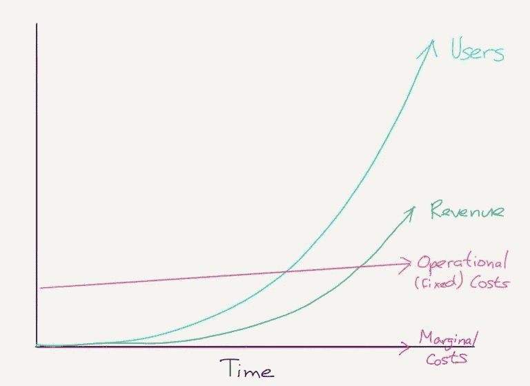
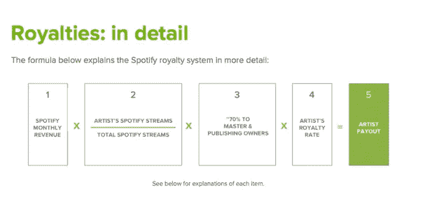
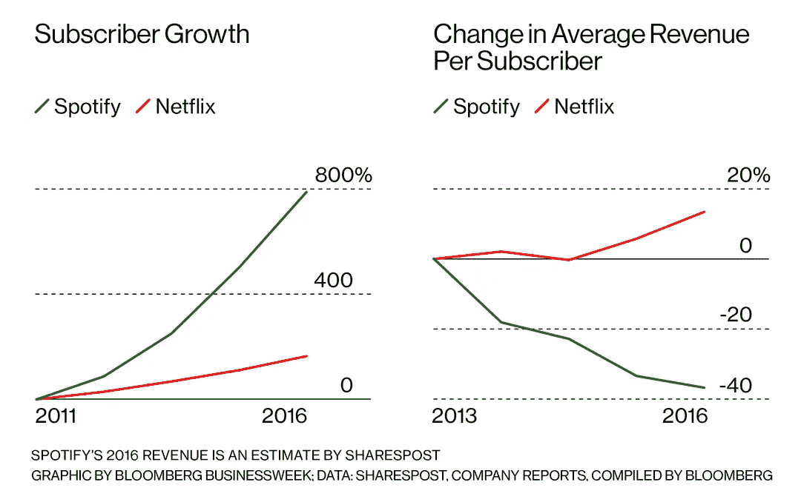

# Spotify 的利润问题，以及解决这个问题的三种方法

> 原文：<https://medium.datadriveninvestor.com/the-spotify-profit-problem-and-three-ways-theyll-solve-it-f71c57d8a8da?source=collection_archive---------3----------------------->

2018 年 11 月 23 日

`Pushing listeners to direct signings, AI music and sponsored content`

Source: [Behance and Spotify collaboration for Pride](https://www.behance.net/gallery/53718515/SPOTIFY-PRIDE)

# Spotify 仍在亏损

Spotify 仍然是一家亏损公司。这是因为音乐很贵——你必须向三大唱片公司支付许可费(或版税)，这三大唱片公司控制着你所听的大多数音乐的版权——你还必须为每一个加入的顾客支付这些费用。那么，spotify 如何解决这个问题呢？

Spotify 有三种方法可以让音乐更赚钱:

1.  将音乐家直接签约到他们自己的唱片公司，省去中间人
2.  委托“库存”音乐——比如“放松钢琴”——完全避免版税(或者使用人工智能自己制作)
3.  推广赞助内容，即广告

我相信 Spotify 会利用 Discover Weekly 和 Spotify 播放列表将用户推向最赚钱的音乐。更有害的是，我认为这可能会慢慢降低我们消费的音乐的质量和种类，因为我们越来越倾向于米色的、大规模生产的[音乐](https://www.youtube.com/watch?v=dQw4w9WgXcQ)。

完整的免责声明——我曾经在 [Jukedeck](http://rich.fyi/music/tech/general/2018/11/23/www.jukedeck.com) 工作，这是一家开发软件的公司，可以使用人工智能生成音乐。我已经写了在之前[我们在那里做了什么。](https://medium.com/@richardcadman/measuring-the-subjective-improving-the-quality-of-ai-generated-music-as-a-pm-at-a-london-based-6b7c45d4f48d)

# Spotify 有一个高边际成本的问题

Spotify 的边际成本非常高。这不像典型的科技公司。一篇战略文章对此进行了精彩的概述。

Source: Stratechery

本质上，随着用户群的增长，你会期望你的成本增长得更慢。每一个加入脸书的新用户基本上不花他们一分钱(即零边际成本)，但他们从新用户那里(从广告中)获得的收入是可观的。

Spotify 不是这样的。它向唱片公司支付固定比例的收入。它的收入成本(或边际成本)随着用户的增加而增加 Spotify 增长越多，它支付的费用就越多。这些收入大部分支付给环球、索尼和华纳，他们控制了大约 85%的市场。然后唱片公司负责支付他们的艺人。

截至 2013 年，该份额大致是这样计算的([来源](https://www.stereogum.com/1587932/spotify-explains-royalty-payments/news/))。

Source: Stereogum

Spotify 的问题通过与网飞的鲜明对比得到了最好的证明。自 2011 年以来，Spotify 的用户增长迅猛，但每位用户的平均收入却在下降。网飞制作了大量自己内容，而不是仅仅被三个主要的版权所有者控制，他们能够更好地将用户增长转化为收入增长。

Source: Bloomberg

最终，这意味着 Spotify 总体上仍在亏损，因此它需要降低运营成本或边际成本，以实现盈亏平衡。我想重点谈谈后者。

# Spotify 让他们的音乐更赚钱的三种方法

除了与唱片公司协商更好的交易，我认为有三种主要方法可以让音乐更赚钱。

## 1)启动 Spotify 唱片，剪下唱片标签

Spotify 付给唱片公司很多钱。据[纽约时报](https://www.nytimes.com/2018/09/06/business/media/spotify-music-industry-record-labels.html):

> Spotify 通常会向唱片公司支付某首歌曲每次播放所产生收入的 52%。反过来，唱片公司向艺术家支付提成的 15%到 50%不等的版税。通过同意与 Spotify 的直接许可协议，艺术家和他们的代表能够保留全部支出。

正如 NYT 所说，与独立音乐人达成直接授权协议将避免支付唱片公司的份额。艺术家们将会受到激励去这样做，因为他们最终会得到更大的份额。Spotify 的整体净成本仍将较低，因为唱片公司现在获得了如此大的份额。

Spotify 也可以从中获得额外的好处:

*   通过将艺术家永远锁定在 Spotify 上的流媒体内容，目录肯定不会被标签移除
*   如果 Spotify 不允许艺术家保留全部音乐版权，所有其他流媒体服务(苹果、亚马逊等)的收入
*   独家报道即将推出的最佳音乐，如果他们独家报道一些大牌明星的话(例如，泰勒·斯威夫特与目前唱片公司的合同即将到期)

Spotify 的数据意味着，它能够很好地发现趋势，识别出崭露头角的艺术家，并把他们带入自己的书里。

但是这些标签对此会有什么反应呢？这肯定会让他们紧张，但很难知道他们会做什么。Spotify 在很大程度上推动了他们的收入从盗版的黑暗日子中复苏(这里是《经济学人》的概述，这里是 T1，这里是《T2》的全文，这本书是 T3)，他们的产品是市场上最好的，这意味着他们拥有超过 35%的市场份额。

标签可以支持另一匹马。Apple Music 的市场份额越来越大，支付的版税也越来越高，但他们有一个天然的限制，苹果设备只有 50%的市场份额，这可能使其缺乏吸引力。Spotify 是遥遥领先的最大玩家。

唱片公司可以从 Spotify 上删除这些歌曲，就像他们过去尝试过的那样。泰勒·斯威夫特没有把她的专辑《1989》放在 Spotify 上，但后来在粉丝的强烈要求下撤回了。

无论哪种方式，直接签约肯定是上升趋势。甚至在过去几周(当我写这篇文章的时候),已经有[几个直接签约的例子](https://www.bloomberg.com/news/articles/2018-11-09/spotify-to-musicians-let-us-be-your-label)。

## 2)投资股票音乐，零边际成本

2017 年，全球音乐商业凸显了 Spotify 平台上有超过 50 名“假冒”艺术家的丑闻。“假”艺人对 Spotify 的价值是巨大的。他们将支付一次性费用，并能够无限期地向用户提供这些内容，无需额外费用。正如我之前所说，Spotify 目前向唱片公司支付 70%的收入份额。如果歌曲归 Spotify 所有，这就不再适用。

通过这种方式，Spotify 实现了零边际成本。它们开始看起来像普通的科技企业，收入的增长速度比成本快得多。全球音乐商业也接受了人工智能音乐不需要版税的观点。

更好的是，在未来世界，他们不需要支付昂贵的真人费用。他们可以像 Jukedeck 一样使用 AI。完整的免责声明——我曾经在 Jukedeck 工作过。为了增加这一理论的分量，弗朗索瓦·帕切特——人工智能音乐专家，领导了索尼的人工智能音乐开发——于 2017 年被 Spotify 聘用为[。人工智能的好处是它将比人类创作的音乐便宜得多。一首人工创作的曲目可能要花费 500 到 2000 英镑；如果 Spotify 拥有人工智能，人工智能将变得微不足道。](https://www.fastcompany.com/40439000/why-did-spotify-hire-this-expert-in-music-making-ai)

这个解决方案最具毁灭性的部分是，这种音乐的大部分是多么的乏味。

## 3)赞助歌曲和其他广告

Spotify 去年开始试用赞助歌曲。这是有道理的，现在每个人都在广告游戏中([亚马逊今年有望从广告](https://www.cnbc.com/2018/10/25/amazon-other-revenue-mostly-advertising-near-2point5-billion-in-q318.html)中赚到 100 亿美元)，这也是锁定有利版税的一种方式。目前还不清楚这将如何实现——但很可能是按次付费或降低版税。

TechCrunch 的这篇文章介绍了他们使用广告的一些其他方式:赞助播放列表、横幅广告、视频广告。

最令人担忧的是，Spotify 有能力让一首歌跻身排行榜前 40 名。如果它为一首特定的歌曲提供足够的屏幕和收听时间，通过滑入足够多的相关播放列表，它可以获得足够多的数据流，使其进入排行榜(在那里它将获得自己的生命)。它有一个次要的好处；如果 Spotify 拥有成功的东西，他们就能增加对唱片公司的影响力。这一切都感觉像是口味制作的反[民主化(即趋势的逆转)。](https://www.ft.com/content/35b75754-15ac-11e5-be54-00144feabdc0)

# Spotify 可以利用其播放列表将用户推向更赚钱的音乐

考虑到版税是如何计算的(详见本博客)，Spotify 有很强的动机将用户推向成本最低的音乐。无论是直接签约，人工智能生成的背景音乐还是赞助内容，几乎可以肯定的是，他们将使用《探索周刊》和播放列表来引导用户获得最赚钱的音乐。

> “……多达 20%的流媒体是通过 Spotify 自己的播放列表播放的。音乐服务公司 Kobalt 经营的独立唱片公司 AWAL 称，加入 Spotify 播放列表后，音乐节目的播放量增加了 50%到 100%

真的有像[选择自由](https://en.wikipedia.org/wiki/Freedom_of_choice)这样的事情吗？

# 这是否意味着音乐的缓慢死亡？

在我描述的三条音乐盈利途径中，只有第一条让我对音乐的未来质量充满乐观。

我认为唱片公司的效用越来越小([不是 100%](https://www.theguardian.com/music/musicblog/2012/feb/02/behind-music-record-labels) ，但仍在减少)，所以我很高兴艺术家可以直接接触粉丝，并在这个过程中赚更多的钱。我认为，如果不再有唱片公司高管否决发行，担心“大众吸引力”，这实际上可能会导致更令人兴奋的实验性音乐。

我不认为流行音乐会消亡，也不认为会有什么不祥之兆，但我确实担心最好的音乐会越来越难被发现。随着播放列表塞满了赞助内容和人工智能生成的填充符，它有可能会排挤独立内容。我希望艺术家和有眼光的粉丝游说 Spotify，以确保这种情况永远不会发生，并且在这个平台上有一个明确的区分[音乐](https://en.wikipedia.org/wiki/Muzak)和[音乐](https://www.youtube.com/watch?v=dQw4w9WgXcQ)。

不管怎样，音乐的未来将会很有看头。从商业和艺术的角度来看。

(原载[此处](http://rich.fyi/music/tech/general/2018/11/23/spotify-profit-problem.html))

____

我正在努力提高我的写作水平，请在评论中、在推特上或通过电子邮件告诉我我做得怎么样，地址是 *hi [at] rich.fyi*