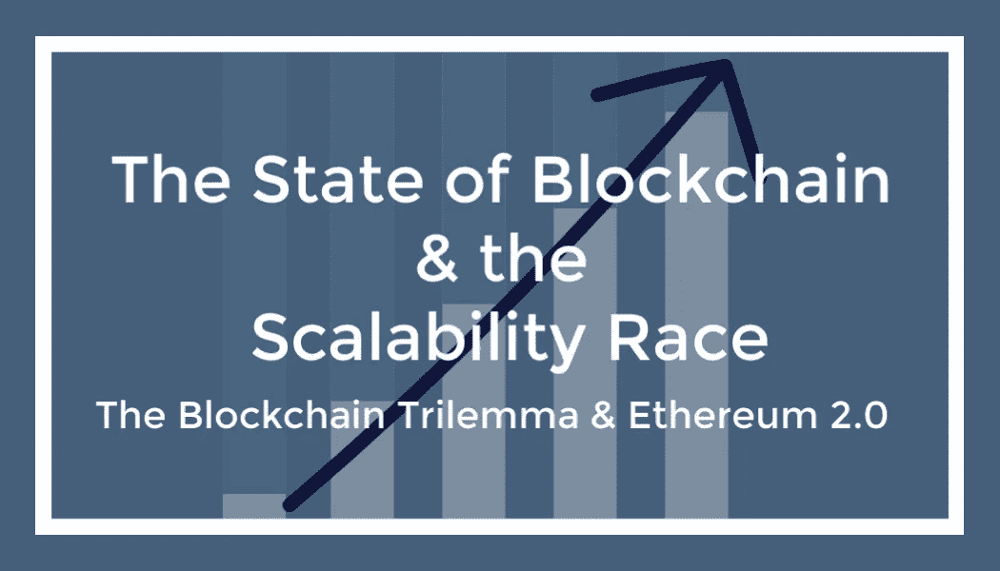
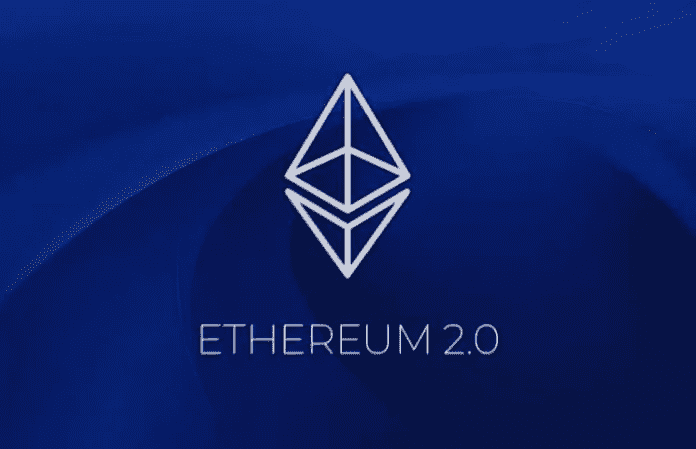
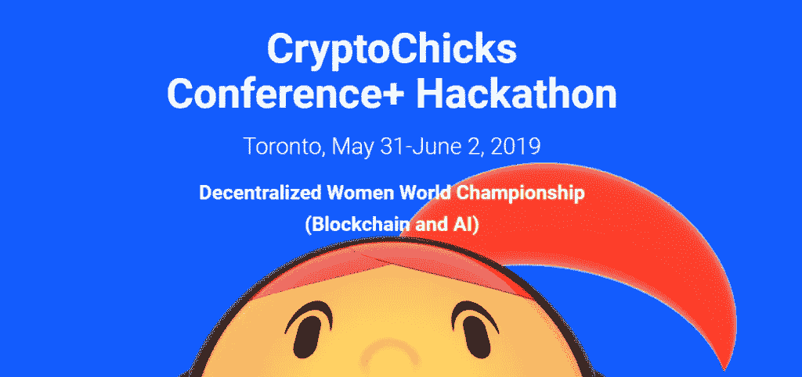

# 区块链的状态&可扩展性竞赛

> 原文：<https://medium.datadriveninvestor.com/the-state-of-blockchain-the-scalability-race-14838f8e0dab?source=collection_archive---------6----------------------->

## 以太坊向利益相关者共识协议的转变会解决区块链三难问题吗？或者另一个平台会赢得可伸缩性竞赛吗？

The Blockchain Scalability Race & Ethereum 2.0 Serenity

**区块链三难困境**

有时被称为可伸缩性三难困境:可伸缩性问题——事务量和速度，肯定是延迟大规模采用的问题之一。为了大规模采用，区块链平台必须能够在不牺牲去中心化和安全性的情况下与传统支付系统竞争。

目标基准是能够与 Visa 等遗留系统竞争，其交易处理能力为每秒 24，000 笔交易(TPS)。目前，Ripple-XRP 公司的[每秒处理 1500 笔交易](https://ripple.com/xrp/)。离取代 VISA 作为世界顶级支付处理商的地位还差得很远。

 [## 2019 年成为主流的 7 大区块链挑战及更多...-数据驱动型投资者

### 教训是永远不要停止学习和成长。关于技术、金融、工作场所、生产力和…

www.datadriveninvestor.com](https://www.datadriveninvestor.com/2019/03/25/top-7-blockchain-challenges-to-go-mainstream-in-2019-more/) 

**以太坊 2.0——宁静**

新的区块链/平台总是宣称自己是下一个比特币或以太坊，但迄今为止，还没有明确的赢家。以太坊推出之初，被认为是第二重要的加密技术，比特币位居第一。

以太坊的创始人 Vitalik Buterin 创建了它，作为一个比比特币更通用的驱动平台。一个区块链平台，可用于实现更广泛的区块链应用程序，从而推动智能合约和 dApp(分散应用程序)开发的发展。在过去的几年里，类似 Tron 和 EOS 这样致力于 dApp 开发的竞争项目开始进入市场，并慢慢蚕食以太坊的市场份额。

然而，在开发者社区中，以太坊仍然是开发者构建 dapp 的首选。据 dApp 分析网站[DApp.com 报道，2019 年 4 月初发布的一份报告](https://www.dapp.com/article/dapp-com-q1-2019-dapp-market-report)显示，Tron (TRX)拥有增长最快的 dApp 用户群，而以太坊(ETH)的 dApp 用户群仍然是最大的，但其领先优势正在缩小。

Ethereum 2.0

**2019 年以太坊的状态——宁静**

在以太坊的路线图中，预计的以太坊 2.0 又名 Serenity 版本包括三个主要更新，包括从工作证明到利益一致机制证明的过渡，分片以及将现有的以太坊虚拟机(EVM)转移到以太坊风格的 WebAssembly (eWasm)。

1.  Casper:用更有效的 PoS 模型代替挖掘的证据算法；扩展解决方案旨在减少集中化并消除电力挑战，包括巨大的能源消耗和采矿集中化。
2.  分片:大规模的可扩展性改进，旨在提高以太坊区块链的总吞吐率
3.  eWasm:一个基于 Wasm 的 EVM，具有改进的硬件特性，使得用任何编译成 WebAssembly 的语言编写智能合约成为可能。

以太坊从 PoW 到 PoS 的转变对于世界上最大的加密货币之一来说是一个令人兴奋的发展。它能解决区块链三难困境吗？时间会证明一切，但看它如何发展肯定会令人兴奋。
许多投资者和开发者都对以太坊和以太坊社区充满信心，其中包括 App Liaison Inc .的创始人兼首席技术官 Arunabh Das。我们将在[加密区块链播客](https://overcast.fm/itunes1436552758/crypto-blockchain-podcast)的第 8 集对此进行讨论

*6 月 1 日星期六，在多伦多的 CryptoChicks 黑客马拉松和大会上，Vitalik Buterin 和 Vlad Zamfir 将就区块链的可扩展性进行专题讨论。点击链接了解更多信息*[*https://www.toronto.cryptochicks.ca/*](https://www.toronto.cryptochicks.ca/)

Toronto Blockchain & AI CryptoChicks Conference

Audrey Nesbitt 和 Arunabh Das，[appliance](https://www.appliaison.com/)的创始人兼首席技术官

[螺旋营销&公关](http://www.spinspirational.com)

[奥黛丽·奈斯比特在 Linkedin 上](https://www.linkedin.com/in/audrey-nesbitt-0388a52a/)

[@ audreynesbit 11 在推特上](https://twitter.com/AudreyNesbitt11)

在媒体上跟随[阿鲁纳布·达斯](https://medium.com/@arunabhdas)