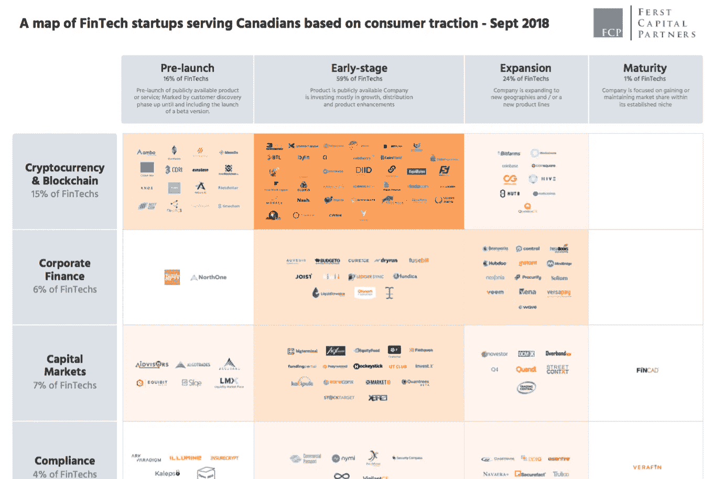

# 四张图中的加拿大金融科技

> 原文：<https://medium.datadriveninvestor.com/the-state-of-canadian-fintech-in-4-charts-cf3a3a0ff686?source=collection_archive---------24----------------------->

[最初发布在 Betakit 上](https://betakit.com/the-state-of-canadian-fintech-in-four-charts/)

去年我们在[发布了 FCP 金融科技地图](https://betakit.com/fintechs-serving-canadians-which-verticals-are-thriving/)的第一版，按照垂直和成长阶段划分了所有服务于加拿大人的金融科技。我们收到了很多很好的反馈，并且很自豪地看到我们的工作被投资者和监管者引用。

今天，我们将发布一个更新版本，以及其他一些关于加拿大金融科技整体状况的图表。这些图表中包含了大量数据(分析了 426 家公司)，所以我们鼓励你喝杯咖啡，慢慢浏览。我们在每个图表下面都包含了一些我们自己的要点，但是，有了大量的方法来分割数据，您无疑会开发出许多自己的要点。

作为这项工作的结果，我们发现两个反复出现的主题值得强调。第一个对我们所有追踪空间的人来说是显而易见的，而第二个可能更微妙。

更明显的主题是，在过去的 12 个月里，加密货币和区块链垂直领域在加拿大金融科技领域的动作最多。为了提供一些数据，我们看到去年有 21 家新公司进入这个领域(新公司指的是新公司减去解散的公司)。这是接下来最活跃的两个垂直行业(贷款和保险)活动的两倍多，这两个行业都有 9 家全新的初创公司进入该领域。

我们还跟踪了 7 家进入扩张阶段的全新加密货币和区块链初创公司，再次在所有垂直行业中领先。这表明，企业不仅在快速进入这一垂直领域，而且在获得牵引力方面也相对成功。虽然这里有几个因素在起作用，但缺乏监管是一个重要因素:鉴于需要克服的监管障碍较少，这些公司上市的时间往往比其他金融科技公司短。同样，鉴于海外监管障碍较少，这些公司实现国际扩张所需的时间似乎也比其他金融科技公司短得多。

第二个不太明显的主题是 B2B(企业对企业)创业公司如何比 B2C(企业对消费者)创业公司取得更高的成功率。尽管 B2B 初创公司占所有加拿大金融科技公司的 54%，但它们在我们跟踪的处于扩张阶段的所有初创公司中占 75%。另一方面，B2C 公司占所有金融科技公司的 35%，但在所有处于扩张阶段的初创公司中仅占 18%。这些是显著的差异。

尽管所有金融科技都面临着共同的挑战，包括难以与现有企业建立合作伙伴关系以及沉重的客户获取成本，但这些挑战在直接面向消费者时似乎会加剧。因此，美国一些专注于金融科技的基金倾向于支持 B2B 公司，这使得融资成为 B2C 公司面临的更大挑战。投资者会将这些数字视为对他们以 B2B 为重点的战略的验证，而 B2C 企业家会辩称，他们需要更多的资本支持才能取得成功。是鸡还是蛋？

尽管有这些结果，在 Ferst Capital，我们仍然保持对 B2C 金融科技的关注。我们相信，有了正确的资金和正确的网络，B2C 金融科技在这个国家可以像在其他地方一样非常成功。更重要的是，我们的使命是帮助改善加拿大人的金融服务，我们相信，在全球范围内看金融科技，像 Revolut、Credit Karma、Lending Club、Wealthsimple 和 Mylo 这样的 B2C 公司是那些在促进消费者如何与他们的钱互动方面影响最大的公司。如果我们希望本土企业引领加拿大金融服务业的下一波浪潮，监管者和投资者都需要发挥自己的作用。监管机构将需要为这些公司创造一个更有吸引力的运营环境，例如，相对于[开放银行业务](https://thefinancialbrand.com/69265/open-banking-psd2-cx-fintech-design-ux/)和[金融科技特许经营](https://www.occ.gov/news-issuances/news-releases/2018/nr-occ-2018-74.html)。投资者需要提供更积极的支持，并理解尽管风险增加，但基于世界其他地方的巨大成功，回报是值得的。

[*这里可以找到完整的信息图*](https://drive.google.com/open?id=1WH7NjO2pGY6NRCqb_-eJQMTfQi1014U2) *。我们期待听到您的想法！*

*注意:我们努力做到尽可能准确，并将在加拿大提供服务的所有 FinTechs 纳入分析。然而，随着空间的增长和演变，我们可能对贵公司的分类不正确，或者我们可能完全错过了贵公司。无论哪种方式，请联系 jshaanan@ferstcapital.com***，如果一切顺利，我们将确保在下一版信息图中反映这些变化。更好的数据带来更好的洞察力。**