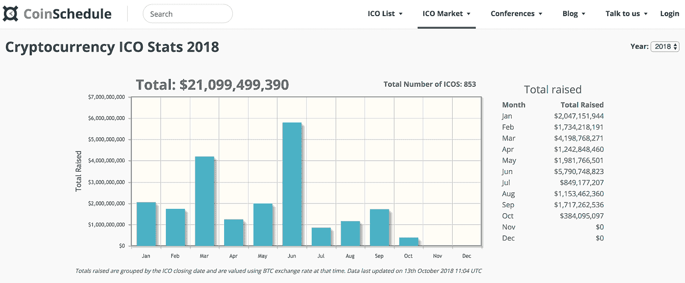
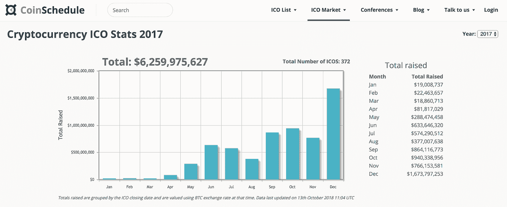
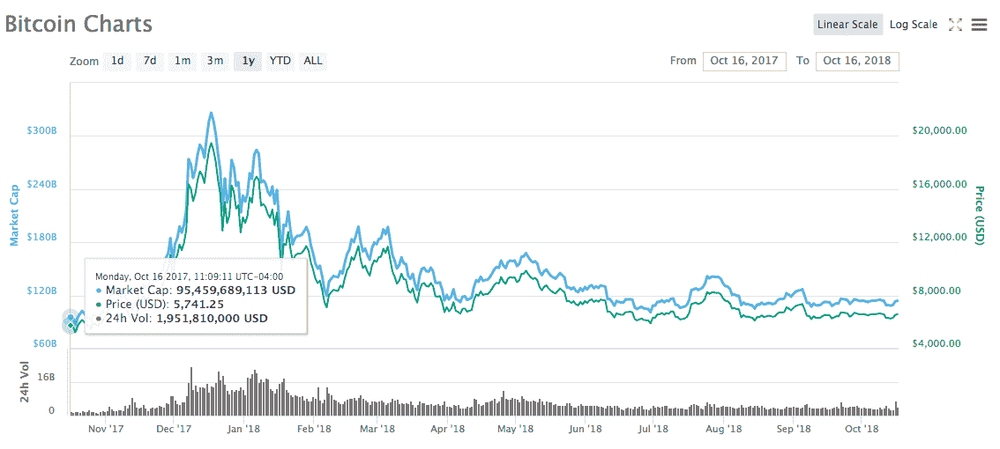
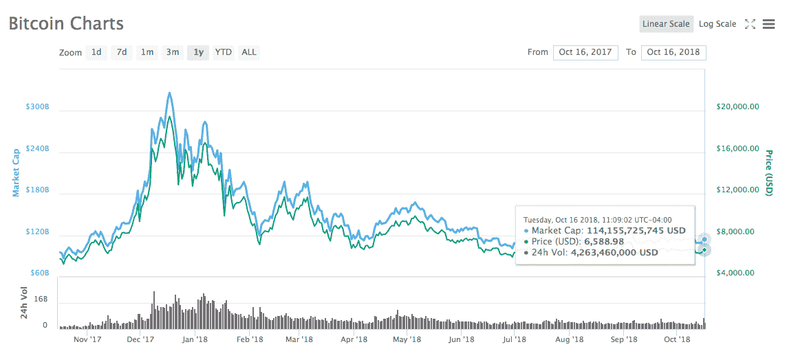

# 加密货币市场的现状

> 原文：<https://medium.datadriveninvestor.com/the-state-of-the-cryptocurrency-market-9c827d5fba83?source=collection_archive---------1----------------------->

区块链和加密货币正在以惊人的速度发展。当越来越多的项目开始通过首次发行硬币——著名的 ICO——来为他们的企业融资时，不断变化的行业让世界大吃一惊。

*如果你想了解更多关于 ico 的知识，这里是* [*investopedia 的*](https://www.investopedia.com/terms/i/initial-coin-offering-ico.asp) *定义。*

除了“ICO”之外，新硬币的创造还被赋予了其他多个名称，如代币生成事件、安全代币发行(STO)和初始代币发行(ITO)。这些名称因当地法律和当地区块链专业人士采用的术语而异。总之，不管它们的名字是什么，它们通过瞄准公众投资者，尤其是散户投资者，使项目能够众筹。

ico 正在增加利息和资本——2018 年 210 亿美元:

高于 2017 年的 60 亿美元:

*来源:*[*https://www.coinschedule.com/stats.html*](https://www.coinschedule.com/stats.html)

# **ICOs 时代**

创建于 2009 年的比特币开启了加密货币时代。它起初没有筹集到任何资金，但人们可以让比特币网络使用他们的电脑来维护和确认比特币网络的交易。提供计算能力的人得到了比特币的奖励。这是一个独立的网络，但技术潜力刺激了多种思维。

快进到 2014 年，Vitalik Buterin 展示了一个新的、更具可编程性的区块链，名为以太坊(Ethereum)，它不仅支持交易，还允许智能合约，这是一个自主软件。智能合同允许创建令牌，这些令牌将利用以太坊的网络来记录交易或提供计算能力。2017 年，这催生了去中心化应用(Dapps)时代，这些应用大多使用 ico 来为其风险投资融资。

这些新的 ico 是公开的硬币或代币销售，任何人都可以参与。随着时间的推移，当局试图进行监管，但在多个司法管辖区，规则仍不明确。大多数 ico 接受比特币(BTC)和以太坊(ETH)作为支付方式，并将出售他们新创造的代币作为交换。

个人投资者、风险资本和私人财富参与进来，开始收购 BTC 和瑞士联邦理工学院，以参与这些新的 ico。2017 年，对 BTC 和 ETH 的需求飙升，但只有几家卖家，市场上可用的令牌数量也仅限于网络生产的数量。由于市场是基于供求关系的，类似于股票市场，人们越是追捧 BTC 和 ETH，价格就涨得越多。收到硬币的项目没有将它们兑现——这主要是因为代币不断升值，项目需要这些硬币，因为它们正在接受资助。

# **私人销售时代**

自 2018 年初以来，一些司法管辖区的监管开始变得更加清晰。虽然通过出售代币而不将其注册为证券来为企业融资在某些管辖区仍然是被禁止的或者非常复杂，但在其他管辖区，现在可以出售代币。此外，市场已经适应了监管不明确的局面，转而通过私募融资。私募销售是公司和投资者(大多数情况下是合格投资者)之间的直接合同。通过每次谈判一份合同，投资者现在可以轻松地直接用美元或双方同意的货币购买新代币。这意味着，投资者不再需要购买 BTC 或瑞士联邦理工学院，就可以通过象征性出售投资区块链的项目。他们现在可以直接使用美元，这影响了对 BTC 和瑞士联邦银行的需求。

2017 年和 2018 年初获得资助的项目已逐步出售其 BTC 和 ETH。主要原因是这些项目需要当地法定货币来支付开发和运营成本。因此，这给市场带来了巨大的抛售压力

# **当今加密市场的宏观前景**

2017 年底 BTC 和 ETH 的大量需求和有限供应导致了加密市场的牛市。现在 2018 年底，投资者可以直接用本国法定货币(美元、欧元等)购买代币。)通过私下买卖。此外，由于项目定期在市场上出售它们的代币。这两个因素都降低了对 BTC 和瑞士联邦理工学院的“流通”需求，增加了卖方的数量。现在，它们的价值更接近一些人所谓的效用价值。BTC 的这一数值仍然高于牛市之前的去年同期。

2017 年 10 月 16 日— BTC 在**5741.25 美元**

2018 年 10 月 16 日— BTC 处于【6,588.98 美元

来源:[https://coinmarketcap.com/currencies/bitcoin/#charts](https://coinmarketcap.com/currencies/bitcoin/#charts)

# **结论**

希望使用代币筹集资金的区块链项目现在必须准备一份白皮书、强大的开发团队、工作产品、可行的商业模式，并展示牵引力或销售额——与典型的风险投资非常相似。市场变得更加精明，新的区块链项目必须做好更多准备。

交易所正变得越来越结构化和规范化，让位于向散户投资者和用户提供的新产品。双子星等交易所创造了 T2 GUSD，这是一种等同于美元的加密货币，由银行账户中的美元支持。对于国际交易，GUSD 可以更快地跨境转移。这是一个将项目标记到区块链系统中的示例。像货币、股票、债券、期货、房地产、产权和合同这样的资产现在可以被令牌化并安全地保存在区块链上。

市场和区块链技术仍处于起步阶段，更多的创新还在后头。让我们关注这些领先的解决方案，而不是新闻中看到的具体的浮华标题，这些标题往往只关注更大生态系统的某个方面。

**特别感谢 Yannick Folla 对本文的贡献。*