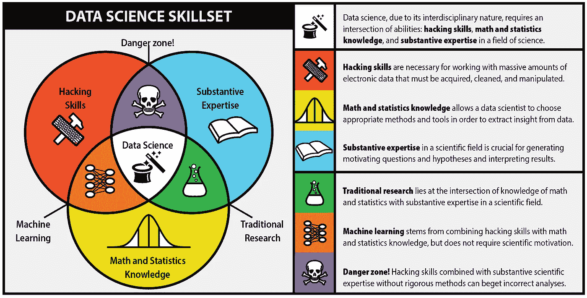
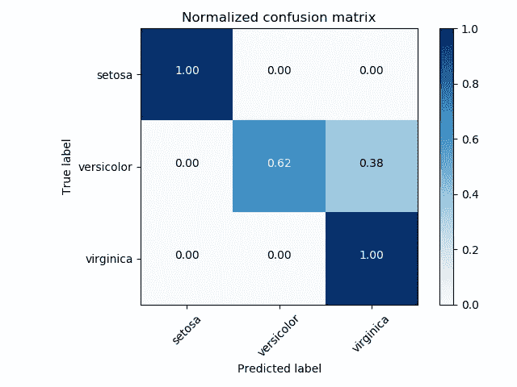
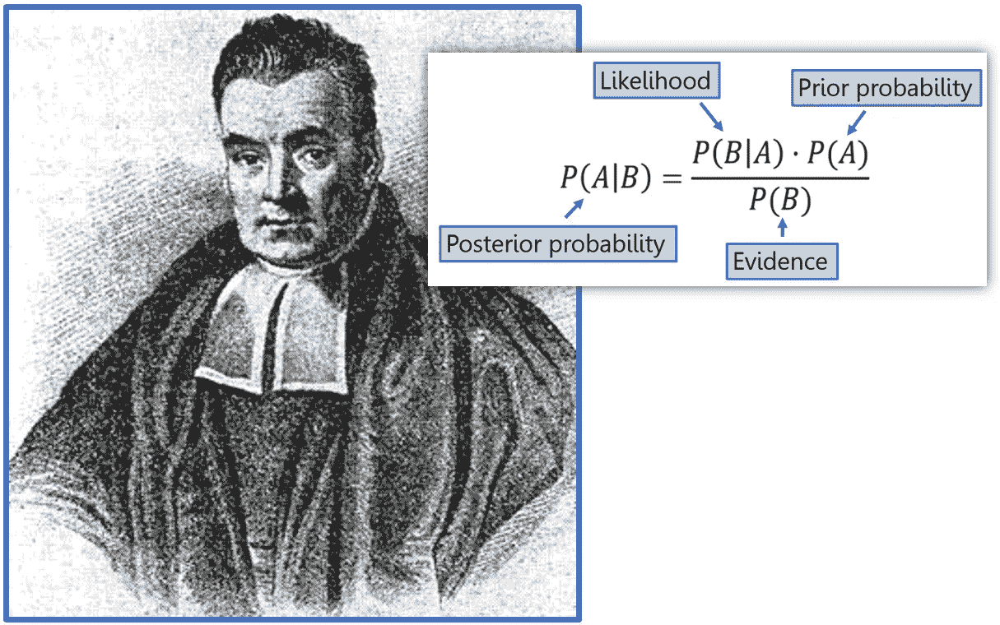

# 人工智能的统计基础

> 原文：<https://medium.datadriveninvestor.com/the-statistical-foundation-for-artificial-intelligence-2d9ce395a92e?source=collection_archive---------4----------------------->

统计学家、数据科学家已经不再碍事了！如果你曾经看到一位数据科学家这样说，他们可能不理解机器学习背后的统计概念。当我开始作为数据科学家的冒险时，我迷上了贝叶斯统计，并希望理解熵的概念。关于我们的预测，我们有什么不知道的？我们对自己的预测真正了解多少？我们如何理解我们的数据？这些都是你在分析数据时应该问自己的问题。在这篇文章中，我将回顾我们的结果，并剖析我们模型中的概率。我们想看看第一类和第二类错误，以及它如何应用于我们最初的业务问题。我想真正理解我们的数据，揭开机器学习中的这个黑匣子。

# **黑客帝国**

当我们观察不同的分类器和算法时，它们会产生不同的混淆矩阵。混淆矩阵给出了概率输出中的真阳性、真阴性、假阳性和假阴性。假阳性被认为是 I 类错误，假阴性被认为是 II 类错误。矩阵的行和列取决于分类任务(二进制或多类)。混淆矩阵可以帮助我们找出模型中发生错误分类的地方。在交叉验证过程中，您将主要通过混淆矩阵输入您的测试预测。图 1 显示了如何准确预测我们的 setosa 和 virginica 植物。我们这个模型的算法给出了一个假阳性的杂色分类。对于测试样本，该算法预测 versicolor 为 virginca 的概率为 38%。这并不好，即使我们的整体准确性是好的，它仍然是错误的分类。然后，我们将回到我们的模型来改进分类错误的类。

Figure 1: Confusion Matrix For Predicting Flowers

# 概率和随机性

数据科学采用需要批判性思维和模型优化的统计技能。**概率论**是与概率有关的数学分支。它帮助我们将定量数据转化为理解。它把我们的随机性变成了我们可以预测的东西。数据的质量和数量极大地影响着我们的预测和结果。这就是为什么数据收集和处理可以决定你项目的成败。我们创造了对抗熵的算法。我们本质上是试图理解宇宙中的这种随机性。术语*贝叶斯*源自 18 世纪数学家和神学家托马斯·贝叶斯。**贝叶斯定理**描述了一个事件发生的概率，基于可能与该事件相关的条件的先验知识。我们经常看到贝叶斯推论，因为数据科学家研究概率。我们从测试样本中得出模型的准确性，这显示了我们有多少次是对的，有多少次是错的。数据科学家总是会回到模型中，对分类系统进行改进。我们优化我们的算法并检查我们的结果，以便我们可以做出更多的改进。

# 精确度和召回率

精确回忆是预测成功的一个有用的衡量标准。精度是真阳性的数量除以真阳性和假阳性的总和。召回率是真阳性的数量除以真阳性和假阴性的总和。精确召回允许我们在不同的分类之间进行权衡。例如，假设我们对一个类的召回率很低，我们想改善这种情况。通过向该类添加更多数据，我们可以改进分类。精度提供了一个总体结果，但我们确实需要深入研究并改善其他输出。下图 2 显示了精确度和召回率如何影响我们使用数据的方式。

Figure 3: Understanding Precision and Recall

# 结论

来自我们的分类器的不同输出帮助我们优化我们的算法并不断改进。查看单个类的精度和召回率可能会有所帮助，但是要记住每个业务任务都是不同的。通过查看与我们相关的内容并了解我们工作中的可能性，我们可以做出最佳决策。始终可视化您的数据，并丢弃您不需要的功能。多安人工智能为世界各地的客户提供机器学习咨询。如果你对实施人工智能感兴趣，请不要犹豫[联系我们](http://www.dogan.ai)。

电子邮箱:john@dogan.ai

网址: [www.dogan.ai](http://www.dogan.ai)