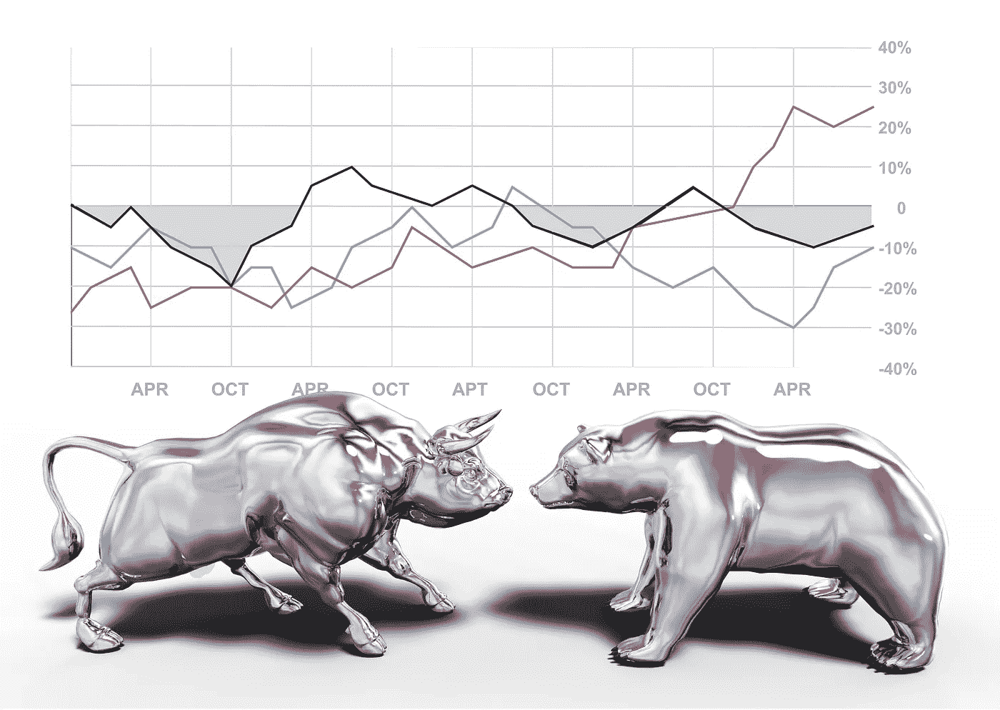
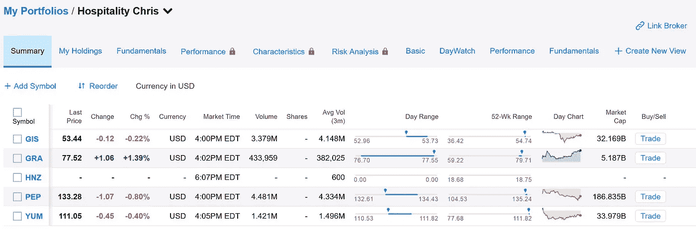
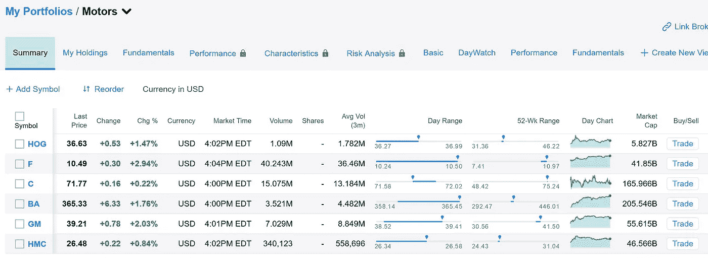
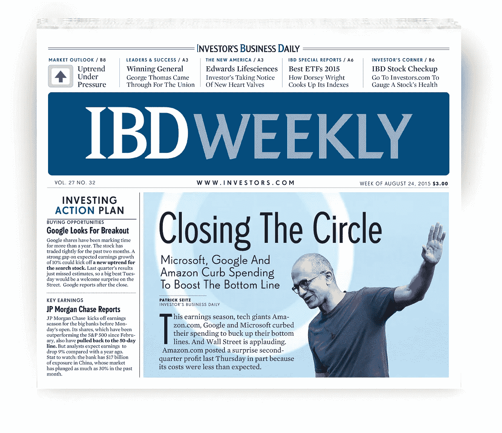
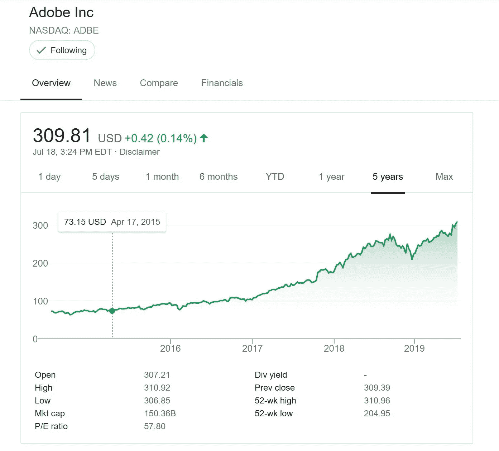

# 股票市场、Adobe 公司和我

> 原文：<https://medium.datadriveninvestor.com/the-stock-market-adobe-inc-and-me-29bd446d6f0?source=collection_archive---------6----------------------->

## 我想分享我从二十年的投资中学到的两个最大的收获

Image by sdecoret on [Adobe Stock](https://stock.adobe.com/contributor/202364863/christopher-boswell?creator_id=202364863&filters%5Bcontent_type%3Aphoto%5D=0&filters%5Bcontent_type%3Aillustration%5D=0&filters%5Bcontent_type%3Azip_vector%5D=0&filters%5Bcontent_type%3Avideo%5D=1&filters%5Bcontent_type%3Atemplate%5D=0&filters%5Bcontent_type%3A3d%5D=0&filters%5Binclude_stock_enterprise%5D=0&filters%5Bis_editorial%5D=all&order=relevance&safe_search=1&search_page=4)

> “我会告诉你如何变得富有。关上门。当别人贪婪的时候要恐惧。在别人恐惧的时候贪婪。”— **沃伦·巴菲特**

# 开始

大约 20 年前，我开始对股票市场和剩余财富感兴趣。因为有害怕它的父母/导师，我没有内在的知识或领导力来源。

尽管如此，我还是关注自己的兴趣，继续寻找指导。毕竟，现金回报的确有其吸引力。

我真的不知道如何开始。谁做交易？我如何挑选股票？我如何得到报酬？什么是股息？继续下去，我知道还有很多我不知道的。

所以，我读书。

我能找到的第一条信息是，

> “投资你所知道的。”

这很有道理，所以我开始关注一些我有经验的行业的公司，比如餐馆和摩托车。但是，我怎么看他们呢？

公牛和熊是怎么回事？

Image by Michael Brown on [Adobe Stock](https://stock.adobe.com/contributor/202364863/christopher-boswell?creator_id=202364863&filters%5Bcontent_type%3Aphoto%5D=0&filters%5Bcontent_type%3Aillustration%5D=0&filters%5Bcontent_type%3Azip_vector%5D=0&filters%5Bcontent_type%3Avideo%5D=1&filters%5Bcontent_type%3Atemplate%5D=0&filters%5Bcontent_type%3A3d%5D=0&filters%5Binclude_stock_enterprise%5D=0&filters%5Bis_editorial%5D=all&order=relevance&safe_search=1&search_page=4)

> “知道你拥有什么，知道你为什么拥有它。”— **彼得·林奇**

# 什么是股市？

根据维基百科:

> 股票市场、股权市场或股份市场是股票买方和卖方的集合，代表着对企业的所有权要求；这些可能包括在公共证券交易所上市的证券，以及只在私下交易的股票。

这在一开始听起来像是胡言乱语，在很多方面仍然如此。

然而，当我看到沃伦巴菲特通过股票市场买入公司的多数股权时，我开始明白了。

知道我通过实践学到了更多，我不得不加入进来。

# 我的教育

这是一个缓慢的开始。

我知道我的钱在一些 1%的储蓄账户中增长得不够快，另外，在娱乐和刺激部门，avenue 的存款为零。

我想，“我该怎么做呢？”

我发现的一些东西建议我开始通过观察列表来观察股票符号。另一个说我可以玩假钱，看看效果如何。

我决定在我的雅虎财务账户上列一些清单，其中一个看起来像这样。

Yahoo.com Image

> “投资应该更像是看着油漆变干或者看着草生长。如果你想要刺激，带上 800 美元去拉斯维加斯吧。”— **保罗·萨缪尔森**

这是我酒店组合的开始。我曾在 Taco Ball 担任总经理，他们归百胜餐饮集团所有。他们也有必胜客和肯德基。这些人似乎都是我工作了十多年的食品行业的领导者。

我还创建了一个名为“汽车”的投资组合。我是一名摩托车手，对汽车感兴趣，在 16 岁的时候就已经改装了几个引擎，甚至修复了一辆旧的皮卡。

我和哈利·戴维森一起开始了这本对开本。

Yahoo Finance Image

> “你知道有多少百万富翁是通过投资储蓄账户而变得富有的？我休息我的情况。”——**罗伯特·g·艾伦**

几年过去了，我没有采取任何行动。更糟糕的是，我对我所关注的股票的缓慢波动感到气馁。这比我想象的要难。生活还在继续，我一直把投资放在次要位置。

直到命运的介入…

# 导师

一个男人通过另一条途径进入了我的生活，久而久之，我们成了朋友。

他是退役军人，就叫他吉姆吧。他似乎很富有，在正确的时间做了几个好的房地产决定。此外，他在 20 年的军旅生涯中享受了丰厚的养老金。

然后有一天他分享说自己是做股市投资顾问的。

我脑袋里的警报响了，叮，叮，叮！

我给他讲了我的股市故事，问他能不能帮忙。

他的回答似乎有点简洁，只问了几个问题就回答说:

> “如果你想让我帮你存下你并不需要的 1000 美元，然后用它开一个史考特账户。那就买一份《IBD》的订阅吧，不要再给我打电话了，直到你把这三样都买了。”

“但是，什么是 IBD”我问，他回答，“你会弄清楚的。”

当我从“这家伙是个混蛋”的想法中恢复过来后，我继续去弄明白它，并了解它的创始人[威廉·奥尼尔。](https://www.williamoneil.com/)

Image from [IBD press](https://shop.investors.com/images/promotional/shop/styleguide/assets.html)

> "陪伴是一个可以挑选的大脑，一只可以倾听的耳朵，以及一个朝着正确方向的推力." ***—约翰·克罗斯比***

做完吉姆要求的所有事情后，我打电话给他，他邀请我去他家吃晚饭并参加信息发布会。食物很好，然后他分享，我问了一些问题。

现在一切都明白了！我谢过他，道了晚安。

我急于回家开始工作。

我已经知道，开始对我来说很重要，所以第二天我起得很早，买了一些股票。

每笔交易 7 美元，加上我微薄的账户余额，我不会发疯。我的第一笔交易只是直觉猜测，结果不太好。

不知何故，我错误地编造了一个故事，说我可以在交易中跳来跳去，迅速积累财富。

不对！

我曾在某处读到过，沃伦·巴菲特在 60 年代从三个邻居那里每人获得 40 美元起步。他将其他人的钱投入到他的起步中，剩下的就是历史了，在撰写本文时，他在伯克希尔·哈撒韦公司的一只股票的交易价格为每股 311，632 美元。

我和吉姆的晚餐已经过去 10 年了。

# 外卖

> “当**别人**贪婪时**恐惧**，**别人恐惧**时贪婪。” **—沃伦·巴菲特**

哦，你问的外卖在哪里？

我已经给了你很多，但是，第一个我立即掌握并成功使用的是…

## 1:投资你所知道的

我的内容创作模型中最重要的工具之一是 Adobe Creative Suite。1992 年他们的热门产品 Photoshop 首次发布时，我就购买了它。这是 29 年来了解一家公司的旗舰产品。这给了我其他公司所没有的洞察力。

## 2:不要乱跳

只要长期留在市场上，你就能获得近 10%的净回报。你不需要知道太多就能明白。如果你一年有 10，000 美元，那么它就值 11，000 美元。举例来说，如果你在 5 年前的 2013 年用同样的 10，000 美元进入 Adobe，这只是一个开始。今天它大概值 45000 美元。

这比 10%多一点，实际上超过了 400%。

Google Finance Image

你有 1000 美元和 IBD 订阅吗？

为什么不呢？

干杯！

我希望你在这篇文章中发现了一些价值，如果你确实发现了，请点击下面的链接阅读更多我最近的作品，也许另一篇会引起共鸣。干杯！

## 请考虑留下评论，我珍惜你的感知和反馈！

*克里斯托弗·博斯韦尔 2019。保留所有权利。*

当克里斯托弗不在任何地方写作时，他可以在美国的某个地方旅行或拍摄照片。他可能正在进行平面设计、建立网站、处理图像或视频、驾驶他的无人驾驶飞行器、遛狗，或者背包旅行和划独木舟。他住在华盛顿州的塔科马。我们邀请您在[***Real Window Creative***](http://www.realwindowcreative.com./?source=post_page---------------------------)了解更多关于 Christopher 的信息

Daily Reader Sign Up

 [## 爱我们的老师们

### 那些没有的。关于生活，他们能教给我们什么？

medium.com](https://medium.com/change-your-mind/the-teachers-who-loved-us-d8df48335bae)