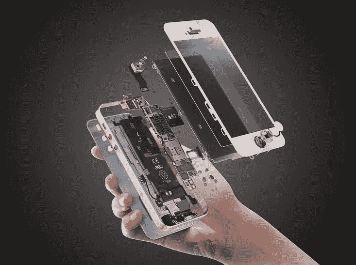

# 我们形影不离的伴侣“我们的手机”的故事

> 原文：<https://medium.datadriveninvestor.com/the-story-of-our-inseparable-companion-our-mobile-p-6a58b8931cb?source=collection_archive---------10----------------------->

Exploded view of the inseperable companion.

智能手机可能已经席卷全球，多年来，我们已经看到从亚历山大·贝尔的手机到新的 I-Phone XS、Pixel 手机或你目前使用的手机的平稳过渡。

手机已经成为我们形影不离的伙伴，这些年来，我们从仅仅是一个寻呼机变成了功能齐全的智能手机，这不是很吸引人吗？这种增长不仅仅归功于苹果、诺基亚、美国电话电报公司或谷歌等品牌，或许这些品牌并不制造你的智能手机，它们只是设计企业。许多不同的组织融合在一起，使电话(或任何其他消费电子设备)成为现实。这些品牌也许最不出名，因为完整的实物产品都是由它们制造的。其中包括 TSMC，富士康，全球铸造，佩吉特龙，Memsic 等许多其他公司。你可能从未听说过这些名字，但这些名字让你的智能手机成为现实。

**先说移动处理器**

因此，你正在阅读的设备可能由三星、英特尔、高通、德州仪器、海思和许多其他制造商的处理器驱动。其中许多是无晶圆厂的组织，他们只是设计和模拟，真正的制造是在 ic 晶圆厂进行的。

只有一家公司拥有移动处理器的知识产权。RISC(精简指令集计算机)架构用于开发移动电话中使用的低功耗处理器。ARM **Acorn RISC Machine** ，开发架构并授权给其他公司，这些公司设计自己的产品来实现其中一个 architectures‍.

IC 晶圆厂是制造微电子和纳米电子产品的专门组织。集成电路制造是最复杂的制造过程之一，仅在全球少数几家工厂进行。TSMC 是最大的集成电路制造商，其次是全球代工厂和德州仪器。

芯片级电子技术在不断发展。这种发展是以两个连续晶体管之间的距离来衡量的，目前我们是 7 纳米。进一步的发展将需要像 3d 光刻这样的技术，我们还没有掌握。

再往下，欣赏一下开采稀土金属的矿工，稀土金属是硅制造的重要组成部分。

**手机显示屏**

LCD 显示器的生产(从现在起 3-4 年内将被淘汰)由中国深圳主导，当地公司如 Liantronics、Unilumin、Leyard 等。LCD 制造在这里相当本地化。但是有机发光二极管(AMOLED)制造业被 LG、三星和其他公司如 AU electronics 和 Anwell 所主导。这种制造是由专门从事成像和光电技术的组织完成的。

这里，further Red 正在尝试全息显示，微软和三星正在尝试可折叠显示手机，让我们看看会出现什么。

另一项很酷的技术是基于电润湿的显示器，其中不混溶的染料穿过微流体通道并由电场触发。染料在特定点的组合将决定颜色。这样的展示将总是可见的，并融入环境中。这些显示器具有高反射性，因此在阳光直射下不会有更多的可读性损失。

**摄像机**

照相机被制造为图像传感器和镜头两者结合形成成像传感器。传感器在半导体晶圆厂制造，广泛使用东芝、松下和索尼的传感器。传感器有两种类型:CCD(电荷耦合器件)和 CMOS(互补金属氧化物半导体)。CMOS 的制造与 ic 制造非常相似，因此在晶圆厂进行，但 CCD 传感器需要专门的设备。图像传感器只是具有百万像素(兆像素)的微透镜阵列。镜头由蔡司或徕卡等镜头制造商制造，或在当地生产。

现在，即使相机每天都在变得越来越好，使用手机像素(作为微透镜阵列)来捕捉图像的研究已经深入到我们可以看到没有专用相机传感器的手机，你的显示器就变成了你的相机。这可以通过超快刷新率显示器来实现，其中每隔一帧充当图像传感器，下一帧充当显示器。真的很吸引人，但需要一些时间才能见天日。

一项“可调透镜”技术正在开发中，将被纳入正在开发的透镜中。这可以极大地提高微型相机镜头模块的光学变焦。

**电池**

电池制造是最复杂的任务，需要非常高的自动化和安全标准(即使特斯拉从松下购买电池)。目前电池生产由索尼、松下、三星、三洋等公司主导。甚至有总部设在台湾和中国的当地公司提供廉价的电池解决方案。

电池和能源行业正面临着新技术爆发的迫切需求，以成倍增加充电容量。研究是用钻石和石墨烯进行的，但对消费电子产品来说太贵了。

**外部传感器**

包括重力传感器、接近传感器、指纹传感器和其他传感器在内的传感器是在专用设施中专门开发的，因为制造它们需要大量的知识产权和专利。例如，TI 生产数字光处理传感器，只有三星生产虹膜扫描仪。

其他 MEMS 传感器是通过纳米加工工艺开发的。在这里，我们为不同类型的传感器提供了专门的设施。生物传感器是利用分子光谱学原理制造的，而加速度计是根据弹簧上的阻尼质量原理制造的。光传感器基于光电二极管，重力传感器利用霍尔效应。

如前所述，所有类型的传感器都是在专用工厂制造的，到目前为止，mems 生产主要由博世、TI、惠普和意法半导体主导。它们一起贡献了大约 60%的传感器制造。但这些并不能构成你的智能手机，因为制造智能手机需要廉价的传感器，所以这些传感器是在台湾复杂的工厂通过表面微加工生产的。来自 InvenSense、Memsic、STM 的传感器在我们的手机中崭露头角。

**扬声器**

公司要么采用设计扬声器，要么购买扬声器技术和设计并加以整合。像杜比这样的公司许可他们的技术被采用，或者其他人设计它们，并由像富士康这样的合同制造商制造。

**身体工程**

机身由玻璃、金属或陶瓷制成，由微加工公司生产，而玻璃机身由康宁公司或 Dragontail Systems 生产。

设计师还在激光雕刻设备上雕刻天线带(这些天线带因国家而异)。

该零件在装配单位就地采购。

**主板和组件**

以上所有产品现在都到达合同制造地点，在那里制造主板，然后进行最终组装和测试。这些公司包括富士康，大部分手机都是在这里制造、测试、包装和运输的。

**稀土开采**

中国内蒙古的稀土产量占全球的 81%，其次是澳大利亚。截至目前，稀土需求超过 40000 吨。

加工一吨稀土会产生 2000 吨有毒废物，对附近地区的环境和生态造成损害，曾经有过由于采矿的毒性而导致整个定居点被迁移的情况。此外，通过回收来提取稀土元素也不是有效和高效的。简而言之，稀土开采对消费电子产品来说是一项肮脏但至关重要的工作。

因此，你现在使用的手机确实是合作制造和设计的最佳作品之一，是无数人和组织的辛勤工作，并通过对环境的永久破坏而成为可能。所以请小心处理，尊重产品，只是不要去交换你的产品，了解它们的价值。