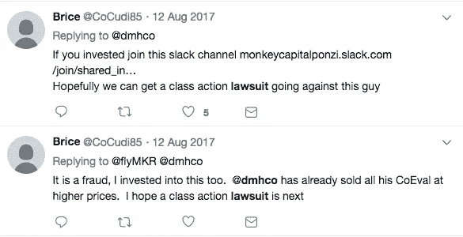
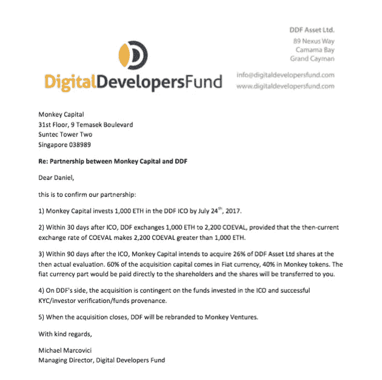
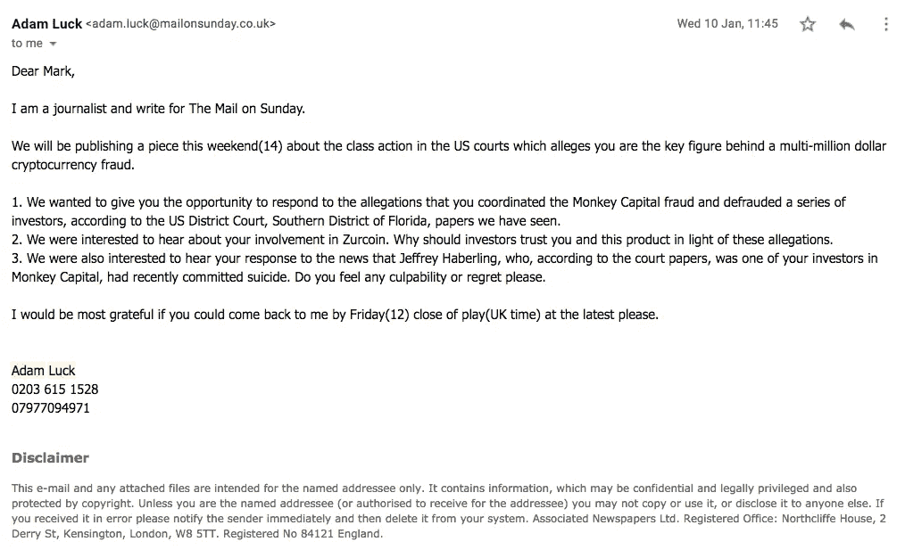
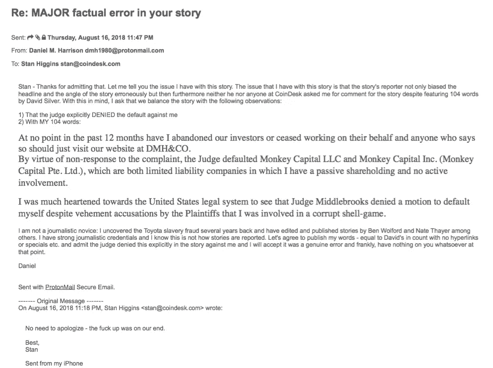

# 猴子资本的奇怪诉讼

> 原文：<https://medium.datadriveninvestor.com/the-strange-litigation-of-monkey-capital-abe225f20f42?source=collection_archive---------8----------------------->

奇怪的巧合比比皆是

以下是一篇即将发表的关于猴子资本诉讼的文章预告:

2017 年 12 月 19 日，两件事像闪电一样同时出现，这两件事显然将成为一长串持久巧合中的第一件，这些巧合将为他们所笼罩的诉讼蒙上阴影。

就在比特币开始从 12 月 17 日达到的历史高点下跌时，仅在两天前，犹太人的光明节假期前一天的一个周末结束时，西尔弗·米勒律师事务所选择对丹尼尔·马克·哈里森和猴子资本提起民事集体诉讼。

这起诉讼在比特币媒体上大肆宣扬，就像新产品上市时的公关方式一样，指控“数百甚至数千名”投资者可能被骗走了高达 6000 万美元的资金，目前的原告群体已经包括了远远超过 1500 万美元的加密货币损失。最初的诉讼甚至附有一张图表，显示这些原告如何有资格成为超过 500 万美元的索赔人，这是在佛罗里达州联邦地区法院进行集体诉讼所必需的金额。

战略上选择这个日期，是为了从媒体那里获得对最大可能潜在损失的最具穿透力的回应，这个日期是该律所在比特币达到历史高点后第一个可以实际提交投诉的日期。人们不得不对这种不可思议的市场时机感到惊讶，如果这不是直接来自内部人士卡特尔的结果，那么对于一群起诉要求归还比特币的原告来说，这似乎是非常偶然的，因为他们在今年早些时候在俄罗斯的一个去中心化交易所输掉了赌博。

此外，有人观察到，其中一名原告直接从丹尼尔·哈里森(Daniel Harrison)那里以 10 万美元的价格购买了价值 100 万美元的同名加密货币，但他显然从未出售过，即使他的朋友正在大量抛售。事实上，在成百上千的潜在原告中，只有 6 个人最终成为了自愿的原告，这是这个疯狂曲调中另一个奇怪的曲折。最终，1500 万美元被逐步降低，直到所有原告都认为实际上只有 120 万美元。

事实上，早在那年 8 月 12 日，就有人抱怨要在 Twitter 上发起集体诉讼，就在同一天，一家黄金投资网站的所有者向所有猴子资本发起了公开战争。这是*就在*之前，同期的代币价格被大幅压低。

不久后，其中一名原告在几周前威胁丹尼尔·哈里森(Daniel Harrison)说，当他被要求出示比特币的证据时，他用一颗子弹击中了他的头部。这个人威胁地建议哈里森暂时不要接近“任何机场”。

这只是开始。事实证明，不少于 3 名来自主要出版物的记者似乎像传播弥赛亚第二次降临的消息一样，执意传播西尔弗·米勒的福音。

事实上，抢劫确实发生了——但不是由猴子资本组织的。而是有人抢了猴都 1,000 ETH。7 月 24 日，一家名为数字开发者基金的 ICO 与猴子资本达成了一项协议。这笔交易是，Monkey Capital 将预付 1,000 ETH，这些 ETH 将在 8 月 8 日至 9 月 9 日之间换回 2,000 COE，除非同期总价值低于 ETH 总价值。正是在这两个日期之间，同期的价值被摧毁，价值下降了 96%。然而，在 8 月 8 日和 8 月 24 日，2,000 COE 的总价值确实超过了 1,000 ETH 的总价值。但那时 DDF 早已离去。

至于那些向一家黄金投资网站的领导者猴子资本(Monkey Capital)公开宣战的家伙，他们同时删除了与丹尼尔马克哈里森(Daniel Mark Harrison)数周的采访录音，这让他们最初卖出的投资者感到恐慌，从而加剧了损失。该网站的播客主持人将 Coeval 的价值推高到超过半个比特币，并告诉数周前带来的数百名听众立即卖出。

当我问节目的播客主持人，他为什么要这样做时，他用一句简单的话回答道:

"我的老板现在认为这个项目是一个骗局。"

还有更多。非常非常多。问题比比皆是:西尔弗·米勒是如何如此完美地把握市场时机，在比特币达到历史高点的那一刻提起诉讼的？DDF 是如何如此幸运地达成一笔交易，以至于在他们需要换回 1,000 ETH 的同一时期，这笔资产下跌了 96%？为什么本应该是一个表面上中立的记者，公开介绍自己来自英国《每日邮报》，使用《每日邮报》的电子邮件，最终却在伦敦《泰晤士报》 的 [*上发表了一篇关于我的热门文章？*](https://www.thetimes.co.uk/article/daniel-harrison-accused-of-30m-crypto-fraud-cn6b0hgrm)

CoinDesk.com 是数字货币集团(Digital Currency Group)旗下的网站，控制着比特币相关市场的大部分，西尔弗·米勒(Silver Miller)是该网站的明星专栏作家。为什么这家网站拒绝发表我在公开报道大卫·米勒(David Miller)时给他们的相同字数的引用？

为什么一名自称来自 theinformation.com(一家受人尊敬的调查性新闻刊物)的记者，在面对这方面的证据时，对“比特币媒体的付费游戏”不感兴趣，反而对去年 12 月猴子资本社区一名成员的自杀更感兴趣(毕竟，这与公共关系的“付费游戏”主题有什么关系？)

为什么有些人坐拥 90 万美元的资本利得，却不拿出他们刚刚投资的 10 万美元来弥补他们最初的头寸呢？

猴子资本的故事引发了许多问题。

但是让我们从头开始。2018 丹尼尔·马克·哈里森