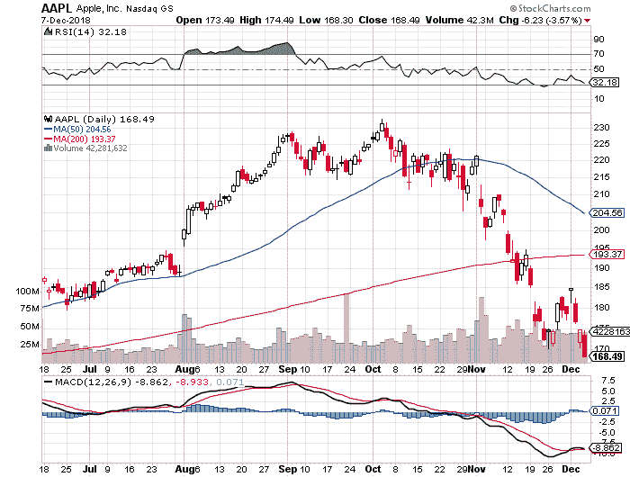

# 成功量化交易的微妙艺术

> 原文：<https://medium.datadriveninvestor.com/the-subtle-art-of-successful-quantitative-trading-826add7640a5?source=collection_archive---------10----------------------->

In the trading markets, perspective is everything

人们通常很难理解股票市场是如何运作和表现的。是什么推动了一家公司的股价？股票价格的基础是什么，人们如何从这些信息中获利？

随着我们的世界演变成一个完全拥抱人工智能和机器学习的世界，我们往往更喜欢我们可以完全控制结果的过程。在完全自主的自动驾驶汽车中，错误率预计不会在 0 到 1 之间。预计为 0，句号，结束点。这就是为什么像股票交易所这样的市场(交易服务商)会让任何科学家或数据驱动的个人感到极度沮丧，无法理解并持续从中获利。从基金管理的角度来看，“一致性”和“利润”这两个词很少联系在一起。

这是因为在准确选股的科学背后有一个巨大的定性成分。而这种定性成分会让交易者，更确切地说是量化交易者(也叫“quants”)发疯，迫使他们重新思考自己所知道的一切。

无论如何，都不能假定股票市场是“精确的”、“绝对正确的”或“完全理性的”。例如:众所周知，作为人类，我们对负面消息的反应不同于正面消息。这正是为什么新闻媒体更喜欢向我们展示坏消息而不是好消息，因为当我们对坏消息做出反应时，我们会带着更多的情绪行动(点击更多的新闻文章)。在股票市场上，同样的情绪在起作用，这就是为什么我们经常听到非常稳定、盈利的公司受到负面新闻的破坏，导致股价迅速下跌的故事。

对于一个量化分析师来说，让整件事令人难以置信地沮丧的是，知道在这个过程背后有一门科学。当谈到交易定理的合法化时，科学过程成为了一个无价的工具。在这方面，交易 T2 是一门科学。你从一个想法开始，然后试图把它变成一个基于规则的系统，这就形成了你的假设。你通过模拟过去的数据来测试假设(科学称之为“实验”，交易者称之为“回溯测试”)。瞧，如果结果足够好，你就可以考虑交易策略了。

但这是事情开始崩溃的时候，这个系统在活跃的市场上不起作用。哪里出了问题？

假设我给自己安排了以下项目:预测 2019 年 1 月 1 日苹果股票的价格。你如何着手建立一个准确的预测模型？

有各种方法可以做到这一点——或者至少尝试做到这一点。一是使用图表和绘制*趋势线。*例如，我可以看看以下内容:

Apple stock price on 9th Dec, 2018

使用一个基本的线性回归模型，并知道今天是 2018 年 12 月 9 日，我复习了一些高中代数并得出以下结果:

*(12 月 9 日价格—10 月 9 日价格)/(60 天)*

= (168.49–215)/60

=-0.7751667，这是两个月内每天的变化率。因此，我可以假设，在接下来的 22 天里(直到 2019 年 1 月 1 日)，股价应该下跌约 22 点，因此跌至每股 146 美元。

一个重要的问题出现了:这种模式是合理的吗？用这样的模型给公司 2019 年 1 月 1 日的股价定价有意义吗？

事实是:这取决于市场的进化程度，但如果我们假设所有的低效率尚未被计入价格，那么是的，这样的系统可以工作。自然，定量分析师必须进行严格的回溯测试，以了解系统在过去的表现。

这样的回溯测试会是什么样的呢？

*   下载历史数据(从可靠的数据源)
*   设置回溯测试环境
*   运行一个时间模拟，其中如果 2 个月的变化率高于 X，并且 X 本身是一个从 0 到 y 的变量，则您购买苹果股票。因此，您也在为 X 进行优化
*   测量投资回报率，并将其与您期望的结果进行比较

假设回溯测试提供了令人满意的结果，一个老练的量化分析师可以运行一个“元”算法，选择最佳策略进行实时运行。这个“元”算法本质上可以是完全自主的；因此，当一个量化指标的回溯测试非常出色时，它就有能力自动部署到实时市场中。

之后，它可以工作一段时间，直到停止工作。

这就是量化策略的一般性质。基于策略的回溯测试，一个定量分析师可以自信地宣称，从统计上看，积极的击球是有意义的。然而，在某个时间点，这种情况将不复存在。

这也是这项工作变得更像艺术而不是科学的地方。

回到我们最初的问题:当后验测试被证明是异常的，但在现实市场中失败时，我们如何解释这种情况？在这些情况下，结果可能是由于糟糕的时机:就在你偶然发现这个策略的时候，可能也是其他定量分析师偶然发现它的时候(也许一个用于这个策略的数据源最近才变得可以访问)。如果是这样的话，回溯测试所依赖的“优势”就不复存在了。

这也可能是由于糟糕的假设，这是更常见的情况。通常，定量分析师对“衍生”数据而不是原始数据进行回溯测试。可以把派生数据看作是一起解析的数据块，并以更易理解的形式呈现。许多机器学习驱动的策略就是这种性质，这就是为什么 ML 驱动的策略在现实市场中经常失败。

在交易市场，背景非常重要。回测的性质和进行回测的角度。这是为什么定量分析师总是要找出每个策略的定性本质的主要原因之一。

很有可能它有一些价值。

*[*作者*](https://www.linkedin.com/in/raghukumarrksv) *是人工智能驱动的基金管理公司*[*RAIN Technologies*](https://rainfund.ai/)*的联合创始人。**