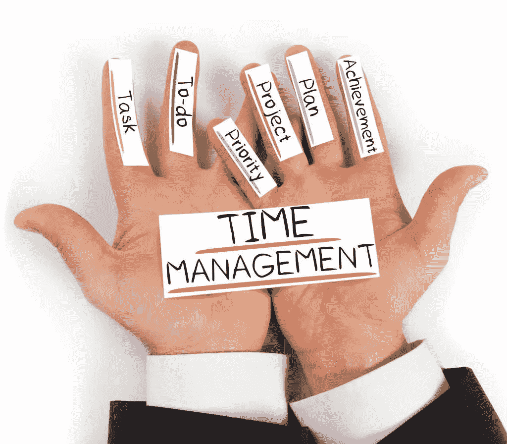
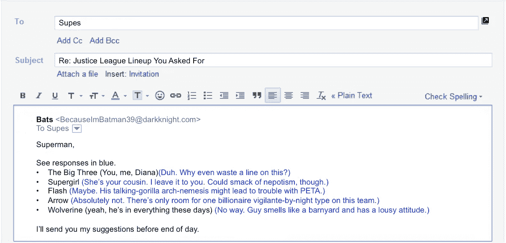
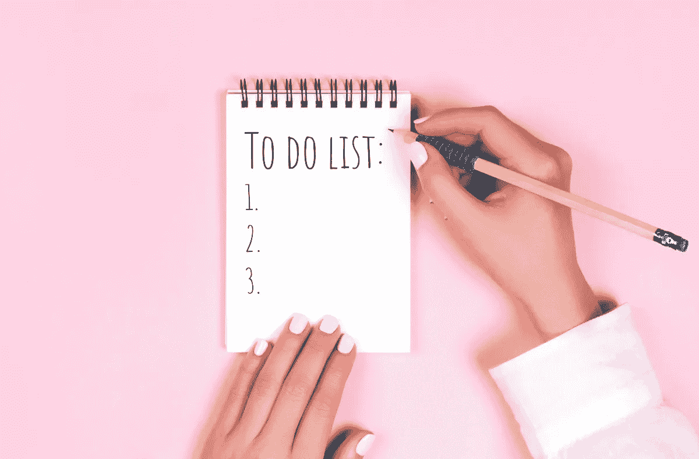

# 我的成功时间管理秘诀

> 原文：<https://medium.datadriveninvestor.com/the-successful-time-management-secrets-of-mine-b2319a7d37c6?source=collection_archive---------2----------------------->

Illustrations by Corporate Finance Institute

> 在我看来，成功的时间管理原则并不复杂。

我只是一个简单的人，喜欢工作得更快更有效率。2009 年，我以全班前百分之五的成绩从河内科技大学毕业。从那以后，我读了 1000 多本书。

其中 80%以上是非虚构的。我阅读了从技术到商业、文学到语言等所有类别的书籍。我真的很喜欢读书。读书是学习的绝佳工具。时间管理也是我从这些书中学到的基本技能之一。

 [## 数据科学和软件工程哪个更有前途？-数据驱动型投资者

### 大约一个月前，当我坐在咖啡馆里为一个客户开发网站时，我发现了这个女人…

www.datadriveninvestor.com](https://www.datadriveninvestor.com/2019/01/23/which-is-more-promising-data-science-or-software-engineering/) 

在我看来，成功的时间管理原则并不复杂。总体而言，它们可以归纳为三个主要观点:

# 如果你碰到它，采取行动…

touch it once rule

这是伟大的时间管理的第一个想法是触摸它一次规则。简单地说，在你准备好处理这封邮件之前，不要打开它。如果你每天只花 30 分钟重新访问、重新阅读文件或电子邮件，你每年将浪费大约 200 个小时不采取任何行动。遵循这条规则不仅能节省你的时间，还能理清你的思路。

# 制作列表…

Make lists as a way to keep organized

如果你没有清单，你很可能是一个非常被动的人。要列出好的清单，请遵循以下步骤:

*   列出你必须完成的任务。
*   给他们分配优先级。
*   按计划行事。

# 如何优先考虑你的清单…？

> 在世界各地，许多人淹没在产生低价值的繁忙工作中。

帕累托原则，也就是 80/20 法则，你听说过吗？这反映了大多数人倾向于将 80%的时间花在任务上，以产生 20%的结果。他们很忙，但没什么收获。他们已经失去了分清轻重缓急和集中注意力的能力。

因此，在排列清单的优先顺序时，有几件事需要考虑:

*   不想做也不需要做。
*   想做的和不需要做的。
*   **不想做而需要做的事。**
*   **想做而需要做的事情。**

不要做你不需要做的事情，上面的第一条和第二条。看看第三和第四类任务。让我们通过混合来激励自己去做你不想做的事情，比如边做边听音乐。

# **结论**

时间管理在生活中很重要，但似乎并不难。

感谢阅读！