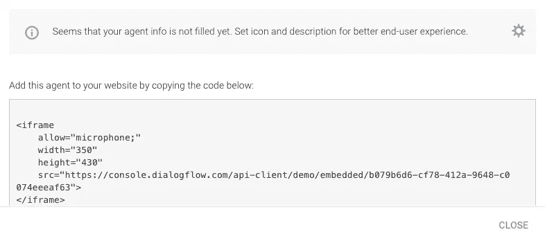
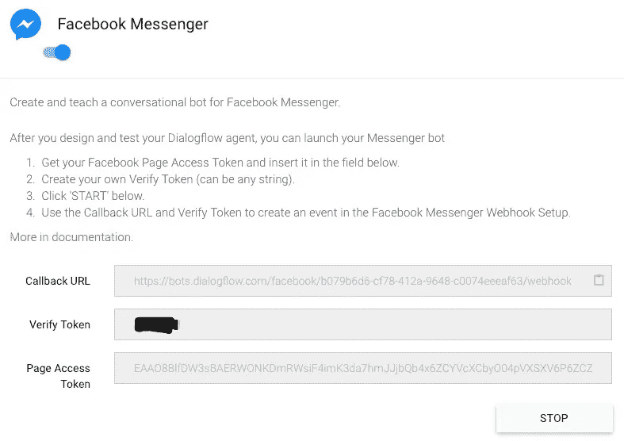
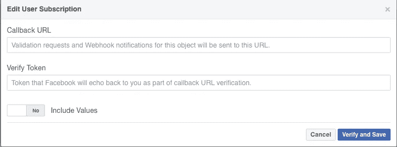
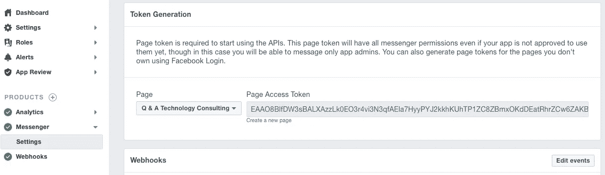

# 对话流入门指南

> 原文：<https://medium.datadriveninvestor.com/the-supreme-starter-guide-to-dialogflow-a173595a83ab?source=collection_archive---------13----------------------->

在 2013 年的科幻剧《她的 T1》中，西奥多·托姆布雷(Theodore Twombly)对人工智能聊天机器人萨曼莎(Samantha)进行了一次离奇而讽刺的诱惑。西奥多在与妻子凯瑟琳的长期关系结束后伤心欲绝。正是这种孤独感，迫使他配置操作系统，表现得像一个真正的女人。

在她身上，萨曼莎是作为西奥多桌面上的高级操作系统执行的。然而，现代聊天机器人通常由☁️.支持今天你可以和微软的准朋友[佐](https://www.zo.ai)聊天。Zo 复制了一个爱打游戏的肤浅少年。和她聊天，Zo 甚至可能[和你调情。](https://medium.com/datadriveninvestor/playing-doctor-turing-with-microsoft-zo-47b18e3a89b3)

前情提要[在 Azure 中开发](https://medium.com/datadriveninvestor/intro-to-developing-chatbots-in-azure-4ccb3c2c5847)聊天机器人，我调查了微软 Azure 聊天机器人和一般聊天机器人的智力基础。机器人利用自然语言处理(NLP)来理解人类语言，目的是提取对话中人的意图。

**意图**

谈话的精神。

“查询”:“获得资格”

“意图”:“要聪明”

【得分】:0.9987

“查询”:“没有烦恼”

“意图”:“没问题”

【得分】:0.9842

“质问”:“你烦死我了”

“意图”:“讨厌”

【得分】:0.9872

“查询”:“嘿，伙计”

“意图”:“问候”

【得分】:0.9955

这段伪代码摘自微软 Azure，但该技术是所有机器人的一个特征。你可以在 [Azure](https://medium.com/datadriveninvestor/coding-chatbots-in-azure-a-k-a-part-two-6e8368c0523f) 的编码聊天机器人中阅读关于代码的细节。

**培训**

幸运的是，软件开发专业知识对于构建机器人来说是多余的。主要供应商销售为几乎所有应用程序预构建的聊天机器人。你可以选择机器人来回答常见问题，订购机票，预订餐厅，等等。你仍然可以为特定的应用训练你自己的机器人。

通过首先登录到主控制台，您可以立即开始使用 Dialogflow。向下滚动到屏幕底部选择一个**预建代理**或在顶部创建一个新代理。

⚠️创造了一个意图，在屏幕上方将其命名为“开玩笑”。然后点击**保存**。

接下来点击**培训阶段**并输入至少一个。越多越好。

“我只是跟你玩玩。”

接下来点击**回复**。请输入有效的回应。

“很搞笑。”

请注意，**事件**字段为空。这是为高级用户准备的。您可以设置机器人来响应特定事件。这个工具可以设置为从菜单中激活动态动作，比如检索星座。

超级用户也可以实现**上下文**。此功能交叉链接了更多动态对话的意图。

每个意图都可以设置为结束对话。使用开关启用它，并考虑添加一个离开响应。此命令结束整个对话。

最后是由开关启动的**履行**选项。这个特性启用了一个 webhook。你可以用它来执行和发送小程序，如(电影，gif 等)。

超级用户可以实现**实体**。实体是真实的或任意的物体，如粉红色、暖色或湿色。该系统将实体应用于意图分析。一个庞大的实体库被预编程到 Dialogflow 中。你应该对实体进行编程的唯一时间是针对你的产品或服务的特性。例如，您的新应用程序使用机器人流程自动化或 RPA。

⚠️为了获得最佳效果，实体应该在意图之前建立。

聊天机器人仍然是一项新兴的技术。你应该准备花几天或几周的时间来训练你的第一个机器人。我鼓励没有经验的开发人员选择一个预建的机器人，并根据你的目的进行定制。

⚠️不要忘记用顶部的密钥保存你所有的工作。否则不保留任何指令。这是复杂的工作，你应该对保存你的工作偏执。

**重要**

像任何程序一样，测试聊天机器人是至关重要的。不要忘记将您所有的培训回答输入到屏幕右上角的文本框中。你也应该输入变化和拼写错误。

INTENTS

**集成**

你做到了。你制造了你的第一个机器人，它通过了训练。是时候将它与你的网站或信息服务整合在一起了。

幸运的是，与网站整合很简单。进入**集成**页面，打开**网络演示**。然后将代码复制并粘贴到您的网页中。为了更好地为您的客户服务，我会在**常规**设置中自定义聊天机器人的名称和图像。

Website Integrations

我知道你的一些客户不会访问你的网站。你可以将你的机器人集成到 Facebook Messenger 中。马克·扎克伯格要求你首先建立一个商业页面，不要忘记添加一个用户名。您还需要选择一个消息按钮，并将其拖到页面上。

你的下一个任务是开**脸书开发商**。

首先创建一个新应用程序。目前它只是一个空的编码窗口。

返回到 Dialogflow 并打开**集成**。你的下一个任务是打开 **Facebook Messenger** 并点击图标。该窗口将打开一个新窗口。

复制 Webhook URL。接下来去脸书的 Webhooks 并选择它。您将被要求订阅。将 Webhook URL 粘贴到订阅窗口中。然后返回到 Dialogflow 并为验证令牌创建一个密码。将验证令牌复制到订阅窗口中。

Edit User Subscription

在 2016 年大选表明可怕的人在网上操纵人们之后，脸书对其游客保持警惕。在验证您的业务之前，不允许您继续安装。

转到设置页面，完成您的企业的基本描述页面。高级设置页面是可选的。它为您的应用程序配置年龄限制和安全设置。不要忘记保存您的设置，脸书会自动检查您的条目。

**任何条目都可以接受**

您现在可以转到设置，滚动到**令牌生成**并选择您的页面。它应该立即生成一个页面访问令牌。这是脸书生成的验证您帐户的密码。将此字符串粘贴到 Dialogflow 中的访问令牌框中。这就完成了您对 Dialogflow 的配置。

Page Access Token

您的应用程序只有在打开时才是活动的。转到屏幕顶部，拨动开关。你现在是**直播**。

脸书还强迫你提交复审申请。选择 **App Review** 并发送您应用的简要说明。

🎆 🎆 🎆