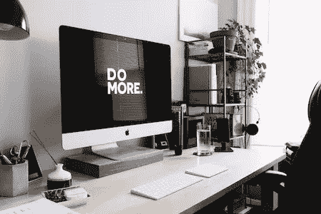

# 2020 年总统候选人令人惊讶的数字世界

> 原文：<https://medium.datadriveninvestor.com/the-surprising-digital-world-of-2020-presidential-candidates-2a91bdf9c99d?source=collection_archive---------17----------------------->

Photo by [Carl Heyerdahl](https://unsplash.com/@carlheyerdahl?utm_source=unsplash&utm_medium=referral&utm_content=creditCopyText)

在 2016 年总统竞选期间，唐纳德·特朗普因购买域名[www.jebbush.com](http://www.jebbush.com/)并将流量重定向到自己的网站而令杰布·布什尴尬，成为头条新闻。

没有购买 www.jebbush.com[是一个令人尴尬的疏忽，但这是大计划中一个非常小的“哎呀”。从那以后，随着对数字风险意识的增强，数字世界的警笛和闪光灯越来越响。](http://www.jebbush.com/)

 [## 保护主义、政治和经济动荡|数据驱动的投资者

### 美国股市昨日出现 400 多点的大幅反转，为未来的事情发出了警告信号。市场…

www.datadriveninvestor.com](https://www.datadriveninvestor.com/2018/06/28/protectionism-politics-economic-turmoil/) 

全球各地的政府和私人部门公司迅速以标准和立法做出回应，但我们的 2020 年候选人，包括我们的现任总统，似乎对此视而不见。他们的漠不关心影响着每一个美国人。

# 将数字风险置于背景中

虽然数据泄露成为头条新闻，但这只是冰山一角。但很容易理解它们如何影响我们的日常生活，所以在我们继续研究竞选网站的数字标准之前，让我们先了解一下它们的背景。

这些只是过去几年中发生的一些最大的数据泄露事件以及受影响的人数:

*   [脸书/剑桥分析](https://www.nytimes.com/2018/03/19/technology/facebook-cambridge-analytica-explained.html):8700 万
*   T-Mobile:200 万
*   萨克拉门托蜜蜂队:1950 万
*   [帕内拉面包](https://www.eater.com/2018/4/3/17192264/panera-bread-data-credit-card-breach-37-million-consumers):3700 万
*   [目标](https://www.usatoday.com/story/money/2017/05/23/target-pay-185m-2013-data-breach-affected-consumers/102063932/):4100 万
*   谷歌+:5250 万
*   Quora : 1 亿

如果你手边没有计算器，那就是 3.39 亿人——大约是加州人口的 10 倍。

# 现在…故事的其余部分

数据泄露只是数字馅饼的一小部分。其他值得关注的领域包括隐私、可访问性、知识产权、多语言支持，甚至是电子邮件安全。但是我们的 2020 候选人似乎没有注意到。

# 他们的网站排名如何

当我检查 2020 名候选人的网站时，我发现了以下情况。

*   **大部分考生的网站都没有版权**。这意味着其他候选人、普通公民，甚至俄罗斯人可以窃取他们的立场文件，传播他们的修改版本，而候选人将没有法律追索权。
*   **虽然世界其他地方都将隐私视为一项人权，但许多候选人的网站甚至没有隐私声明，披露他们收集了哪些信息以及他们用这些信息做了什么。**根据 [Flesch-Kincaid 可读性测试](https://www.webfx.com/tools/read-able/flesch-kincaid.html)，这些陈述的可读性远高于七年级推荐的阅读水平。这意味着隐私声明比普通用户能够理解的更复杂，这违反了隐私声明的核心原则。尽管美国在将隐私要求正式纳入法律方面进展缓慢，但人们会预计总统候选人会看到风向并加入进来。
*   虽然所有候选人的网站都在某种程度上使用了 cookies，但没有一个网站遵守给予消费者选择的广泛接受的标准。虽然伊丽莎白·沃伦的网站确实允许用户选择退出，但它默认设置为“选择加入”的事实不符合这些标准，在一些国家甚至会违反法律。
*   **只有伊丽莎白·沃伦的网站包含一个可访问性声明**，表达了她让所有美国人都能访问该网站的意图(请注意，这并不意味着她已经这样做了)。由于法院已经裁定美国残疾人法案适用于数字空间以及物理空间，这应该是任何竞选总统的人最关心的法律问题。
*   对于那些网站包含西班牙语内容的网站来说，大多数都做得很差。政治表示，他们似乎在使用谷歌翻译，“这是高中生用来逃避做西班牙语作业的一种伎俩。”这种肤浅的尝试很可能会让他们试图拉拢的选民失去兴趣。

# 我们要让犯人管理精神病院吗？

这不是一件小事。就像发现你孩子的高中英语老师不知道 there，their，和 they 're 的区别。或者应该在凌晨 3 点接电话的人把电话转到了语音信箱。

我们必须对我们的领导人提出更多要求，而这首先要对我们的候选人提出更多要求。他们的网站比基本的数字安全和隐私标准落后了大约十年。我们现在应该把我们最重要的数字资产——比如电网和核电站——托付给一群连自己的网站都搞不好的候选人吗？

除非总统候选人在数字技术上齐心协力，否则我们似乎别无选择。但就我而言，在选择获得我选票的候选人时，我会优先考虑数字实践。