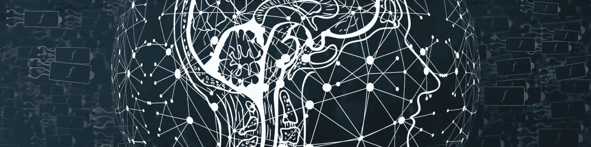

# 群体人工智能

> 原文：<https://medium.datadriveninvestor.com/the-swarm-ai-6daee0630bb3?source=collection_archive---------22----------------------->

在过去的几年里，许多公司和个人都在投资开发人工智能。他们中的许多人试图找到类似圣杯的东西。一个可以积累智慧的系统，给他们带来巨大的利润，也许还能帮助人类。

我个人认为这是一个死胡同。我们看到我们的大脑——一台机器——一个在我们看来有智能的物体。但是有两件事我们需要意识到。首先，我们的大脑由高度专业化的单元组成——神经元群，是我们大脑的一部分。第二个原因是，如果没有能力互相了解自己的经历，我们仍然是穴居人。

这些事情让我想到一个理论，如果我们要建造一个人工智能，它将是一个大型的分布式群体，由更小的高度专业化的人工智能系统组成，作为一个认知超级智能一起工作。

支持这个理论的另一个东西是大自然本身。以蚂蚁或蜂群为例。这些小生物很简单，没有个体那么强大。但是它们一起创造了大型的社区，能够建造复杂的结构，表现得像一个智能系统。

嗯，人类也是一种超级智慧。我们已经能够发展工业、计算机和互联网。

# 专门化

专门化是智能系统的重要组成部分。我们人类是专业化的，我们有不同的职业，没有他们，我们将无法实现我们文明的奇迹。让我们试着想象一下，我们每个人都必须学习所有的东西。我打赌你意识到这是行不通的。

动物群落，尤其是昆虫，也是特化的。蜜蜂有雄蜂、工蜂和蜂王。类似的情况也适用于蚂蚁。

# 命令与征服

人类(以及其他物种)的另一个特性是指挥和征服的能力，或者仅仅是将工作委派给其他人的能力。

这使我产生了一个想法，将人工智能系统与经理和工人分开。

工人是这个系统的最底层。他们做出真实的动作，比如计算、模拟、查看日历、创建约会、调用 API、移动事物。它们只是执行器。

与工人相比，经理是专业的授权者。他们的角色是在更高的抽象层次上理解事物。他们把东西放在一起，把任务分配给工人来实现目标。

此外，我们有经理的经理。这个层次可以是不确定的，这取决于所需的抽象级别。

工人和经理应该相互学习，就像我们人类一样，就像蚂蚁利用气味来寻找最佳路径一样。

# 专业人工智能系统的例子

我们可以有各种简单到复杂的系统。从简单的计算器、可以查看日历的系统到能够识别图像的神经网络。

这些神经网络也可以是管理者和工作者。你可以训练一个神经网络来识别更高抽象层次的物体，比如动物、汽车、建筑物。然后它可以将识别委托给一个专门的网络，这个网络可以识别它是哪种动物。假设它是一只蝴蝶。甚至这也可以委托给一个网络，这个网络能够识别它是哪种蝴蝶。

## 餐馆问题

让我们接下这个任务:

明天晚上在附近一家评价不错的意大利餐馆给我订一个两人座位。

这个问题的解决方案可以由以下步骤组成。

1.  **最高管理者:**任务是什么？哦，在餐馆预订座位——让我们把它委托给餐馆预订系统。
2.  **Mid manager:** 让我们把问题分解成更小的部分——我们需要找到一家餐馆，然后订一个座位。因此，将第一部分委托给餐馆查找系统。
3.  **工作人员:**我们用搜索引擎或数据库在附近找一家符合条件的餐厅。
4.  好的，我们现在有餐厅了，让我们试着预订吧。
5.  工作人员:我们给选定的餐厅打个电话，试着预订
6.  **Mid manager:** 嗯，餐厅不可用，尝试重复步骤 4-6，直到我们成功，否则我们将别无选择。好的，我们预订了明天晚上 7 点的房间，让我们把它退了吧。
7.  **最高管理者:** Ok 用户，你的问题有解决方案。

# 实施理念

如果你懂编程，你可以把每个人工智能系统想象成一个单一的功能。它有描述请求的参数——一个问题。它有一个返回值——一个解决方案。

这些函数可以是工人——做一些事情，比如返回数据或回答一个更大问题的一部分。他们也可以是管理者——将部分问题委托给其他职能部门。

经理职能可以充当信息转换器。他们把一个问题分成更小的部分，得到结果，然后把答案组合成一个单一的解决方案。

## 学问

每个函数调用(委托)都会生成一个调用跟踪——一个可能的解决方案的路径。如果我们对结果不满意，我们可以评估路径并建议不同的方法。或者我们可以让系统自己尝试不同的方式。或者我们可以定义另一组函数，其目的是评估错误可能在哪里。为了节省资源，我们可以忘记在一段时间内没有用的功能。

在系统是分布式的情况下，我们可以建立一个共享的知识库。当系统的一部分找到某个问题的解决方案时，它可以让其他系统知道它，这样他们就可以用它来构建更高层次的概念，而不需要找到部分解决方案本身。同样，我们人类通过分享我们的想法和知识来学习。

# 结论

我个人认为，我们已经走上了通往分布式超智能系统的道路。世界上许多公司都在构建许多小型的专业系统。都是基于机器学习和传统编程。这些系统作为 API 经济的一部分正在变得相互连接。

电脑在哪些方面比我们强？解决需要纯逻辑或高计算技能的问题。主要是他们交换信息的速度。

也许我们还没有认识到互联网是一个超级智能系统，但它可能已经是或者将来会是。因为看起来智能是更小的高度专门化的单元连接在一起的结果，它们的行为就像一群昆虫或一群人类。

这篇文章最初发表在我的博客上:[https://jiri.hybek.cz/en/The-Swarm-AI/](https://jiri.hybek.cz/en/The-Swarm-AI/)。