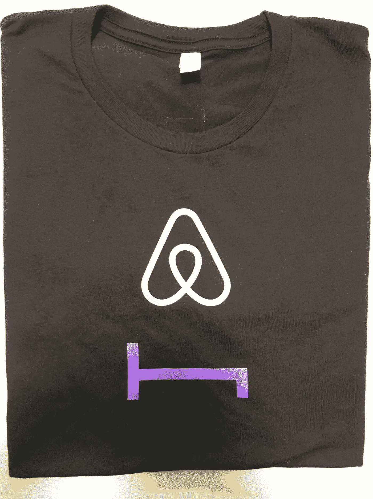

# Airbnb+hotel night 重塑酒店和旅游业的协同效应

> 原文：<https://medium.datadriveninvestor.com/the-synergies-between-airbnb-and-hoteltonight-to-reshape-hospitality-and-tourism-822e7e6a75d0?source=collection_archive---------4----------------------->

2019 年 4 月 25 日晚上，一群不寻常的人在旧金山歌舞伎酒店的休息室酒吧里闲逛——这些人从来没有想到会在任何酒店出现。

他们来自 Airbnb，该组织经常与“反酒店”运动联系在一起，聚会是为了庆祝其收购 HotelTonight 的交易完成。

 [## 本地活动赞助如何帮助您找到新客户——数据驱动型投资者

### 根据 2017 年 BrandMuscle 有效性指数，举办和赞助活动是最有效的…

www.datadriveninvestor.com](https://www.datadriveninvestor.com/2018/10/10/how-local-event-sponsorship-can-help-you-find-new-customers/) 

我怎么知道的？我是“主持人”的一部分——不是一个普通的 Airbnb 主持人，而是作为 Airbnb Experiences 的主持人，这是一个大约两年前推出的产品线。实际上，我和我的妻子一直是 Airbnb 体验主机的早期批次之一。我们的体验——中国书法和礼仪品茶——非常受欢迎，评价很高，以至于我们被选为晚会的主角。

2019 年 3 月初，Airbnb 宣布了收购 HotelTonight 的惊人消息。HotelTonight 成立于 2010 年，是一个最后一分钟酒店预订平台，曾是旧金山酒店业的热门初创公司。然而，经过 9 年的不温不火的增长，筹集了约 1.37 亿美元的总资本，只有约 200 名员工，它最终决定加入更大的船 Airbnb，价格未披露——传闻称超过 4 亿美元。

Airbnb 一直在疯狂收购——hotel tonight 是其在 M&A 的第 20 笔交易，也是 2019 年以来的第二笔交易。但它引起了更多的关注，因为它标志着 Airbnb 在酒店行业占据更大份额的雄心。自成立以来，Airbnb 已经从分享一张沙发或充气床垫，发展到一个额外的房间，整个公寓或度假屋。现在，随着 HotelTonight 的加入， **Airbnb 可以利用更大的群体，不仅仅是个人住宅，还有 HotelTonight 网络中的精品和独立酒店。**

HotelTonight 的联合创始人兼首席执行官 Sam Shank 表示，“HotelTonight 和 Airbnb 一起可以为客人提供更多选择，让世界上最好的精品和独立酒店成为真正的合作伙伴，将他们与这些客人联系起来。”Airbnb 似乎不仅仅是试图用其著名的“共享经济”商业模式来扰乱酒店业——通过让每个人都成为其闲置能力的主人。此外，它似乎正在通过抓住长尾——精品酒店和独立酒店——来攻击酒店业，它向价值链上游攀升以瞄准大型酒店似乎只是时间问题。

然而，我认为仍然认为 Airbnb 的野心是颠覆酒店行业是幼稚的。“颠覆”可能是硅谷的科技初创公司曾经吹嘘的时髦词。但近年来，随着企业家的成熟，越来越多的初创公司选择了更明智的战略，并定位于与现有公司合作，帮助重塑生态系统，提高效率。

以炙手可热的金融科技行业为例。LendingClub 等贷款初创公司的早期浪潮旨在通过实现个人对个人的贷款来彻底扰乱银行系统，但却发现这种商业模式的可扩展性和单位经济学与其股价一样令人失望。现在，新一波有前途的金融科技初创公司选择与系统合作并赋予系统权力。Blend 为抵押贷款建立了一个 API 平台，让像富国银行这样的大银行的生活变得更加轻松和高效。Clarity Money 应用程序旨在对消费者支出进行智能分析，后来成为高盛孵化的内部金融科技部门 Marcus 的一部分，该部门是著名的苹果卡的推动者。

同样，Airbnb 收购 HotelTonight 的举动，而不是扰乱酒店业，实际上可以重塑生态系统**，让精品酒店更好地接触客户，并为客户提供更多选择。**

就在 Airbnb 上周完成 HotelTonight 交易的同时，它宣布与 RXR 房地产公司合作，将纽约市地标洛克菲勒中心的 10 层楼改造成 Airbnb 风格的住宅。Airbnb 正抓紧时间推进其住宅共享之外的实验。

同一天，酒店业巨头万豪国际也宣布进入家庭共享市场，扩大其忠诚度计划，涵盖万豪、喜来登、W 酒店和丽思卡尔顿等品牌。据说其他酒店品牌如希尔顿和凯悦也在形成他们的家庭共享战略。然而，对于传统酒店来说，成功管理像家庭共享这样的千年商业模式的品牌名称可能具有挑战性。

**除了酒店住宿，Airbnb+hotel night 交易中重塑酒店服务的另一个方面被忽视了。**大约两年前，Airbnb 推出了一个名为 **Airbnb Experiences** 的新业务流，在这里，主人可以与客人分享有趣的当地体验。一些著名的课程包括参观巴黎当地的农贸市场、洛杉矶的拉面制作课程或旧金山的捕蟹课程。

在举办活动的时候，我意识到 Airbnb 和 HotelTonight 之间被忽视的协同作用——房地产和活动空间。过去 10 年，各大城市的房地产非常疯狂。自全球金融危机以来，尽管各国央行不断向经济注入资金，但全球通胀率仍保持在如此低的水平，原因之一是资产价格不断上涨，尤其是主要城市的房地产价格。不仅仅是住宅或办公室租金，短期会议和活动场所的价格也越来越难以承受。因此，对于那些想成为其独特体验的主人的人来说，除非他们能进入一个大房子或公寓，否则寻找一个重复出现的场所及其相关成本的摩擦可能是令人生畏的。

另一方面，许多精品酒店都有可用的开放空间，如休息室、酒吧或咖啡厅，但它们往往没有得到充分利用。如果他们能够用有趣和吸引人的活动来填充空间，这不仅可以促进酒精饮料等高利润商品的销售，还可以增加客流量，有助于营销。因此，通过匹配活动空间的供需， **Airbnb 和 HotelTonight 可以建立更具活力的活动平台。**

我已经可以想象 Airbnb Experiences 上的许多活动是对某些精品酒店场所的巨大补充。为空置的酒店咖啡厅提供烹饪和糕点课程，为空无一人的酒吧提供现场音乐会，当然还有为酒店休息室提供仪式品茶——这是冥想的绝佳替代方式。

为了更上一层楼，它还可以通过重塑供应方来打破酒店业的界限。不仅仅是住宿的供给方面，还有体验的供给方面。不仅仅是酒店提供他们所拥有的东西，**，还与个人贡献者合作，提供真正真实的、多样化的、动态的旅游体验。**