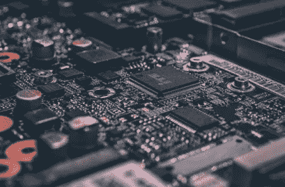

# 技术高原是一件好事。

> 原文：<https://medium.datadriveninvestor.com/the-technology-plateau-is-a-good-thing-9e8c6bb49ae2?source=collection_archive---------2----------------------->

让我们面对它，智能手机，平板电脑，笔记本电脑和台式机，它们在很大程度上已经停滞不前。每一个新版本都是关于更快的处理器，更多的存储空间，更好的摄像头。它们的形状都很好，正方形或长方形。三角形的智能手机或平板电脑毕竟没有多大意义，所以它们可能会变得更薄或更厚，但仅此而已。许多权威人士认为，创新已经死亡，苹果、谷歌或三星等科技巨头已经失去了优势。

事实上，谈到技术，事情会变得非常有趣。我们已经经历了一段时间，我们使用的设备和硬件都在不断快速变化。这也迫使软件公司与硬件能力一起快速发展。这导致了软件的创新差距和开发者在研发的重点和力度上的两难境地。

 [## 准备在 2019 年改变世界的技术-数据驱动的投资者

### 很难想象一项技术会像去年的区块链一样受到如此多的关注，但是……

www.datadriveninvestor.com](https://www.datadriveninvestor.com/2019/01/17/the-technologies-poised-to-change-the-world-in-2019/) 

既然硬件已经基本停滞不前，进步微乎其微，软件有机会迎头赶上。互联网基础设施的进步带来了更快、更可靠的网络和速度，使云成为企业解决方案、内容流和交付消费者工具和应用的可行方案，这为真正的技术创新奠定了真正的基础。

“简单”的事情已经完成，包括在社交媒体上。如果不是不可能的话，至少在短期内，现在让脸书或 Twitter 不安是非常困难的。现在，是时候来硬的了。软件创作者和那些从事人工智能和区块链等技术的人现在可以更好地迭代和进化。他们开发了敏捷方法以在硬件和基础设施快速发展的时期生存下来，现在这些工具意味着他们可以更快地创建更加稳定、强大和实用的解决方案。

因此，与其为缺乏技术创新这一备受诋毁但错位的观点感到悲哀，倒不如看看真正有趣的事情即将发生。在一段时间内，我们可能不会看到像智能手机这样具有颠覆性的设备，但我们将看到软件领域令人难以置信的创新，以及不太明显但更难实现的解决方案进入市场。对于投资者来说，是时候看看谁在解决特别棘手的问题，或者在幕后做些什么了。对于那些沉迷于硬件创新不足的专家来说，开始写一些用软件和基础设施解决难题的文章吧。