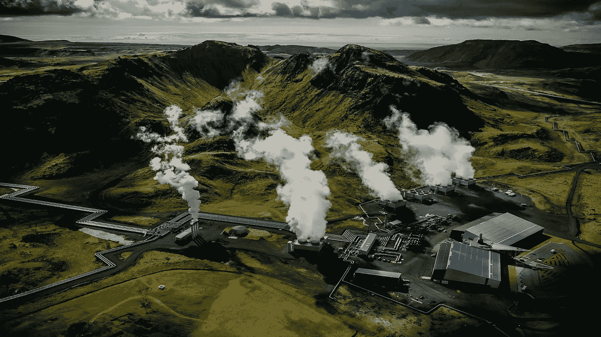
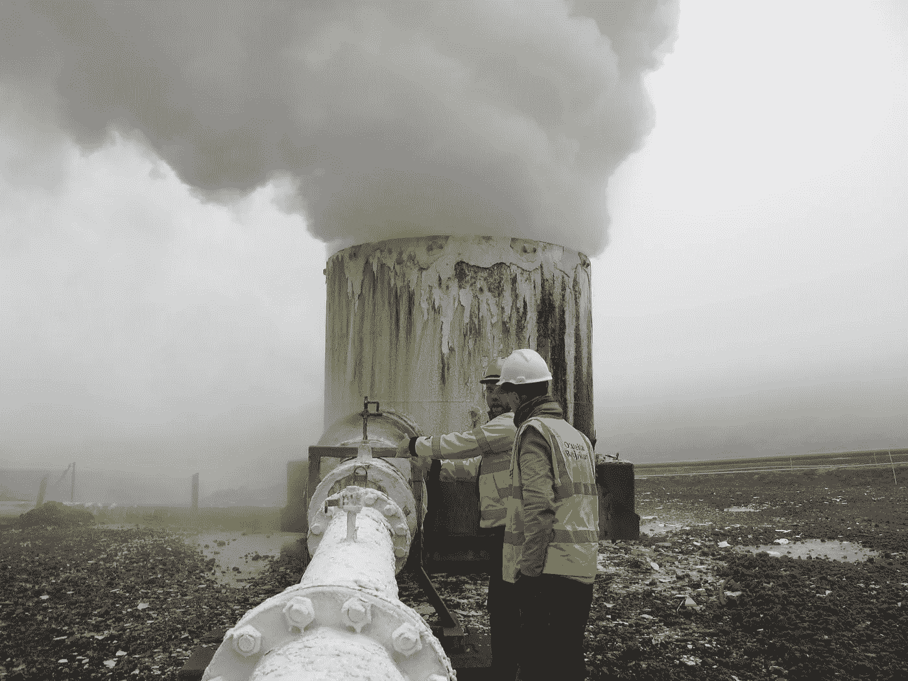

# 将二氧化碳转化为岩石的技术

> 原文：<https://medium.datadriveninvestor.com/the-technology-that-turns-co2-into-rock-8ee34d4aad3b?source=collection_archive---------2----------------------->

冰岛可能发现了第一种真正安全的碳捕获和储存方法。目前，既定的碳捕获技术是从大气中提取二氧化碳(CO2)，将其冷凝，并将其泵入地下腔室。这是石油和天然气行业青睐的技术，因为他们可以吸干石油或天然气储层，将二氧化碳泵回，并声称他们正在为气候变化尽自己的一份力量。这种方法的问题(除了虚伪之外)是二氧化碳可能会泄漏出来——只要一次地震，二氧化碳就会渗漏到地表，进入大气。就像核废料一样，它不能解决问题，只是把责任推给后代。

这是冰岛的替代方案:二氧化碳与富含矿物质的岩石发生反应，变成固体。在上面概述的主流碳捕获和存储方案中，这一地质过程需要超过 100，000 年(在此期间，不稳定的二氧化碳很可能已经泄漏出去)。但是冰岛的研究人员已经开发出一种方法，将二氧化碳溶解在水中，然后注入岛上富含矿物质的玄武岩中。在这里，它在不到 10 万年的时间里就变成了白色的固体方解石晶体——事实上，只需要两年。

这不仅仅是理论或基于实验室的研究。自 2014 年以来，它一直在雷克雅未克附近的 Hellisheidi 地热发电厂的一部分 CarbFix 以工业规模发生。废弃的二氧化碳从发电厂的蒸汽中被捕获，溶解在大量的水中，然后注入 400 米到 800 米深的玄武岩中。那里的玄武岩(含钙、镁和铁的重量百分比高达 25%)看起来就像一个黑色的海绵，充满了气孔，二氧化碳沉积在其中，并在短短数百天内形成方解石(或矿化碳)，而不是几十万年。

The Hellisheiði Geothermal Power Plant, site of the CarbFix project. Photo: [Sigrg](https://commons.wikimedia.org/w/index.php?title=User:Sigrg&action=edit&redlink=1).

最初研究小组成员之一、南安普顿大学地球工程副教授 Juerg Matter 告诉我:“自 2016 年以来，[CarbFix]通过每年向玄武岩地下储存注入约 10，200 吨二氧化碳，将二氧化碳储存和矿化提升至工业规模”。

大气中、动植物中、你我体内的所有碳都来源于岩石，最终又会变成岩石:这就是所谓的“碳循环”。冰岛大学地球科学研究所 2014 年在《科学》发表的一篇论文解释说:“自工业革命开始以来，人类通过开采和燃烧化石燃料加速了这一循环，导致大气二氧化碳(CO2)浓度上升，这是全球变暖的主要原因。缓解高度全球变暖的一个选择是捕获二氧化碳，并将其安全地储存在地下岩石中数千年或更长时间。通过加速这些岩石中碳酸盐矿物的形成，有可能重新平衡全球碳循环，提供长期的碳储存解决方案。”

University of Iceland’s Institute of Earth Sciences. Extracting CO2 from geothermal steam. Photo: Sigurður Reynir Gíslason.

冰岛非常幸运地拥有玄武岩——这个高度火山岛的 90%以上都是由玄武岩构成的。但玄武岩在世界其他地方也并不罕见:它是地球上最常见的岩石类型之一，覆盖了大约 10%的表面和大部分海底。T4 carb fix 的地质学家 Sandra Snaebjornsdottir 告诉 BBC :“只要有玄武岩和水，这个模型就能工作。从理论上讲，玄武岩的储存能力足以永久储存地球上所有化石燃料燃烧产生的大部分二氧化碳排放。

那么，为什么——鉴于世界上有丰富的玄武岩和世界末日般的大气二氧化碳问题 CarbFix 模式没有在其他地方发生呢？“好问题”，马特说。“CarbFix 模型是独一无二的，因为它在注入储油层的过程中将 CO2 溶解到水中(来自地热发电厂的废水)。这是一种理想的情况，因为水的供应不足，不可能在任何地方都将水和二氧化碳一起注入。”然而，“将纯二氧化碳注入深层玄武岩地层而不同时注入水是可能的”，Matter 说。华盛顿州哥伦比亚河玄武岩二氧化碳注入试验项目的初步结果已经完成。

马特告诉我，主流碳储存在地下储库中占主导地位的另一个原因是，“石油和天然气行业正在主导这一领域”。“他们没有玄武岩等‘非常规’储层的知识和专业技能。”

由雷克雅未克能源公司(Reykjavik Energy)联合运营的 CarbFix 公司[在其网站](https://www.or.is/english/carbfix-project/about-carbfix-0)上解释说，“通过从各种来源捕获二氧化碳，并将其注入合适的深层岩层，释放的碳会返回到提取碳的地方……这项技术可能有助于缓解气候变化，因为在精心选择的具有巨大潜在储存能力的地质地点注入二氧化碳可能是一种持久和环保的储存解决方案。”泄漏风险为零。留给下一代去解决的问题？也是零。

当务之急必须是首先减少碳排放。但是，一种真正稳定的碳捕获方式无疑是对抗全球变暖的有益补充。

*我的第一本书，* [*净化空气:空气污染的开始和结束*](https://www.amazon.co.uk/dp/1472953312) *，由布卢姆斯伯里出版社出版，现在已经出来了。*