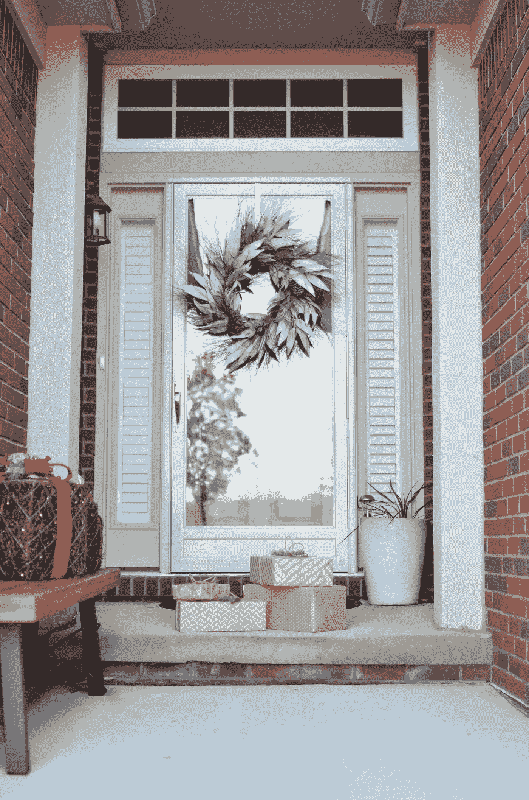
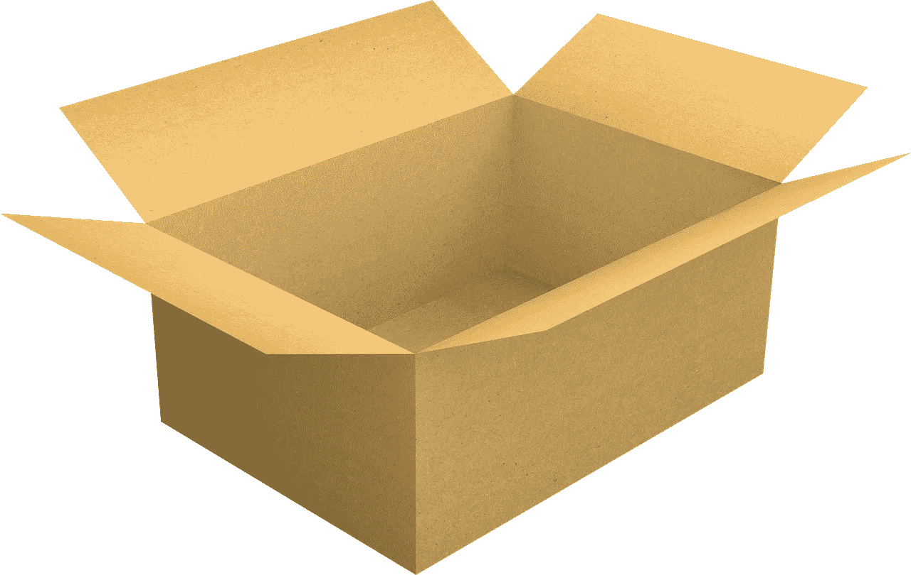
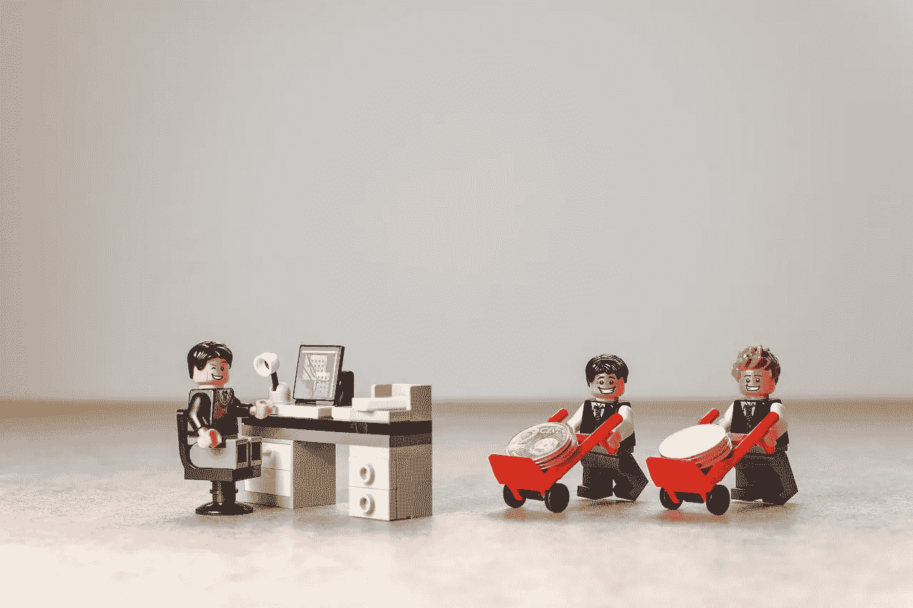
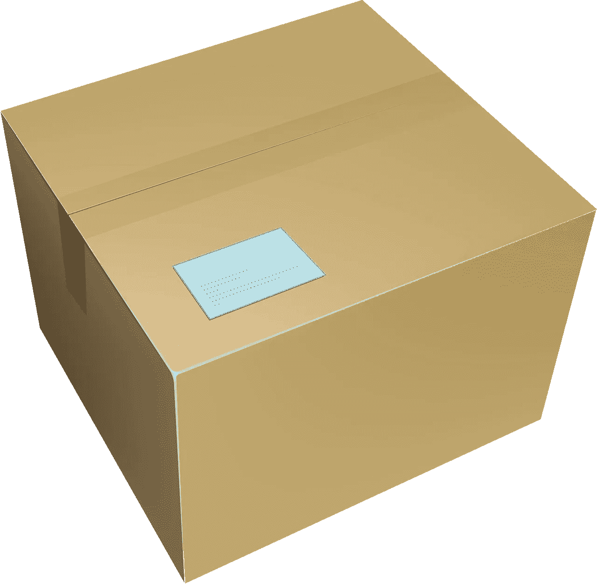

# 对 UPS 的威胁

> 原文：<https://medium.datadriveninvestor.com/the-threats-to-ups-a91c5a1b1f7c?source=collection_archive---------5----------------------->

对 UPS 的威胁很多，而且每天都在增加。因此，这些威胁可能会限制联合包裹服务公司作为一项卓越价值投资的日子。

目前，UPS 向投资者提供 2019 年 3 月 12 日应付的 96 季度股息。令人印象深刻的是，股息比 2018 年 12 月 5 日的 91 英镑增加了 5 英镑。因此，联合包裹支付了近 1 美元的季度股息。

此外，UPS 在 2019 年 2 月 27 日向投资者提供的股息收益率为 3.46%，年化支付为 3.84 美元，支付率为 53%。此外，UPS 正进入股息增长的第 9 个年头。

因此，UPS 是 2019 年 2 月 27 日报告的 110.86 美元股价中股息最好的股票之一。不幸的是，交割市场的变化可能会毁掉这些红利。

> [DDI 编辑推荐—基础股票交易全教程](http://go.datadriveninvestor.com/stocktrading1/matf)

# **这些威胁注定了 UPS 的命运吗？**

令人不安的是，对 UPS 的威胁数不胜数，而且还在增长。特别是，联合包裹服务公司(UPS)依赖于一个可能成长为其最大竞争对手的客户。

UPS 面临的一些最大威胁包括:

# **亚马逊(纳斯达克代码:AMZN)**

亚马逊试图通过向任何愿意创办快递公司的人提供高达 30 万美元的融资，来击败 UPS 的数百名竞争对手。据 Business Insider [报道](https://www.businessinsider.com/amazon-delivery-job-2018-6)，事实上，一个只有 10，000 美元的人可以申请亚马逊商品的第三方交付。

此外，亚马逊正在从戴姆勒(OTC: DAI) 购买 20，000 辆奔驰 Sprinter 面包车，用于第三方交付网络。除了货车，第三方送货服务还可以获得亚马逊品牌的制服、燃料计划和低成本车辆保险。

亚马逊甚至购买了电动汽车公司 Rivian*Car 和 Driver*T14 的 7 亿美元股份。亚马逊对 Rivian 感兴趣，因为它正在开发一款续航里程为 400 英里的电动皮卡。

为了解释，亚马逊可以将 Rivian 的皮卡底盘用于电动送货车。从逻辑上讲，亚马逊可以通过向其送货合作伙伴提供品牌电动货车来降低燃料成本。

因此，亚马逊试图创造数百个 UPS 的竞争对手，就像联邦快递(纽约证券交易所:FDX) 一样。

# **劳工骚乱**

特别是，那些递送合作伙伴可能会降低 UPS 的劳动力成本，因为他们可能不会使用工会劳动力。同时，UPS 是一家卡车司机商店。

在这种情况下，UPS 可能会发现自己处于亚马逊和工会之间恶性的破坏性战争中。例如，很容易想象绝望的卡车司机砸毁亚马逊品牌的车辆，殴打穿着亚马逊制服的工人。

从历史上看，卡车司机对他们视为威胁其家庭生计的公司或工人以暴力回应。

政治将使亚马逊/卡车司机的冲突复杂化。例如，一位依赖工会选票的民主党总统可能会站在卡车司机一边。与此同时，特朗普这样的反工会共和党人可能会站在公司一边。

最后，工会可能会加强对 UPS 等公司的控制，并为保持这种控制而更加努力。解释一下，UPS 是剩下的为数不多的强大工会商店之一。因此，我无法想象卡车司机不经过血战就放弃它。

# **Instacart、Kroger 和 Ocado**

CNN 财经[称，食品杂货递送服务 Instacart 价值 80 亿美元。此外，Instacart 正在计划 2019 年的首次公开募股(IPO)。](https://www.cnn.com/2019/01/24/tech/instacart-fresh-money/index.html)

事实上，Instacart 现在声称为 4000 个州的 15000 家商店提供服务。因此，Instacart 现在经营着一个可与 UPS 竞争的递送网络。因此，Instacart 可以轻松递送包裹，与 UPS 展开直接竞争。

特别是，卡车运输公司可以将商品运送到机器人履行中心。一旦到达履行中心，Instacart 就可以挑选包裹并交付给消费者。

值得注意的是，Instacart 的合作伙伴**克罗格(NYSE: KR)** 美国最大的独立杂货商，正在建造机器人履行中心，为坦帕[和俄亥俄州](https://www.cnn.com/2019/01/24/tech/instacart-fresh-money/index.html)[的送货司机提供服务。此外，克罗格正在与英国的 Ocado 集团有限公司(伦敦证券交易所:OCDO) 合作开发先进的机器人包裹分拣设施。事实上，克罗格拥有 Ocado 6%的股份，Ocado 声称在英国运营着世界上最先进的机器人履行中心。](https://marketmadhouse.com/kroger-kr-and-ocado-plan-robotic-warehouse-in-ohio/)

因此，Kroger、Instacart 和 [Ocado](https://marketmadhouse.com/is-ocado-the-future-of-groceries-and-does-it-make-money/) 可以立即部署快速包裹递送服务，与 UPS 竞争。由于这项服务可能在一夜之间推出，UPS 可能很难应对它的到来。

# **GrubHub、Deliv、DoorDash 和 Postmates 等送餐应用**

为了解释这一点，送餐应用迅速建立了庞大的司机网络。此外，这些司机有大量的交货知识。

例如，公开交易的外卖应用程序 **GrubHub(纽约证券交易所代码:GRUB)** [声称](https://marketmadhouse.com/what-is-the-value-of-grubhub-grub/)可以向 1640 万活跃客户提供来自 95000 家餐馆的食物。此外，GrubHub 声称在 1700 个美国城市开展业务。

[GrubHub](https://marketmadhouse.com/is-grubhub-a-threat-to-kroger-kr/) 没有赚钱，但其收入在 2018 年第三季度增长了 51.63%。有趣的是，GrubHub 报告 2018 年第三季度的毛利率为 51.63%，毛利为 1.3571 亿美元，收入为 2.4723 亿美元。

因此，如果 GrubHub 愿意的话，它拥有与 UPS 竞争的资源。UPS 管理层需要担心的也不仅仅是 GrubHub。

例如，TechCrunch [声称，DoorDash 据称价值 60 亿美元，能够从投资者那里借款 5 亿美元。与此同时，Postmates 已经私下申请了首次公开募股(IPO)。](https://techcrunch.com/2019/02/15/peloton-peddles-toward-an-ipo-self-driving-is-big-business-and-saass-new-highs/)

# **送餐应用如何威胁 UPS**

此外，GrubHub 和 DoorDash 等应用程序正在收集大量的客户和交付数据。这些数据显然可以用来建立与 UPS 直接竞争的递送网络。

GrubHub 或 DoorDash 可以利用这些数据创建一个包裹递送服务，与 UPS 直接竞争。例如，GrubHub 或 DoorDash 司机可以在沃尔玛商店或 Kroger/Ocado 履行中心接订单，并将其交给客户。

重要的是，GrubHub 和 DoorDash 的劳动力成本可能更低，因为他们的司机不是工会成员。另外，GrubHub 和 DoorDash 没有购买、保险和维护车辆的费用。相反，像优步这样的应用将这些费用转嫁给司机。

# **亚马逊餐厅**

在这种情况下，UPS 最大的噩梦是亚马逊通过亚马逊餐厅或与 GrubHub、DoorDash、Postmates 或 Instacart 合作提供包裹递送。例如，[亚马逊餐馆](https://www.amazon.com/restaurants/landing?sourceUrl=/restaurants&ref_=amzrst_ob_z)司机可以从 Amazon Go 上接亚马逊订单；或者全食，然后把它们带给顾客。

对 UPS 的一个主要威胁是亚马逊将品牌司机计划扩展到亚马逊餐馆司机。例如，亚马逊可以为其最好的餐馆司机提供一辆货车，用来运送其他货物。

因此，亚马逊可以使用亚马逊餐厅来收集数据，用于其送货计划的扩展。特别是，亚马逊可以识别哪些社区和人群对送货最开放。此外，亚马逊可以使用亚马逊餐厅的数据来确定最佳司机并雇用他们。

# **完全开放的交割市场**

因此，UPS 正在从一个它有公开的主要私人竞争对手的环境中走出来；联邦快递，一个完全开放的递送市场。

这个完全开放的快递市场是 UPS 的最大威胁，因为任何拥有智能手机和货车的人现在都是潜在的竞争对手。只有时间才能证明 UPS 能否在技术创造的新的完全开放的递送市场中生存下来。