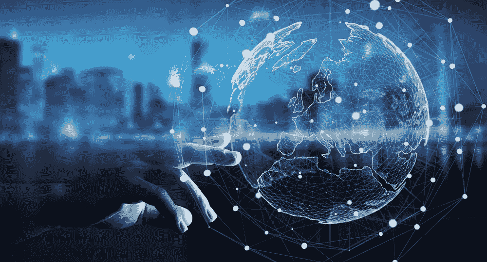

# 区块链的三个时代

> 原文：<https://medium.datadriveninvestor.com/the-three-eras-of-the-blockchain-dc32c16cf15f?source=collection_archive---------14----------------------->

像所有新技术一样，区块链也正在经历一系列快速变化，因此有必要将创新中的巨大突破划分为不同的时代，以获得全面的背景。

美国学者梅勒妮·斯旺(Melanie Swan)在她的著作《区块链:新经济蓝图和指南》(block chain:New Economic blue print and Guideline)中，以这个视角划分了区块链技术应用对各个领域的影响。区块链的过去和未来发展分为三个时代:区块链 1.0(可编程货币)、区块链 2.0(可编程金融)和区块链 3.0(可编程社会)。区块链 1.0 时代主要是数字货币时代，以加密货币为代表。它构建了一个分散的系统来进行数字交易，并实现了各种附加服务，如快速交易和跨境交易。其主要代表是比特币。区块链 2.0 时代是关于智能合约的使用。它的应用不仅用于数字货币，还扩展到整个金融领域。

除了加密货币，资产和合同现在也可以数字化和分散化，以便在金融市场中使用。从更广的角度来看，区块链 3.0 是区块链技术的全面应用。在这个时代，全球资源，而不仅仅是属于金融市场的资产，将被分散化。其主要领域包括:民主、医疗、公证、公益、版权、网络安全、租车、学历认证等。目前，区块链技术正处于第二个时代，同时稳步迈向 3.0 时代。有学者预测，到 2019 年将完全进入区块链 3.0 时代。

目前，由于处于过渡阶段，它已经从最初的数字货币应用扩展到更广泛的金融领域，并逐渐扩展到上述其他领域。区块链以其去中心化、无信任、可追溯、集体维护、安全性、无形修改、开放性和匿名性等独特优势，逐渐被应用到社会经济生活的各个领域。这些优势将有助于解决各行业的难点和痛点。

最终它将节省中介的成本，建立信任关系，便于跟踪，确保信息的完整性和透明度，并保护隐私。

关注我们，了解更多信息:

*   [推特](https://twitter.com/Miusu_Official)
*   [电报](https://t.me/joinchat/JJacXwp39N4p08zGqvGBag)
*   [脸书](https://www.facebook.com/pg/Miusu-1912689845693589/posts/)
*   [Reddit](https://www.reddit.com/user/Miusu)