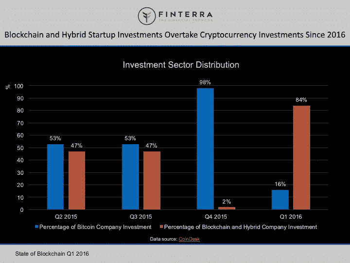

# 区块链将带来革命的三大商业领域

> 原文：<https://medium.datadriveninvestor.com/the-three-major-areas-of-business-that-blockchain-will-revolutionize-ee7185a08649?source=collection_archive---------6----------------------->

随着越来越多的人熟悉区块链，他们开始了解到这项技术本身并不像以前认为的那样不稳定。你可能已经读过很多关于区块链是一个分散的、数字化的账本，交易被公开地按时间顺序记录。不可否认，这项技术可以激发商业领域的重大变革。大多数人想知道为什么它对商业的未来如此重要。该技术中使用的加密和编码最大限度地提高了透明度、效率和安全性。

这些特点导致不同行业的公司重新评估他们的方法。随着技术的发展，拒绝适应的企业将会遭受损失并落后。区块链技术已经可以在以下业务领域带来革命性的变化:

**会计**

会计之所以是人们关注的领域之一，是因为区块链技术可以提供一个更加透明和持久的框架来跟踪和计量资产。区块链不仅将改变信息存储、访问和解释的方式，还将影响审计和网络安全。检查哪些资产是可用的，它们的价值是什么，以及它们如何影响现金流，这将是毫不费力的。

区块链将在一个可互操作的系统上保存记录，这也可以使审计人员更安全、更容易地访问记录，并确保一切都符合规定。这种透明度对客户和供应商都有好处。企业将只需要维护一个联合登记簿，而不是多个单独的记录。因此，除了消除错误和保护数据免受破坏，该过程还会留下可追踪的审计线索。

“区块链的透明性为批准的用户提供了所有交易的可见性，这可能会减少审计人员对交易进行采样和验证的工作。"

肯·泰西亚克，[会计杂志](http://www.journalofaccountancy.com/news/2017/nov/blockchain-opportunity-for-accountants-201717900.html)

**营销**

说到广告，区块链确实可以改变在线广告的获取、分发、衡量和估值方式。大多数人对在线广告的一个问题是，几乎不可能判断统计数据是否可靠。很难区分真正的客户和被分销商用来获取更高费率的机器人。现在，有了区块链，公司可以确定查看他们广告的人是否是他们的观众，这将帮助他们每年节省数百万的广告支出。

区块链还可以帮助公司瞄准他们的受众，因为广告商现在可以一次性获得客户愿意分享的所有信息，而不是从几个不同的来源获得信息。区块链系统允许客户看到每件产品在供应链中的移动，以便他们可以检查产品来自哪里，谁在管理它，它是否是真实的，等等。这意味着，除了创造信任，区块链还建立了品牌。

**人力资源**

区块链有能力重塑像工资单、招聘、能力管理和学习这样的人力资源流程。招聘人员通常必须浏览简历，核实他们的资格、工作经验和证书。由于区块链不可编辑，用户只能添加信息。它降低了凭证被伪造或更改的可能性。

区块链还可以影响工资单，特别是涉及银行和第三方的不同规则集的全球工资单。区块链技术可以轻松管理后端工作，以简化流程和标准化支付。人力资源部门通常会成为黑客的目标，因为他们要处理人事和财务数据。区块链使用共识来建立事实，有助于消除欺诈活动。

**下一步是什么？**

区块链有可能像 20 世纪 90 年代初的互联网一样具有革命性。区块链技术有潜力改变一切，因为它的实际应用是无限的。

来源:【https://www.entrepreneur.com/article/309164】