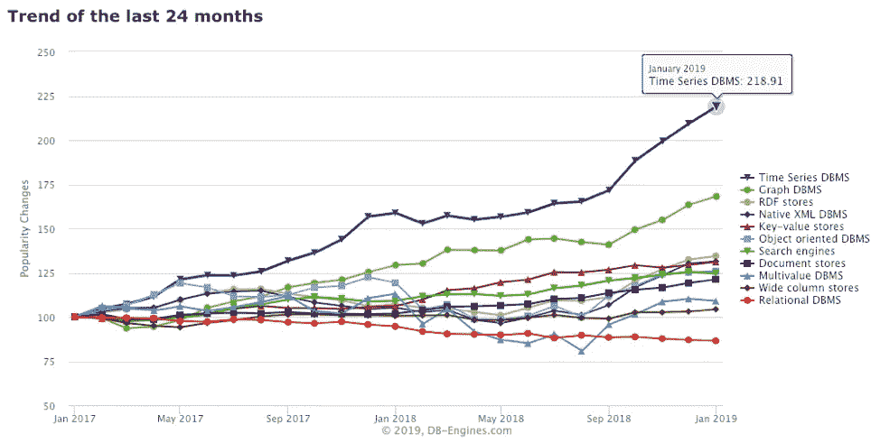

# 新型数据库的时代已经到来

> 原文：<https://medium.datadriveninvestor.com/the-time-has-come-for-a-new-type-of-database-47cf8df1667a?source=collection_archive---------7----------------------->

*探索时序数据库的出现*

长期以来，数据库一直是数据管理的中流砥柱，在过去的十年中，它取得了许多进步，将数据库技术推向了激动人心的新领域。优化的解决方案现在利用各种硬件平台以不同的方式存储和分析数据，内存数据库和图形数据库最近大受欢迎。然而，没有一个数据库像时序数据库一样有如此大的发展势头。据 DB-Engines.com 称，在过去的两年中，时间序列数据库的受欢迎程度已经超过了 [218%](https://db-engines.com/en/ranking_categories) 。

Source: [https://db-engines.com/en/ranking_categories](https://db-engines.com/en/ranking_categories)

**什么是时序数据？**

将时间序列数据识别为在一段时间内收集的带有时间戳的数据点序列，将其作为新写入而非更新发送到数据库，其时间戳构成数据集主轴。虽然这些数据集由特定实例的快照组成，但时序数据的主要关注点是系统如何随时间变化。在一个账户的基本财务记录中可以找到时间序列数据的清晰图像。每个单独的数据点是给定时间的账户余额的快照，在收集时提供账户的交易历史。

什么是时间序列数据库？

时间序列数据库(TSDB)就是一个为处理时间序列数据而优化的数据库。TSDBs 是柱状结构，由数据时间戳索引，内部数据点由带有时间戳的键/值对组成。这允许在特定时间收集的多个指标存储在单个数据库条目中。

虽然时间序列数据可以存储在关系数据库和 NoSQL 数据库中，但这两种数据库在规模和可用性方面都明显不足。关系数据库尤其面临着通过纵向扩展来处理大量数据的挑战，因为在保持一致性(ACID 属性)的同时进行纵向扩展会导致可用性[受损](https://en.wikipedia.org/wiki/CAP_theorem)。例如，Twitter 的 2.7 亿用户每天产生大约 100 GB 的数据，而现代自动驾驶汽车在同一时间跨度内产生大约 30 TB 的时序数据。对于任何关系数据库的可用性来说，通过扩展来满足这种需求都是不可行的。

另一方面，TSDBs 是高度可伸缩的，因为它们不保证一致性(ACID 属性)。它们可以弹性地纵向扩展，内置管理大量数据的功能。在收集时间序列数据时，通常的做法是只保留一个设定窗口的高精度数据，具体取决于应用。TSDBs 支持简单的下采样和数据聚合，因此窗口之外的历史数据可以简化为长期趋势数据。

Source: [https://innovation-destination.com/2018/02/16/7-factors-critical-success-self-driving-cars/](https://innovation-destination.com/2018/02/16/7-factors-critical-success-self-driving-cars/)

尽管 NoSQL 数据库很容易扩展，但与专门构建的 TSDBs 相比，它们对于时间序列数据的可用性就相形见绌了。TSDBs 包含许多用于处理和分析时序数据的内置通用函数和功能，例如用于实时分析的连续查询。在 NoSQL 数据库中获得相同的功能需要在开发、测试和维护方面进行大量投资，即使 NoSQL 数据库被定制为处理时间序列数据功能，TSDB 仍然胜出。TSDBs 的专门功能允许显著提高数据输入的写吞吐量，并加快覆盖大时间范围的查询的查询时间。

那么，为什么 TSDBs 在过去两年里人气飙升呢？

时间和背景。时间序列数据在我们周围无处不在，等待着驱动业务决策。金融交易算法不断寻求根据市场条件的变化做出决策。DevOps 环境关注系统或应用程序行为的变化。运输和物流团队不断寻求如何优化他们的供应链。所有这些时间序列数据都很容易获得，市场也开始注意到这一点。

Source: [https://www.flexwareinnovation.com/10-principles-of-the-internet-of-things-iot/](https://www.flexwareinnovation.com/10-principles-of-the-internet-of-things-iot/)

也许 TSDB 最重要的动力来源是物联网和互联设备的兴起。自动驾驶汽车不断跟踪周围环境的变化，智能家居传感器记录家中温度的变化或入侵者的存在等指标，制造机器遥测技术利用数据流在故障发生前预测机器故障。随着每个传感器和设备反馈时间序列数据，对可应用的优化数据库的需求也成比例增长。TSDB 使不同行业的企业能够充分利用丰富的时间序列数据来推动业务成功。

**谁在利用这一势头？**

从一开始，开源技术就是时间序列数据库的核心。知名人士如 [OpenTSDB](http://opentsdb.net/) 、 [Graphite](https://graphiteapp.org/) 和 [RRDtool](https://oss.oetiker.ch/rrdtool/) 开发了一些第一批可用的解决方案，而其他主要的开源玩家已经出现，包括 [InfluxData](https://www.influxdata.com/) 、 [Prometheus](https://prometheus.io/) 和 [Druid](http://druid.io/) 。开源技术没有前期成本，但通常需要额外的人员成本来实现、维护和定制该技术。因此，TSBDs 对于拥有成熟的 IT 部门的企业来说可能很有吸引力，这些 IT 部门拥有可用于解决方案的资源。对于没有可用员工或人才的公司，许多提供商提供基于开源框架的付费解决方案([时标](https://www.timescale.com/)、 [RiakTS](http://basho.com/products/riak-ts/) 、 [Kdb+](https://kx.com/why-kx/) 和 [Canary](https://www.canarylabs.com/en/) )，让更小的组织有机会获得 TSDB 的好处。此外，包括 [AWS](https://aws.amazon.com/timestream/) 和 [Azure](https://azure.microsoft.com/en-us/services/time-series-insights/) 在内的许多云提供商提供付费 TSDB 解决方案，这对于已经投资公共云基础设施的公司来说可能很有吸引力。

随着时间序列数据量的持续增长，TSDB 将进一步成为企业数据管理堆栈中的重要部分。虽然 TSDBs 永远不会取代关系数据库或 NoSQL 数据库的一般功能，但它们将提供跟上不断增长的数据环境所需的功能。

想知道如何开始使用你的时间序列数据吗？Trace3 [*数据智能*](https://trace3.com/data-intelligence/) *团队在此讨论解决方案，帮助您开始更高效地使用数据。*