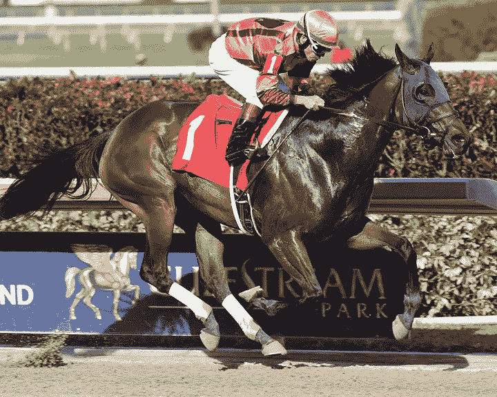
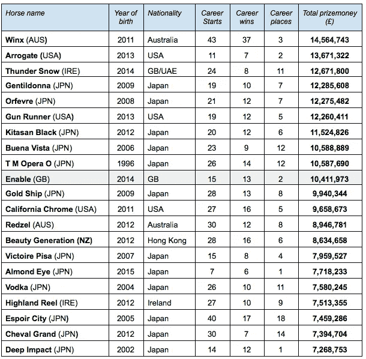
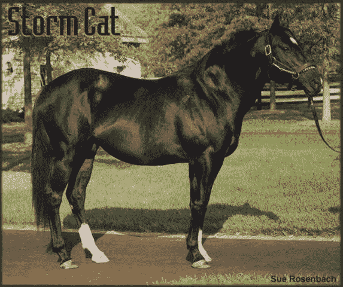
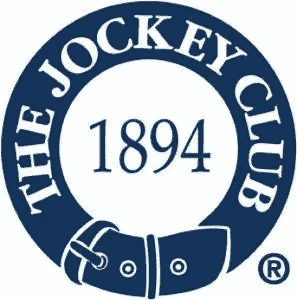

# 赛马的符号化，真的有意义吗？

> 原文：<https://medium.datadriveninvestor.com/the-tokenization-of-racehorses-does-it-really-make-sense-9fa65bff721f?source=collection_archive---------13----------------------->

*“Fusaichi Pegasus” the most expensive horse ever. It was paid US$ 64 million in 2000*

马术是一项昂贵的职业。但对于所有参与者来说，这也是一个非常好的行业，比如所有者、训练者、骑师/骑手、育种者和各种体育联合会。

成功的赛马不仅在奖金中赚了很多钱——一只澳大利亚纯种马*温克斯*是有史以来最高的赢家，在 43 场比赛中赚了超过 1450 万美元——而且它们在退休后甚至是更大的赚钱机器。

Highest All time earners

这匹名为*风暴猫*的公马每年平均要支付 50 万美元的配种费*以覆盖 120 匹母马。这是一个天文数字，仅交配一项每年就要花费 6000 万美元。*

但是，如果说风暴猫是公马中的“罗纳尔多”，那么数万美元的配种费对于优秀且相当成功的纯种马来说是相当正常的。

难怪出售这些高价值资产之一的价格会达到数千万美元。 *Fusaichi Pegasus* 在 2000 年创下 6400 万美元的纪录，而由迪拜埃米尔拥有的 *Shareef Dancer* 仍然是有史以来第二昂贵的赛马，1983 年的售价为 4000 万美元。

 [## 5 行业转型区块链应用|数据驱动投资者

### 除非你一直生活在岩石下，否则我相信你现在已经听说过区块链了。而区块链…

www.datadriveninvestor.com](https://www.datadriveninvestor.com/2019/02/13/5-real-world-blockchain-applications/) 

这就是为什么赛马的部分所有权甚至在其他类型的资产，如房地产、飞机等变得如此之前就已经很普遍了。所谓的*种马辛迪加协议*通常在几十个主人之间签订，以分享繁殖的利润(种马费)、成本和费用、出售马匹的任何收益，并经常授予一匹或多匹马与主人选择的母马自由交配的权利。专业公司销售赛马的部分所有权计划已经有一段时间了(在(iii)部分所有权下有更多关于这个主题的内容)。

# 赛马标记化的案例

将赛马标记化的想法是由 Wave Financial 的本杰明·蔡(Benjamin Tsai)在一次采访中首次提出的。据我所知，至少到目前为止，这个想法还没有真正的结果。尽管这听起来有些奢侈，但大型农场主、饲养者和赛马所有者仍然有很好的理由去思考[关于他们珍贵资产的象征化](https://medium.com/@andreabianconi/why-tokenization-is-still-a-chimera-724df1b94165)。让我们试着看看如何做到这一点，以及这会带来哪些好处:

**(一)令牌标准**:这取决于被令牌化的内容。基本上有两种选择:

a)将马本身标记为独特的资产，并使用不可替换的标记格式。这里最简单的解决方案是基于[以太坊的](https://blocksdecoded.com/what-are-ethereum-erc-token-standards/) ERC-721 或 ERC-1155 标准。

b)是将特殊目的公司的股份令牌化(在美国通常使用有限责任公司)，在这种情况下，ERC-20、ERC-223 或 ERC-777 标准都可以。

**(二)所有权**:作为背景资料，法律一般不规定所有权出售和转让有效性的具体强制性形式。只有当你想让你的马参加比赛和体育赛事时，你才需要在一个主要的赛马协会/联合会(例如[费](https://inside.fei.org/fei/your-role/veterinarians/passports)、[赛马会](http://www.jockeyclub.com/)、[、](https://www.aqha.com/)、[乌什贾](https://www.ushja.org/)和 [USDF](http://www.ww.usdf.org/) )注册，并为你的马获得一种护照。

联盟负责维护其注册中心内的所有权链。因此，只有当您希望注册联盟并更新所有权记录时，才需要书面形式。因此，这给了我们使用代币作为合法有效的工具来转让马的所有权的自由。对联盟的所有权标题链的更新可以由新所有者在稍后阶段完成。

在上述(i)(a)的情况下，所有者可以数字化所有权、购买协议和其他记录，例如微芯片植入或未来马的生物特征数据，并将所有这些作为“数字护照”打包在以太坊公共区块链的 ERC-721 令牌中。即使联盟继续运行他们的纸质注册，并且最终在出售动物后必须更新联盟的记录，买方仍然具有马的时间戳证明的干净所有权以及所有附加的文件和动物的电子格式的护照的优势。众所周知，事情往往会出错。联邦的记录也可能丢失或被意外删除等等。如果一个人拥有一个拥有数十匹价值数百万的纯种马的马厩/农场，那么拥有你珍贵资产的“一个不可改变的数字化备份副本”可能是明智的。

**(iii)部分所有权**:虽然像[myracemarse](https://myracehorse.com/)或 [team valor](http://teamvalor.com/gettingstarted.asp) 这样的公司正试图将历史悠久的马部分所有权概念带入数字时代，但毫无疑问，向前迈出一步——通过将拥有资产的 SPV 的股份或实际上动物本身(如上文(i) (a)和(b)中所述)标记化——将为他们的商业模式增加更多透明度、流动性和更多机会，以灵活的方式定制合同关系，这要归功于智能合同嵌入的可编程性。

**(iv)利润分享权**:代币是代表马的各种经济权利的非常有效的方式，这些权利可以顺利地从卖方转移到买方或辛迪加协议、合资企业或公开市场中的其他合作伙伴。可以打包到数字令牌中的经济权利可以很多，并且在不同方之间:

*   交配权。
*   奖金、配种费、出售动物所得、赞助和代言的利润分享权。
*   饲养者可以向某些珍贵的小马驹出售象征性期权，从而对冲小马驹无法成为未来冠军的风险，同时增加其现金流。
*   拥有数十匹竞争赛马的马厩/农场主/所有者可以出售期权，以分享奖金或配种费。这可能会极大地提高非流动性资产的流动性。当这种权利以数字代币的形式存在时，这种新的资产类别的市场也很容易发展起来。
*   此外，马匹拍卖也不会逃脱数字化。如果马匹也被打包成数字代币格式，拍卖可以更容易和更快地扩大规模，这将为该行业带来流动性。
*   显然，交易上述所有权利的数字市场也可能在未来发展。

**(v)马匹代币的法律处理**:这取决于许多变量，例如代币附带的权利、代币如何销售以及在哪个司法管辖区销售。因此，在采取任何此类举措之前，最好先和律师谈一谈。然而，根据经验，出售代表简单所有权的代币与交换纸质合同或握手来出售马匹没有什么不同。相反，如果我们正在处理更复杂的利润分享结构——作为投资向公众推销——那么你可能必须遵守适用的证券法规。但即使在这种情况下，也有许多监管解决方案被设计成有利于小企业家进入金融市场，如欧盟的[增长招股说明书制度](https://medium.com/hackernoon/the-new-growth-prospectus-regime-a-potent-instrument-for-security-token-offerings-9acd9734602f)和美国的法规 A、D 和 CF。目前，美国、瑞士、列支敦士登和马耳他是发行代币的最佳选择。

# 结论

尽管这是一个利基市场，但将赛马所有权衍生出的经济权利象征化的提议肯定有一些优点。

Feel like dipping your toes into racehorse investing? Tokenization can make it a more accessible asset class for the public

改善此类权利的无摩擦流通和非流动性投资的流动性，可能有助于该行业扩大规模，并在公众中推广赛马投资。

## PS:如果你喜欢马，[这是一个鼓舞人心的故事](https://www.youtube.com/watch?time_continue=2&v=wNesX-N1K3c&feature=emb_logo)的链接，讲述了人类和这种奇妙动物之间的爱、友谊和真正的盲目信任。享受

*****************************************************************

如果你喜欢这篇文章，请在左下角“鼓掌”x 次，这样它会被更多的人分享。多谢

*****************************************************************

**法律免责声明**:本网站及其中包含的信息仅供一般指导，并不构成法律意见。因此，它不应被用来替代就具体问题与律师的磋商。本文中的所有信息均按“原样”提供，不保证完整性、准确性、及时性或任何形式的明示或暗示的担保。

**投资免责声明**:本网站及其中包含的信息无意成为与所提交材料相关的建议或信用分析的来源，本网站中包含的信息和/或文件不构成投资建议。

#区块链# bianconiandrea #赛马#令牌化#令牌

[www.bianconiandrea.com](http://www.bianconiandrea.com)—2019

*原载于 2019 年 11 月 20 日*[*【https://medium.com*](https://medium.com/@andreabianconi/the-tokenization-of-racehorses-does-it-really-make-sense-c3f2831b99f9)*。*