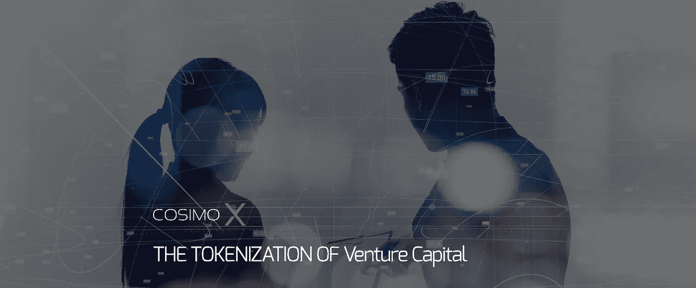
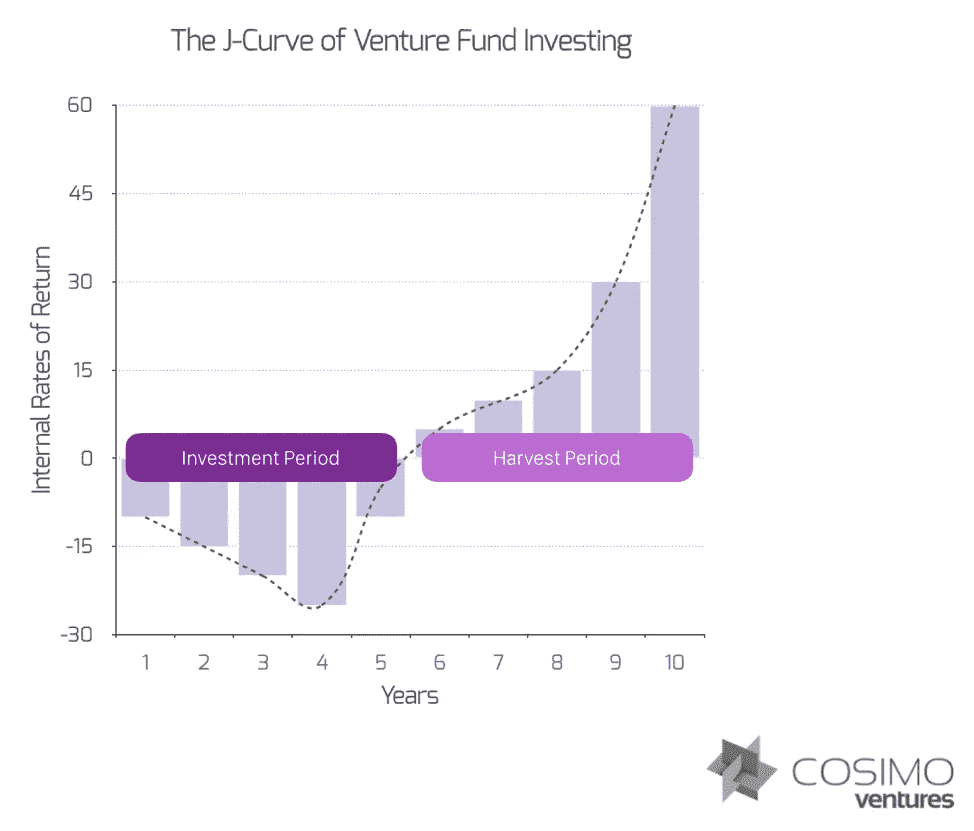
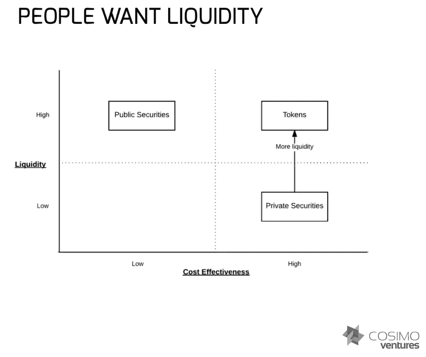
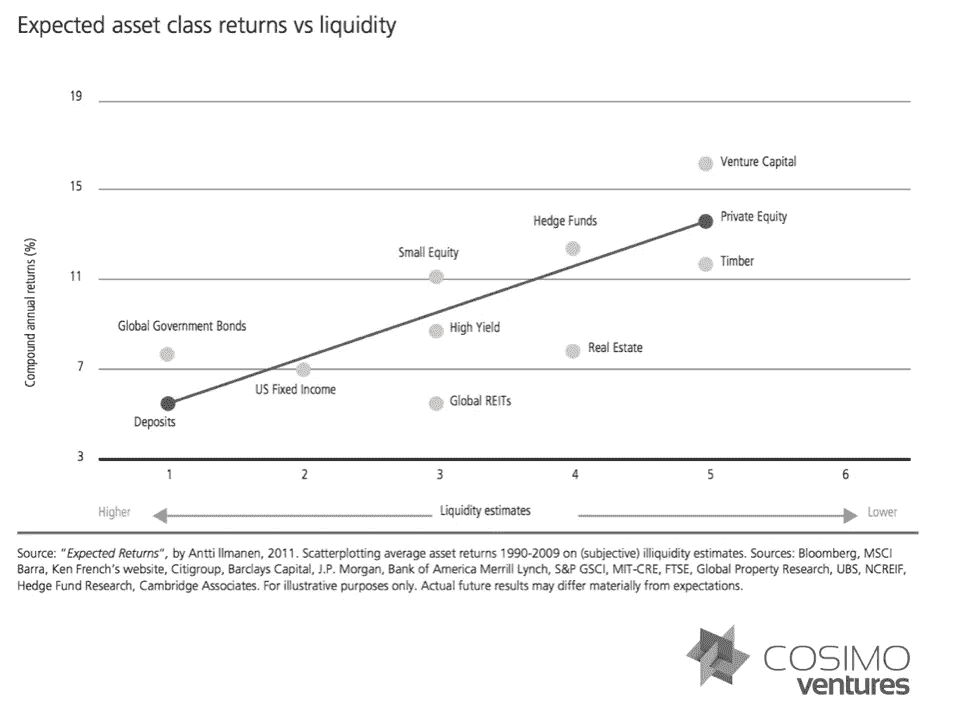

# 风险投资的符号化

> 原文：<https://medium.datadriveninvestor.com/the-tokenization-of-venture-capital-b240242663e4?source=collection_archive---------4----------------------->

与我们在互联网先驱职业生涯早期所看到的类似，区块链技术代表了对现有技术市场的彻底颠覆。我们相信，这种大规模的破坏无疑将为有远见的投资者创造巨大的财富创造机会。

正如我们所看到的，世界正在进入互联网的第四个阶段，像区块链这样的分散化技术正在创造和加速许多新的价值产生公司的增长。

随着早期区块链企业家涌入这个市场，对于有经验的投资者来说，这是一个绝佳的机会，可以帮助最有前途的科技初创企业转变为全球领导者。

当我和我的合作伙伴开始抓住这个机会并投资于这场颠覆时，我们问自己:

“为什么不用区块链来扰乱我们自己的工业？”

**传统风险投资基金是流动性最差的资产类别之一**

风险投资伙伴关系是一个 10 年的盲池…在这种长期关系中，投资者退出的能力有限，结果也不明朗。我们认为不一定是这样。

令牌化解决了投资者流动性不足的主要问题。

那么，风险基金呢？

区块链技术允许几乎任何非流动性资产在数字账本中被“令牌化”，然后变得具有流动性。它创造了一个更广阔的市场，改善了价格发现。

流动性有助于在更大的投资者群体中获得更广泛的采用。

*“LP 利益很可能被令牌化。声望很高的风险投资公司会抵制这种做法，但已经有一些新的风险投资公司在做表面文章。很快，再有几个就行了。然后再多几个。最终，流动性不足将成为融资中的竞争劣势，只有顶级公司才能证明这一点。”*

大卫·萨克斯，贝宝首席运营官，Yammer 创始人兼首席执行官，Zenefits 首席执行官

**投资者想要流动性**

我们都知道投资者想要流动性。

**投资者为流动性买单**

在其他条件相同的情况下，你给投资者的流动性越多，他们要求的回报就越低:

当想到区块链及其“象征化”一切的能力时，很难不对这个机会感到兴奋。随着数百万亿美元的私人资产可以被令牌化，未来十年通过令牌化释放的价值将达到数十万亿美元。

**在 COSIMO，我们寻求用区块链彻底改变流动性差的风险投资市场。**

为此，我们推出了 [COSIMO X](http://www.cosimox.com) :世界上第一个令牌化的常青基金。它是这样工作的:

**证券代币代表股份**

每一个代币都代表了一批经过严格审查的早期深度技术公司的经济利益，这些公司的总 NAV 由公认的独立第三方提供商进行验证，并每季度在我们的网站上发布。

**以有形的高增长潜力资产为后盾**

代币销售的净收入投资于投资组合公司，以发展和扩大其业务，实现数字安全产品、后续融资或财务独立。

**安全令牌是流动的和可交易的**

当代币的资产净值升值时，或等到基金收益实现后， [**COSIMO X**](http://www.cosimox.com) 在公开市场上以资产净值的倍数回购代币时，在我们指定的交易所与其他合格投资者交易代币。

SEC 批准的许可具有传统资产的特征和保护。

**投资方:**

将美元、欧元、瑞士法郎或 BTC 汇给我们，并以[**COSIMO X**](http://www.cosimox.com)**代币的形式获得基金的经济利益。代币购买可以私下进行或者通过我们的[网站](https://cosimox.com/)进行。**

**Securitize 将通过他们的在线平台，带您快速轻松地完成身份识别和鉴定过程(如果适用)。**

**在你被证券化批准成为合适的投资者后，你将被要求创建一个钱包，在里面你可以存放你的 **COSIMO X** 代币。**

****代币化经济学如何工作** **投资者购买代币****

*   **以对该基金的经济兴趣为后盾**
*   **基金的资产净值按季度确定(第三方审计)**
*   **“账面”代币价值来自未偿代币浮存的 NAV**

****动态令牌供应****

*   **一级市场——由基金新发行——收益归基金所有。**
*   **二级市场——从持有者手中购买——收益归持有者所有。**

****流动性****

****季度资产净值调整****

****常绿结构****

*   **代币持有者有优先销售权**
*   **超额需求是通过发行新债券来满足的，从而扩大了该基金的 AUM。**

****退出收益分配****

*   **50%的收益留在基金中用于再投资**
*   **50%进入象征性回购市场。**
*   **回购流动性保持为未结订单，直到完成。**
*   **回购代币被烧毁。**

****费用****

*   **附带权益是逐笔支付的**
*   **管理费按季度 NAV 支付**

****基金令牌化的好处** **增强流动性****

**投资者可以在特定的交易所以数字安全代币的形式交易他们在 T4 的经济利益。根据适用的锁定期，人们可以在任何时候以代币的市场价值买卖任何数量的代币。**

**基金本身也通过在投资组合公司退出时在公开市场上回购和随后收回代币来提供流动性。**

****优越的经济学****

****COSIMO X** 将通过在公开市场上以市场价购买代币，并永久收回这些代币，在逐笔交易的基础上分配其投资退出收益的 50%。**

**由于剩余 50%的收益被再投资到基金中，长期持有人受益于象征性供应的减少，这代表了更大的可投资资本池。**

****估值透明度****

**该基金每季度将接受第三方估值审计，并公布当前的综合投资组合估值。**

**与上市公司向其股东报告收益的方式类似，这一合计资产净值将公布在 [**COSIMO X** 网站](http://www.cosimox.com)上，以向其投资者表明其股票的潜在价值。**

*   **利用区块链和智能合同，销售等信息可以实时公开，消除了永无止境的一次性披露。随着越来越多的服务变得基于分布式分类账，报告将从静态披露演变为实时和基于网络的披露。**
*   **根据定义，在其他条件相同的情况下，越透明的公司估值越高。**
*   **此外，像零知识证明这样的技术将实现复杂的隐私功能，消除隐私区块链的主要驱动因素之一。**

****资金调用自由裁量权****

**与大多数传统结构的风险资本或私募股权基金不同， **COSIMO X** 允许你自行决定资本的配置。**

**没有资本催缴，也没有意外的承诺要求。所有代币都由投资者自行决定购买——无论这些代币是直接从基金购买还是在公开市场上购买。**

****更广泛的投资者基础****

**外国投资者最低 10，000 美元的初级代币购买额，加上该基金的常青性质，使投资者资本民主化。**

**这防止了基金被少数投资者控制，允许 COSIMO X 以一种永久的金融前景来配置资本，而不是培养短视的投资。**

****常青框架****

**COSIMO X T2 基金是常青树，这意味着它向新投资者的新资本和现有投资者的额外资本开放。**

**通过将主要代币的新发行限制在新的和令人兴奋的投资机会出现时，基金可以保护现有投资者的代币价值，并促进代币在更广泛的市场中升值。**

**现在是时候让风险投资者在如何构建自己的基金方面变得更聪明了。通过使用我们正在投资的技术来创建一个具有更高透明度、更高流动性和卓越经济性的基金，我们发现自己处于互联网第四阶段所能创造的最前沿。**

**【https://www.linkedin.com】最初发表于**。****