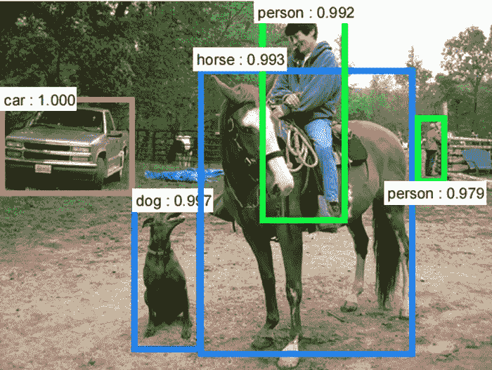
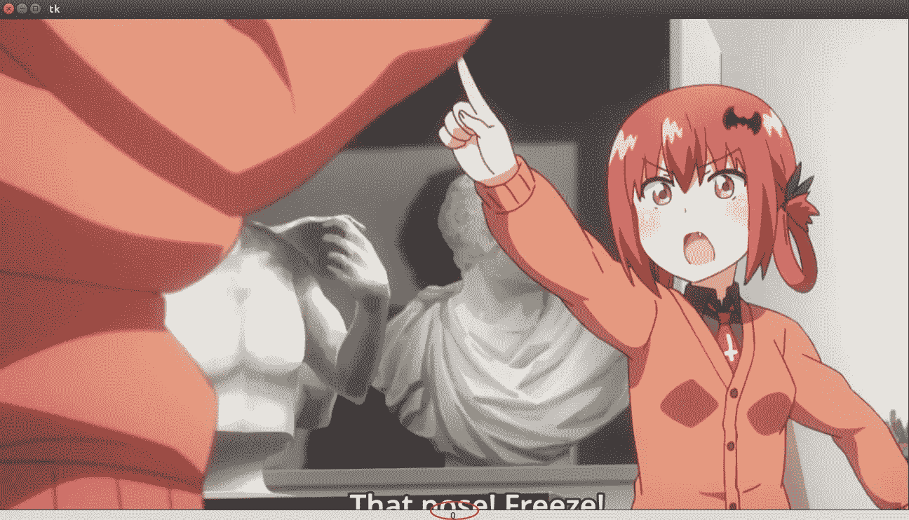
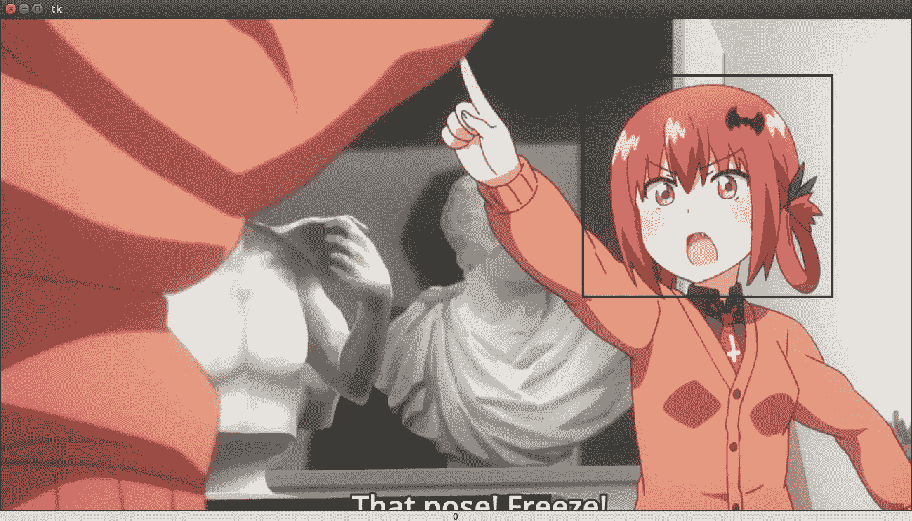
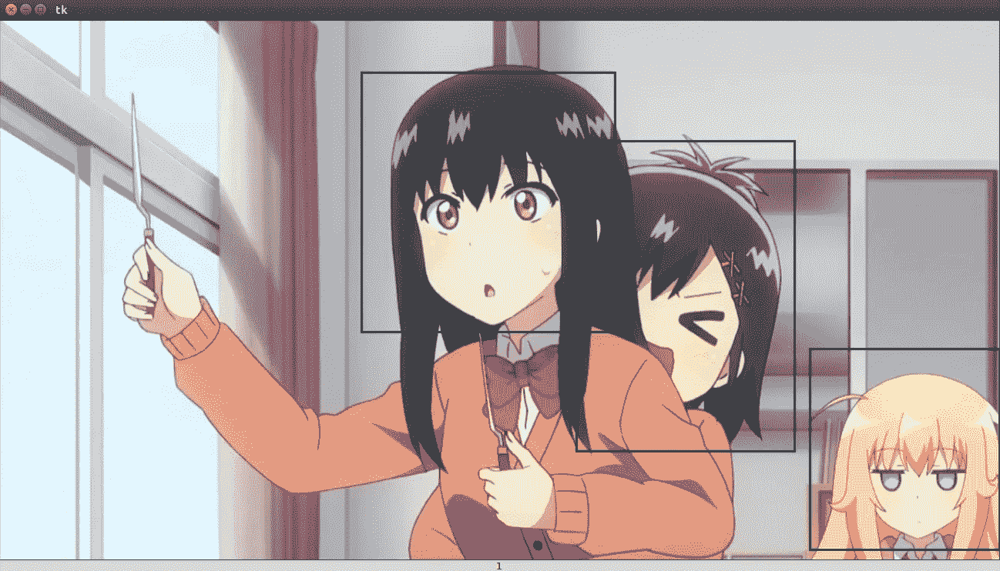
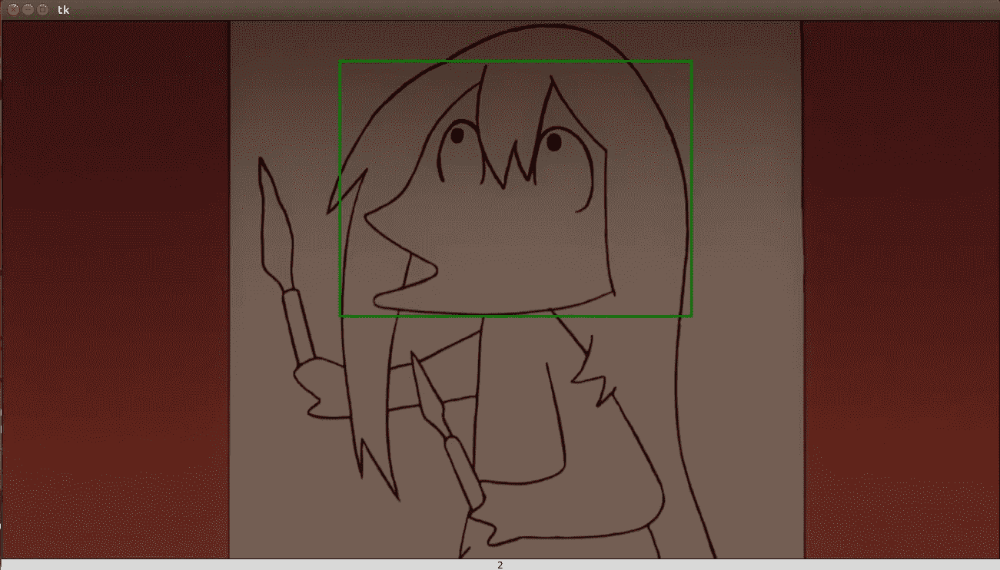

# 该工具将帮助您构建对象检测算法的训练集

> 原文：<https://medium.datadriveninvestor.com/the-tool-that-will-help-you-build-training-sets-of-object-detection-algorithms-88e0fec4908?source=collection_archive---------3----------------------->

[](http://www.track.datadriveninvestor.com/1B9E)

source: [https://dius.imgix.net/2016/12/deep-learning-4.png?w=700](https://dius.imgix.net/2016/12/deep-learning-4.png?w=700)

对于我的下一个项目，我想用机器学习来试验一种物体检测算法。在机器学习中，图像分类和物体检测的区别在于物体检测，你要**指出**物体所在的位置，**分类**它是什么物体而在图像分类中，你只需要**分类**它是什么图像。

要指出对象，你必须定义该对象的区域，你必须**定义该对象的边界框**。这就是为什么除了图像数据集之外，对于对象检测，您还需要定义图像数据集的所有边界框坐标(x_min、x_max、y_min 和 y_max，以像素为单位)的表格数据。对于一般数据集(汽车、苹果、船、飞机等)，你可以在互联网上轻松找到数据集。但是对于不通用的云分类(积云，积雨云，层云，卷云等)来说，这是很少见的，你甚至需要自己创建。构建对象检测数据集最困难的部分是定义边界框。你可以**在你的电脑上用你最喜欢的“画图”工具画一个任意的框**，然后通过**区分边界框和原始图像**之间的 RGB 颜色来编写一个定义 x_min、x_max、y_min 和 y_max 的脚本，然后**将它保存在一个文件中**，这就是两步法。对我来说，如果我们能直接定义边界框并保存在一个文件中，那就更方便了。

这就是为什么我在这里给你所有的脚本，以帮助你定义边界框，并直接将其坐标保存在一个文件中。

```
#!/usr/bin/pythonimport tkinter as tk # this is in python 3.4\. For python 2.x import Tkinter
from PIL import Image, ImageTk
import os#setting
wCanvas = 1366
hCanvas = 700
datasave = 'box.csv'
dirimg = 'image'class BoundingBox(tk.Tk):
 def __init__(self):
  tk.Tk.__init__(self)
  self.x = self.y = 0
  self.canvas = tk.Canvas(self, width=wCanvas, height=hCanvas, cursor="cross")

  self.canvas.pack(side="top", fill="both", expand=True)
  self.canvas.config(scrollregion=self.canvas.bbox(tk.ALL))
  self.canvas.bind("<ButtonPress-1>", self.on_button_press)
  self.canvas.bind("<B1-Motion>", self.on_move_press)
  self.canvas.bind("<ButtonRelease-1>", self.on_button_release)

  self.canvas.focus_set()
  self.canvas.bind("<Left>", self.previmg)
  self.canvas.bind("<Right>", self.nextimg)
  self.canvas.bind("s", self.saveboxcord)
  self.canvas.bind("d", self.resetbox)

  #add label of numbering
  self.numbering = tk.Label(self, text='0')
  self.numbering.pack()#open data save
  self.allimg = sorted(os.listdir(dirimg))
  self.imgptr = 0

  self.boxdata = Noneself.allcord = []self.allrect = []
  self.rect = Noneself.start_x = None
  self.start_y = None
  self.end_x = None
  self.end_y = Noneself._draw_image()def _draw_image(self):
  self.im = Image.open(dirimg+'/'+self.allimg[self.imgptr])
  self.tk_im = ImageTk.PhotoImage(self.im)
  self.canvas.create_image(0,0,anchor="nw",image=self.tk_im)def saveboxcord(self, event):
  self.boxdata = open(datasave, 'a+')
  for i in xrange(len(self.allcord)):
   self.boxdata.write(self.allimg[self.imgptr]+','+
   str(self.allcord[i][0])+','+
   str(self.allcord[i][1])+','+
   str(self.allcord[i][2])+','+
   str(self.allcord[i][3])+'\n')
  for i in xrange(len(self.allrect)):
   self.canvas.delete(self.allrect[i])
  del self.allcord[:]
  del self.allrect[:]
  self.boxdata.close()
  self.numbering.configure(text="box saved")

 def resetbox(self, event):
  for i in xrange(len(self.allrect)):
   self.canvas.delete(self.allrect[i])
  del self.allcord[:]
  del self.allrect[:]
  self.numbering.configure(text="box reseted")

 def nextimg(self, event):
  for i in xrange(len(self.allrect)):
   self.canvas.delete(self.allrect[i])
  del self.allcord[:]
  del self.allrect[:]
  self.canvas.delete("all")self.imgptr += 1
  if self.imgptr > len(self.allimg)-1:
   self.imgptr = 0
  self._draw_image()
  self.numbering.configure(text=str(self.imgptr))def previmg(self, event):
  for i in xrange(len(self.allrect)):
   self.canvas.delete(self.allrect[i])
  del self.allcord[:]
  del self.allrect[:]
  self.canvas.delete("all")self.imgptr -= 1
  if self.imgptr < 0:
   self.imgptr = len(self.allimg)-1
  self._draw_image()
  self.numbering.configure(text=str(self.imgptr))def on_button_press(self, event):
  # save mouse drag start position
  self.start_x = event.x
  self.start_y = event.y# create rectangle if not yet exist
  #if not self.rect:
  self.rect = self.canvas.create_rectangle(self.x, self.y, 1, 1, outline='green', width=3)def on_move_press(self, event):
  curX, curY = (event.x, event.y)if curX > wCanvas:
   curX = wCanvas
  if curY > hCanvas:
   curY = hCanvasself.end_x = curX
  self.end_y = curY# expand rectangle as you drag the mouse
  self.canvas.coords(self.rect, self.start_x, self.start_y, curX, curY)def on_button_release(self, event):
  print self.start_x, self.start_y, self.end_x, self.end_y
  self.allcord.append([self.start_x, self.start_y, self.end_x, self.end_y])
  self.allrect.append(self.rect)
  print len(self.allcord)if __name__ == "__main__":
 draw = BoundingBox()
 draw.mainloop()
```

或者你可以在这里下载[整个项目。在这个脚本中，您可以分别在变量 hCanvas 和 wCanvas 中设置图像画布的高度和宽度。要制作一些边界框，只需根据您想要用边界框覆盖的区域单击并拖动鼠标。要保存边界框的坐标，请按“s”，要重置边界框，请按“d”。](https://github.com/genomexyz/detect_object)

如果你现在运行这个脚本，尤其是‘git clone’我当前的项目，你会看到类似这样的东西。



看红色圆圈中的数字标签，它是你要定义其边界框的图像顺序。要前进到下一幅图像，请按右箭头键，反之亦然。要返回到上一幅图像，请按左箭头键。

让我们定义一些边界框并保存它。



These are my favorite scene in Gabriel drop out series >.<



在这个例子中，我想要**检测卡通中的脸**，这样所有的边界框就覆盖了图像中的所有脸。我们刚刚保存的所有边界框坐标都在 box.csv 文件中。内容如下

```
pose 1.png,830,81,1185,396
pose 2.png,460,49,800,408
pose 2.png,790,175,1017,555
pose 2.png,1056,451,1290,669
pose 3.png,440,53,897,385
```

第一列是**图像文件名**，第二列是 **x_min** ，第三列是 **y_min** ，接下来是 **x_max** ，最后是 **y_max** 。瞧，你得到了包围盒的坐标，所以你可以很容易地把它放在机器学习模型中。

仅此而已。下次我将在这里记录这个项目的发展。再见。