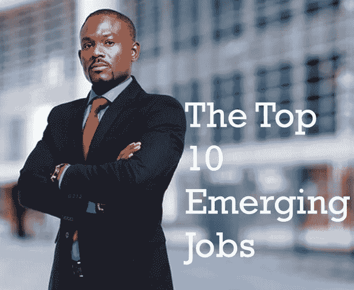
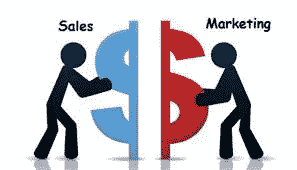
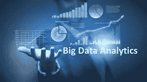
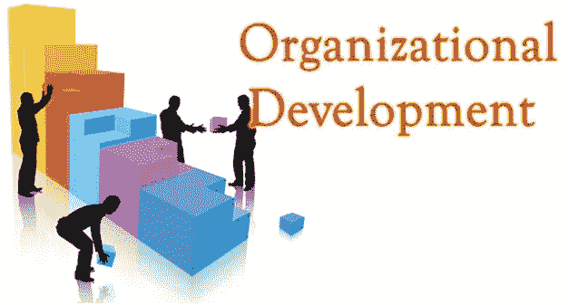

# 十大新兴工作

> 原文：<https://medium.datadriveninvestor.com/the-top-10-emerging-jobs-c2f89f85aef1?source=collection_archive---------12----------------------->

变化正在快速发生，这已经不是什么新闻了。现在看似正常的事情到中午可能就过时了。这些变化反映在我们的价值观、技术、政治和职业上。

技术变革导致了新角色的产生和某些角色的增强。这意味着工作环境正在快速变化，旧技能正在让位于新技能。工作场所的需求正在发生变化，不再像往常一样。

> 据世界经济论坛称，到 2022 年，7500 万个工作岗位将被淘汰，但那时，机器人和人工智能的进步将使 5800 万个工作岗位比它被摧毁的还要多。为了保持相关性和受欢迎，你必须重新掌握技能和提高技能。

**以下是 10 大新兴工作，你可以在哪里学到它们:**

**数据分析师和科学家**

[**数据分析师**将数字翻译成简单的英语。每个企业都收集**数据**，无论是销售数字、市场调查、物流还是运输成本。数据分析师的工作是获取数据，并利用这些数据帮助公司做出更好的商业决策。](https://www.snagajob.com/job-descriptions/data-analyst/)

1.  数据科学和分析的统计思维:[点击此处](https://www.class-central.com/course/edx-statistical-thinking-for-data-science-and-analytics-4913?utm_source=qz&utm_medium=web&utm_campaign=ivy_league_courses_2019)

2.高维数据分析:[点击这里](https://www.class-central.com/course/edx-high-dimensional-data-analysis-2949?utm_source=qz&utm_medium=web&utm_campaign=ivy_league_courses_2019)

3.电子表格和模型介绍:[点击这里](https://www.class-central.com/course/coursera-introduction-to-spreadsheets-and-models-5451?utm_source=qz&utm_medium=web&utm_campaign=ivy_league_courses_2019)

**人工智能和机器学习专家**

一个**人工智能和机器学习程序员**帮助开发可以帮助机器人的软件，机器自己做决定和学习。

1.  人工智能:[点击这里](https://www.class-central.com/course/edx-artificial-intelligence-ai-7230?utm_source=qz&utm_medium=web&utm_campaign=ivy_league_courses_2019)

2.用于数据科学和分析的机器学习:[点击此处](https://www.class-central.com/course/edx-cs50-s-introduction-to-computer-science-442?utm_source=qz&utm_medium=web&utm_campaign=ivy_league_courses_2019)

3.机器学习:[点击这里](https://www.class-central.com/course/udacity-machine-learning-1020?utm_source=qz&utm_medium=web&utm_campaign=ivy_league_courses_2019)

4.数据科学和分析的使能技术:物联网:[点击此处](https://www.class-central.com/course/edx-enabling-technologies-for-data-science-and-analytics-the-internet-of-things-4911?utm_source=qz&utm_medium=web&utm_campaign=ivy_league_courses_2019)

**总经理兼运营经理**

这些人确保一个组织高效且富有成效地运转。他们管理日常运营、人力资源、质量保证、行政、治理和政策

1.  运营管理简介:[点击这里](https://www.class-central.com/course/coursera-introduction-to-operations-management-372?utm_source=qz&utm_medium=web&utm_campaign=ivy_league_courses_2019)

2.运营分析:[点击此处](https://www.class-central.com/course/coursera-operations-analytics-4204?utm_source=qz&utm_medium=web&utm_campaign=ivy_league_courses_2019)

3.管理基础:[点击此处](https://www.class-central.com/course/coursera-management-fundamentals-10801?utm_source=qz&utm_medium=web&utm_campaign=ivy_league_courses_2019)

**软件和应用开发商和分析师**

根据市场或客户的需求，开发人员使用技术(代码)构建或创建有用的软件和应用程序。分析师是用户和开发人员之间的中间人，他们决定他们的需求是什么，以及开发的软件或应用程序是否满足他们的需求。

1.  计算机科学原理:[点击这里](https://www.class-central.com/course/edx-cs50-s-ap-computer-science-principles-7017?utm_source=qz&utm_medium=web&utm_campaign=ivy_league_courses_2019)

2.数据结构和软件设计:[点击这里](https://www.class-central.com/course/edx-data-structures-and-software-design-8517?utm_source=qz&utm_medium=web&utm_campaign=ivy_league_courses_2019)

3.软件开发基础:[点击这里](https://www.class-central.com/course/edx-software-development-fundamentals-8516?utm_source=qz&utm_medium=web&utm_campaign=ivy_league_courses_2019)

**销售和营销专业人员**

他们从事推销和销售公司产品和服务的活动。这里的角色包括:销售、营销、业务开发人员、关系主管、数字营销人员

1.  营销介绍:[点击这里](https://www.class-central.com/course/edx-data-structures-and-software-design-8517?utm_source=qz&utm_medium=web&utm_campaign=ivy_league_courses_2019)

2.数字营销、社交媒体和电子商务的基础:[点击这里](https://www.class-central.com/course/edx-fundamentals-of-digital-marketing-social-media-and-e-commerce-5835?utm_source=qz&utm_medium=web&utm_campaign=ivy_league_courses_2019)

3.营销分析:数据工具和技术:[点击此处](https://www.class-central.com/course/edx-marketing-analytics-data-tools-and-techniques-6746?utm_source=qz&utm_medium=web&utm_campaign=ivy_league_courses_2019)

4.财务和盈利能力:[点击此处](https://www.class-central.com/course/coursera-entrepreneurship-4-financing-and-profitability-5476?utm_source=qz&utm_medium=web&utm_campaign=ivy_league_courses_2019)

5.客户分析:[点击此处](https://www.class-central.com/course/coursera-customer-analytics-4353?utm_source=qz&utm_medium=web&utm_campaign=ivy_league_courses_2019)

**大数据专家**

检查大量不同的**数据集**的复杂过程(大数据),以发现包括隐藏模式、未知相关性、市场趋势和客户偏好在内的信息，从而帮助组织做出明智的业务决策

1.  大数据与教育:[点击此处](https://www.class-central.com/course/edx-big-data-and-education-968?utm_source=qz&utm_medium=web&utm_campaign=ivy_league_courses_2019)

2.大数据基础:[点击此处](https://www.edx.org/course/big-data-fundamentals-adelaidex-bigdatax)

3.大数据简介:[点此](https://www.edx.org/course/introduction-to-big-data-0)

**数字化转型专家**

他们帮助组织转变其活动、流程、能力和模式，以充分利用技术和数字工具。

1.  解决问题的计算思维:[点击这里](https://www.class-central.com/course/edx-cs50-s-ap-computer-science-principles-7017?utm_source=qz&utm_medium=web&utm_campaign=ivy_league_courses_2019)

2.转变数字化学习:学习设计与服务设计的结合:[点击此处](https://www.futurelearn.com/courses/digital-learning)

**新技术专家**

紧跟潮流，有远见，活在未来，是这些人的重要技能。我们有网络安全、区块链、云计算、人工智能、机器学习、比特币和加密货币。一般来说，这个人必须了解技术领域发生的所有事情，以及这些事情如何影响安全。

**组织发展专家**

组织发展专家的目标是通过人员扩展组织的知识和技能，使组织全面有效。他们评估技能差距并建立所需的能力。他们确保组织拥有实现其核心目标所需的技能

1.  领导的学习:[点击这里](https://www.class-central.com/course/edx-leaders-of-learning-2027?utm_source=qz&utm_medium=web&utm_campaign=ivy_league_courses_2019)

2.人员分析:[点击此处](https://www.class-central.com/course/coursera-people-analytics-4264?utm_source=qz&utm_medium=web&utm_campaign=ivy_league_courses_2019)

3.组织整个课堂讨论:[点击此处](https://www.class-central.com/course/coursera-orchestrating-whole-classroom-discussion-7421?utm_source=qz&utm_medium=web&utm_campaign=ivy_league_courses_2019)

4.创新教学:用技术重新想象教学:[点击此处](https://www.class-central.com/course/edx-innovating-instruction-reimagining-teaching-with-technology-8019?utm_source=qz&utm_medium=web&utm_campaign=ivy_league_courses_2019)

**信息技术服务**

这包括网站开发人员、软件工程师、IT 支持和分析师、网络工程师、信息/网络安全和计算机系统分析师。

1.  计算机科学入门:[点击这里](https://www.class-central.com/course/edx-cs50-s-introduction-to-computer-science-442?utm_source=qz&utm_medium=web&utm_campaign=ivy_league_courses_2019)

2.用 Python 和 JavaScript 进行 Web 编程:[点击这里](https://www.class-central.com/course/edx-cs50-s-web-programming-with-python-and-javascript-11506?utm_source=qz&utm_medium=web&utm_campaign=ivy_league_courses_2019)

3.软件开发基础:[点击这里](https://www.class-central.com/course/edx-software-development-fundamentals-8516?utm_source=qz&utm_medium=web&utm_campaign=ivy_league_courses_2019)

**结论**

在新世界中找到你的位置。保持相关性。然而，这并不一定意味着传统的工作会完全过时，我们仍然需要它们，但不是以高度竞争的速度。

**参考文献**

1.[https://www . inteqna . com/blog/6-不同类型的信息技术工作](https://www.inteqna.com/blog/6-different-types-of-jobs-in-information-technology)

2.[https://www . techopedia . com/definition/5569/technology-services](https://www.techopedia.com/definition/5569/technology-services)

3.[https://qz . com/1514408/400-free-ivy-league-university-courses-you-can-take-online-in-2019/](https://qz.com/1514408/400-free-ivy-league-university-courses-you-can-take-online-in-2019/)

[4。http://stevepeacocke . blogspot . com/2013/06/programmer-or-analyst-developer . html？m=1](http://stevepeacocke.blogspot.com/2013/06/programmer-or-analyst-developer.html?m=1)