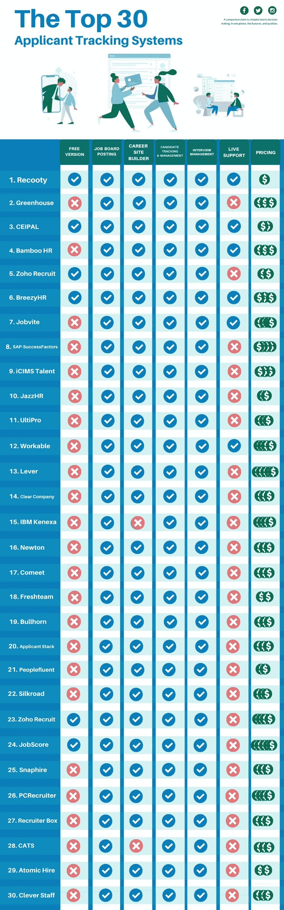

# 2021 年前 30 名最佳申请人跟踪系统

> 原文：<https://medium.datadriveninvestor.com/the-top-20-best-applicant-tracking-systems-in-2019-46fc34a54504?source=collection_archive---------0----------------------->

> 永远不要雇用一个对他的工作了解得比你少的人——***马尔科姆福布斯*** *，*福布斯

对于任何公司的人力资源或招聘团队来说，招聘可能是最具挑战性和最令人不安的过程。在整个招聘过程中，在所有不同的阶段中，发布职位、管理和简化申请被普遍认为是招聘行业中最繁忙的任务。理想情况下，公司的招聘流程应该尽可能有效和高效，为此，只接受合格和最合适的员工以节省资金和时间变得非常必要。这似乎是一个令人生畏的过程，不是吗？嗯，也不一定啊！

Applicant Tracking System in 2021

*在过去的十年里，招聘人员有效地将招聘过程委托给了现代技术，或者更专业地说，申请人跟踪系统。申请人跟踪系统是一种软件，其基本功能是根据职务空缺中提到的偏好和标准，以电子方式自动过滤、组织和简化职务申请。*

*随着趋势的确立和数字化接管招聘场景，近年来出现了许多 ATS。有这么多选择，很难决定考虑哪些 ATS，忽略哪些。哪种 ATS 最合适，并能证明对您的人力资源团队有效？别担心，我们支持你。为了解决招聘人员的这一困境，我们列出了 2021 年招聘人员不应错过的 30 个最佳求职者跟踪系统，并整理了这篇文章。*

# 1.Recooty

[**Recooty**](https://recooty.com/) 是 Gartner 的顶级**申请人跟踪系统**。它简化了招聘流程，从发布职位到让世界顶尖人才轻松入职。它帮助雇主建立强大的雇主品牌&提供广泛的高级功能，带来最佳的招聘体验。像优步联邦快递这样的公司是他们的快乐顾客。Recooty 也被认为是[最佳谷歌招聘替代者](https://recooty.com/google-hire-alternative)。

独特之处- Recooty 因其简单高效而被誉为世界上最简单的招聘软件。它有令人难以置信的负担得起的价格，而且基本计划是绝对免费的。

# 2.温室

温室是一个有效的招聘工具，不仅仅是一个 ATS。它有效地支持和帮助公司建立一个成功的招聘文化。它使公司在人才竞争中保持领先

**独特之处-** 温室是一个终极而完整的人力资源管理系统。招聘人员能够同时有效地管理现有客户和潜在客户。招聘人员可以从中受益，分析候选人的表现和效率，并进行比较。

# 3.CEIPAL

[CEIPAL](https://www.ceipal.com/) 提供了一个 SaaS 平台，可以自动化人事公司的前台和后台业务运营。CEIPAL 提供完整的劳动力管理平台，包括完全集成的申请人跟踪系统(ATS)和人力资源信息系统(HRIS)。

**独特功能:** CEIPAL 是迄今为止业内最具创新性的解决方案之一，它利用人工智能、人员分析等一系列技术不断添加新功能。这些创新功能通过改进申请人跟踪、候选人参与、被动候选人寻找、工作营销和广告、新员工入职、分析、报告等，提高了盈利能力和工作效率。此外，CEIPAL 直接在其网站上提供免费的个性化演示”。

# 4.BambooHR

[BambooHR](https://www.bamboohr.com/) 是一款基于云且易于使用的人力资源软件，适用于中小型企业。人力资源信息系统提供各种工具和功能，帮助人力资源主管有效地管理和监控雇佣流程的每一步。

**独特的特性-** BambooHR 的繁荣主要是因为它的报告功能。使用 BambooHR ATS 不仅可以调出平等就业机会报告，还可以调出福利报告。而且 BambooHR 的这个功能在手机上也是支持的。

# 5.Zoho 新兵

申请人跟踪是 Zoho Recruit 的专长，其功能完全是为人力资源团队和人事代理服务的。它帮助招聘人员轻松管理和简化大量的申请。

**独特功能-** Zoho Recruit 为招聘人员和求职者提供了一个活动职位空缺列表，按时间顺序显示空缺字段，以便申请人可以立即提交申请。它还允许招聘人员选择他们的申请人要回应的标准，Zoho 会自动拒绝不符合标准的申请人。

# 6.微风 HR

BreezyHR 是一款端到端的招聘软件，通过帮助招聘人员以最小的努力吸引和雇佣优秀的员工，实现招聘流程的现代化。这是一款神奇的招聘软件，它能让招聘人员鸟瞰候选人的个人资料。

**独特之处-** BreezyHR 为申请人及其所处阶段提供了一个清晰而精确的愿景。拖放管理系统允许招聘人员对候选人有绝对的控制权。

# 7.JobVite

[JobVite](https://www.jobvite.com/) 不仅是一款 ATS，还是一款支持社交招聘、移动优化的职业网站、入职以及其他任何理想招聘功能的软件。

独特功能- 招聘人员可以高效地创建可定制的品牌职业网站，展示他们的品牌、申请、表格等。

# 8. **SAP 成功因素**

[SAP SuccessFactors](https://www.successfactors.com/content/ssf-site/en.html) 是一家美国跨国公司，总部位于南旧金山。它为人力资本管理提供基于云的软件。它使用软件即服务模式为组织提供人力资源解决方案。

独特之处:- SAP SuccessFactors 提供全面的 HCM 套件以及全球专业知识保证。它允许招聘交易，并帮助您管理人力资源的各个方面。

# 9.iCIMS 人才

[iCIMS](https://www.icims.com/) 人才获取软件套件可有效支持各行业各种规模的企业。他们已经存在了 10 多年，试图获得招聘权。它易于使用，分为三个模块:招募，连接和船上。

**独特功能-** iCims 是全球领先的人才获取品牌，拥有超过 3000 家企业和组织，是快乐和满意的客户。

# 10.爵士 HR

[JazzHR](https://www.jazzhr.com/) 是一款简单可定制的 ATS 和招聘软件。它使招聘人员能够在多个职位公告板和各种社交媒体平台上发布职位，同时使用特定和理想的过滤器筛选和监控申请。可以根据工作类型的要求设置不同的招聘阶段。

**独特的功能-** 它有效地允许用户同时在同一个平台上访问脸书、LinkedIn 等各种平台上的招聘信息。

# 11.Ulti Pro

凭借超过 25 年的经验， [UltiPro](https://www.ultimatesoftware.com/UltiPro-Services) 专注于改变人力资源系统，并将招聘场景提升到一个新的水平。各种因素，如人力资源、工资、人才、员工信息等，都集中在一个地方，有助于招聘人员轻松管理和分析员工。

**独特功能-** UltiPro 的独特功能是其继任管理功能，该功能使招聘人员能够为员工的专业和职业发展创建和实施前瞻性计划。

# 12.切实可行的

[Workable](https://www.workable.com/) 是一款 ATS 和一体化招聘工具，帮助各种规模的企业在招聘领域蓬勃发展。它帮助招聘人员优化整个招聘过程，从最开始到绝对结束。

独特的功能- Workable 不收取任何安装或设置费用，招聘人员可以在 10 分钟内开始工作。该平台还允许团队就各种招聘决策进行协作和合作。

# 13.工具

[杠杆](https://www.lever.co/)的人才收购重点是让招聘更有效率，更人性化。它是 ATS 和客户关系管理软件相结合的一种系统。借助 Lever，招聘人员还可以创建职业网站和个人资料。

**独特功能-** Lever 通过其分析工具和招聘指标提供所有招聘数据，这使得招聘人员可以非常轻松地起草他们的进度报告。

# 14.清除公司

[ClearCompany](https://www.clearcompany.com/) 是一个绝对的人才管理系统，为招聘人员提供招聘、雇用和留住人才所需的一切。它利用公司的愿景和使命来寻找顶尖人才。

**独特之处-**clear company 的独特之处在于它提供了对候选人的自动检查和验证。通过这种方式，招聘人员确切地知道他们要招聘什么样的候选人。

# 15.IBM Kenexa

[IBM Kenexa](https://www.ibm.com/in-en/marketplace/talent-acquisition)Talent Acquisition Suite 是一个装满各种招聘解决方案的包，可以帮助招聘人员找到、聘用并最终聘用有价值的候选人。它包含了主动吸引人才和激励求职者的行为营销工具。

**独特的特性-** 其评估特性和功能都由 IBM Watson analytics 提供支持，因此确定最佳匹配的过程非常快。

# 16.牛顿

[Newton](https://www.paycor.com/newton-software) 是一款面向中小型企业雇主的移动就绪、用户友好且功能齐全的紧凑型申请人跟踪系统。它可以有效地管理应用程序，没有太多麻烦。

**独特的功能-** Newton 的设计和编程基本上是为了让招聘人员和他们的团队从最初阶段就能无与伦比地了解他们的招聘流程。

# 17.Comeet

[comet](https://www.comeet.com/)是一款独特的招聘软件，支持并鼓励以团队为中心的招聘。它将 ATS 的功能与通信、协作、工作流程和其他所有提高当前工作团队质量的因素结合在一起。

**独特功能-** 借助 Comeet，招聘人员可以在招聘过程中涉及多个人力资源专业人士和候选人。这有助于迅速填补空缺。

# 18.新鲜团队

FreshTeam 是一个求职者跟踪系统，它成功地在优秀的招聘人员和优秀的候选人之间搭建了一座完美的桥梁。这是一个多任务招聘工具，帮助许多公司实现他们的目标。

**独特功能-** 它通过管理职位发布、寻找候选人等，有效地自动化并处理所有招聘任务和杂务。

# 19.手提式扩音器

[Bullhorn](https://www.bullhorn.com/eu/) 主要致力于自动化整个招聘流程，提高招聘人员的工作效率，改善候选人的体验，并做出更好的招聘决策。

**独特功能-** Bullhorn 是一款 ATS 和 CRM 软件的结合体，适用于招聘公司和员工。这是非常容易使用，并给出快速的结果。如果出现任何问题，系统会有效地通知招聘人员，以避免出现重大问题。

# 20.应用程序堆栈

9 年来，凭借众多客户的信任， [ApplicantStack](https://www.applicantstack.com/) 是一款功能齐全的 ATS。许多中小型企业都使用它。

**独特之处-**applicant stack 团队由前招聘人员和人力资源主管组成。所以他们确切地知道所有招聘问题的核心以及如何解决它们。

# 21。PeopleFluent

Peoplefluent 是一家总部位于美国的公司，致力于帮助组织雇佣、管理和奖励高技能和有积极性的员工。这是一个软件，涵盖中型或大型公司的招聘、绩效、继任、薪酬和学习。

独特功能:- PeopleFluent 提供优秀的人才管理软件和学习解决方案，帮助组织实现其劳动力的全部潜力。

# **22。丝路**

[SilkRoad](https://silkroadtechnology.com/) 是一个基于云的申请人跟踪系统，总部位于伊利诺伊州的芝加哥，并在世界各地设有区域办事处。它允许招聘公司和人力资源来源吸引、雇用、参与和管理员工招聘的所有方面。

独特之处:-丝路允许其候选人、员工和招聘人员在他们的各种社交媒体平台上分享职位空缺，如脸书、Twitter、LinkedIn。

# 23。Zoho 招募

Zoho Recruit 是一个基于云的申请人跟踪系统，为中小型企业提供招聘解决方案。该软件包括简历解析、定制职业页面、自动工作公告板和面试安排等功能。

独特之处:-通过创建定制的职业网页，Zoho Recruit 提高了公司职位空缺的可见性。此外，Zoho Recruit 通过使用受欢迎的职位信息板来扩展其覆盖范围。

# **24。工作分数**

[JobScore](https://www.jobscore.com/) 是一个基于云的免费申请人跟踪系统，专为各种规模的企业开发。它为内部招聘人员提供不同的招聘解决方案和工具，以确保他们得到最好的聘用。该产品的功能包括简历数据库、社交媒体招聘、职位发布、报告和分析。

独特之处:- JobScore 是第一个直接的雇主对雇主的简历分享网络。有了这个功能，雇主可以创建一个更好的渠道。

# **25。快照**

[SnapHire](https://snaphire.com/) 是一个位于奥克兰的按需人才管理系统，让招聘人员能够为他们的组织雇佣和留住理想的员工。它让招聘人员能够控制自己的招聘过程。

独特的功能:-snapfhire 提供了招聘人员为其组织招聘和留住最佳人才所需的所有工具。

# **26。PCRecruiter**

PCRecruiter 是一个基于云的招聘和跟踪解决方案，适用于各种企业的人力资源部门。PCRecruiter 在一个中心为联系人管理和申请人流程提供了一个彻底的解决方案。

独特功能:PCRecruiter 的申请人管道功能提供了一个拖放界面，允许在连续阶段之间轻松移动申请人，并自动跟进套用信函和保留完整的历史记录。

# **27。招聘箱**

[Recruiterbox](https://recruiterbox.com/) 是一个求职者跟踪系统，帮助成长型公司简化招聘流程并提高其可预测性。它的设计考虑到了中小型企业的需求和要求。

独特的功能:Recruiterbox 的系统允许其用户定制招聘过程中涉及的各个步骤。

# 28.猫

CATS 是一个基于云的招聘软件，帮助招聘机构管理他们的招聘周期，该解决方案于 2007 年发布。

独特的功能:- CATS 为 Word、Outlook 和社交媒体提供不同的插件。

# **29。原子出租**

[Atomic Hire](https://atomichire.com/) 是一个协作招聘平台，通过结合团队协作、最佳实践和分析，使团队能够更高效地工作。Atomic Hire 帮助招聘人员吸引、管理和选择优秀的候选人加入他们的团队。

独特的功能:-原子雇用有一个易于使用的拖放界面，使管理招聘渠道极其容易。

# **三十。CleverStaff**

Cleverstaff 是一款基于云计算的专业招聘软件，专为人力资源经理、招聘人员和顾问设计。它的主要功能是简历存储，以及通过社交媒体寻找完美候选人的功能。

独特之处:- Cleverstaff 为招聘和人事代理机构提供了一个客户门户，让他们的客户了解空缺职位。

***希望这个清单能帮助你做出更好的决定。我们试图从不同来源收集数据，以帮助您找到最佳的申请人跟踪系统，尽管如此，数据可能会因日期、时间等因素而有所不同。***

最初发布于:

 [## 2019 年前 20 名最佳申请人跟踪系统-recoo oty 博客

### "永远不要雇用一个对他的工作了解得比你少的人."-马尔科姆·福布斯，福布斯说到…

recooty.com](https://recooty.com/blog/the-top-20-best-applicant-tracking-systems-in-2019/?preview=true)