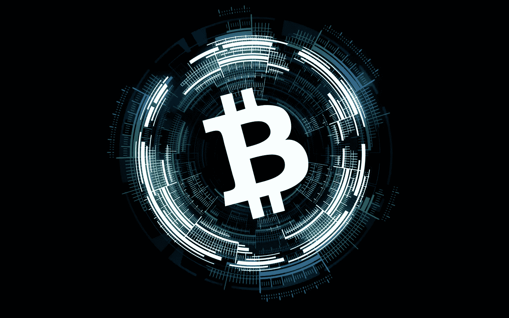
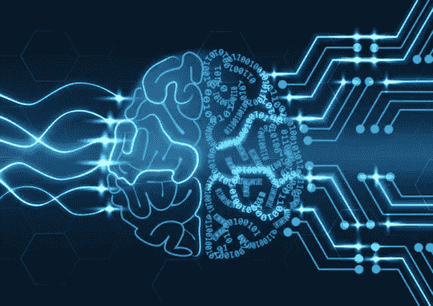

# 三大秘密

> 原文：<https://medium.datadriveninvestor.com/the-top-3-cryptotruths-1f96c1a8c9b0?source=collection_archive---------4----------------------->

加密货币的最佳用途有待发现。比特币和区块链的发明可以与互联网相提并论。区块链是互联网 4.0。互联网是一个了不起的工具，让我们更好地沟通和交流。“但是区块链允许我们以不同的方式交换。对区块链来说，更好的比喻是机械时间的发明。”正如克里斯·伯格所说。

# 那么 3 个密码真理是什么？

# 真相#1

# 人群拥有密码。

加密货币不属于任何政府、银行，没有中间人。人们开始认识到这些货币摆脱了制度的束缚。这项技术可以让政府降低服务成本，提高选举透明度，并改善政府活动的安全性。区块链正处在一个充满腐败的行业的艰苦战斗中。这项技术可以让政府降低服务成本，提高选举透明度，并改善政府活动的安全性。

# 真相#2

# Crypto 成功的关键是结构。

这些货币的成功是因为它们允许分散知识。在加密货币中，技术诀窍是共享的，尽管没有一小组专家决定货币的未来。它需要一个严格的结构，通过哈希验证和安全的信息分发来工作。信不信由你，区块链已经在我们日常生活的行业中获得了很多，它比你想象的更接近你。例如，医疗保健行业一直在努力寻找安全共享和存储医疗数据和记录的解决方案。他们正转向区块链，以实现患者数据的安全存储。

# 真相 3:

# 密码离稳定还有很长的路要走

每天我们都有新的密码问世，其他的也在改进中。如果你想投资，就要理解加密市场的波动性。你必须小心你的投资策略。当你投资加密货币时，利弊很少。

## 对这些公司的好处是:

1.与其他方法相比，以更快的方式获得资金

2.资本成本更低

3.民主化

4.效率

## 对投资者的好处:

1.可能的大规模回归

2.流动性增加

对投资者的不利之处:

1.基于高度推测

2.高波动性

3.市场

4.操纵/骗子

5.缺乏质量控制

*

# 永远做你自己的研究。

如果您决定投资，您应该投资于:

* **金融/交易所，**

***数据服务，**

***区块链(高级)，**

*** AI，**

***IOT。**

区块链是一项实验性技术。区块链可以用在什么地方，这是一个创业问题。很少有账簿会搬到区块链，有些账簿会试图搬到区块链，但都失败了。现在我们不知道行业会有什么反应。不是所有东西都可以通过区块链使用。这一过程将极具破坏性。全球经济面临巨大变化。保险、银行、零售等行业，法律将随着加密货币永远改变。

区块链技术有可能解决银行业目前面临的几个世界问题，有望带来根本性的变化。这项技术保证了更安全、更透明的过程；一切都是为了给客户提供更安全、更快捷的服务。众筹被认为是为初创企业和新企业提供资金的一种可靠方式，许多人为了一个单一的统一目标而共同努力。

但是，这些模式通常收取高额交易费，并且经常会出现一些少报融资额的情况，但要小心:

*   **区块链将前来救援。**

* **区块链通过提供对法律文件和数据的访问、存储和验证，将扰乱法律行业。这项技术将允许公众安全地访问重要文件，如法院裁决、所有权和其他契约。**

消费者与生产商或设计师直接互动的能力将限制中间商在经济中的作用。然而，物流公司将继续繁荣，但无人驾驶交通工具的出现也将对工业造成破坏。

# 结论

区块链革命即将到来。它将带来由人类资本主义主导的经济和更大的个人自主权。区块链技术的未来尚不明朗。我们发现互联网的时候也是这样，我们也不知道谁会成长。企业家、领导者和创新者将领导区块链革命。一如既往地经历一个反复试验的过程。在我们确切知道这种破坏将如何发生之前，巨大的财富将会消失。

# 正如托马斯·爱迪生所说:

## “我没有失败。我刚刚发现了一万种行不通的方法。

## 生活中的许多失败是人们在放弃时不知道他们离成功有多近。"

在日常商业生活中开发和实施区块链技术也是如此。我们唯一能做的就是深入理解区块链模式，并在这个过程中吸取教训。

# **下次见，**

# **曼哈**

# 在 [Linkedin](http://www.linkedin.com/in/manjabogicevic/) 和 [Instagram](http://www.instagram.com/manyaabe/) 上关注我的每日更新。