# 2018 年 30 大营销、销售和管理书籍

> 原文：<https://medium.datadriveninvestor.com/the-top-30-marketing-sales-and-management-books-of-2018-a723d290d5bb?source=collection_archive---------9----------------------->

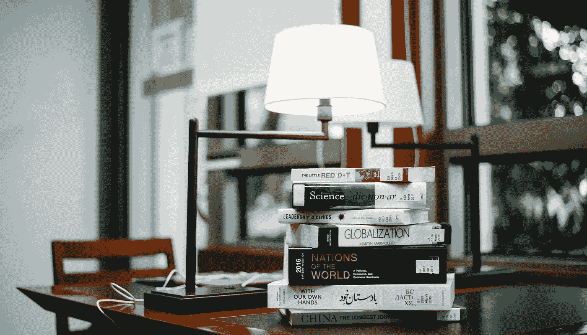

新的一年总是新的开始，也是做出结论和制定新计划的绝佳时机。对于想要有所作为、想要成长为更好的自己的人来说，书籍是最好的帮手。我们在这里收集了关于营销、销售和管理的有价值和发人深省的书籍，它们将鼓励你并展示许多新的观点。

# 营销

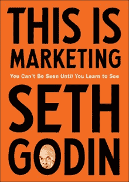

**这就是营销:在你学会见塞斯·戈丁之前，你是不会被人看见的**

*亚马逊比率:4.7*

[*GoodReads*](https://www.goodreads.com/book/show/40549476-this-is-marketing?from_search=true) *速率:4，11*

如何建立一个专注于同理心和情感联系的营销策略？如何做对关心的人重要的工作？塞思·戈丁是 19 本国际畅销书的作者，他提出了一种改变游戏规则的营销方法。

> “营销是我们代表我们服务的人寻求改变，我们通过理解驱动我们每个人的非理性力量来实现这一点。”

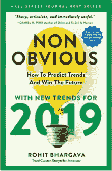

**非显而易见的 2019:如何预测趋势，赢得未来**

*亚马逊费率:5*

[*GoodReads*](https://www.goodreads.com/book/show/40690537-non-obvious-2019?from_search=true)*评分:5*

这本书是由营销专家和乔治敦大学教授 Rohit Bhargava 撰写的最新趋势的畅销书清单。了解如何利用非显而易见的思维来发展业务并在世界上产生更大的影响。

> “已经研究了数千人。。。令人吃惊的是，许多人拒绝学习的机会。—卡罗尔·德韦克(来自《心态》)—罗希特·巴尔加瓦

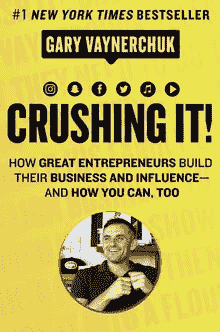

**粉碎它！:伟大的企业家如何建立他们的业务和影响力，以及你如何做到这一点**

*亚马逊比率:4.7*

[*GoodReads*](https://www.goodreads.com/book/show/36045512-crushing-it?from_search=true)*率:4，18*

这是一本实用且鼓舞人心的书，讲述如何借助当前主要的社交媒体平台来扩大你的个人品牌。有了这些理论上和战术上的建议，你很容易发展自己的企业，并成为 Twitter、脸书、YouTube、Instagram 和其他网站上的最大热门。

> “如果你对今天的生活不是 100%满意，那就不要浪费时间去尝试能让你达到目的的事情。”—加里·维纳查克

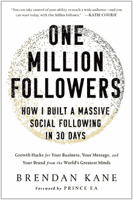

一百万追随者:我如何在 30 天内建立起一个庞大的社交追随者布兰登·凯恩

*亚马逊比率:4.8*

[*GoodReads*](https://www.goodreads.com/book/show/39687710-one-million-followers?from_search=true) *速率:4，00*

对于需要创造独特和有价值的内容、获得专门的在线追随者以及通过社交媒体平台从零开始建立多媒体品牌的人来说，这是另一本好书。布伦丹·凯恩教授如何在所有的信息噪音中脱颖而出。

> “今天，网络世界如此混乱，即使是真正伟大的内容也经常被埋没或忽略。好消息是，你可以控制自己接触广泛受众的能力——你可以从今天开始，拥有 100 万粉丝。”—凯蒂·柯丽克

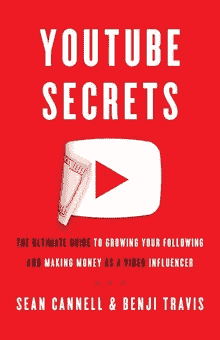

**YouTube 秘密:作为视频影响者增加粉丝和赚钱的终极指南 Cannell，Benji Travis**

*亚马逊比率:4.7*

[*GoodReads*](https://www.goodreads.com/book/show/41429391-youtube-secrets?from_search=true)*rate:4，21*

根据 10 年的经验和对 100 多名顶级创作者的采访，Sean Cannell 和 Benji Travis 给你一本如何成为在线视频专家和创造利润丰厚的业务的手册。

> “这不全是为了赚钱。你永远不知道在 YouTube 上建立自己的影响力会给你带来什么机会、关系或经历。”——肖恩·坎内尔，班吉·特拉维斯

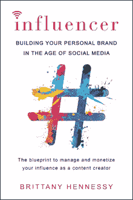

**影响者:在社交媒体时代打造你的个人品牌布列塔尼·轩尼诗**

*亚马逊税率:4.5*

[*GoodReads*](https://www.goodreads.com/book/show/36560239-influencer?from_search=true)*收视率:3，82*

创造值得双击的内容的核心影响者原则。如何提升自己的形象并被发现？如何建立一个观众群并让他们参与进来？布列塔尼·轩尼诗给出了答案，并展示了如何拥抱你的优势和赚钱。

> “我强烈建议任何对在线生活感兴趣的人去买这本书，坐下来做笔记，因为你会想听听布里特妮要说些什么。”—伊斯克拉·劳伦斯，Aerie 模特，Instagram 明星

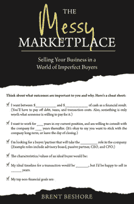

混乱的市场:在一个不完美买家的世界里出售你的企业布伦特·贝肖尔

*亚马逊费率:5*

[*GoodReads*](https://www.goodreads.com/book/show/42971055-the-messy-marketplace?from_search=true)*率:4，27*

这本书是数千小时讨论销售业务细节的积累。在这里，你可以找到在你的企业需要转型的时候，如何避免巨大的压力、焦虑和沮丧的小贴士。了解您和您的公司如何通过与外部投资者的交易实现转型。

> “在其他任何地方，你都不可能找到从这本书中学到的知识。这是业内人士对收购过程的指导。这本书见解深刻、直截了当，将让你为决定接受外部资本或退出的那一天做好准备。”—约翰·加勒特，社区影响报纸

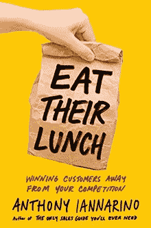

**吃掉他们的午餐:从竞争对手手中赢得顾客**

*亚马逊税率:4.8*

[*GoodReads*](https://www.goodreads.com/book/show/38820051-eat-their-lunch?from_search=true) *速率:4，28*

如果你是 B2B 销售人员，并希望在一个增长 3%的行业中每年增长 12%，这本书非常适合你。在这里，您可以找到关于如何理解潜在客户组织中每个人的不同优先事项、以最佳顺序赢得组织中合适人员的解释，等等。

> “Iannarino 对我们不愿承认存在的领域进行了深入而必要的探索:拥挤、竞争激烈、充满挑战的市场。如果你正在读这本书，那很可能描述了你的世界，所以帮你自己一个忙，读读这本书。”——Andrea Waltz，Go for No 的合著者！

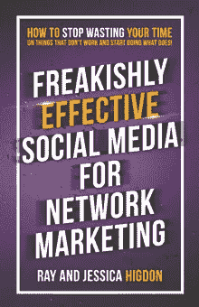

**网络营销出奇有效的社交媒体:如何停止在无用的事情上浪费时间，开始做有用的事情！雷·希格登，杰西卡·希格登**

*亚马逊税率:4.9*

[*GoodReads*](https://www.goodreads.com/book/show/39327456-freakishly-effective-social-media-for-network-marketing?from_search=true)*rate:4，37*

如果你迷失在社交媒体中，这本书将帮助你找到正确的方法。这是每个想要建立一个成功的网络营销业务，并避免在发布和与其他用户和企业互动最常见的错误的人必读。

> "在同等条件下，人们更喜欢和他们认识、喜欢和信任的人做生意."—雷·希格登

# 销售

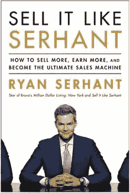

像瑟汉特一样销售:如何卖得更多，赚得更多，成为终极销售机器瑞安·瑟汉特

*亚马逊比率:4.8*

[*GoodReads*](https://www.goodreads.com/book/show/38901678-sell-it-like-serhant?from_search=true)*率:4，42*

如何赢得每一次机会，同时管理几笔交易？这本书用有用的教训、生动的故事和生动的例子表明，任何使用这些原则的人都可以增加利润，实现任何目标。

> “莱恩·斯汉特是销售方面的权威。如果你想比其他人卖得更多，现在就看这个吧。”―《纽约时报》畅销书作家加里·维纳查克

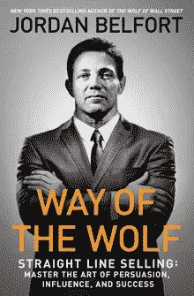

狼之道:直线销售:掌握说服、影响和成功的艺术

*亚马逊税率:4.6*

[*GoodReads*](https://www.goodreads.com/book/show/36304483-way-of-the-wolf?from_search=true) *速率:4，12*

你听说过电影《华尔街之狼》吗？它使世界上最著名的股票经纪人――乔丹·贝尔福特的名字流芳百世。在这本书里，贝尔福特分享了他的一步一步的销售和说服系统，它能够把任何人变成销售摇滚明星。

> “一旦你对直线系统变得相当熟练，你就能够接受任何前景，不管它们在确定性量表上是从哪里开始的，并非常轻松地将它们提升到越来越高的确定性水平。这只是一个直接控制销售的问题，然后一步一步地让你的潜在客户走上正轨”——乔丹·贝尔福特

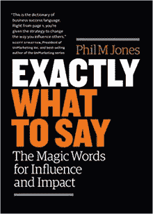

**确切地说:影响和冲击的神奇话语菲尔·m·琼斯**

*亚马逊税率:4.5*

[*GoodReads*](https://www.goodreads.com/book/show/35414701-exactly-what-to-say?from_search=true)*rate:3，8*

畅销书作家、世界领先的销售培训师菲尔·m·琼斯说，准确地知道该说什么以及何时说什么是一门真正的艺术。他教了 200 多万人成为更好的沟通者，并把他的主要策略写进了这本书。你需要他们来得到更多你想要的东西。

> “这个世界上有两种人:一种是为了怀旧而抵制变化的人，另一种是与时俱进、创造美好未来的人。”—菲尔·琼斯

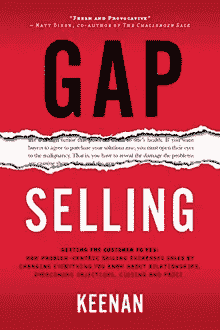

**差距销售:让顾客同意:以问题为中心的销售如何通过改变你对关系、克服异议、成交和价格的了解来增加销售额基南**

*亚马逊费率:5.0*

[*GoodReads*](https://www.goodreads.com/book/show/42686460-gap-selling?from_search=true)*利率:4.00*

销售的主要规则是什么？这本书旨在打破无数过时的销售策略，提高全球销售组织的销售智商。探索一种与买家联系并实现目标的全新有效方式。

> “如果我的记忆被抹去，我不得不重新开始销售，我只能用一种工具来训练自己——那就是这本书。”——卡斯帕·福普，Wondersign 首席收入官

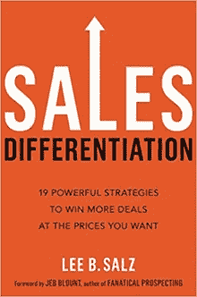

**销售差异化:以你想要的价格赢得更多交易的 19 个有力策略，作者 Lee B. Salz**

*亚马逊税率:4.9*

[*GoodReads*](https://www.goodreads.com/book/show/39873380-sales-differentiation?from_search=true) *比率:4，07*

在这里，您可以找到 19 个易于实施的概念，帮助您赢得交易，同时保护利润。从竞争中脱颖而出并为买家提供价值的实用、策略和可行的方法。

> “从竞争中脱颖而出的实用、战术和可行方法的宝库！读一下...用吧！”——安东尼·帕里内罗,《卖给非常重要的高级官员维托》一书的作者

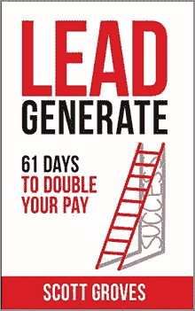

**线索生成:61 天让你的工资翻倍作者 Scott Groves**

*亚马逊费率:5.0*

[*GoodReads*](https://www.goodreads.com/book/show/42629029-lead-generate?from_search=true)*利率:4.00*

商业教练和最高生产贷款官员斯科特格罗夫斯提供了一个实验，并在 61 天内按照他的建议。他确信在这段时间之后，每个销售人员都可以将他们的销售业绩翻倍，并大幅增加他们的收入。准备好试试了吗？

> “这本书很像斯科特，因为它易于阅读，易于理解，而且超级聪明。它是为我们即时满足应用程序麻木的头脑而构建的，如果你每天花几分钟时间使用它，每次都会有所收获。”—查尔斯·马丁，国家农场代理人

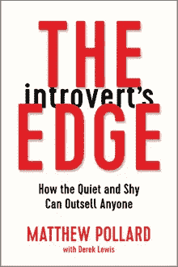

马修·波拉德的《内向者的边缘:安静害羞的人如何胜过任何人》

*亚马逊费率:5.0*

[*GoodReads*](https://www.goodreads.com/book/show/34963434-the-introvert-s-edge?from_search=true)*利率:4.00*

内向的人真的擅长销售吗？这本书的作者马修·波拉德(Matthew Pollard)说是的，并让我们相信，当内向的人意识到如何利用他们天生的优势时，他们尤其优秀。这本书展示了如何找到你的自信，为每种情况做好准备，从一个不依赖于个性的过程中获益，等等。

> "故事是销售的核心。"——马修·波拉德

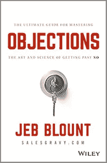

**反对意见:掌握拒绝的艺术和科学的终极指南，作者杰布·布朗特，马克·亨特**

*亚马逊评分:4.8*

[*GoodReads*](https://www.goodreads.com/book/show/40175355-objections?from_search=true) *比率:4，33*

关于如何在任何销售情况下有效处理异议的有用想法。学习抵制的科学和为什么买家抛出异议，获得快速谈判技巧，摆脱你对不的恐惧。

> “《异议》是一部杰作，展示了为什么杰布·布朗特是这个星球上最受欢迎的销售培训师和演讲者之一。这本强有力的书将有助于提高你的信心和成果，因为你学会了如何打破你每天面对的棘手的销售异议！”—《新销售》的作者迈克·温伯格。简化了的

# 管理

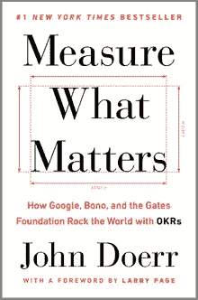

**衡量什么是重要的:谷歌、博诺和盖茨基金会如何用约翰·杜尔登的 OKRs 震撼世界**

*亚马逊比率:4.3*

[*GoodReads*](https://www.goodreads.com/book/show/37559166-measure-what-matters?from_search=true)*rate:4，03*

在这本书中，传奇风险投资家约翰·杜尔登揭示了目标和关键结果(OKRs)的本质。你会发现这个目标设定系统的所有好处，并阅读包括博诺和比尔·盖茨在内的叙述者的案例研究。

> “领导者必须明白为什么以及什么。他们的员工需要的不仅仅是里程碑作为激励。他们渴望了解他们的目标与使命之间的关系。”—约翰·杜尔登

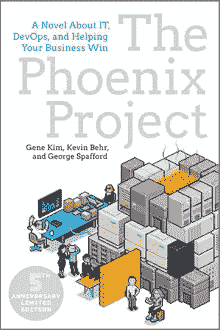

**《凤凰计划:一部关于它的小说，DevOps，帮助你的企业成功》,作者吉恩·金、凯文·贝尔、乔治·斯帕福德**

*亚马逊税率:4.7*

[*GoodReads*](https://www.goodreads.com/book/show/17255186-the-phoenix-project?from_search=true)*率:4，25*

这是一本书的第五次更新和扩展的周年纪念版，彻底颠覆了 IT 世界。Gene Kim、Kevin Behr 和 George Spafford 写了一本伪装成小说的商业书籍，解释了如何改善 IT 组织。

> “将不必要的工作从系统中剔除比将更多的工作放入系统中更重要。”—吉恩·金

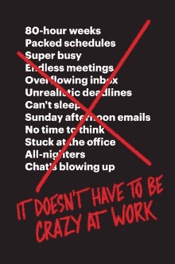

杰森·弗里德，大卫·海涅梅尔·汉森

*亚马逊税率:4.6*

[*GoodReads*](https://www.goodreads.com/book/show/38900866-it-doesn-t-have-to-be-crazy-at-work?from_search=true)*率:3，95*

真的有必要长时间工作才能成功吗？《纽约时报》畅销书的作者拒绝接受这一普遍观点。阅读如何在平静和安宁的基础上建立有效的工作，而不是混乱和压力。

> “公司是时候停止要求员工气喘吁吁地追逐自我设定的越来越高、越来越虚假的目标了。”―杰森·弗里德

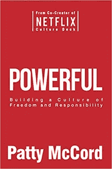

帕蒂·麦考德的《强大:建立自由和责任的文化》

*亚马逊税率:4.5*

[*GoodReads*](https://www.goodreads.com/book/show/36417234-powerful?from_search=true) *速率:4，17*

网飞前首席人才官帕蒂·麦考德写了一本书，这本书将改变你对企业经营方式的看法。她的作品登上了《华盛顿邮报》2018 年 11 本领导力书籍的榜单。了解如何在您的公司创建独特的高绩效文化。

> “优秀的同事、明确的目标和充分理解的可交付成果:这是强大的组合。”—帕蒂·麦考德

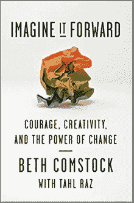

**向前想象:勇气、创造力和变革的力量，作者贝丝·康斯托克，塔尔·拉兹**

*亚马逊比率:4.3*

[*GoodReads*](https://www.goodreads.com/book/show/37811374-imagine-it-forward?from_search=true)*rate:4，07*

著名的创新领袖之一 Beth Comstock 讲述了如何应对我们经常面临的挑战。这本书是写给每一个想找到勇气改变自己的公司和职业，重塑“做事方式”的人。

> “想法很少成为问题。真正阻碍我们前进的是恐惧。这是对旧事物的依恋，对“我们所知道的东西”的依恋”—贝丝·康斯托克

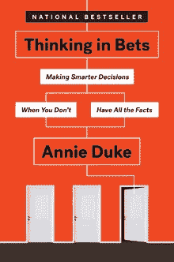

安妮·杜克著

*亚马逊比率:4.2*

[*GoodReads*](https://www.goodreads.com/book/show/35957157-thinking-in-bets?from_search=true)*率:3，86*

如何适应不确定性？如何处理隐藏在视野之外的信息？Annie Duke 分享了一些方便的工具，任何人都可以使用它们来拥抱不确定性，做出更好的决定，并从长远来看变得更加自信。

> “在我们做出的大多数决定中，我们不会与另一个人对赌。更确切地说，我们是在赌所有我们没有选择的未来版本。”—安妮·杜克

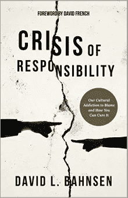

**责任危机:归咎于我们的文化成瘾以及如何治愈它**

*亚马逊评分:4.8*

[*GoodReads*](https://www.goodreads.com/book/show/36334135-crisis-of-responsibility?from_search=true)*率:4，13*

美国顶级商业顾问之一 David L. Bahnsen 认为，走出责任危机是我们在民粹主义新时代生存的唯一途径。他的主要目的是解释我们的命运仍然掌握在我们自己手中。

> “大卫·巴恩斯森写了一篇振奋人心的尖锐文章，批评我们日益普遍的受害文化。他提出了一个令人信服的案例，说明我们仍然有能力，而且绝对有必要自救。你会喜欢这本书，并从中受益。”—《国家评论》主编里奇·劳里

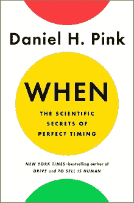

**何时:丹尼尔·H·平克的完美计时的科学秘密**

*亚马逊税率:4.5*

[*GoodReads*](https://www.goodreads.com/book/show/35412097-when?from_search=true) *比率:3，77*

这本《华尔街日报》排名第一的商业畅销书将帮助你在工作、学校和家庭中提高个人素质。时间是我们真正拥有的一切。利用来自心理学、生物学和经济学的多名研究人员，作者就如何更好地管理它给了我们许多想法。

> “精英演员有一些共同点:他们真的很擅长休息”——丹尼尔·H·平克

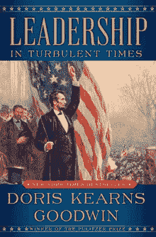

**领导力:动荡时期的多丽丝·肯斯·古德温**

*亚马逊税率:4.7*

[*GoodReads*](https://www.goodreads.com/book/show/38657386-leadership?from_search=true)*rate:4，42*

怎样才能成为一名优秀的领导者？野心从何而来？领导选择我们，我们选择领导吗？普利策奖获奖作家多丽丝·肯斯·古德温对所有这些问题都有答案。这本书对每个有领导抱负的人来说都是一个必不可少的路线图。

> “我越来越觉得，生活中最好的事情就是做一件值得做的事情，然后把它做好。”—多丽丝·肯斯·古德温

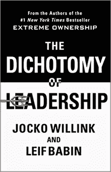

**领导二分法:平衡极端所有权的挑战，领导并赢得胜利，作者乔科·威灵克，叶小开·巴宾**

*亚马逊比率:4.8*

[*GoodReads*](https://www.goodreads.com/book/show/38714388-the-dichotomy-of-leadership?from_search=true)*率:4，42*

另一部关于领导力的有价值的著作成为了全国第一畅销书。作者正在帮助我们找到对每个领导者职位来说最重要的两个因素之间的平衡:他们什么时候应该领导，什么时候应该跟随。找出哪些技能对任何领导者来说都是至关重要的。

> “如果发生错误，有效的领导者不会责怪他人。他们主动承担错误，确定错误所在，制定解决方案来纠正这些错误，并在前进的过程中防止错误再次发生。”—乔科·威林克

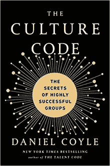

丹尼尔·科伊尔的《文化代码:高度成功团体的秘密》

*亚马逊税率:4.8*

[*GoodReads*](https://www.goodreads.com/book/show/33517721-the-culture-code?from_search=true) *速率:4，38*

你如何在你的公司建立一个积极的环境，或者改变所有需要改进的地方？基于他的经验和众多的例子，丹尼尔·科伊尔提供了具体的策略，将推动企业文化的积极变化，建立信任，并激发合作。

> “首要的工作是互相照顾。我以前并不知道，但现在我知道了。”—丹尼尔·科伊尔

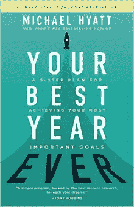

**你有史以来最好的一年:实现你最重要目标的 5 步计划，作者迈克尔·凯悦**

*亚马逊比率:4.8*

[*GoodReads*](https://www.goodreads.com/book/show/35138433-your-best-year-ever?from_search=true)*rate:4，04*

卡住了怎么办？如何将实现目标的可能性提高三倍？这是每个在职业、关系、财务或智力生活中感觉不到任何进步的人的必读之作。让我们拉近现实与梦想的距离。

> "习惯目标的时间关键创造了触发行动的外部线索."迈克尔·凯悦

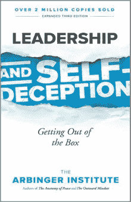

**领导力和自欺欺人:走出盒子，作者:阿尔宾格研究所**

*亚马逊比率:4.6*

[*GoodReads*](https://www.goodreads.com/book/show/180463.Leadership_and_Self_Deception?from_search=true)*率:4，12*

这是全球畅销书的第三版，对组织领导和众多读者的个人生活产生了强大的影响。这本书帮助了 200 多万人避免陷入无休止的自我辩护的“盒子”中，并极大地改善了他们所有的关系。

> “一个封闭的组织充满了专注于自己和被证明是合理的人。相比之下，想象一下，一个所有人都专注于他人和取得成果的组织。”Arbinger 研究所