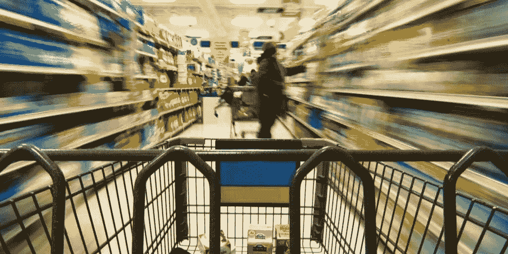

# 节省时间和金钱的五大杂货应用

> 原文：<https://medium.datadriveninvestor.com/the-top-5-grocery-apps-to-save-time-money-8f713f3a69a5?source=collection_archive---------3----------------------->

食品杂货一周比一周贵，这已经不是什么秘密了。在过去的十年里，食品价格每年稳定上涨 5%，而且没有放缓的迹象。对于许多手头拮据的消费者来说，这是一个令人难过的局面。尤其是 4650 万美国人中的一些人，他们依靠食品券来帮助他们的家庭提供基本的食物和生计。这相当于 3.3 亿美国人中有近 5000 万人需要这种关键的帮助。大约 15%以上的人口。对这些人来说，食品价格的任何上涨，以及其他挣扎中的中产阶级或贫困美国人来说，都是坏消息。但是，每年 5%的价格上涨是毁灭性的。食品券和其他帮助人们支付食品费用的福利，如社会保障，或者人们的工资增长不够快，不足以支付不断上涨的食品成本。

然而，有一些好消息来了！在智能手机时代，你可以下载手机上的许多应用程序，帮助你节省一些额外的钱。iTunes 和 Google Play 已经发布了许多应用程序，允许消费者观看短视频或广告，拍照或扫描收据，以获得当周购物清单上“精选”商品的额外折扣。

下面列出了一些可能对你有帮助的应用程序:

# Flipp —传单(iOS、Android)

Flipp 在你的手机上为消费者提供本周最新的广告和销售情况。再也不用处理皱纹纸薄的广告，撕扯，或者当你试图停下来时，里面的页面掉了出来。只要下载这个应用程序，输入你的邮政编码(美国或加拿大)，你就会看到你所在地区的所有销售传单。你可以购物和比较价格，以获得本周所需物品的最佳价格！使用搜索功能找到您需要的确切商品。看看谁卖的最便宜，然后直接去拿！现在只需下载这个应用程序，无需翻页就能看到哪里的销量最好。

# ReeBee-Flyers(iOS、Android、黑莓)

Reebee 类似于 Flipp，但是它也为黑莓平台提供应用程序。它是用一部手机而不是苹果产品制造的，所以对于那些使用 Android 或黑莓的人来说，这个选项似乎更受欢迎。你仍然可以访问所有当地的交易传单和发行量，但遗憾的是，现在还没有搜索功能，所以你必须浏览每一页才能找到你需要的最佳价格。

# 结账 51 —优惠券(iOS、Android)

许多人使用 Checkout 51 省钱，而不是花无数时间剪优惠券。Checkout 51 是为喜欢存钱，但又讨厌剪优惠券的美国人和加拿大人设计的。您只需在智能手机上拍下最近一次购物的收据照片，就可以兑换虚拟优惠券。该应用程序通常包括相同的产品和每周优惠券广告中提供的完全相同的交易。支票通常会在用户达到 20 美元的存款额时邮寄给他们。这个应用程序会记录你买了什么，存了什么，还需要什么。你填写你的地址，以便把支票寄回给你。

# 杂货智商——杂货清单(iOS、Android)

杂货店智商允许你创建一个购物清单，然后找到最适合你的价格，这样你就可以通过优惠券和每周销售来决定在哪里购买你的物品，以节省最多的钱。它允许你与其他可能和你一起购物或为你购物的人分享购物清单，比如家庭成员或与你同住一室的其他人。如果你是一个喜欢用纸和笔购物的人，你也可以把购物清单发送到你的电脑上，打印在纸上带着去购物。它可以让你简化购物过程，节省时间和金钱。

# 所有的食谱(iOS，Android)

AllTheCooks 允许用户通过社交媒体分享食谱，并将所有应用程序放在同一个地方，供其他人分享和尝试。提供了优秀的照片来搭配分享的食谱。此外，它允许你按成分搜索，找到你可以用昨晚的剩菜或冰箱里剩下的东西做什么。

在你的智能手机上安装这些省钱的工具可以让你很容易找到最划算的交易和购买物品的地方。在数字时代到来之前，列一个清单，得到你需要的东西，快速地做，省钱从来没有这么容易。

*最初发表于*[*【wealthvine.com】*](http://wealthvine.com/the-top-5-grocery-apps-to-save-time-money/)*。*