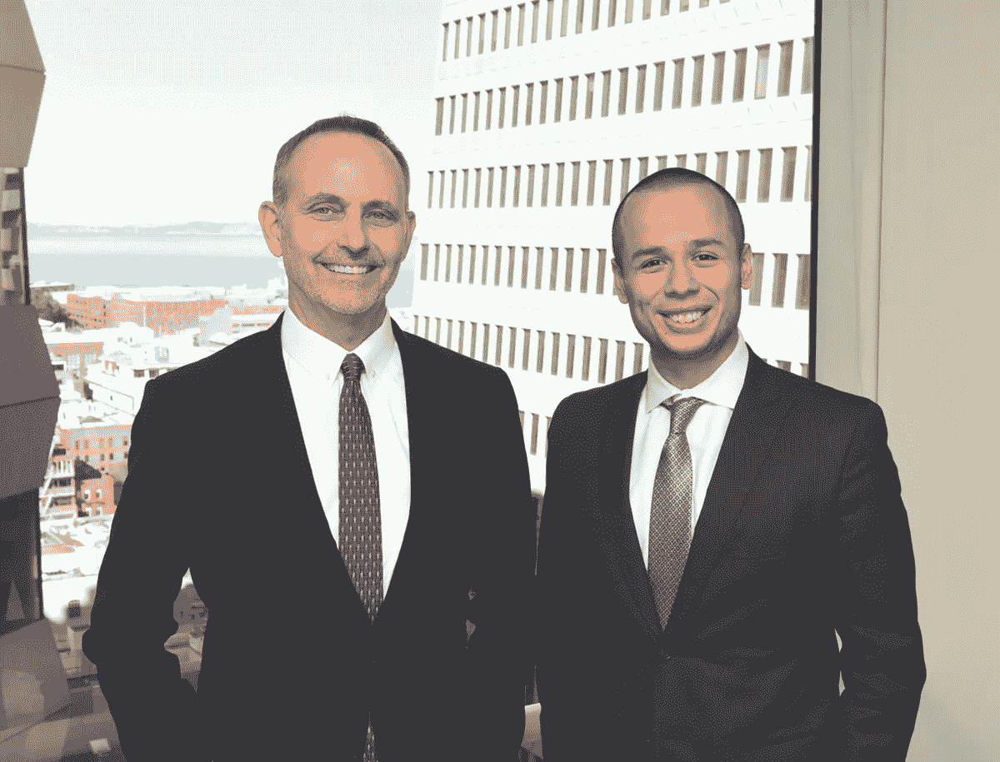
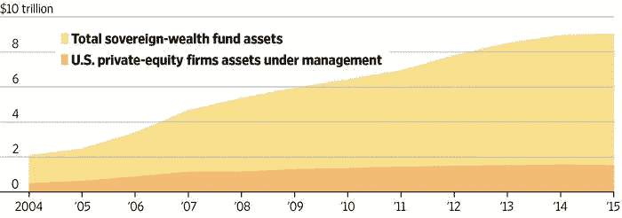

# 今天投资非常规投资领域的五大理由

> 原文：<https://medium.datadriveninvestor.com/the-top-5-reasons-to-invest-in-the-non-conventional-investment-sector-today-c6ea1b25a2ac?source=collection_archive---------24----------------------->

*US Capital Global 董事长兼首席执行官 Jeffrey Sweeney 和 US Capital Global 管理合伙人 Charles Towle 分享了该公司对“投资级”替代产品的独特投资观点。*

*Charles Towle (right) with Jeffrey Sweeney, Chairman and CEO at US Capital Global*

当前经济形势的特点是适度的回报和[增加的市场波动](https://www.bloomberg.com/news/articles/2018-05-02/global-market-volatility-now-a-made-in-the-u-s-a-phenomenon)。在这种情况下，专注于替代产品(尤其是私人信用证券)的最佳实践，有可能以稍少的流动性(而非增加的风险)换取更高的回报。每个投资者都有自己独特的需求，但注册投资顾问(RIA)、家族理财室和个人投资者投资私募股权和私人债务有五个原因。

**1。另类证券的快速增长我们正在见证私人投资资本的爆炸式增长。随着越来越多的资金在私募股权公司和主权财富基金中积累，公司正在利用它们获取资本和推迟上市，有时会给私人投资者而不是公共投资者带来可观的早期投资收益。**

*Sources: The Wall Street Journal, Sovereign Wealth Fund Institute, PitchBook.*

**2。“投资级”替代品的广泛选择**
人们常常有一种误解，认为替代品本身就有风险。这通常是未能区分不同种类的选择的结果。在 US Capital Global，我们区分“投资级”和“非投资级”替代产品。

例如，“投资级”替代产品通常具有以下特征:
表现为具有到期和持续经营属性的基础资产
在其行业中具有强大的竞争地位，具有多元化的基础
作为第二种担保形式的一般金融保险

相比之下，“非投资级”替代品具有以下特征:
天使轮、风险轮或种子轮
没有实质性的市场渗透
监管不确定性和其他重大风险
缺乏覆盖面

重要的是，“替代”并不意味着不受监管的投资；围绕替代品有大量的监管。这只是意味着这些投资不像公共证券那样具有流动性。

**3。降低投资组合的波动性**
很难准确预测股票市场何时会出现回调或调整。当股票市场或债券市场下跌时，你的其他头寸会发生什么变化？如果在出现震荡时，它们都在以同样的方式移动，那么你的投资组合构建就不是很有效。

股票和债券通常占投资者持有量的 70-80%。因此，投资者需要寻找与股票和债券不相关的资产。多年来，机构投资者一直在引领这场转向另类投资的运动。私募股权和私人信贷也允许投资者[识别特殊的、孤立的阿尔法，并试图对冲广泛的市场贝塔](https://www.franklintempleton.com/content-common/market-commentary/en_US/US_Pub_GIO_0918.pdf)。4

**4。提高整体回报的潜力投资级替代产品结合了低波动性和 8-15%的高风险调整净回报。他们通常还提供可分配的已实现收入。尽管非投资级信用替代品有可能获得更高的回报，但它们的风险也高得多。**

另类投资让投资者专注于获得特殊的阿尔法机会，而不仅仅是依赖广泛的市场贝塔。例如，[美国资本全球投资管理公司的私人投资基金](https://www.uscapglobalim.com)通常对有限合伙人的优先回报率至少为每年 8%(净额，而非毛额)。换句话说，在投资者首次获得最低净回报之前，我们不接受任何利润分成。

此外，我们还可以为投资者提供数百只精选的晚期上市前公司的私人交易股票的独家使用权。通过我们注册的经纪交易商网络，我们的投资者可以在一个安全的 SEC 注册的替代交易系统上选择数百种私下交易的股票，该系统提供类似交易所的功能。这些后期二级投资机会通常对机构风险资本之外的投资者关闭。

**5。RIA 可以保留他们对另类资产的顾问地位**
一般来说，RIA 不会从另类资产配置中获得佣金，因为这与他们作为受托人的角色相冲突。然而，越来越多的托管产品变得可用，允许发行人列出和顾问选择备选方案，顾问在投资生命周期内保持其对资产的咨询地位，RIA 对提供此类持续服务收取适当的咨询费。此类费用通常设定为管理资产的一个百分比，可以涵盖退休和非退休资产以及公共和私人替代资产。这解决了 RIA 历史上在替代品方面遇到的一些挑战。

**推荐策略:专注于投资级替代产品**
为了实现最佳结果，我们专注于投资级替代产品，应用以下最佳实践:

1.  将个人可投资资产的 15 %- 20%分配给投资级替代产品，以将 AUM 总回报率每年提高几百个基点。
2.  对保荐人进行仔细的尽职调查，或者只使用经纪交易商承销的证券或基金配售代理。
3.  通过多样化和仔细的监督来降低规模风险。
4.  对于更广泛分散的投资组合风险，使用基金和经验丰富的基金经理。

许多投资者不应该进行单一住宅、单一票据、单一受托人或单一设备的投资。他们投资一只或多只私人投资基金要谨慎得多，就像他们投资共同基金或 ETF 一样。选择私募基金时，你需要评估其主要参与者的技能和经验——基金经理、基金管理人、经纪人、会计师、律师等。这将为 RIA 提供代表其客户做出明智决策所需的数据，不仅是在适合性方面，而且是在发起人风险方面。

**US Capital Global 及其私人投资基金**
[US Capital Global](https://uscapglobal.com)总部位于旧金山，是一家私人金融集团，利用其成功的基金管理和资产融资记录。该集团与其注册投资银行子公司 US Capital Global Securities LLC 合作，为独立投资者和机构投资者提供投资于各种私人投资基金的机会，这些基金旨在满足不同的风险承受能力和投资目标。

**要了解更多信息，请发送电子邮件至帕特里克·斯蒂尔，地址:**[**psteele@uscgs.com**](mailto:psteele@uscgs.com)**或致电+1 415–889–1010。**

Jeffrey Sweeney 和 Charles Towle 是投资专业人士和基金经理，在中小企业的直接贷款和企业融资方面拥有数十年的经验。Jeffrey Sweeney 是 US Capital Global(www.uscapglobal.com)的董事长兼首席执行官，也是 US Capital Global Investment Management，LLC 的创始人，该公司是一家总部位于加利福尼亚州三藩市的创新型基金管理公司。

本篇不构成任何证券的出售要约或购买要约的邀约，并且不可依赖于任何证券的购买或出售。所有的投资都是有风险的，任何投资者都应该首先咨询有能力的专业顾问。部分或全部投资资金可能会损失。

1.Luke Kawa，“全球市场波动现在是一种‘美国制造’现象”，彭博，2018 年 5 月 2 日(2018 年 10 月在线访问)。
2。《私人市场的兴起与崛起》，麦肯锡&公司，2018 年 2 月(2018 年 10 月在线访问)。
3。Maureen Farrell，“美国上市公司的名册正在我们眼前缩小”，华尔街日报，2017 年 1 月 6 日(2018 年 10 月在线访问)。
4。"全球增长还能飞多远？"富兰克林邓普顿投资公司，2018 年第三季度(2018 年 10 月在线访问)。