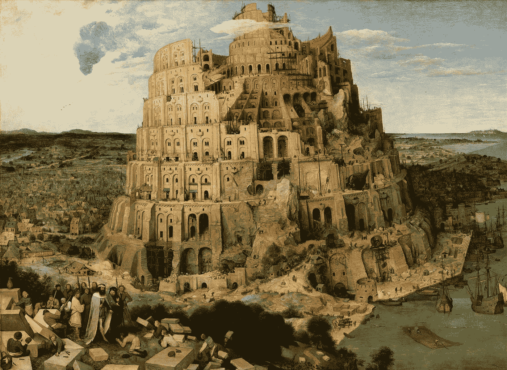
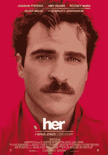

# 巴别塔

> 原文：<https://medium.datadriveninvestor.com/the-tower-of-babel-b6eb7c90b445?source=collection_archive---------25----------------------->

[*The Tower of Babel*](https://en.wikipedia.org/wiki/The_Tower_of_Babel_(Bruegel)) by [Pieter Bruegel the Elder](https://en.wikipedia.org/wiki/Pieter_Bruegel_the_Elder) (1563) Source: Wikipedia

## AI，人类最后的尝试？

> 4 他们说，来吧，我们要建造一座城，一座塔，塔顶通天。让我们扬名立万，免得我们分散在全地上。
> 
> 6 主说，看哪，这百姓本是一样，都是一样的言语。他们已经开始这样做了:现在，他们想要做的事，将没有任何事情被阻止。
> 
> 7 走吧，我们下去，在那里变乱他们的言语，使他们彼此不通。(创世纪 11:4-9)
> 
> 我们人类是高度社会化的。我们喜欢社交。我们已经生活在一个半虚拟的世界里，思维与思维相连。在一个人造的来世里，假设有几个世纪的时间，技术也没有多少改进，那么什么能阻止人们融合成智慧、经验和记忆的结合体，这在生物学上是不可能的呢？(格拉齐亚诺，2013 年)
> 
> 你想创造一个神，你自己的神？这是一个非常好的问题。人类不一直都是这么做的吗？威尔·卡斯特博士，《超越》(2014 年电影)

《圣经》中的第一句话建议:不要挑战神的权威——或者权威的神！总是一个很好的故事主题，由约翰尼·德普在 2014 年的电影《超越》中饰演威尔·卡斯特博士。

圣经文本揭示了另一个问题，成功的集体工作需要良好的沟通。只有人们相互理解，伟大的作品才能实现，包括挑战众神。

人工智能是最后的巴别塔吗？

普林斯顿大学神经科学教授 Michael Graziano(2013)认为，有一天我们将能够上传一份组成我们自己的信息到一个复杂的计算机系统中。卡斯特博士很好地证明了这一点。

Source: [Wikipedia](https://en.wikipedia.org/wiki/File:Her2013Poster.jpg)

到那时，我们也许能够解散我们的个性，并与一个被格拉齐亚诺称为“超人类”的超我融合，一种超意识，将世界上所有的智慧结合在一个实体中。你可能会发现自己在一个虚拟环境中与自己和多个其他实体聊天，这是一种多重人格综合征(或称障碍？)在虚拟现实中重现，新的虚拟巴别塔。科幻小说中的一个典型例子，请看斯派克·琼斯的电影《她》(2013 年)。这个想法让人想起[基特勒的观点](https://medium.com/@gert.gast/driving-the-spirit-out-of-the-humanities-ff93c3c3b762?source=friends_link&sk=b1cbefc0fa9c0687ca58d3228a381db2)，人类有一天会变得多余，成为机器的摇篮，而机器会接管并摆脱我们。

在接受《明镜》杂志采访时，基特勒曾经说过，计算机并不是真正为我们制造的，但是*“…特别是当前的智能机器，自从图灵在 1936 年构想出它们以来，与其说是为我们人类制造的，不如说我们的制造过于粗糙，但是它们的本性，本性中被照亮的认知部分正在与自身耦合回来”* (Onrop，2011)。他将机器拟人化为自然界中“照亮的”和“认知的”部分，它按照自己的利益行事，并将我们“用作”工具，这些工具可以构想出更小、更优雅、更快的机器，反过来，这些机器能够在一个反馈循环中更深入地渗透到“黑暗”物质中，最终淘汰其创造者，因为它不仅能够学习以软件方式改进自己，还能够控制有朝一日将完全自动化运行的硬件装配线。

如果这一切听起来太过神秘，确实如此。正如基特勒在这次采访中进一步阐述的那样，黑格尔精神以代码和硅鹅卵石的形式用数学方式召唤和展现出来。计算机网络可能为人类的利益服务，但不是必须的。计算机主要是相互对话，而不是与人类对话。基特勒说，一个虚拟的精神世界在这些网络中表现出来，“黑格尔称之为精神生活”。

这听起来像是一种新的二元论，精神和肉体的分离，精神和肉体完全不同。17 世纪的哲学家勒内·笛卡尔称之为，思考的东西，延伸的东西，需要空间和身体。

在许多文化中，人类成为其造物的受害者的想法是众所周知的。这个主题被讲故事的人提起，并在小说和电影中多次重复，例如[玛丽·雪莱的《弗兰肯斯坦》](https://en.wikipedia.org/wiki/Frankenstein)，但也出现在更现代的电影作品中，如《终结者》系列或《黑客帝国》三部曲。

基特勒在托马斯·品钦的二战小说《万有引力的彩虹》中找到了他的顿悟。特别是引用:

> 他的战争从来都不是政治性的，政治只是一场戏，只是为了分散人们的注意力。。。私下里，它被技术的需求所支配。。。由于人类和技术之间的阴谋，由于某种需要能量的东西——战争爆发，哭喊着，“让金钱见鬼去吧，这关系到[插入国家名称]的生死存亡”，但意思是，最有可能的是，黎明即将来临，我需要我的夜血，我的资金，资金，啊，更多，更多。。。。真正的危机是分配和优先权的危机，不是公司之间的危机——这只是假装的——而是不同技术、塑料、电子、飞机之间的危机，以及只有统治精英才能理解的他们的需求。(品钦，1995 年)

唉，品钦，与基特勒相反，并没有免除人的因素。相反，他警告我们关于人/机器的阴谋，最重要的是统治精英的阴谋，这是像基特勒这样的保守思想家避免提及的。

目前，我们喜欢认为，随着科学和技术的进步，智能机器变得越来越智能，线性甚至指数级。想到[摩尔定律](https://en.wikipedia.org/wiki/Moore%27s_law)。我们甚至可能认为，这些被无助的分析师大军包围的机器，由于所收集数据的庞大数量和复杂性，是无法理解的。因此，我们必须将决策过程留给机器本身，例如，如何决定穆斯林土地上的特定人群是恐怖团伙还是婚礼派对。我们把自己描绘得越愚蠢，我们就越能责怪机器。毕竟，难道不是战争机器和应征士兵导致了一战中数百万人的死亡，而不是机械化的(商品化的)将军或金融寡头从中获利吗？

战争中人类生命的丧失是悲惨的，这也是对人类智慧和劳动成果的浪费。制造出来就是为了毁灭的战争机器是对人类创造力、知识和资源的极大浪费。例如，一战仅在德国就摧毁了近 380 亿美元的价值。为了这个协议值得吗？大英帝国能在此后更有效地获得殖民地，并继续从中攫取巨额财富，而不必再次担心德国的竞争吗？精英们和他们的政府可能会这样计算。但是他们错了。21 年后，第二次世界大战爆发了，带来了更多的浪费、更多的瓦砾和更多的苦难。

指责人类的愚蠢或道德低劣并不能解释人类的群体行为。用基特勒的术语来说，人类社会是建立在嵌入历史的[话语网络之上的复杂系统。用麦克卢汉的话来说，我们的工具是我们自身的](https://www.youtube.com/watch?v=EHM8B9WrRJM)[延伸](https://en.wikipedia.org/wiki/Understanding_Media)，还是如[基特勒所见](https://www.youtube.com/watch?v=P7lvy3qjg-k)我们是机器的延伸，这也许最后是无关紧要的，但仍然值得思考。

**参考文献**

阿米蒂奇，J. (2006 年)。从话语网络到文化数学:弗里德里希. a .基特勒访谈。理论、文化与社会 23(7–8):17–38。从 http://tcs.sagepub.com/content/23/7-8/17[取回](http://tcs.sagepub.com/content/23/7-8/17)

卡罗尔 J. (2015 年 12 月 16 日)。弗里德里希·基特勒简介【视频文件】。从[https://www.youtube.com/watch?v=EHM8B9WrRJM](https://www.youtube.com/watch?v=EHM8B9WrRJM)取回

科拉马蒂(2013 年 1 月 16 日)。Friedrich Kittler 初级读本—光学媒体[视频文件]。从 https://www.youtube.com/watch?v=P7lvy3qjg-k[取回](https://www.youtube.com/watch?v=P7lvy3qjg-k)

格拉齐亚诺，M. (2013 年，2013 年 12 月)。无尽的乐趣。问题不在于我们是否能把我们的大脑上传到电脑上，而在于当我们做到的时候，我们会变成什么样。永旺杂志。检索自[http://aeon . co/magazine/being-human/virtual-affairs-will-transform-humanity/](http://aeon.co/magazine/being-human/virtual-afterlives-will-transform-humanity/)

Onrop，C. (2011 年 4 月 25 日)。TV docu Spiegel unbrechenbarkeit 1/3[视频文件]。从 http://www.youtube.com/watch?v=AavTap5FgSQ[取回](http://www.youtube.com/watch?v=AavTap5FgSQ)

t .品钦(1995 年)。重力的彩虹。纽约:企鹅图书公司。

温伯格(2012 年)。结构的冷模型:弗里德里希& # 183；基特勒与克里斯托弗& # 183；温伯格的访谈。文化政治，8，3–375-384。DOI:10.1215/17432197–1722109

温思罗普-杨(2011 年)。基特勒和媒体。英国剑桥:政治出版社。