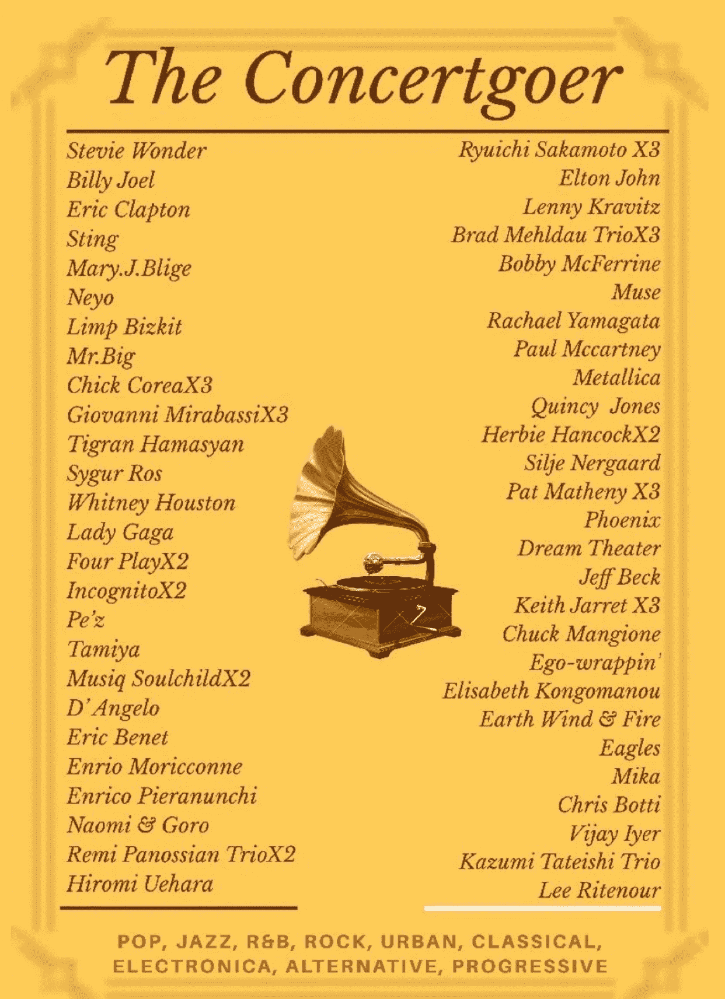

# 自我奖励消费习惯的陷阱

> 原文：<https://medium.datadriveninvestor.com/the-trap-of-self-rewarding-spending-habits-23c76cefb318?source=collection_archive---------10----------------------->

The List of Concerts I Went, from 2011 to 2015

以前每个月赚的钱都花光了。自从上了大学，我再也没有向父母要过零花钱或者学费。虽然在西方国家，获得学生贷款，毕业后找到工作就偿还贷款是相当自然的事情，但在韩国出生和长大的人，不向父母寻求经济帮助的习惯相当罕见。

不想寻求帮助，在校期间我努力学习。我的父母相当开明，但当谈到通勤，没有例外，也没有妥协。因为我的大学位于首尔南部，而我的父母住在北郊省，往返学校需要 6 个小时，所以 6 年来我每天花 6 个小时通勤。在上大学之前，我可以学习和选择任何我想要的东西，因此，我一直要求和说服父母在大学附近租房子，但他们从来不允许我一个人住，甚至不允许我住宿舍。

我的生活是一部杂耍史。这只是一部分。我不想放弃任何东西。大一后不久，我加入了大学广播俱乐部。上学单程至少要两个半小时，我不得不在早上至少 5:30 左右离开家。

我到达学校不晚于上午 8 点。我爸爸偶尔会载我一程，但不经常。我不得不坐一个小时的公共汽车，然后换乘又花了一个半小时的地铁。

太痛苦了。很有可能，极端通勤。到学校后，我接受了 6 个月的从早上到下午的培训，然后受训者现在可以得到现场角落或部分新闻报道，然后，严厉的反馈随之而来。但我只是喜欢成为广播系统的一员。连续 3 年，我不得不在早上 5 点醒来，一遍又一遍地做同样的事情。

与此同时，我在学校上课，并寻找任何方法来赚取学费或津贴。这是一个老掉牙的故事，几乎没有人在大学期间没有艰难地做过一些兼职工作，并同时兼顾许多事情。据描述，这个例子是一个生活在韩国的大学生的一个方面。我没有一概而论，但韩国相当大一部分大学生仍然依赖父母的收入。我不会说大多数学生依赖他们的父母。有相当多的学生根本不依靠他们的父母。但环顾我当时认识的人，我是唯一一个每天通勤 6 小时，每天像松鼠一样跑来跑去做许多兼职工作的人。

在经历了许多不同种类的兼职杂务后，我发现翻译和口译是我的兼职工作。他们相当体面。从翻译论文、期刊或论文开始，我开始翻译技术说明书、公司宣传手册甚至网页。我可以得到相当多的机会翻译随机的英国或美国电视连续剧，但在业余水平。如果没有文字记录，翻译视频是一件痛苦的事，但我可以学习如何使用字幕编辑器和其他大杂烩工具。与此同时，我可以有机会在时装秀或家庭购物频道的现场秀中翻译模特。听起来，我的实际生活就像马戏团里的杂耍。在完成一些大学广播系统的工作后，我参加了一个课程，去学校外面的工作室解释模型，甚至一个小时的路程，然后回到学校参加剩余的课程。例行的事情都做完了，很容易就变成了晚上 9 点到 10 点。我凌晨 1 点回到家，仅仅睡了不到 3 到 4 个小时，我又做了同样的事情。那时候的通勤没有任何意义，但我不得不稍微做了 5 年多，直到我大学毕业。

同时，我获得了一些奖学金。我认为把钱花在学校上是荒谬的。我努力学习，前四个学期的平均绩点还不错。我可以获得两年的全额或半额奖学金。然后我就成了学院广播系统的负责人。负责大学新闻团体的负责人，比如报纸编辑和网络广播俱乐部可以获得一年的全额学费。因此，三年来我没有在大学里花任何钱。

随着年龄的增长，我的体力和激情都被冲淡了。此外，在我高三的时候，我一边做全职英语教师，一边做全职学校工作。结果是一场灾难，一份糟糕的成绩单。高三的 GPA 蚕食了我整整四年的 GPA。看到从前的 4.3 下降到 3.68 是很可怕的，但我不会后悔。我可以赚到我的学费，获得一些经验，并在大学毕业后找到一条出路。

我尝试了很多我感兴趣的事情。起初，我想成为一名营销人员，所以我尝试在波音公司实习。尽管时间很短，但指导我实习的导师和主管给了我很多深刻的见解，让我明白了为什么我应该避免做营销人员。我主修英语，她告诉我，我会成为一个更适合在教育领域。她的观点很有说服力。在营销领域，通常需要大量的时间和努力才能看到结果，而作为新人加入一个团队将会经历至少 5 年的痛苦。她问我们谁会幸福地忍受五到六年看不到自我成长的希望。我接受了她的建议，似乎这是当时正确的决定。然而，还有一位实习生在从事同样的领域后成为了一家知名营销公司的高级经理。谁知道呢，每个人都有不同的契合度。在做了两年英语教师后，我在一个非政府组织实习，该组织给了我在瑞士日内瓦的联合国人权咨询委员会实习的机会。年轻的实习生看到了在国际组织工作的酸甜苦辣，包括我自己。实习结束后来回瑞士和法国旅行了一段时间才回到韩国。

回到首尔后，我决定继续教书。我是一个工作狂，没有人要求我这样做，但大多数韩国人仍然这样工作。

我一周工作 6 天，连续讲课 6 到 9 个小时。你可能会认为这是不人道和荒谬的，是的，但在那个时候，许多韩国人都是这样工作的。

从大学时代就像工作狂一样工作了 8 年多之后，我开始以自我奖励的名义花掉每个月的所有收入。

我认为这是我应得的。我过去常常去购物，买一些我甚至没有削减价格标签的不必要的物品，并把它们放在壁橱里多年，在大型书店漫游，购买由于时间不够而不会读完的书籍，买几瓶酒，米酒和威士忌，几乎每天下班后在我的房间里啜饮。

然后，我开始在音乐会上花钱。我热爱音乐，我喜欢所有类型的音乐活动。制作作品，演奏乐器，唱歌。这就像我遗失已久的梦想，从未实现。我有机会在一个小乐队里作为业余爵士歌手演奏音乐，但我不得不放弃唱歌，因为我的声音变得暴躁，并患有声带小结和息肉。

去听音乐会就像是对不能享受上述音乐活动的补偿。我总结了一下我在两三年里花了多少钱，仅仅是为了去听那段时间里我渴望的所有音乐会。我去了 70 多场音乐会，我只列出了外国音乐家的名单。包括韩国音乐家在内，这个时间将会翻倍。我最终仅买票就花了 12000 多美元。一天，出于纯粹的好奇，我在一个网站上谷歌了音乐会数据库，记录了音乐家的名字和我去过的音乐会的数量。

令我惊讶的是，我有一种复杂的感觉。如果我想要一件商品，即使卖完了，我也会找到存货，等上几个星期，然后去买一件。和演唱会一样。如果我想见音乐家，我必须在那里。到目前为止，我不会后悔在音乐会上花了很多钱。那段时间疯狂工作的时候，它给了我发泄的机会，也给了我一种舒适感。

与此同时，我不得不在急诊室花很多钱。由于繁重的工作，我的免疫系统和呼吸系统都不正常，我偶尔会有炎症。扁桃体炎、支气管炎、血液败血症、严重的胃痉挛，甚至肠痉挛。我会说我的肠痉挛比生孩子还糟糕。现在我是一个四岁小孩的妈妈，我敢这样比较痛苦。当我严重肠痉挛中风时，我汗流浃背，不能走路也不能爬行，设法自己拨打了 911，被送到医院的急诊室，住院治疗，直到急性肠痉挛好转几天。可笑的是，当时我的绰号是二小姐。

工作太努力，在不必要的事情上花太多钱的结果，几年后刺痛了我的灵魂。我会说我既空虚又文化丰富。我尽可能多地去听音乐会和看展览。与此同时，我的银行账户和我的心灵都是空的。

15 年过去了。在过去的 10 年里，我做过英语教师(主要教授托福)、ESL 教师培训师、翻译、英语会议主持人、广播节目主持人和在线讲师。我会过度使用我的声音和声带。我的声音沙哑了。我有声带损伤和息肉。我再也不能讲课了。突然之间，我得到了一个在越南教育公司工作的机会。

我人生中第一次以异乡人的身份工作和生活，在越南的生活改变了我对金钱的看法。在那之前，没有什么能改变我的消费习惯。

结婚并成为一个母亲并没有改变我的方式，一段时间后，我试图证明我在其他方面花钱的行为是正当的。结婚后，我有意避免给自己买任何东西。我已经有一个装满衣服和物品的房间，我甚至还没有试过，因此，不需要更多的单品。然后，我发现自己向家人证明了自己的消费习惯。我喜欢给予，喜欢看到人们感到快乐。我开始在我的孩子身上花钱。与我一个人住的时候相比，我减少了两倍或三倍以上的开销，但我知道我在不必要的东西上花了太多的钱。太多的食品杂货，婴儿用品，以及任何我叫它的东西。

然后我来到了越南。在韩国，我一顿饭至少要花 7 美元。偶尔，我会轻易为一顿饭花费 20 多美元。在越南，当地餐馆或小吃摊的一份服务或一餐大约是 1 到 3 美元。即使在一家不错的餐馆，一份也不到 10 美元。我原以为我会花得更少，但在越南的生活改变了我对花钱的总体看法。

为了自我奖励的名义，我曾经一次花掉一大笔钱，甚至认为这应该是一件值得骄傲的事情，因为这是我挣的钱，是我努力的结果。我根本没有依赖过男人，也没有依赖过父母。然后空虚感再也没有一扫而空。我想我在韩国赚了很多钱，那么这些钱都去哪里了？以流通的名义，是在世界各地飘来飘去，某一天又回到我身边？我会说不。我是在否认这样一个事实，即我习惯于为不应该的事情辩护。我只是浪费了我努力的成果，什么都没剩下。我不得不承认我是个粗心的人，我家里没有人像我一样。我的父亲、母亲，甚至姐姐都是那种在每月预算中计划、储蓄和花钱的人。我甚至从未尝试过在预算中使用金钱，即使我的父母曾教导我并把我作为榜样。我每个月都给一些组织捐款，在银行存一点钱买公寓，除此之外，这是努力工作的负面重复，拿到薪水，由于我的消费习惯，钱自动从账户中取出，周而复始。

看到一顿饭花不到 2 美元的事实给了我一种文化冲击。然后我开始认真思考我花钱的方式。自我奖励没有给我任何满足感，反而给了我更多的空虚感。辩解给了我更多的困惑。我终于发现过去 15 年我都错了。

二十多岁的时候，我每月只花 2000 到 3000 美元在食品杂货和外出就餐上。我证明我应该这样做。我曾经花了 12，000 美元购买音乐会门票。我也证明了我需要以自我满足的名义去看它们。

自我奖励的风险在于，无论你发现自己喜欢做什么，它都很容易让你上瘾，潜移默化地，逐渐地，你不会后悔你做过的任何事情，看着自己不断地通过找借口来证明自己的消费习惯。“是啊，我努力了，为什么不给自己买瓶酒呢。”，“嗯，我一直渴望看到比利·周。$300?值了。机会不会再来。比利·周已经老了，我不知道什么时候能在首尔再见到他。”等等等等。

在经历了 15 年麻木不仁的愚蠢之后，我开始自我反省，而不是自我奖励。我以为我已经变了。部分是真的，我比结婚前花的钱少多了，比我 20 多岁时花的钱少的事实总是给我错误的理由，我不应该遵循。

这两个月，是我成为大学生以来花钱最少的一次。我想我每月吃饭花了不到 200 美元。通勤和一日两餐每天花费不到 10 美元。有时会稍微多一点，但平均来说，一周的餐费预算不超过 40 美元。即使去杂货店购物，即使我的购物车装满了，每次也很少超过 30 美元。我从来不知道我会这样看待这件事，但它不仅改变了我错误的看法，也改变了我的生活方式。

我在越南根本不用信用卡。我用现金提取每周预算，然后从那里花钱。如果我必须通过网上购物或定期订购送货(因为我很擅长这样做)为韩国的家人购买一些物品，我会使用家庭信用卡。

我曾认为，自我反省我是多么的麻木不仁已经太晚了。然而，开始总比拖延好。我想我有一个清单，可以在实现后开始这样的事情。

谁知道呢，我可以在我胖乎乎的腹肌上练出六块腹肌，节省饭钱的结果可以变成蝴蝶效应，让我养成为健康锻炼的习惯。如果你仍然在自我奖励的消费习惯的陷阱里游泳，请离开它。它没有承诺幸福或繁荣。至少，我感到庆幸的是，我没有把后半生浪费在花钱买无关紧要的物品或铺张浪费上。适可而止。