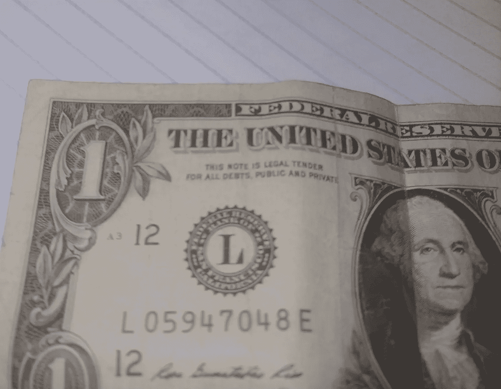
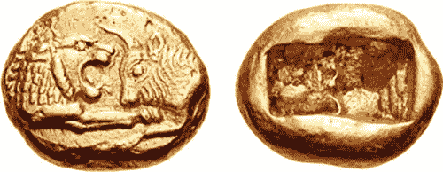

# 我们世界的真正货币是信仰

> 原文：<https://medium.datadriveninvestor.com/the-true-currency-of-our-world-is-faith-5058c8cad921?source=collection_archive---------4----------------------->

## 信念和信任让我们的现代世界得以延续

Photo by [Sabine Peters](https://unsplash.com/@kredit?utm_source=medium&utm_medium=referral) on [Unsplash](https://unsplash.com?utm_source=medium&utm_medium=referral)

> 带着我们的世界建立在其上的希望，他们完全脱离了现实，他们否认月亮是斯蒂尔顿；他们甚至否认她是荷兰人；
> 他们否认愿望是马；他们否认猪有翅膀；
> 所以我们崇拜许诺这些美好事物的市场之神。
> 
> 在石炭纪，我们被许诺为所有人带来富足，
> 通过抢劫被选中的彼得来支付集体的保罗；
> 但是，尽管我们有很多钱，但我们的钱买不到任何东西，
> 字帖标题上的神说:*“如果你不工作，你就会死。”*

 [## 如何创建加密货币[逐步指南] |数据驱动的投资者

### 加密货币是如何工作的？如何制作加密货币？如何创建自己的加密货币？所有这些问题…

www.datadriveninvestor.com](https://www.datadriveninvestor.com/2019/03/25/how-to-create-your-own-cryptocurrency-and-make-your-business-ready-for-the-future/) 

> 然后，市场的神们大跌眼镜，他们油嘴滑舌的巫师们退出了
> ，最卑鄙的人的心变得谦卑，开始相信发光的不一定都是金子，二加二等于四
> 是真的，字帖标题的神们一瘸一拐地走过来再解释一遍。
> 
> ——“[字帖标题的神](http://www.kiplingsociety.co.uk/poems_copybook.htm)”，拉迪亚德·吉卜林

今天一个人能相信什么？在以前，如果问了这个问题，答案可能会很快给出。

大约 12，000 年前建造了 gobekli Tepe 的前现代牧民们，很可能已经有了答案。

基于亚里士多德或其他伟大哲学家的教导，古希腊人在他们宏伟的庙宇中很可能会很快恢复“美德”。

古代中国人可能会给你孔子或老子的诗句。

即使是文艺复兴时期最贫穷的农民也能找到这个问题的答案。也许他们会带你去一个当时美丽的大教堂，给你一个与上帝有关的答案。也许他们会给你看他们播种的田地，给你一个关于季节变化的答案。

然而，今天问这个问题，我敢肯定你可能会得到一个茫然的眼神。一个笨拙的答案可能会在一段时间后出现，但也许你根本得不到答案。

作为一个文明，我们拥有所有的技术和丰富的资源，这样一个基本的问题似乎更难回答。我们的眼睛经常聚焦在物质上，而不是无形的东西上。

这整个练习中最奇怪的部分是我们的现代世界是建立在信仰和信念之上的。每一天你都在参与难以置信的信任练习。无论你是这个星球上最大的无神论者，还是最虔诚的信徒，你都会进行信仰的练习。

在很大程度上，我确信你甚至没有意识到你正在参与其中。这种仪式在我们当前的世界已经根深蒂固，我们甚至没有注意到它的形状和颜色。

# 今天的信仰仪式

Photo by [NeONBRAND](https://unsplash.com/@neonbrand?utm_source=medium&utm_medium=referral) on [Unsplash](https://unsplash.com?utm_source=medium&utm_medium=referral)

你今天买了什么？你在上班的路上有没有在街角的商店停下来买杯咖啡？你睡觉前付帐了吗？你在上班的路上付过路费了吗？也许你买了那本你渴望阅读或聆听的书？

我敢肯定你一整天都在花钱。一天不花某种货币真的很难过。在你一天中的某个时刻，你从钱包里拿出一张纸给了别人。作为回报，这个人给了你不同程度的价值。

也许你甚至懒得抽出一张纸。你可能会给他们一张塑料卡，让他们在机器上刷一下。这个供应商选择相信他们会得到一笔与他们给你的产品价值相当的钱。

这一切发生得很顺利，没有一点差错。你不需要给这个卖家一件你的珠宝，然后和他们交换物品。你不需要画他们商店的正面来换取食物或衣服。

最有可能的是，小贩并没有咬入你递给他们的硬币，以确定这真的是你声称的金属。我怀疑他们在他们的位置有一个秤来称重硬币，以确保你没有刮掉材料。

这整个交换的场景是一个完全的信仰行为。你在购买一管牙膏时表现出了难以置信的信心。为什么

*   你手中的货币是真实的。
*   你相信你用货币交易的物品就是它声称的那样。你不会把牙膏的盖子拿掉，挤出一点来，以确保它没有和水混合。
*   接受你的信用卡的供应商相信钱会被转移到他们的银行账户。
*   卖主相信他们的银行会保留他们的钱，而不会从他们的账户中扣钱。
*   卖主和你都相信你钱包和收银机里的纸是有价值的。

你可能从未将牙膏与信仰联系在一起，但也许你应该这样做。让我们建立对牙膏的信心，并把它延伸得更远一点。

这个世界可能在很多方面看起来很冷。看起来似乎没有什么值得相信的。然而，你和这个星球上的每个人每天都表现出不可思议的信念和信仰。无论你走到哪里，信心的证据总是围绕着你。

# 全球信仰行动

George On My Notebook — Picture By Author

上图是我们的朋友乔治·华盛顿在一美元上。尽管是个老前辈，他在世界上还是很受认可的。无论你来自世界哪个地区，你都有自己版本的类似纸币。这是世界各地的共同主题，并不真正值得注意。

**除了确实值得注意的。"这张纸币是所有公共和私人债务的法定货币"。**

我们相互传递的纸张和通过互联网进入银行账户的 1 和 0 真的一文不值。这种除了信仰之外没有任何支撑的货币可以用来换取我们友好的牙膏或者任何你当时需要的物品。

整个世界都欣然接受这种信仰行为。全球贸易的开始仅仅是由一文不值的纸支撑的。然而，在全球范围内，每一个参与商业活动的人都会眨眨眼，点点头，接受这份文件。

既然我们都相信它有价值，它就有价值，而商业也在一层简单的信念基础上继续发展。

Lydian Coin From 561–546 BC — Picture By [Classical Numismatic Group, Inc.](https://www.cngcoins.com/) Via [Wikipedia Creative Commons](https://commons.wikimedia.org/wiki/File:Kroisos_BMC_31.jpg)

上面的金币是吕底亚国王克罗伊斯创造的第一批硬币之一。诸如此类的硬币在各个时代都很常见。罗马人创造了金黄色葡萄球菌。希腊人有德拉克马。后来西班牙人创造了强尼·德普和加勒比海盗会为之疯狂的第八部。

这些硬币由珍贵的材料制成，本身就有价值。上图中的美元可以在最近的 1971 年兑换成黄金。

所以，今天世界上真正的货币是信仰。这也是一项相对较新的事业。今天的黄金和白银经常被贬为装饰品。在大多数时代，它们可能是财富和贸易方式的真正储藏地。

你每天都参与信仰的行动，世界也与你一起参与。每当你打开钱包或从银行网站上支付账单时，另一种信任行为就开始了。当你从工作中领取薪水时，也要有信心。

现代社会似乎由更少的信仰和信念组成，但你的钱包和我们的整个经济体系讲述了一个完全不同的故事。

今天你能相信什么？对于这个问题，我们现代人可能没有一个快速的答案，但是我们一天几次做出反应，世界也一样。

*感谢你阅读我的漫谈。如果你喜欢你读过的东西，请分享。*