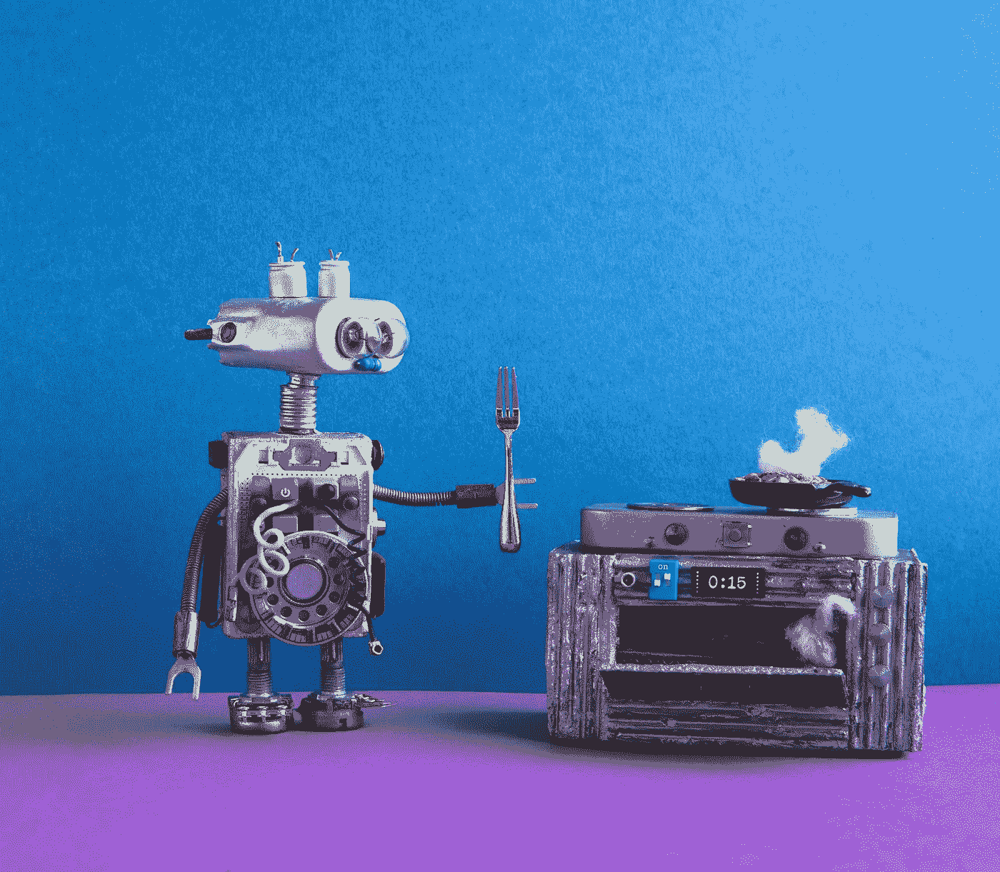
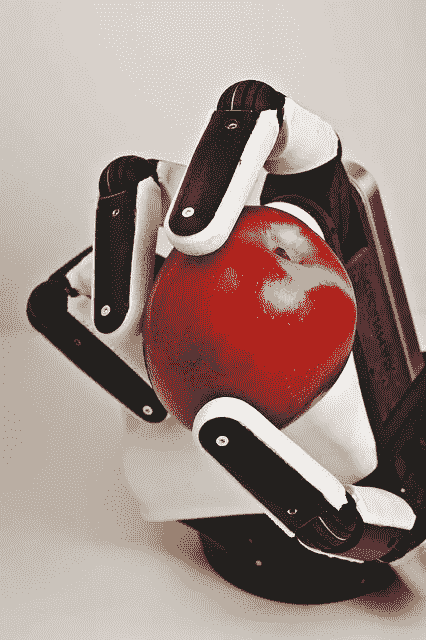

# 关于 AI 的真相

> 原文：<https://medium.datadriveninvestor.com/the-truth-about-ai-dbacece23e83?source=collection_archive---------27----------------------->

31 年后，世界人口将达到 90 亿。T2 有超过 200，000 种可食用的植物物种，但是大多数人通常只食用其中的 200 种。最重要的是，世界目前正面临着 6000 亿美元的营养获取问题，部分原因是近年来，我们的产品测试的营养成分比几十年前少了 50 %[。我们做食物的方式需要改变，而人工智能就是解决方案。](https://www.sciencedirect.com/science/article/pii/S0889157516302113)

当普通人想到“人工智能”时，脑海中经常会出现某些主题或话题。机器人索菲亚。亚历克斯·嘉兰 2014 年票房创下前玛奇纳之最。机器人抢走了我们的工作，害怕有一天它们会接管世界。这种观点不仅狭隘，而且未能承认人工智能能够并且已经为全世界人民带来的所有好处——尤其是在食品领域。事实是，当人工智能被用来做好事时，它并不可怕，也完全不是你想象的那样。最重要的是，人工智能的应用远远超出了现实、文学和电影机器人的范围。

坦白说，人工智能是我们旅程食品公司的一个私人话题。有充分的理由…我们的新(出道！)产品，**旅咬**，不仅美味而且营养丰富，取材于独特的[生物多样性的成分](http://bit.ly/JourneyFoodsBaobob)，没有人工智能是不可能的。

事实上，我们的科学家和开发人员团队创建了 *JourneyAI，*一个由人工智能和机器学习推动的生活智能期刊，以确保我们推出的每一个产品都尽可能健康、可持续和独特的生物多样性。

*但这意味着什么呢？*

我们已经将这个人工智能构建成一个领先的营养便利数据库，用于研究和产品开发，确保全球成分和生物活性化合物的最佳交付。基本上，我们的食物配方——像我们的能量补充剂[芒果+辣椒](http://bit.ly/MangoCayenneJourneyBites)和我们的助消化剂[草莓+奇亚](http://bit.ly/StrawberryChiaJourneyBites)——是由*技师*鉴定、开发和实践的。它使我们能够创造出 **100%植物来源的**微型食品，具有新鲜的质地和生动的味道，增加了营养成分，延长了保质期。

Strawberry + Chia Journey Bites from Journey Foods

除了为个人消费者所做的之外，它还允许我们提高创新的水平和速度，以便能够为全球大量人口定制产品。人工智能对旅行食品的影响不同于大多数人对它的看法。对我们来说，这是关于提供更多营养、*更好*和解决问题。

Journey Foods 看到 AI 和食物是齐头并进的。美国农民、经销商、杂货商和零售商似乎同意我们的观点。

农业是出了名的不稳定行业。克雷格·甘斯勒想要改变这种状况，于是他创建了 FARMWAVE。该应用程序使用人工智能来收集和分析农场的数据。然后，它允许农民识别可能破坏他们作物产量的昆虫、杂草和植物病原体。更少毁坏的庄稼意味着经常挣扎着维持生计的农民有更多的利润，也意味着像你这样的人有更多新鲜的食物。今天，人工智能和机器学习为臭名昭著的不确定农业带来了更大程度的确定性的机会。

[healthy Wave](https://www.wholesomewave.org/)的头脑已经推出了 healthy Rx，它也利用了 AI。不，这不是橙色塑料瓶里的处方。它实际上是一个支付平台，使用机器学习从你的超市会员卡中收集数据。然后，它分析这些数据，生成健康食品的优惠券，向你推荐饮食，并向其消费者用户提供激励。这对它的主要用户之一尤为重要:医疗补助患者。

**人工智能正在改变世界的饮食方式，但它不会改变任何地方。**

从斯坦福大学的首届[人工智能指数](https://www.forbes.com/sites/louiscolumbus/2018/01/12/10-charts-that-will-change-your-perspective-on-artificial-intelligences-growth/#4381c0224758)中的信息，我们知道，自 2013 年以来，需要人工智能技能的工作份额增长了 4.5 倍，预计 2025 年企业应用人工智能的全球收入将达到 312 亿美元。但是，随着人工智能的发展，需要有伦理和以消费者为中心的思想来指导这种发展。

需要围绕基于人工智能的应用程序和产品的开发及其预期用途进行非常透明的对话。在食品领域，人工智能的应用应该像我们在 Journey Foods 所做的那样，专注于简明的营养和功能健康开发。人工智能的目的不应该只是简化流程或让某人赚很多钱，它应该让消费者生活得更好。这是我们关心的问题，我们希望在未来的几年里，它能成为开发人员关注的焦点。