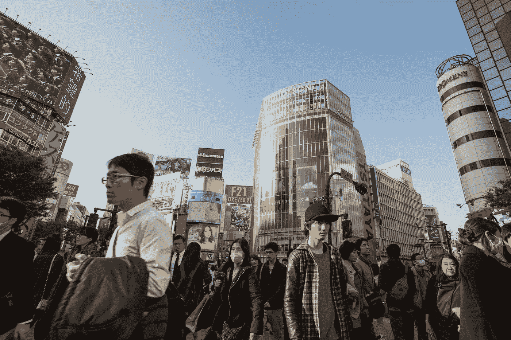

# 神秘的金钱机器小组周四关于金钱的真相

> 原文：<https://medium.datadriveninvestor.com/the-truth-about-money-thursdays-in-the-mystical-money-machine-group-662847e1c767?source=collection_archive---------33----------------------->

Photo by [Jason Ortego](https://unsplash.com/photos/GbZsvIIi4Xw?utm_source=unsplash&utm_medium=referral&utm_content=creditCopyText) on [Unsplash](https://unsplash.com/search/photos/japan-1990?utm_source=unsplash&utm_medium=referral&utm_content=creditCopyText)

下面是我在脸书上创建的神秘货币机器群中的一个帖子。

我对周四的话题有点不感兴趣，关于金钱的积极方面。所以我决定把这个改成周四关于金钱的真相。

我相信这样更合适，会给我们一个更大的频谱来讨论和借鉴。

本周我将与你们分享一部纪录片，我认为它有巨大的价值。

它叫做日元王子，是根据理查德·沃纳博士的书改编的。

它深入研究了日本 1941 年后至 20 世纪 90 年代的金融周期。

需要注意的重要事项:

*   每一次危机或繁荣都有原因。
*   所有这些都是人为的，是为了一个非常特殊的原因而设计的。主要是为了聚集更多的能量。改变现有的法律。
*   任何事物都有周期，即使是经济。
*   我们需要学会发现它们并采取相应的行动。

学会利用它们，这样我们就能夺回权力。

当前的经济繁荣将走向何方？

在我看来(基于研究和观察),更多的权力掌握在少数顶级组织手中。主要是中央银行。

他们将把货币数字化，并以区块链为例，用数字货币来强加给我们的社会。(当然是在制造了另一场危机之后。)

我对此会非常高兴，但这种数字货币是非常受控制的(政府制造)。

他们会确切地知道我们花了多少钱，买了多少东西，在哪里买的。终极控制。而且他们会以“减少犯罪”为借口去做。和/或免除普遍基本收入。我相信 UBI 是一个伟大的想法，但不是当政府规定这一点。很有可能他们会给每个有芯片的人提供 UBI。这意味着，他们将提供“免费货币”，一种可以追踪到每个皮下植入 RFID 芯片的人的数字货币。只有一种情况，但这种可能性很大。这不是为了吓唬你，而是为了提高意识，这意味着什么。

那么他们将拥有最终的控制权。忘了关掉手机或毁掉它吧。现在你的皮肤下有东西可以让你被追踪，你的一举一动、决定、习惯都被收集成数据，用来对付你。最好的情况是，他们会利用这些数据卖给你更多愚蠢的东西。最坏的情况是，他们有能力让你关机(杀死你。)

现在我知道这听起来有点多疑。我同意，的确如此。就一点点。

好消息是，最终我们人类有选择的能力。要么跟这种类型的社会走，要么选别的。

这对普通人来说是有意义的，但是想想看？

我们所做的、花费的、制造的、购买的一切都将被知晓和控制。

没有自由。

有什么更好的选择？

无法追踪的数字货币。莫内罗和 RYO 已经是很好的例子。这意味着你有数字货币，你用它获得报酬，但网络是你自己的。比如你用你的 PC，GPU 和 Android 手机。(大概也可以用 iPhone 挖掘 crypto 吧。不过我还没有测试过。)

每个人都参与网络的有效性，因此，网络不能被污染。

你会付款并收到它们，但没人知道是你花了钱或收到了钱。

或者换句话说，自由。

显然，这是一个巨大的话题，随着时间的推移，我们将继续解开这个问题，但这些是需要记住的一些事情。

享受这部电影吧！

*点击* [*这里*](https://www.facebook.com/groups/532315657241148/) *加入神秘的金钱机器群。一个旨在通过神秘的转折赋予人们理财能力的组织！*

*如果你对短剂量的智慧感兴趣，* [*点击*](https://twitter.com/IanAltosaar) *这里，在 Twitter 上关注我。我在那里发关于金钱、财务、生活、精神、成长和更多的微博。*

伊恩·阿尔托萨尔