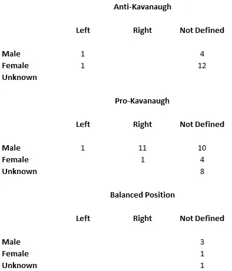

# 布雷特·卡瓦诺确认听证会的真相

> 原文：<https://medium.datadriveninvestor.com/the-truth-about-the-confirmation-hearing-of-brett-kavanaugh-3149e864250d?source=collection_archive---------3----------------------->

这些是事实，这些事实是无可争议的。

Photo by [Claire Anderson](https://unsplash.com/@claireandy?utm_source=medium&utm_medium=referral) on [Unsplash](https://unsplash.com?utm_source=medium&utm_medium=referral)

最近，essica Valenti (@jessicavalenti)写了一篇关于 Brett Kavanaugh 和他的指控者的精彩报道。见 [*逃脱的:卡瓦诺和负重女*](https://gen.medium.com/the-ones-who-got-away-kavanaugh-and-the-weight-women-carry-5b0595993d91) 。我认为这是一个伟大的故事，我鼓掌。我被我在评论中看到的震惊了。我决定尝试对所有的评论做一些分析。

这是一个非常不科学的调查。我根据传统的男性和女性名字来确定性别。在我不能做出决定的地方，我只是把它留为“未知”“未知”的一个例子是那些只有姓名首字母而没有个人资料照片的人。在看了前几个简介后，我决定只有在他们的评论中有明确的政治倾向时，才确定“左或右”。令人惊讶的是，女性对卡瓦诺的比分是 13 比 5，而男性对卡瓦诺的比分是 22 比 5。

 [## 保护主义、政治和经济动荡|数据驱动的投资者

### 美国股市昨日出现 400 多点的大幅反转，为未来的事情发出了警告信号。市场…

www.datadriveninvestor.com](https://www.datadriveninvestor.com/2018/06/28/protectionism-politics-economic-turmoil/) 

有八个其他人支持 Kavanaugh 性别不确定。这些不确定的也是最滥用的。我不禁想知道这些人在那里不仅仅是为了“钓”人取乐。这些政治骗子是受雇于某个政党吗？他们是俄罗斯机器人吗？我不知道。我会说，Medium 有一些非常好的工具可以摆脱这些人——那些毫无理由地进行人身攻击和虐待的人。有证据支持的对政府官员的攻击总是可以接受的。仅仅因为你不同意其他成员的观点而对其进行人身攻击是不可接受的。

上表中暴露的性别差距令我担忧。我怀疑大多数女性在过去都有一些经历，这使她们与克里斯汀·布拉西·福特和黛博拉·拉米雷斯有联系。从男性的角度来看，我怀疑大多数男人都有过和女人在一起的经历，他们不知道女人会如何回忆。嘿，伙计们，让我们面对现实吧，在成长的过程中，我们都面临过和女人打交道的尴尬时刻——尤其是在约会的情况下。我知道我有。每一个和女人有过关系的男人都会让女人在某个时候生他们的气。有些争吵会导致分手。我相信很多人都想知道现在这些前妻或前女友会怎么说他们。

我的男性同胞们的这些担忧需要暂时放在一边。我们需要设身处地为 Kavanaugh 的指控者着想。想象一下克里斯汀·布拉西·福特或黛博拉·拉米雷斯是你的妻子、姐妹或母亲。想象这个的时候，问自己一个问题，你想让这个国家听她的，还是想让她的故事被掩盖起来而不被真正调查？

我对反卡瓦诺阵营的一些愚蠢评论感到惊讶。有一个人声称布雷特·卡瓦诺是性侵犯的真正受害者。这种荒唐的想法从何而来？看来这个人很聪明。他怎么会对这样一个荒谬的阴谋如此疯狂？不管是谁，我都没有时间讨论这种奇怪的想法。这是一个值得认真思考的严肃问题。

还有一个人喜欢批评“wokes”我得查一下“醒来”是什么意思。根据韦氏词典对“[wake](https://www.merriam-webster.com/dictionary/woke)”的定义是“*意识到并积极关注重要的事实和问题(尤其是种族和社会公正问题)。我是最后一个知道‘醒来’是什么意思的人吗？怎么会有人反对社会正义呢？如果一个人反对社会公正，这是否意味着他们支持社会不公正？根据这个家伙的说法，我们这些“进步人士”和“蠢人”根本不关心事实。然而，是进步人士和工人们想要调查真相。也许我们“雪花”应该只是坐着享受社会的不公平，因为，真的，无论谁告诉我们生活将是公平的。也许有一天，我们会了解“真实世界”的方式另一方面，也许真正的“雪花”是那些懒得与社会不公抗争的人——你知道，那些生活在“真实世界”的人我当然很高兴像麦迪逊、富兰克林和华盛顿这样的人没有生活在这个“真实世界”中，在这个世界中，人们不关心他们的同胞的困境。如果这些创始人生活在这个“真实世界”，美国就不会成立。*

当然，必须有针对主流媒体的假新闻指控的惯常合唱。不要介意主流的《华盛顿邮报》在下面的一个段落中引用了一篇描述民主党的负面报道。

和往常一样，总有人会说，‘克林顿夫妇怎么样？’令人惊讶的是，这些克林顿夫妇可以被调查这么多年，唯一被发现的是比尔·克林顿的婚姻不忠。不要误解我，我不会因为这个原因投票给比尔·克林顿。性格很重要。我还想知道比尔·克林顿和杰弗里·爱泼斯坦的关系。我更关心特朗普和爱泼斯坦的关系，因为特朗普是现任总统。

我看到许多评论说，我们需要“看看事实”，关于卡瓦诺的原告。什么事实？从来没有足够的调查，也没有足够的听证会来确定任何一方的“事实”。由于他们的虚假调查，共和党人阻止我们获得任何“事实”。共和党人就像一个众所周知的故事中的家伙，在街道的一端丢了钥匙，但决定在街道的另一端寻找他的钥匙，因为那里的光线更好。对于这个虚假的调查，女性有权对卡瓦诺听证会感到愤怒。这些抱怨的人没有权利根据“事实”来抱怨。事实是，共和党人不想听事实，他们只想做一个有偏见的假设。

这些基于“只听他们想听的”的偏见假设在极右翼中最为常见。这种情况在较为温和的人群中发生的程度较低。适度是一种标志，表明一个人实际上在“思考”，而不是听谁喊得最响。考虑这些问题的人并不是被纯粹的情感所驱使。极端主义者把他们的观点当作福音，喜欢把每个人都贴上左派或右派的标签。任何没有他们那么极端的人都属于政治光谱的对立面。

这些极端分子需要加入我们这些“真实世界”的人。政治不是足球比赛。不管你的团队做什么，你都不应该支持他们。政治家的选举和他们投的票对我们国家公民的日常生活有着真正的影响。一个坐下来想通所有问题的人，不会是极右翼，也不会是极左翼(美国极左翼的人很少)。这些仔细考虑问题的人会根据他们自己的价值观和知识采取立场。他们不会试图通过比朋友“更极端”来超越朋友。这种幼稚的分析在政治舞台上没有一席之地，因为它会导致特朗普这样的无能领导人当选。

每个人都需要意识到的第一件事是，这不是一个“证明有罪之前无罪”的情况。这个标准和“排除合理怀疑”的原则只适用于刑事审判。这个“低门槛”是针对刑事被告的，因为我们的法律体系是建立在这样一个理念之上的，即让一个有罪的人逃避正义比让一个无辜的人被错误地定罪要好。在美国最高职位之一，美国最高法院大法官的确认听证会上，障碍肯定很大。这些人必须无可指责。标准就是简单的“证据优势”也就是说，“卡瓦诺是否更有可能犯下所谓的性侵犯行为。”

民主党在这场考验中的行为可能存在一个关键问题。克里斯汀·布拉西·福特在听证会前两个月给她的民主党众议员写了一封信。她想对这件事保密。这封信被转交给参议员费恩斯坦的办公室和联邦调查局。要么是参议员办公室的人，要么是众议员办公室的人，要么是联邦调查局的人泄露了这个信息。为了这次辩论的目的，我将假设民主党人泄露了信息。参见[加州教授，Brett Kavanaugh 机密信件的作者，从 *Washington Post* 上公开了她对性侵犯](https://www.washingtonpost.com/investigations/california-professor-writer-of-confidential-brett-kavanaugh-letter-speaks-out-about-her-allegation-of-sexual-assault/2018/09/16/46982194-b846-11e8-94eb-3bd52dfe917b_story.html)的指控。我敢肯定，民主党之所以推迟，是因为他们不想强迫一名要求保密的女性作证。在某种程度上，民主党人决定他们必须有克里斯汀·布拉西·福特的证词，并泄露了她的信息，实质上迫使她在参议院面前出现。

共和党人的反应是试图在没有对指控进行调查的情况下通过确认。他们尖叫道，卡瓦诺在背景调查期间“已经被调查了九次”!他们更清楚。他们知道背景调查是什么样的。虽然法官或大法官的背景调查可能有所不同，但人们可以通过查看针对处理机密信息的人员的背景调查联邦法规来了解背景调查的内容。参见《联邦法规》第 32 篇第 147 部分。具体来看 147.6(c)(1–2)。卡瓦诺不会因为克里斯汀·布拉西·福特的指控而受到这些准则的调查。林赛·格雷厄姆在为卡瓦诺辩护时就知道这一点。格雷厄姆在空军服役期间曾在军法署署长(JAG)部队服役。他必须了解这些问题。我知道这一点，因为我曾经在一个小镇担任破产律师，那里的主要行业是国防承包商，从事机密研究和开发。我的很多客户都通过了安全审查，不得不担心第 147.8 条。

民主党付出了巨大的努力，争取到了额外的一周时间，至少对此事进行了一些调查。多亏了弗雷克议员，我们进行了短暂的调查。不幸的是，许多关键证人甚至没有被联邦调查局询问。很明显，这是一次虚假的调查。请看[证实:强势男性在短路事件中忽视女性 Brett Kavanaugh 调查](https://www.usatoday.com/story/opinion/2019/09/17/fbi-kavanaugh-investigation-unfair-process-supreme-court-column/2342922001/)来自*《今日美国》。*

所以，显而易见的问题是，为什么共和党人不下令进行更彻底的调查？如果花两周而不是一周有什么关系？他们是在对民主党人置信息于不顾长达几个月，并违背克里斯汀·布拉西·福特的意愿泄露信息做出反应吗？如果这是共和党行为的基本原理，那么应该应用“两个错误不等于一个正确”的法则。在过去的几年里，共和党人一再表现出不守信用。事实上，民主党人可能有一次不良行为，但这不能作为共和党人增加不良行为记录的理由。

这件事没有经过彻底的调查，这一事实让那些政治光谱中的右翼分子没有了争论“事实”的基础我们根本不知道。另一方面，那些政治光谱中的左翼人士可能会注意到，由于共和党人不守信用的行为，他们“不知道”。所有美国人都应该问这个故事中最关键的问题:为什么共和党人如此匆忙？即使必须有新的提名人和新的听证会，仍然有足够的时间。即使民主党在 2018 年中期选举中赢得了参议院(没有人预测会发生这种情况)，仍有两个多月的时间来提名和确认特朗普候选名单上的其他法官之一。为什么确认这种特殊的正义如此重要？

这个答案与川普为什么想让威廉·巴尔担任司法部长的答案是一样的。布雷特·卡瓦诺对总统的权力持有激进的扩张性观点。以下句子是在政治报道的。

> 事实上，卡瓦诺的写作表明，作为一名法官，他可能会拒绝重要的最高法院判例法，并支持总统拒绝向穆勒团队移交证据的权利。他也可能认为总统可以拒绝回答刑事调查中的问题。

从*政治*看[布雷特·卡瓦诺对行政权力的激进观点](https://www.politico.com/magazine/story/2018/09/04/kavanaugh-trump-mueller-executive-power-219634)。

在川普提名他为下一任司法部长的几个月前，威廉·巴尔给罗德·罗森斯坦写了一封信。下面 LawFare 的分析总结了 Barr 的观点。

> 因为不管一个人是同意他对法律的观点(如麦卡锡)还是退缩(如莱德曼)，美国司法部长绝对不应该做的一件事就是捏造事实。具有讽刺意味的是，对于一份提出鲍勃·穆勒虚构了一项罪行进行调查的备忘录来说，这份文件完全是基于虚构的事实。

从 *LawFare* 看[比尔·巴尔关于妨碍司法](https://www.lawfareblog.com/bill-barrs-very-strange-memo-obstruction-justice)的非常奇怪的备忘录。

有人没有看到特朗普任命的人的类型的模式吗？特朗普任命大法官和总检察长是基于他对他们是否会帮助特朗普解决自己的法律问题的看法。这是明显的滥用职权。但是，像林赛·格雷厄姆这样的人崇拜特朗普。他们为了讨好特朗普，想做什么就做什么。像参议员格雷厄姆这样的人根本不在乎这个国家和他们发誓维护的法律。

就我们所知，我们根本没有足够的证据来对卡瓦诺过去做过或没做过的事情做出明智的决定。我们确实有足够的证据证明卡瓦诺在听证会上的行为以及特朗普任命卡瓦诺做出知情决定的动机。律师和法官必须脸皮厚。他们必须能够在压力下表现，同时保持一定程度的良好行为。卡瓦诺在他的确认听证会上证明，他不能胜任这项任务。见[500 多名法学教授谴责卡瓦诺“缺乏司法气质”](https://www.huffpost.com/entry/kavanaugh-judicial-temperament-law-professors_n_5bb40200e4b028e1fe38cf9d)摘自*赫芬顿邮报*。请注意，上述文章中的几位法学教授来自耶鲁大学法学院——卡瓦诺法学院。

卡瓦诺的这种不良行为对我来说还不是最糟糕的。这是他对单词‘T6’Borking 的使用对我来说，仅仅使用这个词就是不合格。罗伯特·博克法官是现代共和党人的原型。与总检察长和副总检察长不同，在周六晚上的大屠杀中，副检察长罗伯特·博克没有勇气对抗尼克松。博克后来在回忆录中承认，由于他对尼克松的忠诚，尼克松曾许诺给他在最高法院的一个位置。博克没有勇气，他把个人发展置于国家利益之上。这听起来很像无论如何都要捍卫特朗普的现代共和党人。这些现代共和党人显然遵循一种“让这个国家见鬼去吧”的哲学，我要支持特朗普，推进我自己的职业生涯！

正是这种哲学导致我们的国家不得不忍受像米奇·麦康奈尔这样的人的蛮横行为。当时没有对博克更加严厉，却允许这样一种癌症哲学在我们的国家滋长。这并不奇怪，因为麦康奈尔第一次在参议院被注意是因为他对“borking”的荒谬批评。参见我的故事， [*“莫斯科米奇”这个名字一直被米奇麦康奈尔使用的原因。第三段中来自 PBS 的视频是这个故事最相关的部分。*](https://medium.com/swlh/the-reasons-the-name-moscow-mitch-has-stuck-to-mitch-mcconnell-698d70196170)

克里斯汀·布拉西·福特非常可信。我看了她的证词，看出她很认真。她也有令人印象深刻的简历和令人印象深刻的职业生涯。我肯定她最不希望的就是成为这个马戏团的一员。在她允许一名男子进入我们国家的最高法院之前，她想向她的国会女议员发送一份机密信息，要求对这名男子进行调查。她知道，如果对卡瓦诺的青春进行调查，就会发现他的其他事情。她只是不想在全国电视上讲述自己的故事。谁会呢？大学聚会上的其他人当然不想被拖下水。人们不想重温 35 年前做出的错误选择

我猜有人决定违背她的意愿，把克里斯汀·布拉西·福特“征召”到这个为她的国家服务的部门。我非常同情克里斯汀·布拉西·福特，因为她不得不在 80 年代忍受一次折磨，去年又一次。至于克里斯汀·布拉西·福特和黛博拉·拉米雷斯，我很感激他们愿意讲述自己的故事。共和党人应该尊重这些女性，弄清她们的故事。相反，他们选择向美国历史上最糟糕的总统低头效忠。正如瓦伦蒂女士所写的，另一个可能的性虐待者逃脱了，因为有权势的人帮助了他。为什么这些有权有势的人帮助可能的性虐待者逃跑？他们想帮助一个被承认的性虐待者唐纳德·特朗普达到目的。现在，克里斯汀·布拉西·福特和黛博拉·拉米雷斯必须担起重担。