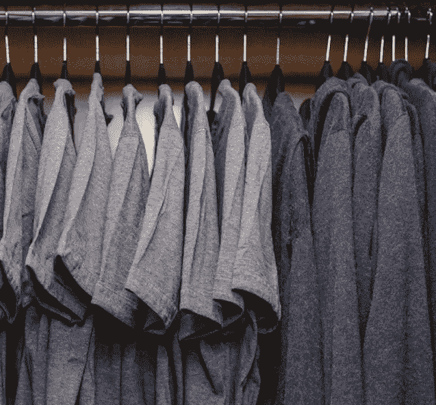

# 脸书联合创始人独特时尚感背后的真相

> 原文：<https://medium.datadriveninvestor.com/the-truth-behind-facebook-co-founders-unique-fashion-sense-and-how-it-can-help-you-became-rich-b87f55d68c2f?source=collection_archive---------60----------------------->

这是马克·扎克伯格的照片。以防你不认识他，他是脸书的创始人。每当你想分享一些东西或者想偷窥别人的生活时，你都会使用这个应用程序。

当这个年轻人达到三个逗号的时候，他只有 22 岁。他身价 15 亿美元，在世界首富排行榜上排名第 785 位。他甚至超越了比尔·盖茨，成为最年轻的白手起家的亿万富翁。

十年后，他现在排名前五，身价 710 亿美元，是他 2008 年身价的 48 倍。

很神奇吧。想和他一样吗？

但我不希望你把注意力放在他现在挣了多少钱上，去羡慕他。

我要你把注意力集中在他穿的那件灰色衬衫上。没错吧？看到了吗？

如果你在谷歌搜索引擎中输入“马克·扎克伯格”并点击图片。

你会注意到一些事情。

是的，在我朋友马克的所有照片中，他穿着一件灰色的衬衫！

那你觉得他为什么每天都穿同一款灰色衬衫呢？

他没什么可穿的？

记住他是亿万富翁。他可以买任何他想要的衣服。

他没有时尚感吗？

记住他是亿万富翁。他可以雇佣任何著名的时装设计师。

他只是懒。

部分原因。

当马克接受采访并被问及他为什么穿这样的衣服时，他说

> “我真的想清理我的生活，这样我就可以尽可能少地做决定，除了如何最好地为他的社区服务(脸书)。”

当我研究其他白手起家的亿万富翁时，比如杰夫·贝索斯(亚马逊)、已故的史蒂夫乔布斯(苹果)、比尔盖茨(微软)，甚至前总统巴拉克奥巴马(美国)，我看到了一个共同点。

> 它们看起来很简单。

我相信，我们应该像他们一样。

目标是变得富有，而不是看起来富有。

我宁愿银行账户里有 20，000 美元(110 万比索)，也不愿拥有价值 20，000 美元(110 万比索)但破烂不堪的衣服、包包和小玩意。

但是我坚信每个人都有权利选择他们想要的生活方式。

如果你想要新发布的价值 999 美元(Php 54000+)的 iPhone Xs 和价值 1449 美元(Php 80000+)的 iPhone XS Max，随你便！

如果你想去马尔代夫或巴厘岛度假，那就去吧！

如果你想买任何最新的奢侈品牌，我不在乎！

这是你的钱，不是我的。

但我在乎的是。

当你买这些东西只是为了满足你的自我时，

…只是为了看起来像其他人一样富有和享有特权。

我向你保证，你会破产

当你破产时，你就死了。

# 量入为出。

不要买你买不起的东西。

如果你想刷那张卡，抵制它。想一百遍。

如果要花自己的血汗钱？

问问你自己。

你*真的真的真的真的*需要吗？

会影响你的预算吗？你未来的计划？你的目的是什么？它会帮助我实现目标吗？

再想想。这取决于你。