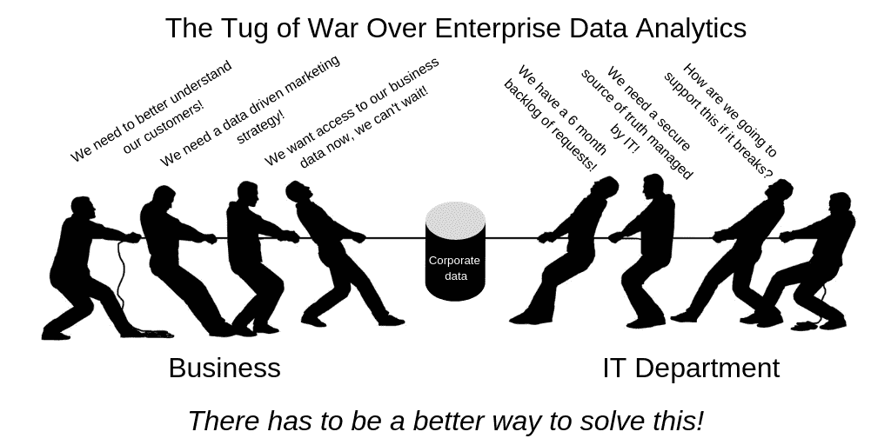
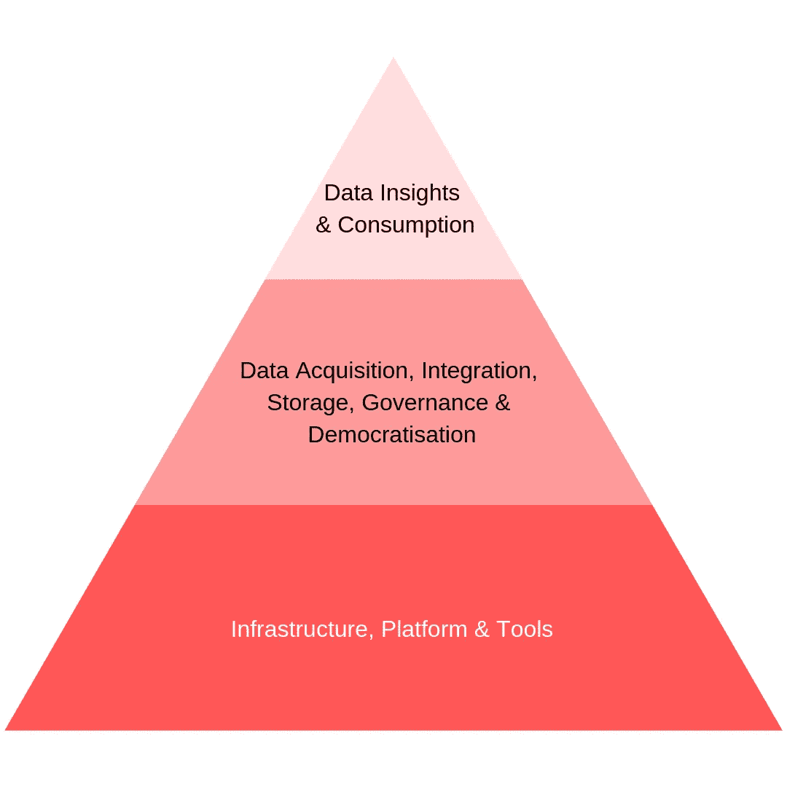
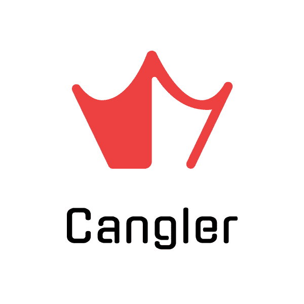

# 企业中数据分析的拉锯战

> 原文：<https://medium.datadriveninvestor.com/the-tug-of-war-over-data-analytics-in-the-enterprise-39d65df82a1d?source=collection_archive---------22----------------------->

如今，数据无处不在，企业比以往任何时候都更加依赖从数据中收集的见解来构建更好的产品和服务，做出更明智的商业决策，并在各自的行业中竞争。企业正在收集数量惊人的数据，但往往难以理解所有这些数据。

# 问题是:

做出正确的数据驱动型决策会有很高的回报，但数据泄露和根据不准确或不完整的数据做出决策会带来很高的后果。这在企业中造成了业务部门和 IT 部门之间的紧张关系，这通常会导致对企业数据集和分析工具所有权的争夺。

业务部门的首要任务通常是利用公司数据做出更好的业务决策，并为组织发现机会。IT 部门的首要任务通常是保证数据的安全、管理和集中，并确保遵守适用的法律。这两个优先事项经常相互竞争，导致数据孤岛、访问积压数据的 IT 瓶颈，以及错过及时做出数据驱动的业务决策和发现新机会的机会。

> 在没有自动化投资的情况下，您可以执行数据分析用例的速度与您雇佣的数据工程师、数据科学家和数据分析师的数量成正比。这造成了可扩展性问题，并大大增加了数据分析的成本。

除了企业数据的竞争优先级之外，从数据中获得有意义的见解实际上非常困难！要建立复杂而昂贵的分析工具和基础设施，以及准备用于分析的数据，需要做大量的前期工作。

对构建分析工具、数据模型和数据科学算法的稀缺人才也有很高的需求，这意味着企业经常被迫只优先考虑最高优先级的数据分析用例，从而错过了许多用例的机会，这些用例本可以成为下一件大事！

这是一个大而复杂的问题，组织通常没有时间或资源独自解决这个问题。

> “只有 4%的公司表示，他们有合适的资源从数据中提取有意义的见解，并据此采取行动”——Rasmus Wegener 和 Velu Sinha，Bain & Company

# 为什么这是一个问题？

建立企业数据分析能力需要做大量的工作，没有“一刀切”的解决方案可供企业采用。IT 部门经常不得不购买和集成来自多个供应商的多种数据分析产品，这意味着需要大型团队来构建和支持所有必需的系统并将它们集成在一起。

典型的企业数据分析架构分为三层，每层通常都有自己的专门团队:

*   **基础设施、平台&工具层:**设置和管理数据分析基础设施、工具、平台，并将它们集成在一起。
*   **数据采集、集成、存储、治理&民主化层:**设置和管理数据采集(包括第三方数据)、数据集成、物联网、数据民主化、数据模型、业务规则、KPI、数据治理、数据质量、数据存储、数据安全、主数据管理、备份、数据监管、数据沿袭、数据保证、数据聚合、数据湖、数据仓库&数据集市。
*   **数据洞察&消费层:**设置和管理数据科学算法、机器学习、人工智能、分析查询、数据可视化、仪表盘、报告、自助服务、版本管理、持续集成&部署、数据货币化、开放数据、与运营系统集成，并使用所有这些产品来生成业务洞察。

在设置和管理企业数据分析功能方面有如此多的工作要做，公司受到其团队规模的限制，这导致大量工作积压。

# 怎么才能解决这个问题？

我们可以通过自动化和数据民主化来解决这个问题。 [Cangler Analytics](https://www.cangleranalytics.com/) 正在开发一个端到端的企业数据分析平台，通过人工智能生成的代码、自我修复技术和内置的应用商店生态系统来帮助简化、管理、自动化和民主化企业数据分析，使公司能够即时、安全地分析其企业数据，以收集有意义的数据见解，就像在手机上下载应用程序一样简单，而无需构建或管理任何复杂的分析工具、内容或技术。

数据民主化确保没有在数据入口制造瓶颈的看门人，并使每个员工都能够成为数据驱动的决策者。这意味着每个人都有一个简单而安全的方法来访问数据，以一种有意义且易于理解的方式，因此它可以用于加快决策制定，并为组织发现新的机会。

我们的目标是让任何人在任何时候都可以使用数据来制定决策，而没有访问或理解的障碍，同时还确保数据是安全的，得到适当的管理，并有一套统一应用于所有人的通用业务规则，以确保数据不会被意外曲解。

# 我们需要你的帮助！

# 该问:

我们非常想听听你对此事的看法！帮助我们挑战我们的假设，更好地了解您的需求，并利用以人为中心的设计构建下一代数据分析产品，该产品专为作为关键用户的业务用户而非 IT 部门设计。

我们希望更好地了解数据分析客户目前面临的问题，以便开发正确的解决方案来解决这些问题。我们将开发由客户需求驱动的产品功能，因此我们需要您的帮助来找出当今数据分析市场的差距。以下是我们在面试中想问你的一些问题:

*   对于当今市场上的数据分析产品，您面临哪些问题？您的痛点是什么？
*   您认为市场中存在哪些差距，您是如何填补这些差距的(例如，变通办法、雇佣第三方服务提供商)？
*   您希望在下一代数据分析产品中看到哪些功能？
*   今天，您为什么在公司中使用数据分析产品？你想解决什么问题？

如果您能抽出 30 分钟进行面对面或在线会议，我们将非常高兴。如果你没有时间开会(我们明白，我们都超级忙！)如果您能抽出时间填写我们的在线调查，我们将不胜感激！

请在下面选择一个选项(或者两个都选，如果你超级热衷的话！):

*   [安排一次 30 分钟的面谈](https://calendly.com/cangleranalytics)，面谈(柏林)或视频会议
*   [参加我们的在线调查](https://andrewherbert1.typeform.com/to/WDfheT)

# 这对你有什么好处？

对于同意进行面对面或视频会议采访的前 20 名参与者，您将获得以下好处:

*   一旦 Cangler 的估值超过 100 万美元，1000 美元将捐赠给你选择的注册慈善机构
*   一经推出，一年内可免费使用 Cangler
*   产品中的一枚[复活节彩蛋](https://en.wikipedia.org/wiki/Easter_egg_(media))，你的名字将永远被列为产品开发的先驱人物
*   我们永远的感激(每个人都得到这个)！

有时间限制，但是，我们需要在 2019 年 1 月 23 日星期三午夜(欧洲中部时间)之前采访您！原因是 Cangler 非常幸运地成为了全球首屈一指的创意阶段加速器和创业启动计划[Founder Institute](https://fi.co/)Berlin Winter 2019 program 的参与者。我们接到了一项极其艰巨的任务:采访 20 位潜在客户，以更好地了解他们的需求，然后在 1 月 24 日星期四之前写一份 1500 字的专业设计报告和一篇 500 页的中型文章，其中包含我们的分析以及我们在采访中发现的客户问题！

这项任务旨在让我们失败，旨在将我们推向极限，考验我们克服未来创业挑战的决心。我们正在迎头应对这一挑战，非常感谢您的支持，帮助我们越过这条线！

您的组织在获取决策所需的分析工具和数据方面是否面临挑战？我们很想听听你的想法！

感谢您的宝贵时间，祝您愉快！