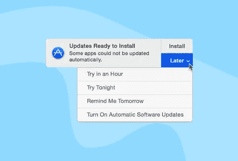

# “以后更新”的暴政

> 原文：<https://medium.datadriveninvestor.com/the-tyranny-of-update-later-b2ae528edc5f?source=collection_archive---------43----------------------->

当您在电脑上看到通知“更新可用”时不由自主地，你点击“稍后更新。”一次…两次…总是。每当你看到那个烦人的通知，它就变成了一种反射动作，是你被编程要做的事情。你总是忙忙碌碌，从来没有时间抽出 600 秒来更新系统。现在看来，600 秒似乎并不比*那*多。普通人一天要花 1200 秒等待。在这 1200 英镑中，乔*可以*用 600 英镑更新他的电脑。但他没有。这就引出了一个问题:为什么他从不花 600 秒更新他的电脑，而是等到他的 Mac 开始变慢，或者他的 Windows 强迫他更新？

这是便利的暴政。在纽约时报*的[文章](https://www.nytimes.com/2018/02/16/opinion/sunday/tyranny-convenience.html)中，蒂姆吴写道:“简单更好。最简单的是最好的。”这在今天尤其正确，因为“完成工作”最简单的方法总是最好的方法。这有它的优点和缺点。虽然它的优点包括提高生产力和效率，但它的缺点是妨碍我们发展核心的情绪智能技能——无聊的天赋、耐心的美德和接受延迟满足的艺术。*

积极地更新你的电脑是痛苦的，因为你知道在那 600 秒里你将无事可做。我同意，这很难(我已经给我的 Mac 增加了很多次负担，却发现它慢到了难以想象的程度)。然而，技术带来的积极休息的好处远远超过 600 的痛苦。这 600 秒的*积极无所事事*让你的思想游荡，让你脱离连续不断的通知，让你断网(如果不是你的手机，至少是你的电脑)。这至少允许一些有创造性的(和深刻的)思考，同时也使人欣赏“大局”，而在许多情况下，这是人们容易错过的。Linkedin 的首席执行官杰夫·韦纳在这篇文章中写了什么都不安排的重要性，并声称:

> 思考，如果做得恰当，需要不间断的专注；彻底发展和质疑假设；综合所有源源不断的数据、信息和知识；将点点滴滴联系起来，从信任的同事那里获得灵感；并遍历多个场景。换句话说，这需要时间。只有当你为自己开拓时，你才有时间。

深度思考、开箱即用的解决方案以及脱离屏幕时间对于开发新颖的解决方案至关重要，尽管 Joe 可能永远找不到时间“去科技化”，但计算机更新是一个很好的替代。现在，你可能会说很多人不关心以后的更新。然而，后来更新由于不由自主地沉迷于电脑的*便利*，*是。*因此，尽管“稍后更新”不会对 Joe 造成严重后果，但正如 Tim Wu 所言，“当我们让便利决定一切时，我们放弃了太多。”然后，很明显，延迟更新的便利是 Joe 对他的计算机上瘾的副产品，是技术更深层次的隐藏效果的症状。