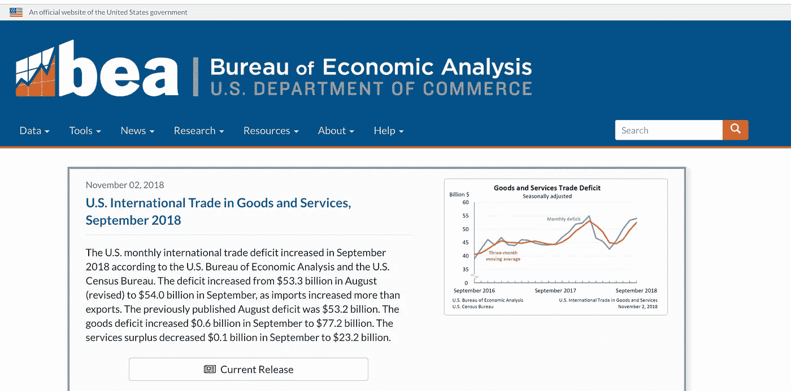
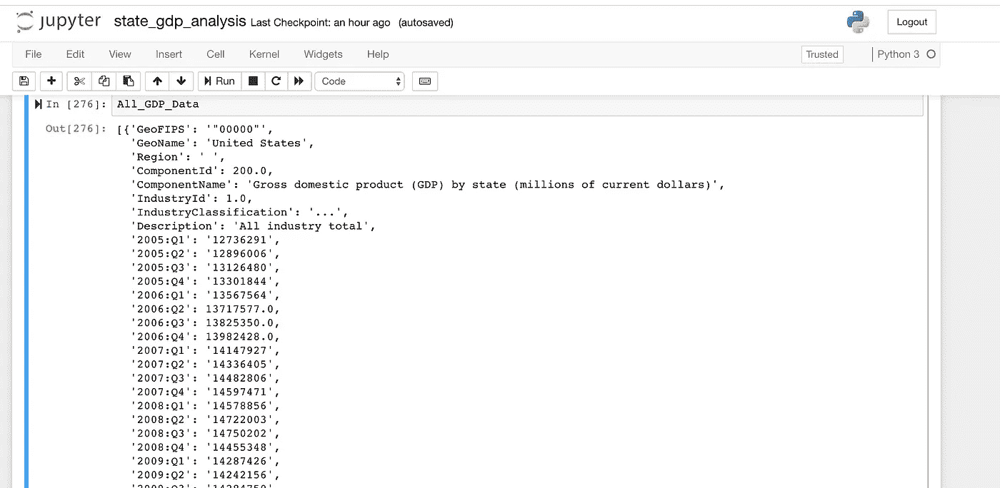
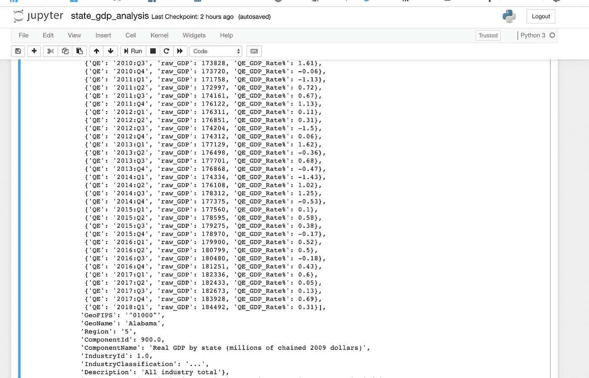
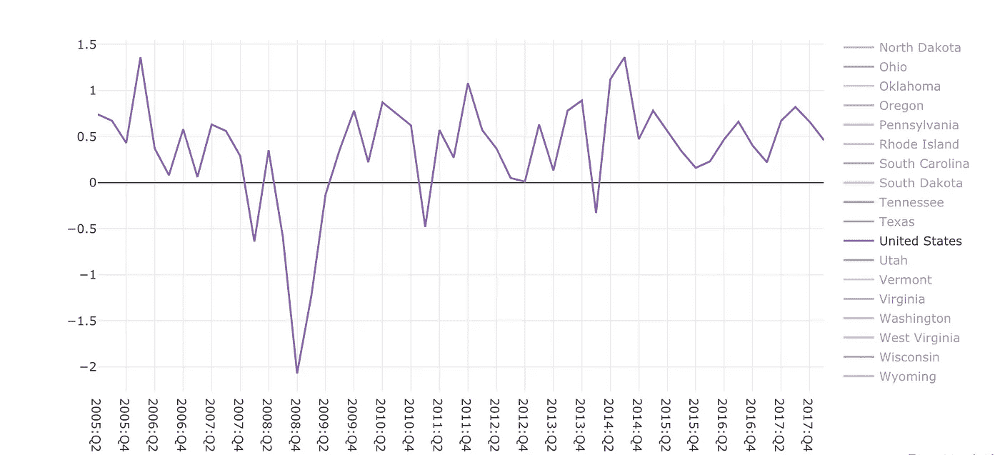
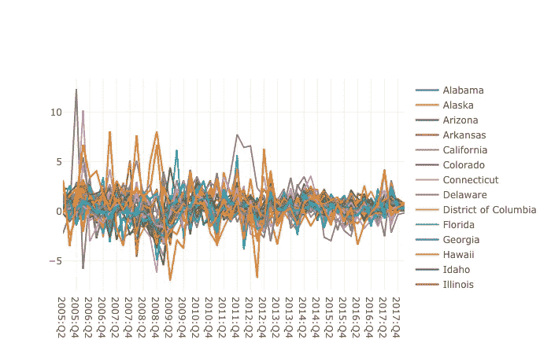
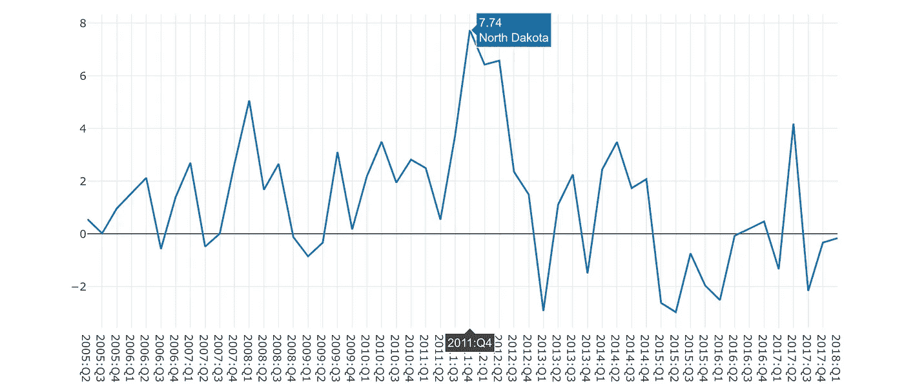
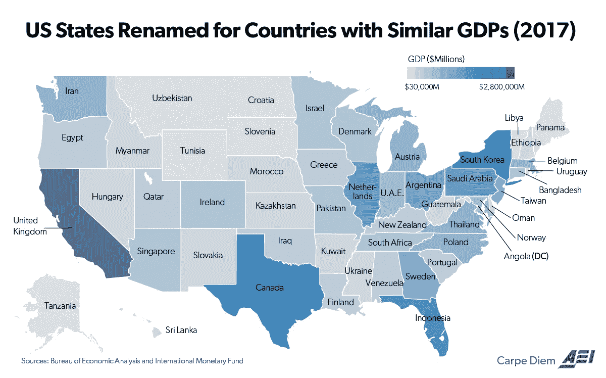

# 美国 GDP 数据简介

> 原文：<https://medium.datadriveninvestor.com/the-u-s-economy-and-gdp-3f1caced7647?source=collection_archive---------30----------------------->

作为一名数据科学家学生，我们被鼓励观察我们周围的世界，并找到我们感兴趣的数据。从我高中的第一堂经济学课开始，我就发现主宰世界的地缘政治贸易力量天生就很迷人。世界已经演变成一个极其复杂的贸易协定、利息支付以及人与人、国家与国家之间合作的体系。我想从更高的层面来审视一个被媒体、政治家和其他人用作经济健康指标的无所不在的指标:

国内生产总值的季度变化率。

本博客(以及可能的后续博客)将绘制自 Q1 2005 年底以来美国及其 50 个州和哥伦比亚特区的国内生产总值，因此我们可以探索干净的数据集，并对美国过去 13 年的一些总体趋势进行观察。

# **奇妙的数据以及在哪里可以找到这些数据**

[https://www.bea.gov/](https://www.bea.gov/)

第一篇博客中使用的所有数据将来自美国商务部下属的经济分析局(BEA)。美国经济分析局负责按季度编制国内生产总值，并公布其调查结果和任何后续修订供公众使用。虽然 GDP 比率是头条新闻，但附带的数据集提供了大量信息，说明了 GDP 的不同输入，并将它们分成不同的类别(如特定行业或特定地区)，因此公众可以分析数据，并对整个经济做出结论。[如果你想看的话，这里有一个链接](https://www.bea.gov/sites/default/files/2018-04/booklet-for-printing-weve-got-your-number.pdf)链接到他们的初级读本。我的第一步将是清理来自东亚银行网站的数据，并通过显示 GDP 的变化来探索这些数据。

# **初审**

我从他们网站的区域经济账户部分下载了“各州季度国内生产总值(GDP)”CSV 文件，其中包括所有可用的组件以及更广泛的统计数据。我把文件转换成 python，并把它放入字典列表中。

这个初始数据集包含 5，763 个条目。我知道我需要削减数据，经过一些简单的探索，我发现数据需要通过以下方式清理:

1.  季度 GDP 值需要被转换成可用的数字(浮点数)，这样我就可以在以后计算一个季度的 GDP 率。
2.  需要过滤掉非国家数据，包括区域信息和错误的名称。
3.  描述中没有“所有行业合计”的条目已被删除。
4.  只有包含“各州实际国内生产总值(2009 年百万美元)”的条目才应在范围内。特别是，该字段将为我提供某个辖区在给定季度的原始 GDP 值。

清理之后，我只剩下 52 个条目(50 个州+ DC +美国)。在探索数据之前，我的最后一步是重新格式化每个辖区内的 GDP 数据，这样我就可以在将来更容易地操作数据集。这包括添加一个“季度 GDP”键，其值是一个字典列表，每个字典包含季度末和原始 GDP。

以这种方式分解数据集使我能够更容易地引用每个数字，并使用 Python 计算每个季度的 GDP 率。

Alabama’s Data Set Part 1

Alabama’s Data Set Part 2

现在我有了可用数据库，我们可以开始研究我们的数据集了。从美国国内生产总值(GDP)率的整体表现来看:

U.S. GDP Rate (Real 2009$) Q2 2005 — Q1 2018

这是所有 52 条线在一个图表上的样子…这有点像“我把油漆再次扔在墙上，这是发生的情况。”

玩笑归玩笑，即使看一下这些数据，我也开始注意到一些有趣的异常值。例如，看到 2011 年第四季度到 2012 年 Q1 金融危机后突出的紫色线条了吗？那是…北达科他州？

我的第一个问题是，是什么原因让一个 GDP 相当于克罗地亚的州，在美国金融危机后拥有迄今为止三个最好的增长期？

*参见 PS，查看美国及其类似国家的地图

# **为什么这样做？**

正如我前面说过的，我觉得这个信息很吸引人。它是广泛使用的、复杂的、相关的数据，企业和学者用它来更好地了解世界。使用 GDP 比率作为经济健康的衡量标准，整篇学术论文都可能(我怀疑已经)是关于缺陷或问题的。更不用说大多数媒体已经令人作呕地报道了这些话题。但现在…这是我所拥有的…我正开始我的旅程，试图通过数据科学更好地了解这个世界，也许其他人也能在这个过程中学到一些东西。

此外，随着我们对线性代数和机器学习的深入，新类型的问题和查看数据的方法将变得可用，这有可能为新的想法、问题和学习机会打开大门。

# **下一步**

我对这个数据集的下一个项目有一些想法。现在它是一种可用的形式，我想我会看看自金融危机以来不同的州和行业发生了什么；像这样的问题:哪些已经恢复甚至增长了？哪有挣扎过？在这场斗争的危机之前，有什么迹象或趋势吗？

然后，我可以看到未来的计划，查看不同的数据源，更深入地研究通过这一分析发现的趋势，例如是什么导致了北达科他州在 2011 年底和 2012 年的增长高峰？

附:这是美国各州和 GDP 相近的国家的图表。

Courtesy of American Enterprise Institute, Bureau of Economic Analysis and International Monetary Fund

^-^，2015 年 7 月 11 日