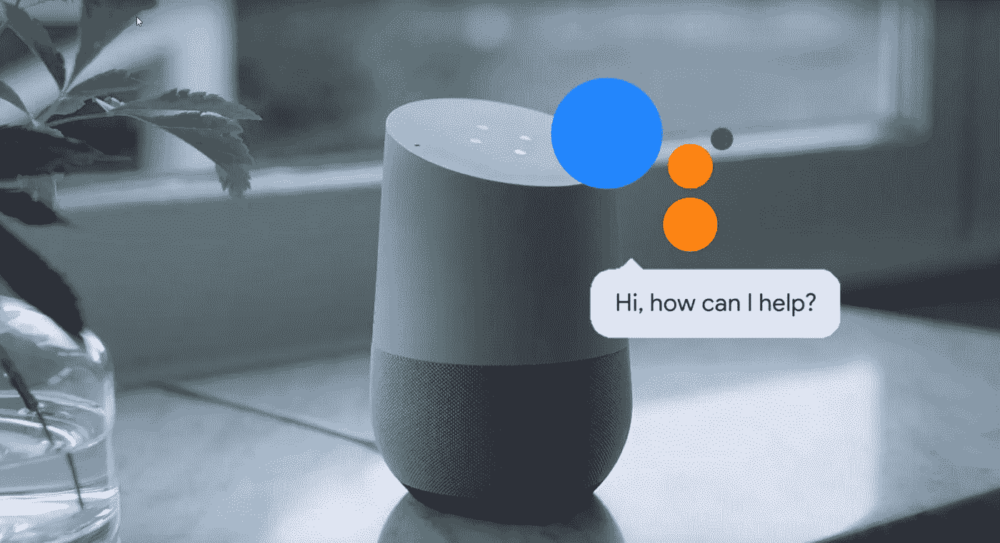
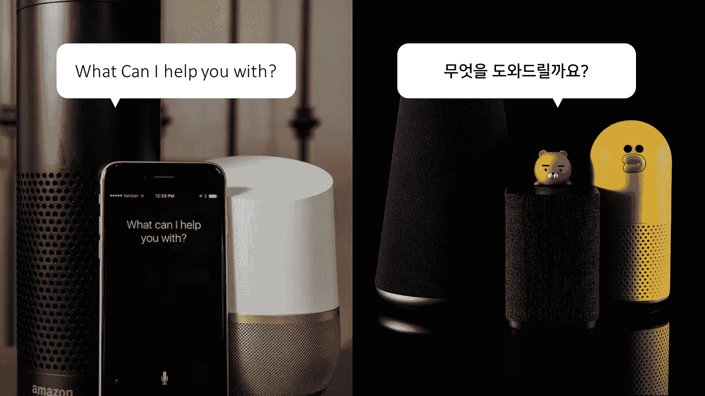

# 虚拟助理技术的丑陋真相

> 原文：<https://medium.datadriveninvestor.com/the-ugly-truth-of-virtual-assistants-technology-aaf17bc5c078?source=collection_archive---------6----------------------->

我觉得和你在一起我可以做任何事。在电影< HER >中，角色萨曼莎展现了一个完美的人工智能，它真正理解并调整自己以适应用户的情感需求。她的口音和语调很自然，足以与真实的人声混淆，她甚至表达了自己的感受。我们和萨曼莎唯一的区别是她没有身体上的体现。

在现实世界中，我见过的最像萨曼莎的人工智能声音是谷歌新宣布的功能，名为*双工*。在一年一度的谷歌 I/O 大会上，它绝对是大会的一大亮点，并以其完美的人声震惊了世界。它甚至包含像“嗯嗯”或“嗯……”这样的对话填充音，使其更加自然。

*Duple* x 显示虚拟助理技术已经得到了惊人的发展，现在它们似乎赶上了人与人之间的交流。**然而，这里有一个小问题。我们还要等多久才能让这位类人助手走进我们的日常生活？**

## 当前虚拟助理技术的丑陋真相

*好的，谷歌。天气怎么样？*

根据最近的智能音箱趋势报告，最常用的功能是*音乐*和*天气*。是啊，这既没意思也没技术含量。对于使用过这些设备的人来说，当前的虚拟代理不够智能这一事实并不奇怪。由于他们经常误解用户的命令，人们不期望他们处理复杂的任务。即使命令助手可以处理的列表正在增长，它仍然远远低于我们对人工智能助手的期望。

此外， *Duplex* 是世界上最好的科技公司谷歌最新技术的原型。意味着还需要几年的时间，才能为拥有各种设备的正常人实现商业化。

## 小心空隙！英语国家和非英语国家之间的差距

如果你远离说英语的国家，这个问题会变得更糟。与自然语言处理相关的最新技术主要是基于英语单词和短语发展起来的，自然语言处理是语音接口的一个特别重要的部分。

所以，英语文化之外的 AI 公司不得不开发自己的自然语言处理系统。考虑到韩国人、日本人和中国人分别有自己的字母和语法，即使是亚洲国家也无法互相帮助。

我注意到，当谈到用户满意度时，这种差距产生了一个问题。亚马逊 Echo 和 Google Home 的增长代表着西方国家的人们实际上正在日常生活中采用这些新的语音界面。

另一方面，一项研究表明，不到一半的韩国智能音箱用户对他们的语音代理不满意，这主要是因为他们无法理解用户的命令，这是由技术问题引起的。这表明非英语国家仍在为建立自己的语言处理系统而苦恼。

我们不得不承认对此没有明确的答案。第一世界和其他国家之间科技产业的不平等问题一直存在，就像永远存在一样。我想说的是，像萨曼莎这样的未来人工智能的美好梦想将在几年内仍然是一个幻想，特别是对世界上其他不说英语的人来说。