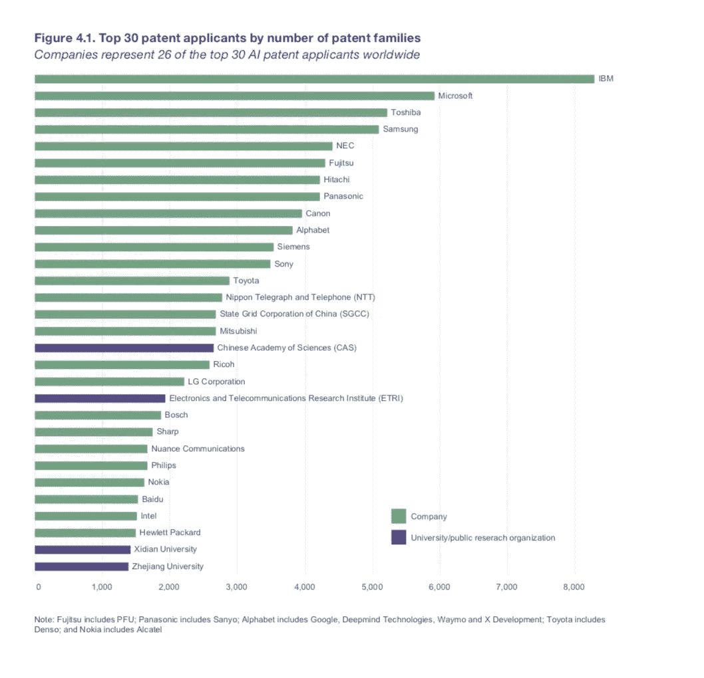
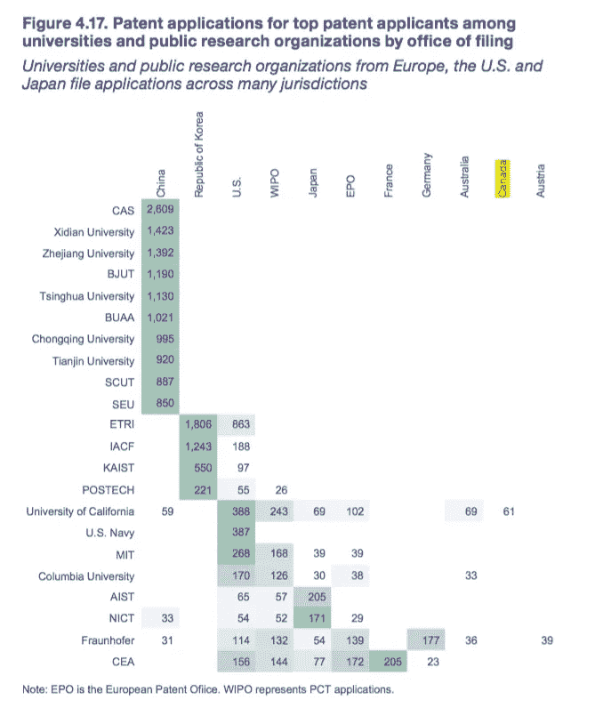

# 英国人工智能产业是如何在第一个障碍中倒下的:我们甚至没有专利，这样我们就无法商业化(通常的抱怨)

> 原文：<https://medium.datadriveninvestor.com/the-uks-tech-problem-used-to-be-that-we-failed-to-commercialise-our-intellectual-property-that-s-34b130f268f2?source=collection_archive---------19----------------------->

据世界知识产权组织称，英国在 21 世纪基础技术的专利热潮中处于落后地位

DARPA

世界知识产权组织最近发布了关于人工智能趋势的 2019 年[报告](https://www.wipo.int/publications/en/details.jsp?id=4386)。这很值得一读。

一张图表展示了排名前 30 位的专利申请机构。

 [## 关于知识产权，每个开发者都必须知道的 5 件事——数据驱动的投资者

### 今天，任何参与软件开发的人都必须对知识的来龙去脉有敏锐的理解…

www.datadriveninvestor.com](https://www.datadriveninvestor.com/2018/05/17/5-things-every-developer-must-know-about-intellectual-property-rights/) 

注意到什么了吗？

极少数是欧洲人，但没有一个是英国人。是的——这些组织中没有一个是英国的。一个都没有。

如果人工智能——就像英国政府，事实上也是大多数其他政府，热衷于指出的那样——将成为 21 世纪的关键经济驱动力之一，如果像我们这样的高成本、成熟经济体的未来应该是知识产权，那么……它看起来并不美好。

也许这只是因为我们缺乏大型科技公司——对英国的一个传统抱怨是，即使我们提出了许多好想法，我们也很难商业化。

让我们简单地看看学术界的席位——英国的大学通常被视为全球人工智能和人工智能领域的佼佼者。注意到什么了吗？

哎呀。

在报告中，就被收购的初创企业而言，英国确实表现不错。问题的一部分可能是，大量“英国”专利现在被美国企业深深吞噬——想想 Deepmind 和谷歌/ Alphabet。

英国也有大量的科学出版物，在人工智能知识产权诉讼方面排名很高。这两者都可能温和地暗示将英国拉回到游戏中的选择。

因为我们迫切需要一线希望。