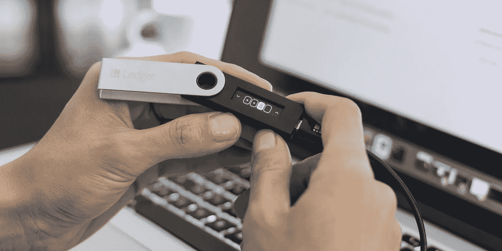
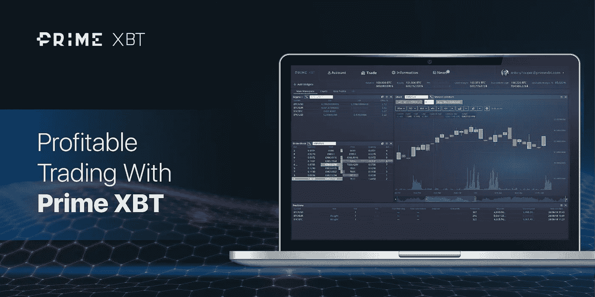
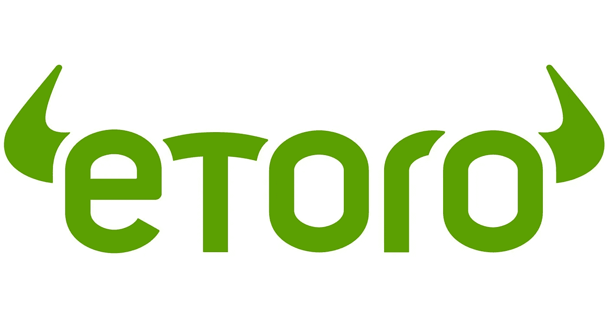
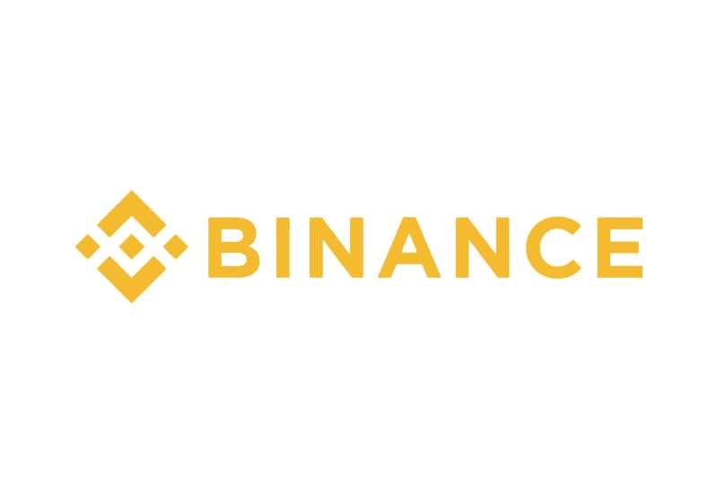
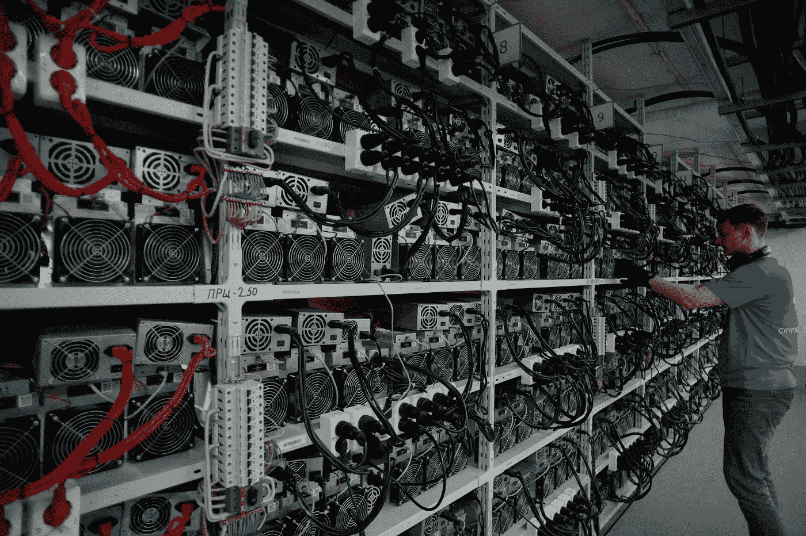

# 比特币交易、投资和采矿终极指南[2020]

> 原文：<https://medium.datadriveninvestor.com/the-ultimate-guide-to-bitcoin-trading-investing-mining-2020-b585788e6a7a?source=collection_archive---------7----------------------->

随着越来越多的比特币自动取款机被安装，越来越多的新闻报道报道比特币价格的波动，越来越多的人决定尝试比特币交易，可以肯定的是，比特币只会成为主流意识中越来越大的一部分。

尽管如今有成千上万种不同的加密货币，但无论是从单个比特币的价值、所有比特币的总价值还是每天交易比特币的总人数来看，比特币在其长达十年的生命周期中都一直是最受欢迎的。

因此，考虑到这一点，我们将分析比特币、加密货币和区块链到底是什么，网上买卖比特币的[最佳地点](https://primexbt.com)，比特币挖矿是什么，以及为什么选择正确的交易地点在 2020 年如此重要——让我们开始吧！

# 什么是加密货币？

[加密货币](https://coinmarketcap.com)发明于 2008 年，当时一个神秘的匿名团体或个人(仅被称为“中本聪”)公开发布了一篇名为《比特币白皮书》的研究论文。

 [## 算法交易的机器学习|数据驱动的投资者

### 当你的一个朋友在脸书上传你的新海滩照，平台建议给你的脸加上标签，这是…

www.datadriveninvestor.com](https://www.datadriveninvestor.com/2019/01/30/machine-learning-for-stock-market-investing/) 

在论文中，作者概述了一种新型虚拟货币的蓝图，这种货币允许世界任何地方的人们快速、轻松、廉价地在彼此之间转移价值，而不需要银行或支付处理公司。

自然，那些听说过加密货币的人对这种新的互联网货币的潜力感到兴奋，这种货币允许他们从中赚钱，并成为世界能够处理个人财务的新革命的一部分。

# 比特币是什么？

正如中本聪研究论文的名字所示，第一种被创造的加密货币被称为“[比特币](https://bitcoin.org)”。

在推出加密货币概念的同时，Nakamoto 宣布了他们自己的加密货币的初始化身，称为比特币，将在白皮书发布后的几个月内推出。

多年来，比特币是唯一具有任何价值的加密货币，尽管在其诞生之初，比特币本身的价值还不到 1 美分。

随着越来越多的人听说比特币，购买比特币的人数也在增加，逐渐并持续推动其价格上涨。在一个反馈循环中，比特币的价格越高，赚钱的人就越多，因此越多的人听说了比特币并想加入进来。

虽然今天有数千种不同的加密货币，但在比特币推出的时候，它绝对是革命性的，独一无二的。

追溯到 20 世纪 90 年代和更早的许多其他项目都试图创造虚拟货币，但几乎所有这些项目都因为这样或那样的原因而崩溃和失败。

早期数字货币设计者面临的一个主要问题是，网络代码通常保存在同一栋建筑中的单个服务器或服务器集群上。

这意味着，一旦一个政府机构宣布创造一种新的货币是非法的，执法机构就很容易追踪到服务器，然后拔掉它们。

Nakamoto 设计的机制在众多不同的聪明发明中脱颖而出，是其主要的底层技术，称为“区块链”。

# 什么是区块链？

[区块链](https://blockchain.com)无疑是 21 世纪迄今为止最伟大、最深刻的技术发明之一。

Nakamoto 面临的问题，就像他们之前遇到的其他问题一样，通过创建一个新的系统来解决，该系统分散了系统的治理、参与者获得的回报和价值，以及运行网络的代码的存储方式。

区块链这个名字准确地描述了这些系统的结构——一连串的方块。每个块包含有时间戳的数据，其主要部分是网络已经处理的所有事务的列表。

区块链系统的核心组件是其共识机制，或者换句话说，每个参与者就下一步应该将哪些交易添加到区块链中形成共识的方式。

## 什么是共识？

工作证明(PoW)和利益证明(PoS)是两种最常见的共识机制，PoW 的创建是比特币白皮书和比特币今天运作方式的核心部分。

PoW 系统允许用户创建节点，或直接连接到区块链，这提供了额外的软件，可用于“挖掘”加密货币。

挖掘是使用计算机尝试解决极其复杂的数学和计算问题的过程，在与成千上万台做同样事情的其他计算机的比赛中，获胜者将获得免费的加密货币。

获胜的比特币矿工最初获得 50BTC，每 4 年减半，现在为 12.5BTC。

获胜的挖掘者还被允许从等待事务池中选择事务，以在它们的获胜块中进行处理，这允许事务处理的治理被分散并由一系列参与者共享。

与之前的数字货币尝试不同，比特币使用区块链还意味着，现在所有交易的记录和所有货币账户余额的分类账不再存储在一台服务器上，而是存储在全球数千台计算机上的副本，并不断更新，以保持所有系统的同步。

这一保护措施意味着，试图通过拔掉运行比特币的电脑来关闭比特币，需要全球各地成千上万台电脑同时被查封和拔掉电源，这对于任何政府机构来说都几乎是不可能的。

# 什么是比特币交易？

[比特币交易](https://primexbt.com/trade-bitcoin-with-leverage)是以重复的方式买卖比特币的过程，目的是在每次买卖时从价格差异中获利。

自世界头号加密货币诞生以来，交易比特币一直是人们与其互动并产生利润的主要方式。

虽然交易比特币最明显的方式是以低价买入，然后以更高价格再次卖出为目标，但这种思维方式有许多变体，也有各种不同的策略。

其中包括套利和做空，套利是指发现可以进行交易的情况，这种交易可以基于两个交易所的价格差异获得有保证的盈利结果，做空是指通过价格下跌而不是价格上涨来创造盈利交易。

# 买卖比特币最好的地方在哪里？

## PrimeXBT

[PrimeXBT](https://primexbt.com) 是全球最大的多资产保证金交易平台，日均交易量高达 5.5 亿美元，并在 2019 年呈指数级增长。

该平台在过去几年中顺应了高杠杆加密保证金交易的需求浪潮，虽然其他旧平台失去了市场份额，但 PrimeXBT 是比特币交易兴趣重新繁荣的真正赢家之一。

PrimeXBT 做得很好，很大程度上是由于结合了行业最低的费用、先进的功能和服务以及用户获利的广泛方式，包括 PrimeXBT[独特的 4 层推荐计划](https://primexbt.com/partners)。

与其他几个专注于加密保证金交易的平台不同，PrimeXBT 有一个可靠的交易引擎，每秒可以执行高达 12，000 笔交易，几乎消除了所有滑点。

PrimeXBT 的用户界面是我们见过的最好的用户界面之一，适合新用户学习如何交易以及可以使用的工具和图表。

PrimeXBT 对加密资产提供高达 100 倍的杠杆，对传统资产提供高达 500 倍的杠杆，这也是业内最高的，允许交易商获得与传统市场相当的杠杆。

All up PrimeXBT 是一个很棒的平台，很容易理解它是如何在如此短的时间内成为当今加密行业的中流砥柱的。

## eToro

[eToro](https://etoro.com) 是一个较老的平台，主要专注于传统资产，但也为希望买卖加密货币的交易者提供了很好的服务。

eToro 于 2006 年在以色列特拉维夫推出，并逐步发展壮大，现在将加密货币与外汇和股票一起上市。

eToro 有一个易于使用的界面，尽管它肯定会对刚开始学习的新用户更友好。

说这个 eToro 的支持一般是好的，对查询的响应时间往往很快。

在 eToro 的大部分时间里，它在向交易者推销自己的方式上表现出色，正因为如此，它比许多其他传统市场更加流行和知名。

然而，eToro 是否会以同样的方式渗透到加密货币市场仍有待观察。

## 币安

[币安](https://binance.com)是一个纯加密的交易平台，在其网站中加入了自己的原生令牌——币安币。

在 2017 年推出后，币安增长相当迅速，因为它的令牌是一个 ICO，而且它是第一个限制用户不能与菲亚特交易的平台，以此来规避通常适用于交易平台的监管。

币安确实列出了各种各样的代币，并努力为用户创建一个流畅的界面，同时确保交易可以非常快速地执行。

该平台的一个问题是它的费用，比这个名单上的其他平台贵 10 倍。

此外，在 2019 年初用户资金遭到 40 美元的大规模黑客攻击后，该网站的安全能力也受到了质疑，尽管人们希望币安现在已经充分提高了安全性，以防止未来的黑客攻击。

# 比特币交易平台安全吗？

今天，在很大程度上，比特币平台是安全的，但仍有大量平台向交易者提供不合标准的服务，在某些情况下，他们会积极尝试诈骗和窃取交易者的信息。

在加密货币的早期，这种行为更加普遍，因为尽管今天加密货币市场在很大程度上仍然不受监管，但当时它确实是互联网的狂野西部。

这是一个持续存在的问题，因为它给无数交易者带来了痛苦，也因为它对加密货币行业造成了损害。

好消息是，现在很容易理解哪些平台是潜在有害的，哪些是安全的。

我们上面列出的所有平台都是安全的，这来自于它们在加密货币行业中的广泛声誉以及多年来为加密交易商服务的大量正面报告。

其中一些平台实际上走得更远，提供了先进的安全系统和附加功能，这意味着它们不仅安全，还为交易者提供了更高水平的价值。

# 什么是比特币挖矿？

如前所述，比特币挖矿是比特币区块链及其运作方式的核心部分。

用户可以下载比特币区块链和能够用他们的电脑采矿所需的软件，然后将他们的系统转换成“采矿钻机”。

个人用户自行挖掘加密货币的这一过程被称为“单独挖掘”，是人们最初挖掘比特币的最常见方式。

首先，一台仅由普通 CPU 组成的简单计算机每天可以用来开采数百枚比特币。

比特币挖矿网络中计算能力总量的一个衡量指标叫做“散列率”，用于调整矿工所解决问题的难度。这意味着，挖掘比特币总共使用的计算能力越多，区块链就越难解开谜题。

因此，随着越来越多的人开始用 CPU 挖掘比特币，为了产生相同数量的比特币和相同的利润，需要越来越多的计算能力。

这导致数十个连接在一起的 CPU 需要能够盈利，然后最终使用 GPU，最后今天唯一可以盈利的方式是使用称为 ASICs 的专门计算芯片，如果不做两件事情中的一件，就不可能盈利。

# 单独采矿的替代方案有哪些？

如今挖掘比特币比许多年前更加困难。

2020 年，可能用于盈利性开采比特币的两种方法是加入采矿池和建立采矿农场。

## 什么是矿池？

采矿池是一大群个体采矿者，他们组合他们的散列率，以便有更高的机会开采每个区块。

一台挖掘比特币的计算机可能每隔几年就能完全侥幸地解决一个区块，相比之下，一个大型的挖掘池解决每个区块的机会很高，一旦任何一个区块被解决，奖励就会被所有参与的哈希提供商分享。

这是一个伟大的选择，任何人都有足够的投资到价值几千美元的采矿设备，并希望赚取一些东西回来，以获得利润的钱支出的电力和设备。

## 什么是采矿场？

采矿场是巨大的装置，包含价值数十万或数百万美元的采矿设备，产生比普通采矿钻机可能产生的更大的总散列率。

这些装置是由计算机工程师安装的，通常安装在电费非常低的地方，以便尽可能提高利润率。

如果你有数百万美元的设备费、电费和物业费，也有足够的钱雇佣人才来设置这个项目，而又不会烧毁你的远程仓库，那么这是一个很好的选择。

# 总结:2020 年的比特币交易、投资和开采

这就是你要说的——比特币在 2020 年是一件大事，并且会一直存在下去。从来没有像今天这样围绕着加密货币有如此多的宣传和期望。人们预计 2020 年和 2021 年会很大。

当寻找交易和投资比特币的地方时，有选择性是很重要的。

即使一个平台不是彻头彻尾的骗局，为什么不花时间找到你能找到的最好的比特币交易平台，并利用使用它们提供的额外好处。

虽然大部分注意力都集中在未来几年的比特币交易和比特币价格发展等领域，但也有很多人关注比特币采矿的未来，以及比特币将如何逐渐成为主流意识中越来越大的一部分。