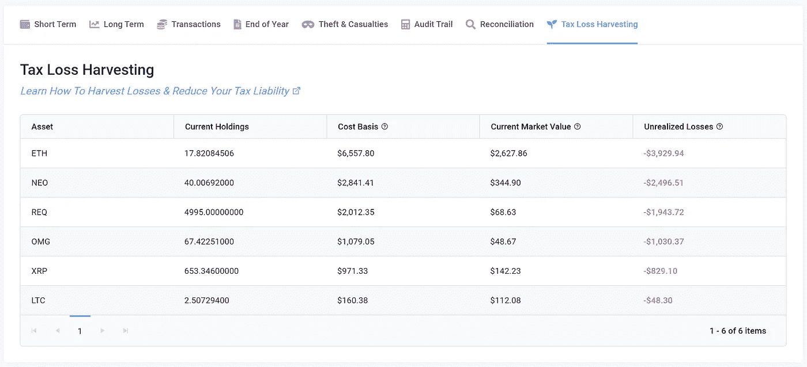
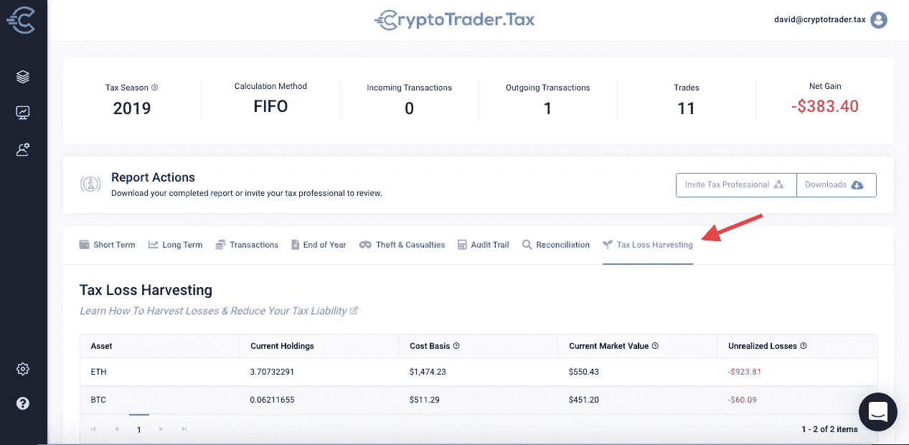

# 加密货币税收损失收获终极指南

> 原文：<https://medium.datadriveninvestor.com/the-ultimate-guide-to-cryptocurrency-tax-loss-harvesting-cryptotrader-tax-aaea57c2f3a3?source=collection_archive---------12----------------------->

用你的加密货币资产进行税收损失收割是减少你一年税单的最有效的方法之一。加密货币极其不稳定，这不是什么秘密。这一点和许多其他特征使其成为税收流失收获策略的异常有效的候选者。

本指南概述了什么是税收损失收集，如何使用它来减少您的比特币和加密税责任，以及如何使用 [**CryptoTrader。税务**](https://www.cryptotrader.tax/) 税收流失收割工具，自动检测您最大的节税机会。

# 税收流失收获——是什么？

税收损失收获是以亏损出售资本资产来抵消资本收益税负债的做法。通过实现或“收获”损失，投资者能够抵消收益和收入的税收。这是股票和证券界常用的减税策略。

# 一个例子

约翰在某一年购买了 1000 美元的苹果股票和 2000 美元的特斯拉股票。当持有这些投资时，约翰的苹果股票价值上升到 1500 美元，而特斯拉下降到 1700 美元。约翰以 1500 美元的价格卖掉了他所有的苹果股票。

## 没有税收损失收获

没有收获他在特斯拉股票上的损失，约翰今年从出售他的苹果股票中获得了 500 美元的资本收益。约翰为这 500 美元的资本收益缴税。

 [## Azbit 旨在连接传统金融和加密货币|数据驱动的投资者

### Azbit 是下一个提供交易平台的加密项目，该平台提供保证金和算法交易。一样多…

www.datadriveninvestor.com](https://www.datadriveninvestor.com/2019/03/20/azbit-aims-to-connect-traditional-finance-and-cryptocurrency/) 

## 税收流失收获

约翰可以在年底前卖出特斯拉股票，而不是继续持有他的股票。资本利得和损失在一年中被加在一起，导致净收益或净损失。约翰今年的资本净收益只有 200 美元(500-300 美元)。在这种情况下，约翰只需为 200 美元的净资本收益缴税，而不是 500 美元。

# 利用加密货币进行税收流失收集

出于税收目的，加密货币被视为财产，与股票完全一样。这意味着你也可以战略性地出售/交易密码，以获取损失并减少你的纳税义务。然而，与股票不同，加密货币具有独特的特征，这使它们成为税收损失收获的更好候选对象。我们在下面讨论这些。

# 清洗销售规则

当你遭受资本损失，然后在资本损失发生之前或之后的 30 天内买回相同的证券时，就产生了洗售。这一规则旨在防止投资者在一年内承担资本损失，然后立即回购股票。 [**IRS 特别声明**](https://www.irs.gov/publications/p550#en_US_2016_publink100010601) 洗盘规则仅适用于证券。根据 [**IRS 指南**](https://www.irs.gov/pub/irs-drop/n-14-21.pdf) 的定义，加密货币是财产，而不是证券。这意味着 wash 销售规则目前不适用于加密货币。

# 波动性

加密货币极其不稳定——比传统资产更不稳定。这种波动性意味着投资者经常有机会实现和收获资本损失。对于投资者来说，困难的部分是识别他们投资组合中的哪些加密货币与当前市场价格相比具有最高的**成本基础**(原始购买价格)。这些资产为节税提供了最大的机会。 [**密码商。Tax**](https://www.cryptotrader.tax/) 有一个内置在应用程序中的税收损失收获工具，允许用户自动识别他们的加密货币中哪种损失收获机会最大。

# 一个例子

艾米今年投资股票市场获得了 15，000 美元的资本收益。艾米还投资了比特币、XRP 和以太坊等加密货币。12 月，Amy 将她的加密货币交易导入 CryptoTrader。注意到她的投资今年减少了 20，000 美元。为了收获这些损失，Amy 将她所有的加密货币交易为莱特币(因此发生了 [**应税事件**](https://www.cryptotrader.tax/blog/when-do-you-owe-taxes-on-your-bitcoin-and-cryptocurrency) 并实现了她的损失)。Amy 在加密货币上的损失完全抵消了她在股票市场上的所有收益，她今年的资本损失为 5000 美元。

# 高达 3000 美元的净资本损失抵消了普通收入

每当一年的资本利得和损失总和为负数时，就会发生净资本损失。如果净资本损失小于或等于 3000 美元(如果你已婚并单独报税，则为 1500 美元)，那么全部资本损失可以用来抵消其他类型的收入，如工作收入。

超过 3 000 美元的净亏损将结转到以后各年。

# 使用密码交易商。自动检测损失收获机会的税

你可以用 CryptoTrader。税，以生成一份完整的报告，分解您最大的税收损失收获机会。首先连接您的交易所，并将您所有的加密货币交易数据导入平台。密码交易商。税收历史价格引擎将为您的每一笔加密货币交易分配成本基础。

# 定位至“税损收集”标签

生成税务报告后，导航至“税收损失收获”选项卡(如下图所示)。此报告按降序显示您最大的损失收获机会。该报告将您在特定加密货币中的成本基础(您支付了多少钱)与当前市场价格进行了比较。成本基础远高于当前市场价格的加密货币提供了最大的税收流失收获机会。

# 一旦发现，出售或交易

一旦你知道哪些加密货币是最好的节税机会，你就可以在你选择的交易所出售或交易它们。请记住，出售或交易您的密码将触发 [**应税事件**](https://www.cryptotrader.tax/blog/when-do-you-owe-taxes-on-your-bitcoin-and-cryptocurrency) 并“实现”您的资产损失。

完成销售或交易后，将交易导入 CryptoTrader 的步骤 2。纳税并重新运行您的纳税报告！然后你就能看到这种损失减少了你多少净收益。

# 12 月 31 日是截止日期——时间至关重要！

重要的是要记住，纳税年度于 12 月 31 日结束，尽管申报截止日期是 4 月 15 日。这意味着，如果你想让你的损失影响当年的税收，你必须在年底前获得。许多投资者迟迟才意识到，如果他们在 12 月份卖出股票或实现亏损，他们本可以节省税款。到那时就太晚了。

不要让这种事发生在你身上！您可以通过使用 CryptoTrader 创建一份 [**税务报告**](https://www.cryptotrader.tax/cryptocurrency-tax-reports) 来查看您所有的税务损失收获机会。今日税。

你可以通过我们的 [**加密货币税**](https://www.cryptotrader.tax/blog/the-traders-guide-to-cryptocurrency-taxes) 完全指南了解更多关于加密货币如何征税的信息。

*免责声明:本指南仅供参考。其目的不是替代税务、审计、会计、投资、财务或法律建议。*

*原载于*[*https://www . cryptotrader . tax*](https://www.cryptotrader.tax/blog/cryptocurrency-tax-loss-harvesting)*。*