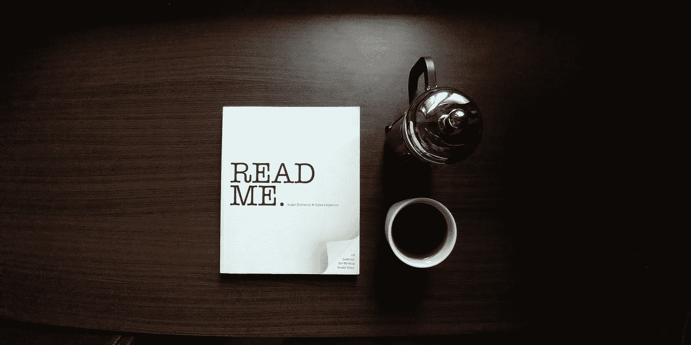

# 互联网上最佳个人资料的官方列表

> 原文：<https://medium.datadriveninvestor.com/the-ultimate-list-of-the-best-profiles-on-the-internet-252dd8de1e8?source=collection_archive---------2----------------------->

自从我开始写[简介](https://readtheprofile.weebly.com/)以来，我已经阅读了数以千计的简介，这是一份每周时事通讯，以有趣的人和公司的最佳长篇文章为特色。

这些故事包括像埃隆·马斯克、雪莉·桑德伯格、Jay-Z 和哈里森·福特这样的知名人物。但他们也包括一些不那么高调的人，比如停用唐纳德·特朗普推特账户的男人和让优步屈服的女人。

如果你即将进行长途飞行，或者你只是想从世界上最成功的人物身上学到一两个教训，这里有一个互联网上最好的长篇简介的综合列表。享受吧。

***每周日获取最新个人资料，*** [***在此订阅个人资料***](http://readtheprofile.com/) ***。***

**2018 年 10 月**

——[诈骗王子&经营 450 亿美元帝国的女人](https://theprofile.substack.com/p/the-profile-the-prince-of-fraud-and)

**2018 年 9 月**

——[风险投资之王&倒戈的秘密警察](https://theprofile.substack.com/p/the-profile-the-king-of-venture-capital-and-the-crypto-cop-who-switched-sides)
——[卖空的勒布朗·詹姆斯&差点倒闭的太空公司](https://theprofile.substack.com/p/the-profile-the-lebron-james-of-short-selling-and-the-space-company-that-almost-failed)
——[——【打破民主的】创始人&虐待人类的宠物初创公司](https://docs.google.com/document/d/139alDjE9xv5uU1uPRsJFOubmnJwHPnoKLTqm89GG1VU/edit?usp=sharing)
——[世界首富&男性女权主义阵营](https://docs.google.com/document/d/1TJXW-w-TB3tOXei7ijxHFIl9fejqYznIJ6RGwbl8Z4w/edit?usp=sharing)
——[美女史蒂夫·乔布斯&](https://docs.google.com/document/d/1FnQ4R4mOVReY49lqHoaLWeeKTMunT7vqBv_MuHjoFL4/edit?usp=sharing)

**2018 年 8 月**

——[世界上最令人恐惧的投资者&极度神秘的科技公司 CEO](https://docs.google.com/document/d/1Hllom-LnP1S-vjyGskPnlNeX1vG_1hUXWlQbWI-_heo/edit?usp=sharing)
——[维珍银河的火箭人&区块链民主](https://docs.google.com/document/d/1cBAWSO_1Dnb_dcEejxEe5ETGF3qDQipEMpIHB1RzF0Q/edit?usp=sharing)
——[贝宝黑手党&基地组织内部的间谍](https://docs.google.com/document/d/1T8bGXtqRabgEpbZkQ8xT_kEjddUIJB9Z2ss-OsMPGZ8/edit?usp=sharing)
——[亿万富翁尤吉&阿姆斯特丹的约翰·戈蒂](https://docs.google.com/document/d/16UqozZ4Tkccof4XtSlxWIkkn_SCCgkT7jhr7O5TOtW0/edit?usp=sharing)

**2018 年 7 月**

——[SpaceX 的秘密武器&秘密邪教头目](https://docs.google.com/document/d/1EsYLSeMZY6Kz9VQxmQ7N_37_-QROdPvClR_HMr8lWmY/edit?usp=sharing)
——[美国人质在国外&让脱发变酷的公司](https://docs.google.com/document/d/1z60u69QF0q49nZoN4ogeySUkScDHg_BcsJGDbl-_BTA/edit?usp=sharing)
——[挑战埃隆·马斯克的女亿万富翁&登月工厂](https://docs.google.com/document/d/1uahDJZA6yab8oiplLgMVjVtFzaeu7S1IfGK1l2OAhq4/edit?usp=sharing)
——[感觉不到恐惧的男人&世界上最独家的交友应用](https://docs.google.com/document/d/1YmzWL_apjiXh0OxVGk4JYvbkNPY38XCjtsUwNlVftjM/edit?usp=sharing)

**2018 年 6 月**

——[你网飞瘾背后的女人&商界最大的竞争对手](https://docs.google.com/document/d/1gLCmlKGe57zFzDYlMLPOCpCztItseOF87bIRrWtq3Dg/edit?usp=sharing)
——[硅谷的秘密交易撮合者&无人机战士](https://docs.google.com/document/d/1XafvXihrK0No2mILCHnVfurGxrWbGWH5x7MSkeT1l8E/edit?usp=sharing)
——[华尔街的密码之王&分手训练营](https://docs.google.com/document/d/1gCbLeO0hCGM_VHWvWJB5nWKVjAKon4DDLTo0FniSnTY/edit?usp=sharing)
——[纽约最大的骗子&起死回生的记者](https://docs.google.com/document/d/1IQJAaHgAuZ39oy75Apm_QkOy6sfUny7atuyQNTiNhjc/edit?usp=sharing)

**2018 年 5 月**

——[独角兽杀手&摩根大通内部的秘密资本家](https://docs.google.com/document/d/1LdBmdmwur7Xo4uQzUHykjCpKvlHQWA43w--ncEuIbNM/edit?usp=sharing)
——[名人教主&约会应用女王](https://docs.google.com/document/d/1IiTC3bT_Em1633s-2cf9gGn8KE42cmVRfUgWcWwZjgI/edit?usp=sharing)
——[十亿美元赌马者&亚马逊首脑](https://docs.google.com/document/d/1PCzNWMrAOLwLFSe0HGS-bc2igkzl7vgf9845eP9o_hM/edit?usp=sharing)
——[全球最精英的交易者俱乐部&火绒代笔者](https://docs.google.com/document/d/1yMMgODsWAoPeteM--czd9mUapm_HR1T-tHMsW2zkL60/edit?usp=sharing)

**2018 年 4 月**

——[一个没落帝国的领袖&碧昂斯的私人保镖](https://docs.google.com/document/d/1U8-FAppUhMOQJBIvHdPG9vUoePxfptGxEX0pz_n3B7Y/edit?usp=sharing)
——[重塑中东的王子&给你面子的健身房](https://docs.google.com/document/d/1YZWOBgAqUjnVgFZvQky6jPNXVKiMBnuVyab7ay1DIhk/edit?usp=sharing)
——[输掉 80 万美元比特币的男人&川普的高音喇叭](https://docs.google.com/document/d/1iD9qjQM8ERQ6aIjZOwJZ7QEsPSNkEgjvArMjo946Gms/edit?usp=sharing)
——[华尔街最大的赌徒&黑帮线人](https://docs.google.com/document/d/11hVleXi10_38faS9wQKyTR8PkgRlIOxsZTMWHm4VGSA/edit?usp=sharing)
——[最具破坏性的男人](https://docs.google.com/document/d/1y5mym9p4JA5bfmU2RFN-gYK6TRU0GLbeiqjiVrpF2Dw/edit?usp=sharing)

**2018 年 3 月**

——[想要修复资本主义的投资者&火山潜水员](https://docs.google.com/document/d/1HtQVDt0hFMR3_SImUMsathlGGbuW-rZGRwxonEnlU8E/edit?usp=sharing)
——[亿万富翁私募股权之王&全美最无知的人](https://docs.google.com/document/d/1qPA28Kzh-EQib6WbOdH8XUxBfdsWbVAdybdswJP489M/edit?usp=sharing)
——[奥运冠军的秘密生活&王牌密语者](https://docs.google.com/document/d/1TRa1uUfatsP6qnDNHbBU37rUdEa9PXpFKHofzqn686w/edit?usp=sharing)
——[拯救世界的网络罪犯&大脑公司上传你的回忆](https://docs.google.com/document/d/1h_VXeBGftxgVIvsjZ3p_Pmsu4CaOmhFNOaVcovhnLVs/edit?usp=sharing)

**2018 年 2 月**

——[白宫里的意大利放荡者&好莱坞最大的交易撮合者](https://docs.google.com/document/d/17ze_kulVBPUCnP7c4ZKH3WY_7QkXC4FVEdbZ1excXlA/edit?usp=sharing)
——[比特币支持的政客&南极洲唯一的人类](https://docs.google.com/document/d/1OHQVDrP79ZAetsAX1K3Ltin-lQMSx6WqSNYmXsOr6hc/edit?usp=sharing)
——[NBA 的秘密葡萄酒俱乐部&崩溃的社交网络](https://docs.google.com/document/d/1iaBP38fG--L0kg0lAV6aPBlcndHKe1YUcG-zhJFi-cQ/edit?usp=sharing)
——[美国的国家噩梦&NBA 人才工厂](https://docs.google.com/document/d/1SeSJ8VZRp9zJoyvX9HoKJvGA1Q11fRXfrFTfBt-I3Nw/edit?usp=sharing)

**2018 年 1 月**

——[1000 亿美元的男人&由父亲变成 Instagram 明星](https://docs.google.com/document/d/1UiNUE3M2xkdeUuAxPa3j94kYFwP5q1-ePHXxpY23aDA/edit?usp=sharing)
——[亚马逊背后的策划者&活在未来的 VC](https://docs.google.com/document/d/1JKrfsUzXBo1E3c0rhDxoOvdrkwaN8k4Hn_tBk90hI0Q/edit?usp=sharing)
——[失去公司的亿万富翁&足球最强大的友谊](https://docs.google.com/document/d/1b8UsBRalmYfr4pdOuZ_keTo1yGuJXfBTjzAkO-5swbk/edit?usp=sharing)
——[追逐火星的宇航员&硅谷的自旋大师](https://docs.google.com/document/d/1dwJuxdzKLJmrkjbq1VeM0afnUx2OJKIg-EDB8CQZza0/edit?usp=sharing)

【2017 年 12 月

——[哭泣的说唱大亨&让特朗普沉默的男人](https://docs.google.com/document/d/1T8CepsDZu_oolbmYavpNrLnBBuRx3u9aKdRkCpEmGBQ/edit?usp=sharing)
——[风险投资之父&贷款黑手党](https://docs.google.com/document/d/1xBGLr9Z087xBT4XcbDzT-4fRpp1OXBor15nopvg-vrU/edit?usp=sharing)
——[第一个比特币亿万富翁&没有自尊的奥运冠军](https://docs.google.com/document/d/1HSTXcjFWassXeaZX-M1X1iloUGkZmwtKs6KRKnpjMQM/edit?usp=sharing)
——[好莱坞最有影响力的女演员&建造以太坊的男人](https://docs.google.com/document/d/1A5Wo5ycKkD90kEPylZqz1v_5AJ8Dj8cNi9c08fSCvNk/edit?usp=sharing)

**2017 年 11 月**

**—** [美国新势力夫妇&世界上最快的爸爸](https://docs.google.com/document/d/1dqTth8ZlvLJSm4TXc4BHkWP9XVhOkPmQLce3vt7BZy4/edit?usp=sharing)
— [硅谷最混乱的分手背后的男人和美国的爱情医生](https://docs.google.com/document/d/1b_gcTwp6T7PEPC-4bBVU4lsBPKHJuEUW2dVEESC4eLA/edit?usp=sharing)
— [刺探你的钱的公司&不太可能的推特巨魔](https://docs.google.com/document/d/1Rdr_ULF62RJQDAPziU1lOB_MYIy1Yt6FVSCe-i5v-HE/edit?usp=sharing)
— [掌管美国的私人监狱&保加利亚最臭名昭著的黑帮](https://docs.google.com/document/d/1_2J_JsnYfwUm52t-CH5i2yA3XIvc9XbEQvLomOeG-LQ/edit?usp=sharing)

**2017 年 10 月**

——[尼克·萨班、斯库特·布劳恩&克莉茜·泰根](https://docs.google.com/document/d/1XBQgdEfhn22wjHYWQdNbJGiyr6Si8K9jmzC9mge4D4Y/edit?usp=sharing)
——[为火星做准备的宇航员&硅谷的钢铁侠](https://docs.google.com/document/d/1-uhj6cBhs3Qupcg8ux3R5ySdPVtgQt--F3nWbEHnZOA/edit?usp=sharing)
——[秘密的亿万富翁驾驶瘾&与恐怖分子建立信任的夫妇](https://docs.google.com/document/d/1UBSnbZZYnwMfBIDZDYK8Eh19n61S2r1MsyJHny8W82U/edit?usp=sharing)
——[千禧一代的华特·迪士尼&30 亿美元消失法案](https://docs.google.com/document/d/1UBSnbZZYnwMfBIDZDYK8Eh19n61S2r1MsyJHny8W82U/edit?usp=sharing)

**2017 年 9 月**

——[疯狂的亿万富翁兄弟&不朽的创业公司创始人](https://docs.google.com/document/d/1cdtpUbQLv8-cxgH8JqBVGtoHrB1fJnlEZ9eQkmPoHsg/edit?usp=sharing)
——[扮演上帝的科学家和建立在冲突之上的人](https://docs.google.com/document/d/1ly6umSvuBZSuZb0orZxwpKt4rUZf7FFDBFmqdkvVx4A/edit?usp=sharing)
——[全美橄榄球联盟最两极分化的运动员&全美最遭人恨的公司](https://docs.google.com/document/d/1FOmqfYBHIZ-PQgG69NMtXFEPyDFbHnb78M8RL1qd8Tk/edit?usp=sharing)
——[运动员的脸书&酒店老板兼职当电视明星](https://docs.google.com/document/d/1NAxOqiGPB63gzjZbq2PuJFJLSg1C6HiZYQOfucSovVE/edit?usp=sharing)

**2017 年 8 月**

——[直视死亡的 NBA 球员&家庭主妇变身啤酒亿万富翁](https://docs.google.com/document/d/1_e6Znu3p_gxQhPWrcq1Y3AyEPyqEWjkq3KYxPrdC4WU/edit?usp=sharing)
——[恐怖密语者&住在你家的双面间谍](https://docs.google.com/document/d/1UzXKiRNm3oBFNVUzMr035YNaJkGoORJyW0Pb5n-3Rpo/edit?usp=sharing)
——[带我们去火星的女人&十亿美元的性爱录像带帝国](https://docs.google.com/document/d/11lWPgUeCRV6ucwqY65InbBKR_hJVm8gO4GvtUyQwRaQ/edit?usp=sharing)
——[毫无悔意的女亿万富翁&沉迷于战争的男人](https://docs.google.com/document/d/1SGZQ3RY8JiYKxhJrtIE9EFaObE1v0xp23vsHGUvuXuk/edit?usp=sharing)

**2017 年 7 月**

——[解读你基因秘密的创业公司&躲在埃隆·马斯克阴影下的男人](https://docs.google.com/document/d/1DSh-DzEEfd9jHPs4iaB-qEukzzuAnw3ikUJ9MANmIrc/edit?usp=sharing)
——[第一个比特币罪犯&不太可能的权力夫妻](https://docs.google.com/document/d/1JCmQvD72xU6ToT32vuJjdT-KpnKPXMqsrDknjsfkVkg/edit)
——[过着秘密双重生活的医生&华尔街之王](https://docs.google.com/document/d/1859U4GiLJ5q1cYYZF4B5swGxN4XGghMTkOR0PbFzPLI/edit?usp=sharing)
——[硅谷最激进的家庭&好莱坞最坏的女人](https://docs.google.com/document/d/1qcppYlYdEDCBQoXv0fdd_6n6qqDp5dkpO62JpUlhH6Y/edit?usp=sharing)

**2017 年 6 月**

——[将修复你爱情生活的治疗师&9 个月内崩溃的 clickbait 帝国](https://docs.google.com/document/d/18m6qt3503i3RFc7e5ONY13Nsdyfj6FNBPlFZ3NmrNGE/edit?usp=sharing)
——[神秘的亿万富翁、赏金猎人、周薪 90 万美元的 CEO](https://docs.google.com/document/d/1EzPDHLb_FrN5iyHbsc0U176kRbOV_TSSD9rGSzNDdQw/edit?usp=sharing)
——[硅谷的懒汉&过着双重生活的棒球之神](https://docs.google.com/document/d/1JPGDUhcLbb0qX9rDPICxMjYSYCc4fYPxhbizDBPmBaw/edit?usp=sharing)
——[公司毒贩&赚 70 万美元烙牛肉饼的千禧一代](https://docs.google.com/document/d/11rhWMSeGZ8ZEPUAHay2LyvsCD0AaKUk1QqZe_TmZOFA/edit?usp=sharing)

**2017 年 5 月**

——[说监狱救了他一命的 NFL 球员&失败的 TedX](https://tinyletter.com/polinamarinova/letters/the-profile-the-nfl-player-who-says-prison-saved-his-life-the-tedx-of-failure)
——[试图“感受生活”的演员和陷入火海的 Fyre 公司](https://tinyletter.com/polinamarinova/letters/the-profile-the-actor-trying-to-feel-life-and-the-fyre-company-that-went-up-in-flames)
——[不确定自己是个混球的企业家和对资本主义过敏的公司](https://docs.google.com/document/d/1x_lAsjDgBGzI_60_uDsG0wugrn6GEvcq5hYrzI_JVYw/edit?usp=sharing)
——[美国最重要的说唱歌手&让你编辑新闻的公司](https://docs.google.com/document/d/13gTk4eze5duBO7cRVX6jstLGEsu_RLex2y5NpFrcyiA/edit?usp=sharing)

**2017 年 4 月**

**—** [华尔街最努力工作的人和数字乡村俱乐部](https://tinyletter.com/polinamarinova/letters/the-profile-the-hardest-working-man-on-wall-street-and-the-digital-country-club)—[应对死后生活的技术高管&读你思想的公司](https://tinyletter.com/polinamarinova/letters/the-profile-the-tech-exec-coping-with-life-after-death-the-company-reading-your-mind)
— [偷了汤姆·布拉迪超级碗球衣的家伙&都市农业加速器](https://tinyletter.com/polinamarinova/letters/the-guy-who-stole-tom-brady-s-super-bowl-jersey-the-urban-farming-accelerator)
— [收入六位数环游世界的夫妇&电器之苹果](https://tinyletter.com/polinamarinova/letters/the-profile-the-couple-that-earns-six-figures-to-travel-the-world-the-apple-of-appliances)
— [势不可挡的 22 岁](https://tinyletter.com/polinamarinova/letters/the-profile-the-unstoppable-22-year-old-entrepreneur-the-company-merging-your-brain-with-a-computer)

**2017 年 3 月**

——[热爱美国的移民亿万富翁&“快乐崇拜”行业](https://tinyletter.com/polinamarinova/letters/the-profile-the-america-loving-immigrant-billionaire-the-cheerful-cult-business)
——[操纵你情绪的魔术师&建立披萨帝国的公司](https://tinyletter.com/polinamarinova/letters/the-profile-the-magician-manipulating-your-emotions-the-company-building-a-pizza-empire)
——[篮球神童&懒惰的千禧一代的“成人学校”](https://tinyletter.com/polinamarinova/letters/the-profile-the-basketball-prodigy-the-adulting-school-for-lazy-millennials)
——[让创始人哭泣的人&出租狗的公司](https://tinyletter.com/polinamarinova/letters/the-profile-the-man-who-makes-founders-cry-the-company-that-rents-out-dogs)

**2017 年 2 月**

——[帮助杀人犯人性化的女人&太空探索的硅谷](https://tinyletter.com/polinamarinova/letters/the-profile-the-woman-who-helps-humanize-murderers-the-silicon-valley-of-space-exploration)
——[真正无聊的亿万富翁&心碎净化](https://tinyletter.com/polinamarinova/letters/the-profile-the-really-boring-billionaire-the-heartbreak-cleanse)

## **更多简介，** [**订阅简介**](http://readtheprofile.com) **。**